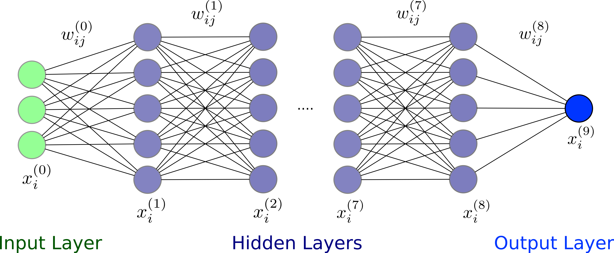
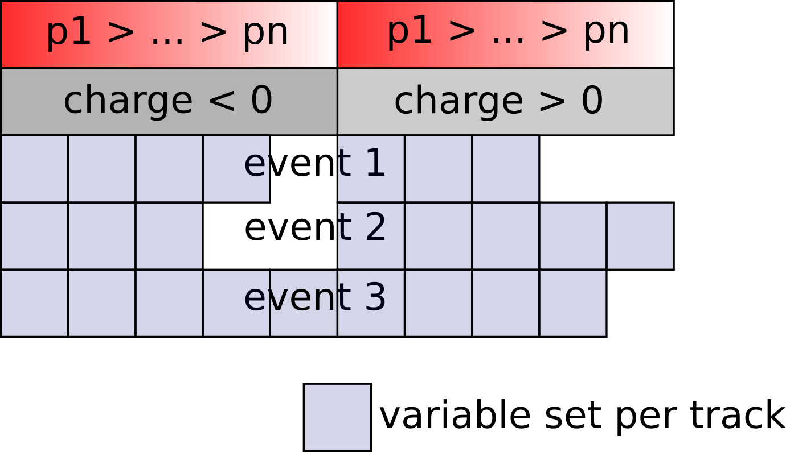

.. _DeepFlavorTagger: 

Deep Flavor Tagger
==================

**Authors: J. Gemmler**

The Deep Flavor Tagger is a multivariate tool to estimate the
flavor of :math:`B_{tag}` mesons, without having to reconstruct the decays
explicitly.

Principle
---------
Many B mesons decay in flavor specific decay modes, which offer a unique
signature for their final state particles. Certain attributes, like fast
leptons or slow pions can be used to infer directly to the flavor of the
tag B meson.

As opposed to the category based flavor tagger, see :ref:`analysis/doc/FlavorTagger:Flavor Tagging Principle` ,
those specific attributes are not incorporated by hand, but the representation data is directly 'learned' by a deep
neural network, which is described in the next section.

The advantage of this method is that the algorithm is potentially susceptible to exploit a wider case of attributes of
the dataset, than putting in only explicit knowledge by pre crafted features.

Furthermore this method allows a variety of domain adaption methods, which could be object of
future studies.

Algorithm
---------

The core of the algorithm is a multilayer perceptron with 8 hidden layers. It is trained with
stochastic gradient descent.

It is implemented with the `tensorflow <https://www.tensorflow.org/about>`_ framework, which is interfaced via the
`mva`.

Currently, the input of the algorithm is based on tracks only, but can be extended to other objects, e.g. cluster
without too many changes.
The charged tracks are grouped by charged, and sorted by momentum. If an event has less then 5 positively or 5
negatively charged tracks, a specific kind of zero padding is applied.
The scheme of the input parameters are shown below:

The output of the algorithm is the variable ``'DNN_qrCombined'``, which corresponds to the tag-side :math:`B` flavor :math:`q_{\rm DNN}` 
times the dilution factor :math:`r_{\rm DNN}`. The range of ``'DNN_qrCombined'`` is :math:`[-1, 1]`. 
The output is close to :math:`-1` if the tag side of an event is likely to be related to a :math:`\bar{B}^0`, 
and close to :math:`1` for a :math:`B^0`. The value :math:`0` corresponds to a random decision.

How to use
----------

The usage of the Deep Flavor Tagger is pretty simple and straight forward.

In your *steering file*, you first have to import the interface to the Deep Flavor Tagger

::

    from dft.DeepFlavorTagger import DeepFlavorTagger

After reconstructing your signal :math:`B` meson, make sure that you build the rest of event:

::

    ma.buildRestOfEvent('B0:sig', path=path)

To use the Deep Flavor Tagger with basic functionality on Belle II data or MC, use

::

    DeepFlavorTagger('B0:sig',
                     uniqueIdentifier='FlavorTagger_Belle2_B2nunubarBGx1DNN_1',
                     path=path)

.. note::
    For development purposes, the algorithm can also be used with local .xml weight files e.g.
    ``FlavorTagger_Belle2_B2nunubarBGx1DNN_1.xml``

To use on Belle data or MC with ``b2bii``, you need a special identifier and a special set of variables:

::

    BELLE_IDENTIFIER='FlavorTagger_Belle_B2nunubarBGx1DNN_1'

    BELLE_FLAVOR_TAG_VARIABLES = [
        'useCMSFrame(p)',
        'useCMSFrame(cosTheta)',
        'useCMSFrame(phi)',
        'atcPIDBelle(3,2)',
        'eIDBelle',
        'muIDBelle',
        'atcPIDBelle(4,2)',
        'nCDCHits',
        'nSVDHits',
        'dz',
        'dr',
        'chiProb',
    ]

    DeepFlavorTagger(..., uniqueIdentifier=BELLE_IDENTIFIER, 
                          variable_list=BELLE_FLAVOR_TAG_VARIABLES)

Studies have shown, that we can reduce a certain kind of bias, by applying additional rest of event cuts, you can do
this with the following argument. You can basically treat this like cuts in an RoE mask.

::

    DeepFlavorTagger(..., additional_roe_filter='dr < 2 and abs(dz) < 4')

Finally, do not forget to save the output variable ``'DNN_qrCombined'`` into your ntuples.
It is probably also helpful for MC studies, to write out the MC truth flavor of the
tag side ``'mcFlavorOfOtherB'``.

::

    ma.variablesToNtuple(decayString='B0:sig',
                         variables=['DNN_qrCombined', 'mcFlavorOfOtherB'],
                         path=path)

Functions
---------

.. automodule:: dft.DeepFlavorTagger
   :members: DeepFlavorTagger
   :undoc-members:
