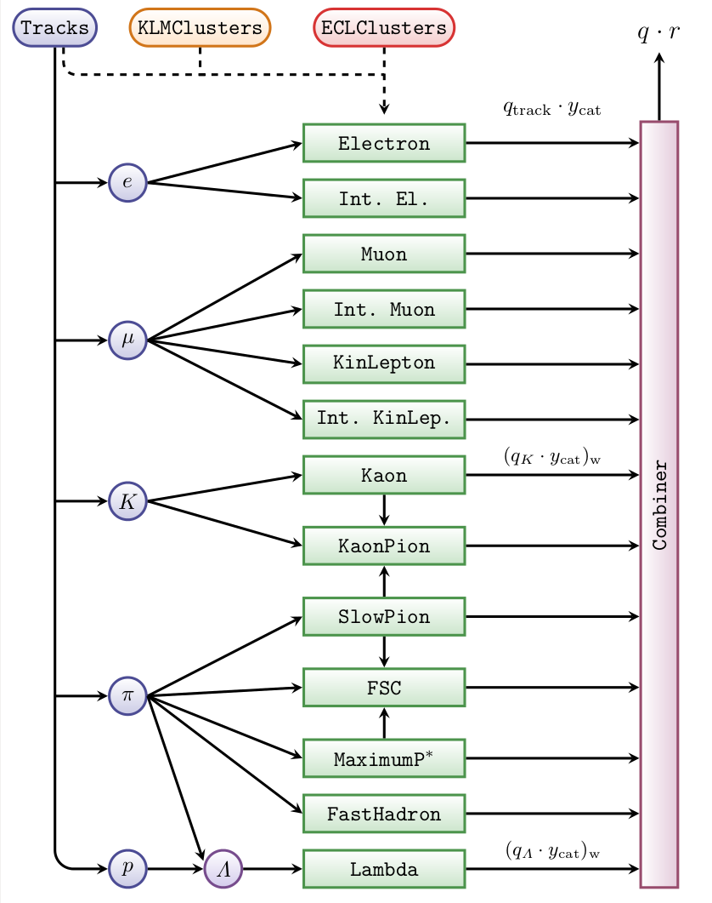

.. _FlavorTagger:

Flavor Tagger
==============

**Authors: F. Abudinen, M. Gelb, L. Li Gioi**

The Flavor Tagger is a module based on multivariate methods. It is designed to determine the
flavor of the not reconstructed :math:`B^0` meson in events with a neutral
:math:`B` meson pair. It can be used also in addition to continuum suppression in events
with a charged :math:`B` meson pair.

.. tip:: For an introductory hands-on lesson, take a look at :numref:`onlinebook_flavor_tagging`.

Flavor Tagging Principle
------------------------

Considering an entangled neutral B-meson pair, if one of both decays to a CP
eigenstate and the other to a flavor specific channel, the goal is to determine
the flavor of the latter at the time of its decay. The different signatures of
flavor specific decay channels can be grouped into categories. Up to now we
have developed 13 categories for the following signatures:

 

Electron:
      In the decay :math:`b \to X e^- (b \to c e^- \bar\nu)` the charge of the electron tags unambiguously the flavor of the B Meson.
IntermediateElectron:
      In the decay :math:`b \to X_c X \to X e^+ (b \to c \to s e^+ \nu)` the charge of the secondary electron (se) tags the B flavor. 
Muon:
      In the decay :math:`b \to X \mu- (b \to c \mu^- \bar\nu)` the charge of the muon tags the flavor.
IntermediateMuon:
      In the decay :math:`b \to X_c X \to X \mu^+ (b \to c \to s\mu^+ \nu)` the charge of the secondary muon tags the flavor.
KinLepton:
      In the decay :math:`b \to X \ell^- (b \to \ell^- \bar\nu)` the charge of the lepton is
      the flavor signature. Here muon and electron PIDs are used.
IntermediateKinLepton:
      In the decay :math:`b \to X_c X \to X \ell^+ (b \to c \to s \ell^+ \nu)` the charge of
      the lepton is the flavor signature. Here muon and electron PIDs are used.
Kaon:
      In the decay :math:`b \to X K^- (b \to c \to s)` the charge of the Kaon is the searched flavour signature.
FastHadron:
      In the decay :math:`b \to X^+ \pi^- (K^-)`  the charge of the pion (Kaon) tags the flavor of the B Meson.  
SlowPion:
      In the decay :math:`b \to X D^{*+} \to X D^0 \pi^+ (b \to c )` the charge of the slow pion tags the flavor.
MaximumP*:
      Here the particle with the highest CMS momentum is assumed to be a
      primary daughter of the B. Therefore, its charge is considered as flavor
      signature.
KaonPion:
      In the decay :math:`b \to X D^{*+} \to X \pi^+ D^0 \to X K^- \pi^+ (b \to c \to s)` the
      charges of the Kaon and the slow pion provide a combined flavour signature.
FastSlowCorrelated (FSC):
      Slow pions from :math:`D^{*\pm}` and high momentum primary particles, e.g. :math:`\overline{B^0} \to D^{*+} e^- \bar\nu \to X \pi^+ e^-` , 
      provide a combined flavour signature.
Lambda:
      In the decay :math:`b \to \Lambda_c^* X \to \Lambda X \to X p \pi^- (b \to c \to s)` 
      the flavor of the Lambda tags the flavor of the B. For this, a proton and a
      pion are reconstructed to a Lambda.

In the following the particles providing the flavor tag information, i.e. the
flavor signatures, are denoted as target.

Below: Simple draft (no physical magnitudes) to illustrate the different decays providing the 
signatures belonging to the different categories.

  Underlying decay modes of the flavor tagging categories.

.. note::
   Decays with intermediate resonances that provide flavor information are
   correctly considered as signal. E.g., :math:`\bar{B_0} \to D_1^+ \to D^{*+} \to D^+ \to K_{10} \to K^{0*} \to K^-`.
   
   The Kaon and the Intermediate Lepton categories consider mesonic and baryonic
   decays via :math:`b \to c \to s` transitions. E.g., 
   :math:`b \to \Sigma_{\bar{c}} \to \Lambda_{\bar{c}}^+ \to K^- p \pi^+ (\Lambda \ell^+ p \nu_{\ell})`.
   
   The FastHadron category considers also intermediate resonances and single tau
   daughters (kinematically similar). E.g., 
   :math:`b \to \tau^- (\to \rho^-) \to \pi^-, b \to \tau^- (\to K^{*-}) \to K^-`.

Flavor Tagger Algorithm
-----------------------
The process of the FlavorTagger is inspired by the Flavor Tagging concept
developed by Belle and BaBar. It proceeds in 2 steps or levels: *EventLevel* and
*CombinerLevel*. Each step relies on trained multivariate methods. Up to now, for
the official Flavor Tagger, the multivariate method used is always a FastBDT
which is embedded as Plugin in the `mva` TMVAInterface.

  The process for an example category.

At the starting point the available information consists only of ROE Tracks,
ECL and KLM clusters.

In the first step a dedicated ParticleList is created for each type of
reconstructed tracks (electrons, muons, Kaons, pions and protons). The
particles in each list correspond to the whole set of :doc:`RestOfEvent` (ROE) tracks
fitted with a specific mass hypothesis. The mass hypothesis of each
ParticleList corresponds to the searched flavor signature, e.g. "K+:KaonROE" is
created for the categories using the information of kaons. Several flavor
tagging input variables are calculated for each track. In these calculations
the ECL and KLM Clusters are implicitly involved. The variables are taked as
inputs for a category specific multivariate method.

For each category, an EventLevel multivariate method is assigned which is
trained to give as output the probability of being the target particle of the
category, providing the right flavor. This probability is called RightCategory
and is calculated in the EventLevel using the flavor tagging input variables.
After the EventLevel each dummy particle in each one of the categories has the
RightCategory probability as extraInfo.

For the CombinerLevel the dummy particle with the highest RightCategory
probability is selected as target. The product qp of charge and RightCategory
probability of the target is an input value for the combiner. Just for the
Lambda and Kaon category, qp is weighted among the three candidates with the
highest RightCategory. It means that the combiner gets 13 inputs, each one
belonging to a specific category.  The multivariate method of the CombinerLevel
is trained to give the qr value belonging to the tagged B-meson as output. Here
q means flavor, and r is the so-called dilution factor. Currently, there are
two combiner methods: one fast BDT and a multilayer-perceptron from the FANN
library. In future, also new methods could be included.

  Flow of information in the flavor tagger.

The ``qr`` value of the tagged B is saved temporary as extraInfo of the
reconstructed B particle at the end of the FlavorTagger process.  All
FlavorTagging information (qr of the two multivariate methods and the
RightCategory probabilities) saved previously as extraInfo are saved into a
dedicated DataStoreObject called FlavorTagInfo . After filling the
FlavorTagInfo data object, all flavor tagger extraInfos are then deleted. The
user can decide which information is saved in the Ntuples. If specified, also
the inputs of the combiner are saved.

For more information see 
`BELLE2-PTHESIS-2018-003 <https://docs.belle2.org/record/1215/files/BELLE2-PTHESIS-2018-003.pdf>`_.

Using the FlavorTagger
----------------------

Adding the FlavorTagger to your analysis is very simple: an example can be found in this tutorial:

analysis/examples/tutorials/B2A801-FlavorTagger.py

At the beginning of your steering file you have to import:

::
  
  import flavorTagger as ft

Do not forget to buildRestOfEvent for your ``B0`` recoParticle before calling the flavor tagger.

If you just want to use the flavor tagger as standard user you need only:

:: 

  ft.flavorTagger( particleLists=['B0:yourSignalBlist'], weightFiles='B2nunubarBGx1')

and to add the ``flavor_tagging`` variables to your nTuple as explained below. BGx1 stays for MC generated
with machine Background. Only BGx1 files are provided centrally.
 
The current flavor tagger is trained with MC samples for the signal channel 
:math:`B^0 \to \overline{\nu}\nu` which has
no built-in CP violation. This is needed to avoid that the flavorTagger learns CP asymmetries
on the tag side. 

The full interface of :func:`flavorTagger` function has 10 possible arguments and it is described below.

Saving to nTuples
-----------------

The flavor tagger provides the output of the two combiners and the outputs 
of the 13 categories. It provides also the MC information relevant for the categories. 
To save this information you just have to add the predefined list
``ft.flavor_tagging``
to the variables that you use as argument for the module :func:`modularAnalysis.variablesToNtuple`.

The two available combiners provide two different flavor tags which can be
found in the ntuple of the output root file: ``FBDT_qrCombined`` or
``FANN_qrCombined``. FBDT is the output of a fast boosted decision tree and
FANN is the output of a multi-layer perceptron of the open source library fast
artificial neural network . The default output -2 is saved for events without
tracks in the ROE.

The following variable is also saved by default,

``qr_MC``:It is the ideal output of the flavor tagger (therefore the name) and is
the target variable of the combiners. Scholastically speaking it should be
called q_MC and is just the MC flavor of the tag B. But it considers if
isSignal on the signal side is 1. Therefore,  one can make several checks at
one shot with this variable. qrMC is just the nTuple name. The variable which
is saved is `isRelatedRestOfEventB0Flavor`.

The goal of this variable is to return the value +1(-1) for a :math:`B^0 (\overline{B}^0)` on the tag side checking the MC.
But technically this is not trivial at all. The variable calculation performs the following steps:

1. Check the MC matching of :math:`B^0_{\rm sig}`. It means MC :math:`B^0_{\rm sig}` corresponds to RECO :math:`B^0_{\rm sig}`. 
   If correctly matched then:
2. Loop over all tracks in the ROE and get for each one the related mc particle.
3. Check all mothers (grand-, grandgrandmother, and so on) of each one of
   these MC particles and find out if at least one of them is a descendant of MC
   :math:`B^0_{\rm sig}` (these events are not good neither for training nor for evaluation). The
   loop is broken as soon as an MC particle related to a ROE track is found to be
   a descendant of MC :math:`B^0_{\rm sig}`. If not
4. Find the MC flavor of the neutral :math:`B` particle on the tag side (:math:`B^0_{\rm tag}`).

The variable has several output values. The meaning  are the following:

  * *-2 (+2)* At least one MC particle that is related to a ROE track is found to be a descendant of MC :math:`B^0_{\rm sig}`: 
    *-2 (+2)* means MC :math:`B^0_{\rm sig}` is a :math:`B^0 (\overline{B}^0)`.

  * *-1 (+1)* Everything is correctly matched. All MC particles related to ROE tracks are not descendent of MC :math:`B^0_{\rm sig}`:
    *-1 (+1)* means that the MC neutral :math:`B` on the tag side is a :math:`B^0 (\overline{B}^0)`.

  * *0* Wrongly matched :math:`B^0_{\rm sig}`, or correctly matched but no neutral :math:`B` found on the tag side. 
    It means, either there are no tracks in ROE, or among the MC particles
    (and also their ancestors) that are related to the
    ROE tracks no neutral :math:`B` particle was found. So, ``B0_isSignal==1`` and ``B0_qrMC==0`` is
    possible, e.g. for :math:`B\to` final state with only photons, :math:`B\to` invisible, :math:`B\to`
    photons and few tracks but the tracks outside of the acceptance (or not
    reconstructed), etc. Very rare things could also happen like there is no
    related MC particle for the tracks in the ROE. This means that one should use
    ``abs(B0_qrMC) == 1``, if one wants to filter out good events for evaluation. But
    one should be very careful, e.g. for some signal channels the MC matching does
    not work well at all and one could think for an instant that the flavor tagger
    is under or overestimating the dilution.

The flavor tagger also saves the variable ``mcFlavorOfOtherB`` which returns the flavor of the 
accompaning tag-side :math:`B` meson (positive or negative) if the given particle is a correctly MC-matched 
:math:`B` (it returns 0 else). In other words, this variable checks the generated flavor 
of the other MC :math:`\Upsilon(4{\rm S})` daughter without considering the ROE particles.

The additional information about individual categories are saved using the aliases
``qpCategory<Name>``, where ``<name>`` is the cathegory.
These are 13 values which correspond to the 13 inputs which are given to the
combiners. They are actually not ``qr`` but ``qp`` where ``p`` is the output of the
category level mva (FBDT) for the track with the highest target probability.
In case of Kaons and Lambdas, it is the weighted qp of the 3 most probable
targets.

By definition,

::

  r = TMath::Abs(2 * prob - 1)

where prob is the probability that this event is, for example, a semileptonic
event for the Electron category. Technically, it is just the output of the
category level FBDT for the target track. The target track is the track with
the highest track probability, which is the output of track level FBDT.

When the flavor tagger started to be developed, ``qr`` was used for each category
as input. But then it turned out that ``qp`` is more powerful. The names of the
variables remained the same just for practical use.

``hasTrueTargetCategory<Name>``: These variables tell you if you have the target
of a specific category for each event. For example, :math:`B^0\to e^+ \nu X^-` is the decay
corresponding to the electron category. This variable returns 1 if there is an
:math:`e^+` which is a primary daughter of the :math:`B^0_{\rm tag}` by checking the MC information. 0
else. Similar for the other categories.

The standard flavor tagger combines all 13 tags of all 13 categories for each
event.  ``hasTrueTargetCategory<Name>`` only tells you which categories were right
or not (with exceptions for kaons).

Efficiency Calculation and Validation Plots
-------------------------------------------

If you want to calculate the efficiency of the FlavorTagger on your own File and produce qr plots, use the script 
analysis/release-validation/CPVTools/flavorTaggerEfficiency.py giving your file and the ntuple tree name as arguments:

::

  basf2 flavorTaggerEfficiency.py 'YourFiles*WithWildcards??.root' Youtreename

Tutorials
---------

An example tutorial for normal use can be found under:

::

  analysis/examples/tutorials/B2A801-FlavorTagger.py

Find the latest tutorial given at the `2nd OPEN Belle II physics week <https://indico.belle2.org/event/493/contributions/4538>`_ 
at `DESY stash <https://stash.desy.de/users/abudinen/repos/handsonexercises>`_.

Try the advanced tutorial `B2T_Advanced_3_FlavorTagger.ipynb <https://stash.desy.de/projects/B2T/repos/b2-starterkit/browse/B2T_Advanced_3_FlavorTagger.ipynb>`_
(Jupyter notebook) under the latest `b2-starter-kit <https://stash.desy.de/projects/B2T/repos/b2-starterkit/browse>`_ tutorials.

As further examples you can have a look on the scripts used to generate the weight files at kekcc once a release is tagged. 
You find them under:

::

  analysis/release-validation/CPVTools/

You can train and test the flavor tagger, and evaluate its performance by yourself running:

::
  
  sh CPVToolsValidatorInParalell.sh Belle2 nunubar nunubar BGx1 yourPathForWeightFiles yourPathForAnalyzedMdst

Note:

The convention is BGx0 for no machine background and BGx1 for MC with machine background. The process is defined in:

::
 
  flavorTaggerVertexingValidation.py

If you are interested in the validation of the flavor tagger, have a look at the `flavortaggingvalidation <https://stash.desy.de/projects/B2A/repos/flavortaggingvalidation>`_ repository.

Functions
---------

.. automodule:: flavorTagger
   :members:
   :undoc-members:
