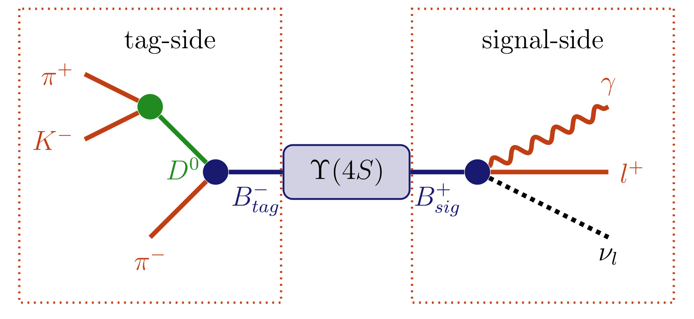
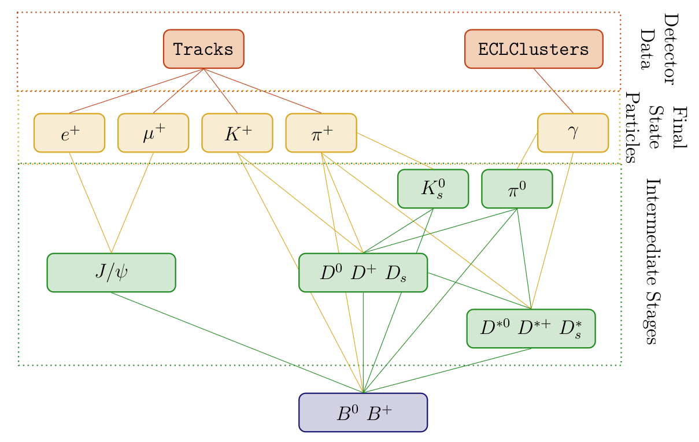
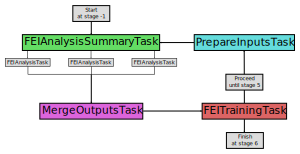

.. _FullEventInterpretation:

Full event interpretation
=========================

.. seealso:: The FEI is formally described in the publication `Comp.Sci.HEP.2019.3.6 <https://link.springer.com/article/10.1007/s41781-019-0021-8>`_

Algorithm overview
##################

Physics
*******

Measurements of decays including neutrinos, in particular rare decays, suffer from missing kinematic information. The FEI recovers this information partially and infers strong constraints on the signal candidates by automatically reconstructing the rest of the event in thousands of exclusive decay channels. The Full Event Interpretation (FEI) is an essential component in a wide range of important analyses, including: the measurement of the CKM element :math:`|V_{ub}|` through the semileptonic decay :math:`b \rightarrow u \nu`; the search for a charged-Higgs effect in :math:`B \rightarrow D \tau \nu`; and the precise measurement of the branching fraction of :math:`B \rightarrow \tau \nu`, which is sensitive to new physics effects.

.. _example_decay:



  :math:`\Upsilon(4S)\rightarrow (B^{+} \rightarrow l^{+} \nu_{l} \gamma) (B^{-} \rightarrow (D^{0} \rightarrow K^{-} \pi^{+}) \pi^{-})` decay topology. Here the decay :math:`B^{-} \rightarrow (D^{0} \rightarrow K^{-} \pi^{+}) \pi^{-}` can be reconstructed as the tag-side allowing additional information about the signal-side :math:`B^{+} \rightarrow l^{+} \nu_{l} \gamma` to be deduced.

As an analysis technique unique to B factories, the Full Event Interpretation will play an important role in the measurement of rare decays. This technique reconstructs one of the B mesons and infers strong constraints for the remaining B meson in the event using the precisely known initial state of the :math:`\Upsilon(4S)`. The actual analysis is then performed on the second B meson. The two mesons are called tag-side :math:`B_{\text{tag}}` and signal-side :math:`B_{\text{sig}}`, respectively. In effect the FEI allows one to reconstruct the initial :math:`\Upsilon(4S)` resonance, and thereby recovering the kinematic and flavour information of :math:`B_{\text{sig}}`. Furthermore, the background can be drastically reduced by discarding :math:`\Upsilon(4S)` candidates with remaining tracks or energy clusters in the rest of event.

Belle already employed a similar technique called Full Reconstruction (FR) with great success. As a further development the Full Event Interpretation is more inclusive, provides more automation and analysis-specific optimisations. Both techniques heavily rely on multivariate classifiers (MVC). MVCs have to be trained on a Monte Carlo (MC) simulated data sample. However, the analysis-specific signal-side selection strongly influences the background distributions on the tag-side. Yet this influence had to be neglected by the FR, because the training of the MVCs was done independently from the signal-side analysis. In contrast, the FEI can be trained for each analysis separately and can thereby take the signal-side selection into account. The analysis-specific training is possible due to the deployment of speed-optimized training algorithms, full automation and the extensive usage of parallelization on all levels. The total training duration for a typical analysis is in the order of days instead of weeks. In consequence, it is also feasible to retrain the FEI if better MC data or optimized MVCs become available.

Key Performance Indicators
**************************

Quantifying the performance of the FEI can be done using:

*    the **tagging efficiency**, that is the fraction of :math:`\Upsilon(4S)` events which can be tagged,
*    the **tag-side efficiency**, that is the fraction of :math:`\Upsilon(4S)` events with a correct tag,
*    and the **purity**, that is the fraction of the tagged :math:`\Upsilon(4S)` events with a correct tag-side

These three properties are the key performance indicators used, they are closely related to important properties of a specific analysis: The tagging efficiency is important to judge the disk-space required for skimming; the tag-side efficiency influences the effective statistics of the analysis, and the purity is related to the signal-to-noise ratio of the analysis.

The tag-side efficiency and purity are usually shown in form of a receiver operating characteristic curve parametrized with the SignalProbability.

Hadronic, Semileptonic and Inclusive Tagging
********************************************

As previously described, the FEI automatically reconstructs one out of the two :math:`B` mesons in an Υ(4S) decay to recover information about the remaining :math:`B` meson. In fact, there is an entire class of analysis methods, so-called tagging-methods, based on this concept. In the past there were three distinct tagging-methods: hadronic, semileptonic and inclusive tagging.

*   **Hadronic tagging** solely uses hadronic decay channels for the reconstruction. Hence, the kinematics of the reconstructed candidates are well known and the tagged sample is very pure. Then again, hadronic tagging is only possible for a tiny fraction of the dataset on the order of a few per mille.
*   **Semileptonic tagging** uses semileptonic :math:`B` decays. Due to the high branching fraction of semileptonic decays this approach usually has a higher tagging and tag-side efficiency. On the other hand, the semileptonic reconstruction suffers from missing kinematic information due to the neutrino in the final state of the decay. Hence, the sample is not as pure as in the hadronic case.
*   **Inclusive tagging** combines the four-momenta of all particles in the rest of the event of the signal-side :math:`B` candidate. The achieved tagging efficiency is usually one order of magnitude above the hadronic and semileptonic tagging. Yet the decay topology is not explicitly reconstructed and cannot be used to discard wrong candidates. In consequence, the methods suffers from a high background and the tagged sample is very impure.

The FEI combines the first two tagging-methods: hadronic and semileptonic tagging, into a single algorithm. Simultaneously it increases the tag-side efficiency by reconstructing more decay channels in total. The long-term goal is to unify all three methods in the FEI. The algorithm presented in this thesis is only the first step in this direction.


Hierarchical Approach
*********************

The basic idea of the Full Event Interpretation is to reconstruct the particles and train the MVCs in a hierarchical approach. At first the final-state particle candidates are selected and corresponding classification methods are trained using the detector information. Building on this, intermediate particle candidates are reconstructed and a multivariate classifier is trained for each employed decay channel. The MVC combines all information about a candidate into a single value – the signal-probability. In consequence, candidates from different decay channels can be treated equally in the following reconstruction steps.

.. _hierarchy:



  Hierarchical reconstruction applied by the FEI, which starting from tracks and EM clusters reconstructs initial state particles, intermediate particles in several stages and finally candidate :math:`B` tags.

For instance, the FEI currently reconstructs 15 decay channels of the :math:`D^{0}` . Afterwards, the generated D0 candidates are used to reconstruct :math:`D^{*0}` in 2 decay channels. All information about the specific D0 decay channel of the candidate is encoded in its
signal-probability, which is available to the :math:`D^{*0}` classifiers. In effect, the hierarchical approach reconstructs :math:`2 * 15 = 30` exclusive decay channels and provides a signal-probability for each candidate, which makes use of all available information. Finally, the :math:`B` candidates are reconstructed and the corresponding classifiers are trained. The final output of the FEI to the user contains four ParticleLists: ``B+:hadronic``, ``B+:semileptonic``, ``B0:hadronic`` and ``B0:semileptonic``.

It is important to introduce intermediate cuts to reduce combinatorics in order to save computation time. The main goal of the cuts is to limit the combinatoric, while retaining the best :math:`B` meson candidates in each event. There are two types of cuts

*  **PreCuts** can be chosen for each channel individually and are done as early in the reconstruction as possible to save computing time.
*  **PostCuts** are applied after all information about the candidate from the vertex fitting and the MVC is available; The post-cut employs all available information about a candidate by cutting on the signal-probability calculated by the MVC. Since the interpretation of the signal probability is the same for all candidates independent of their decay channels the cut is channel-independent. It is important to choose this cut tight enough, otherwise one loses a lot of signal candidates in the consecutive reconstruction steps due to a bad signal-to-noise ratio

The FEI uses several cuts, which are applied for each particle in the following order:

#.    **PreCut::userCut** is applied before all other cuts to introduce a-priori knowledge, e.g. final-state particle tracks (K shorts are handled via V0 objects) should originate from the IP ``'[dr < 2] and [abs(dz) < 4]'``, the invariant mass of D mesons should be inside a certain mass window ``'1.7 < M < 1.95'``, hadronic B meson candidates require a reasonable beam-constrained mass and delta E ``'Mbc > 5.2 and abs(deltaE) < 0.5'``. This cut is also used to enforce constraints on the number of additional tracks in the event for a specific signal-side ``'nRemainingTracksInEvent == 1'``.
#. **PreCut::bestCandidateCut** keeps for each decay channel only a certain number of best-candidates. The variable which is used to rank all the candidates in an event is usually the PID for final-state particles e.g. ``electronID``, ``pionID``, ``muonID```; the distance to the nominal invariant mass ``abs(dM)`` for intermediate particles; the product of the daughter SignalProbabilities for intermediate particles in semileptonic or KLong channels ``daughterProductOf(extraInfo(SignalProbability))``. Between 10-20 candidates per channel (charge conjugated candidates are counted separately) are typically kept at this stage. This reduces the combinatoric in each event to the same level.
#.    **PreCut::vertexCut** throws away candidates below a certain confidence level after the vertex fit. Default is throwing away only candidates with failed fits. Since the vertex fit is the most expensive part of the reconstruction it does not make sense to do a harder cut here, because the cuts on the network output afterwards will be more efficient without to much extra computing time
#.    **PostCut::value** is a cut on the absolute value of the ``SignalProbability`` and should be chosen very loose, only candidates which are highly unlikely should be thrown away here
#.    **PostCut::bestCandidateCut** keeps for each particle only a certain number of best-candidates. The candidates of all channels are ranked using their ``SignalProbability``. Usually Between 10-20 candidates are kept per particle. This cut is extremely important because it limits the combinatoric in the next stage of reconstructions, and the algorithm can calculate the combinatoric at the next stage in advance.

Applying the FEI
################


Just include the ``feistate.path`` created by the ``fei.get_path()`` function in your steering file.

The weightfiles are automatically loaded from the conditions database (see :ref:`analysis/doc/FullEventInterpretation:FEI and the conditions database`).
This might take some time.

After the FEI path the following lists are available

*    B+:generic (hadronic tag)
*    B+:semileptonic (semileptonic tag)
*    B0:generic (hadronic tag)
*    B+:semileptonic (semileptonic tag)

Each candidate has two extra infos which are interesting:

*    SignalProbability is the signal probability calculated using FastBDT
*    decayModeID is the tag :math:`B` decay channel


You can use a different decay channel configuration during the application. In particular you can omit decay channels (e.g. the semileptonic ones if you are only interested in the hadronic tag).
However, it is not possible to add new channels without training them first (obviously).

You can find up to date examples in ``analysis/examples/FEI``.
If you encounter problems which require debugging in the FEI algorithm, the best starting point is to enable the monitoring, by choosing ``monitor=True`` in the FEIConfiguration. This will create a lot of root files containing histograms of interesting variables throughout the process (e.g. MC truth before and after all the cuts). You can also create a pdf using the root files produced by the monitoring and the "Summary.pickle" file produced by the original training by executing:

``basf2 fei/latexReporting.py > summary.tex``


FEI and the conditions database
###############################

The FEI is frequently retrained and updated to give the best performance with the latest reconstruction, etc. You will need to use the relevant database in which the FEI training weights are located.
FEI training weights are distributed by the `basf2.conditions` database under an `analysis global tag <https://confluence.desy.de/x/MhqdAw>`_.
In order to find the latest, recommended FEI training, you can use the `b2conditionsdb-recommend` tool.

``b2conditionsdb-recommend input_file.mdst.root``

This tool will tell you all tags you should use. For the FEI we are only concerned with the analysis tag.
Analysis tags are named ``analysis_tools_XXXX``, and the latest and recommended one can be retrieved using
the tool `b2conditionsdb-recommend` or the function `modularAnalysis.getAnalysisGlobaltag`.
You will need to prepend this tag to your global tags list.
This is done inside the FEI steering script.

.. code-block:: python3

        import basf2
        import fei

        basf2.conditions.prepend_globaltag("analysis_tools_XXXX")
        conf = fei.config.FeiConfiguration(prefix="foo", ...)

Note that when running on Belle converted data or MC you will need to use the ``B2BII`` and ``B2BII_MC`` database tags, respectively.

If you have trouble finding the correct analysis tag, please ask a question at `B2Questions <https://questions.belle2.org>`_ and/or send a mail to frank.meier@belle2.org,

Sphinx documentation
####################


.. automodule:: fei
   :members:
   :undoc-members:
   :imported-members:

Code structure
##############

In my opinion the best way to use and learn about the FEI is to read the code itself. I wrote an extensive documentation. Hence I describe here the code structure. If you don't want to read code, you can just skip this part.

The FEI is completely written in Python and does only use general purpose BASF2 modules. You can find the code under: ``analysis/scripts/fei/``

config.py
*********

The classes defined here are used to uniquely define a FEI training.

*    The global configuration like database prefix, cache mode, monitoring, ... (``FeiConfiguration``)
*    The reconstructed Particles (Particle)
*    The reconstructed Channels of each particle (``DecayChannel``)
*    The MVA configuration for each channel (``MVAConfiguration``)
*    The Cut definitions of each channel (``PreCutConfiguration``)
*    The Cut definitions of each particle (``PostCutConfiguration``)

These classes are used to define the default configuration of the FEI

default_channels.py
*******************

Contains some example configurations of the FEI. Mostly you want to use ``get_default_channels()``, which can return the configuration for common use-cases

*    Hadronic tagging (``hadronic = True``)
*    Semileptonic tagging (``semileptonic = True``)
*    B+/B- (``chargedB = True``)
*    B0/anti-B0 (``neutralB = True``)
*    running on Belle 1 MC/data (``convertedFromBelle = True``)
*    running a specific FEI which is optimized for a signal selection and uses ROEs (``specific = True``)


You can turn on and off individual parts of the reconstruction. I advise to train with the all parts, and then turn off the parts you don't need in the application.

Another interesting configuration is given by ``get_fr_channels``, which will return a configuration which is equivalent to the original Full Reconstruction algorithm used by Belle

In the training and application steering file you probably will use:

.. code-block:: python3

   import fei
   particles = fei.get_default_channels(hadronic=True, semileptonic=True, chargedB=True, neutralB=True)


core.py
*******

This file contains the implementation of the Full Event Interpretation Algorithm.

Some basic facts:

*    The algorithm will automatically reconstruct :math:`B` mesons and calculate a signal probability for each candidate.
*    It can be used for hadronic and semileptonic tagging.
*    The algorithm has to be trained on MC, and can afterwards be applied on data.
*    The training requires O(100) million MC events
*    The weightfiles are stored in the Belle 2 Condition database

Read this file if you want to understand the technical details of the FEI.

The FEI follows a hierarchical approach.

There are 7 stages:

*    (Stage -1: Write out information about the provided data sample)
*    Stage 0: Final State Particles (FSP)
*    Stage 1: :math:`pi^{0}`, :math:`J/\psi` (and :math:`Lambda^{0}` if baryonic modes requested)
*    Stage 2: :math:`K_{s}` (and :math:`Sigma^{+}` if baryonic modes requested)
*    Stage 3: :math:`D` mesons (and :math:`Lambda_{c}^{+}` if baryonic modes requested)
*    Stage 4: :math:`D^{*}` mesons
*    Stage 5: :math:`B` mesons
*    Stage 6: Finish

Most stages consists of:

*    Create Particle Candidates
*    Apply Cuts
*    Do vertex Fitting
*    Apply a multivariate classification method
*    Apply more Cuts

 The FEI will reconstruct these 7 stages during the training phase, since the stages depend on one another, you have to run basf2 multiple (7) times on the same data to train all the necessary multivariate classifiers.

Since running a 7-phase training by hand would be very difficult there is a tool which implements the training (including distributing the jobs on a cluster, merging the training files, running the training, ...)


Training the FEI
################

The FEI has to be trained on Monte Carlo data and is applied subsequently on real data after an analysis-specific signal-side selection. There are three different types of events one has to consider in the training and application of the FEI:

*    **double-generic events** - :math:`e^{+}e^{-} \rightarrow \Upsilon(4S)\rightarrow B \bar{B}` for charged and neutral B pairs, where both B mesons decay generically.
*    **continuum events** - :math:`e^{+}e^{-} \rightarrow \Upsilon(4S)\rightarrow q \bar{q}` where :math:`q=u,d,s,c`.
*    and **signal events** - :math:`e^{+}e^{-} \rightarrow \Upsilon(4S)\rightarrow B \bar{B}`, where one :math:`B` decays generically and the other decays in an analysis-specific signal-channel like :math:`B^{+} \rightarrow \tau^{+} \nu_{\tau}`.

The final classifier output for the B tag mesons has to identify correctly reconstructed B tag mesons in the signal events of the analysis and reject background B tag mesons from double-generic, continuum and signal events efficiently. To accomplish a high efficiency for correctly reconstructed B tag in signal events a training on pure signal Monte Carlo after the signal-side selection would be appropriate, but in this scenario background components from double-generic and continuum events would not be considered in the training and therefore could not be rejected efficiently. On the other hand, a training on double-generic and continuum Monte Carlo after signal-side selection suffers from low statistics especially for correctly reconstructed B tag mesons, because the constraint that the reconstructed candidate has to use all remaining tracks is very strict. Moreover, it is not clear if D mesons from continuum background should be considered as signal in the corresponding trainings.

The background components are factorized into background from Υ(4S) decays and from continuum events. It is assumed that the continuum events can be suppressed efficiently with the ContinuumSuppression module, therefore no Monte
Carlo data for continuum events is used in the training of the FEI. Further studies have to be performed to test this assumption.

The FR of Belle was trained on double-generic and continuum Monte Carlo without considering the signal-side selection. In consequence, the background distributions were fundamentally different in training and application. For example, most of the
CPU time in the training was used for events with more than 12 tracks, yet these events never led to a valid :math:`B` tag meson in an analysis with only one track on the signal-side like :math:`B^{+} \rightarrow \tau^{+} \nu_{\tau}`. Therefore the FEI employs two different training modes:

*   **generic-mode**; the training is done on double-generic Monte Carlo without signal-side selection, which corresponds to the FR of Belle. Hence, the training is independent of the signal-side and is only trained once for all analyses. The method is optimized to reconstruct tag-side of generic MC. If you don't know your signal-side selection before the tag-side is reconstructed e.g. in an inclusive analysis like :math:`B → X_c K` or :math:`B → X_{u/c} l \nu`, this is the mode you want.
*   **specific-mode**; the training is optimized for the signal-side selection and trained on double-generic and signal Monte Carlo, in order to get enough signal statistics despite the no-remaining-tracks constraint. In this mode the FEI is trained on the RestOfEvent after the signal-side selection, therefore the training depends on the signal-side and one has to train it for every analysis separately. The method is optimized to reconstruct the tag-side of signal MC. The usual tag-side efficiency is no longer a good measure for the quality, instead you have to look at the total Y4S efficiency including your signal-side efficiency. This mode can be used in searches for :math:`B^{+} \rightarrow \tau^{+} \nu_{\tau}` (Thomas Keck), :math:`B^{+} \rightarrow l^{+} \nu_{l} \gamma` (Moritz Gelb), :math:`B^{0} \rightarrow \nu \bar{\nu}` (Gianluca Inguglia), :math:`B \rightarrow K^{*} \nu \bar{\nu}`, :math:`B \rightarrow D^{*} \tau \nu_{\tau}`, ... Another advantage is that global constraints on the beam-constrained mass and :math:`\Delta E` can be enforced at the beginning of the training.

In addition it is possible to train the multivariate classifiers for a decay channel on real data using sPlot, however I never tested it since we do not have real data (02/2016). We also trained the FEI successfully using Belle I MC. This is commonly known as "converted FEI".

Basic Workflow (training)
*************************

If you want to use the FEI in your analysis these are the steps you have to do (italic font refers only to specific-mode):

#. Get an account on KEKCC or access to another cluster where you can submit computing jobs. You will need 10-20 TB disk space during the training (we cache the reconstructed training data to save a lot of computing time)! Once the training is done you only need O(100MB) of data.
#. Locate the generic Monte Carlo from the current MC campaign, you will need ~100M Events (the more the better). Generate 50M-100M Monte Carlo events with one B decaying into your signal-channel, the other B decaying generically.
#. Create a new directory and two subdirectories named "collection" and "jobs"
#. Copy an example steering file from ``analysis/examples/FEI/`` to your directory and modify it (especially choose a different prefix(!))
#. Use ``python3 analysis/scripts/fei/distributed.py`` to perform the training
#. Take a look at the summary.pdf which is created at the end of the training
#. Upload the weightfiles to the condition database: ``b2conditionsdb-request localdb/database.txt``
#. Load the path in your analysis-steering file by choosing the option ``training=False`` in the ``FEIConfiguration``
#. Use the ParticleLists created by the FEI ``B+:generic``, ``B+:semileptonic``, ``B0:generic``, ``B0:semileptonic`` and the signal-probabilities stored in the extra Info ``(extraInfo(SignalProbability))`` in your analysis.

In addition you may want to train the ContinuumSuppression separately and use it.

A typical training of the generic FEI will take about a week on the new KEKCC cluster using 100 cores and 100M events. The specific FEI can be trained much faster, but will require more statistics depending on your signal side selection

distributed.py
**************

This script can be used to train the FEI on a cluster like available at KEKCC. All you need is a basf2 steering file (see ``analysis/examples/FEI/`` ) and some MC O(100) million

The script will automatically create some directories collection containing weightfiles, monitoring files and other stuff jobs containing temporary files during the training (can be deleted afterwards)

The distributed script automatically spawns jobs on the cluster (or local machine), and runs the steering file on the provided MC. Since a FEI training requires multiple runs over the same MC, it does so multiple times. The output of a run is passed as input to the next run (so your script has to use RootInput and RootOutput). In between it calls the do_trainings function of the FEI, to train the multivariate classifiers of the FEI at each stage. At the end it produces summary outputs using printReporting.py and latexReporting.py (this will only work of you use the monitoring mode). And a summary file for each mva training using basf2_mva_evaluate. If your training fails for some reason (e.g. a job fails on the cluster), the FEI will stop, you can fix the problem and resume the training using the `-x` option. This requires some expert knowledge, because you have to know how to fix the occurred problem and at which step you have to resume the training. After the training the weightfiles will be stored in the localdb in the collection directory. You have to upload these local database to the Belle 2 Condition Database if you want to use the FEI everywhere. Alternatively you can just copy the localdb to somewhere and use it directly, however, this is recommended only for testing as it is not reproducible.

You have to adjust the following parameters:

*    ``-n``/``--nJobs`` - the number of jobs which are submitted to the cluster. Every job has to process #input-files/nJobs data-files, so the number of jobs depend on the time-limit of each job on the cluster and the total number of files (assuming each file containing 1000 Events) you want to use for the training. On KEKCC nJobs=1000 for 100M Events (==100000 files) with a time limit of 3h on the short queue is sufficient.
*    ``-f``/``--steeringFile`` - the absolute path to the fei-training steering file.
*    ``-w``/``--workingDirectory`` - the absolute path to the working directory. This directory temporarily stores large training files, cut histograms, and other ntuples produced during the training of the FEI O(100GB).
*    ``-l``/``--largeDirectory`` - (optional) the absolute path to a directory with a lot of free space. The caching data O(10TB) is saved here, otherwise in the working directory.
*    ``-d``/``--data`` - The absolute paths to all your input files. You can use the bash glob expansion magic here (e.g. ``*``)
*    ``-s``/``--site`` - The site you're running on: At the moment kekcc, kitekp and local is supported.
*    ``-x``/``--skip-to`` - Skip to a specific step of the training. This is useful if you have to restart a training due to an earlier error (this is more an expert option).

Here's a complete example:

.. code-block:: bash

    python3 analysis/scripts/fei/distributed.py -s kekcc \
        -f /home/belle2/tkeck/basf2/analysis/examples/FEI/B_generic.py \
        -w /gpfs/fs02/belle2/users/tkeck/Belle2Generic_20160222 \
        -n 1000 -d /ghi/fs01/belle2/bdata/MC/fab/merge/release-00-05-03/DBxxxxxxxx/MC5/prod00000013/s00/e0002/4S/r00001/mixed/sub00/\*.root \
        -d /ghi/fs01/belle2/bdata/MC/fab/merge/release-00-05-03/DBxxxxxxxx/MC5/prod00000014/s00/e0002/4S/r00001/charged/sub00/\*.root

Known issues when training the FEI on the KEK system:

The automatic training can crash at several places. In most cases you hit a resource limit on your local machine or on your cluster

* Disk space: Use ``df -h`` and ``du -sch`` to check this. Often this happens for directories that are not located at the HSM. E.g. the job directory due to large log files, or collection directory due to a large training file
* Total number of processes: The FEI doesn't use that much processes, still you can run into problems at KEKCC if other users use the machine in parallel.
* CPU time on cluster: Make sure that each job has enough cpu time to finish before it is killed by the cluster-software. If the job on the first stage takes 15 minutes, intermediate stages can take up to ten times more!

Restarting a training
*********************

If the training failed or you have to terminate a training temporarily you can usually restart it. The distributed script provides a option ``-x``, which can restart the process at any point, and can even resubmit failed jobs.

I advise to take a look into the distributed.py script which is very well documented.
Examples

You can find up to date examples in ``analysis/examples/FEI``.

In general a FEI training steering file consists of

* a decay channel configuration usually you can just use the default configuration in fei.get_default_channels. This configuration defines all the channels which should be reconstructed, the cuts, and the mva methods. You can write your own configuration, just take a look in ``analysis/scripts/fei/default_channels.py``
* a FeiConfiguration object, this defines the database prefix for the weightfiles and some other things which influence the training (e.g. if you want to run with the monitoring)
* a feistate object, which contains the BASF2 path for the current stage, you get this with the get_path function

The user is responsible for writing the input and output part of the steering file. Depending on the training mode (generic / specific) this part is different for each training (see below for examples).
The FEI algorithm itself just assumes that the DataStore already contains a valid reconstructed event, and starts to reconstruct B mesons. During the training the steering file is executed multiple times. The first time it is called with the Monte Carlo files you provided, and the complete DataStore is written out at the end. The following calls must receive the previous output as input.

You can find up to date examples for training the specific or generic FEI, for the cases of Belle II of Belle converted data / MC in ``analysis/examples/FEI``.


FEI Training on Grid
####################

In this section, we will consider, how to run the FEI training workflow on grid using `gbasf2` and `b2luigi`.

.. seealso::

    * `gbasf2 documentation <https://confluence.desy.de/display/BI/Computing+GBasf2>`_
    * `b2luigi documentation <https://b2luigi.readthedocs.io/en/latest/>`_

The example adapted for this section is ``analysis/examples/FEI/B_generic_train.py``, but feel free to adapt
the changes presented for that example to your own needs.

Software and Environment Setup
******************************

The following software packages need an installation: local `basf2`, `luigi`, `b2luigi`, and `gbasf2`.

In case the required developments are not merged into a `basf2` release yet, the first step would be to setup a local `basf2` development directory, which is also documented in 
:ref:`build/tools_doc/index-01-tools:Development Setup`. The easiest way to do that is by performing the following commands:


.. code-block:: bash

    source /cvmfs/belle.cern.ch/tools/b2setup
    cd </path/to/your/work/directory>
    b2code-create development
    cd development; b2setup

After this, you would need to merge in the changes required to run on grid from the branch
``feature/BII-2765-make-fei-great-again-training-grid-compatible-v2``:

.. code-block:: bash

    git fetch origin
    git merge origin/feature/BII-2765-make-fei-great-again-training-grid-compatible-v2

You can monitor the changes and updates for this branch by looking at the JIRA issue `BII-2765 <https://agira.desy.de/browse/BII-2765>`_.
There you would also see, whether it is already merged into a certain release or not.

The last set of commands to setup `basf2` is compiling everything. It is best to do this using multiple CPU's,
so please check beforehand, how many you can use in parallel on your machine.

.. code-block:: bash

    scons -j <number-of-available-cpus>

The next step is to setup the software packages `luigi` and `b2luigi`. To profit from latest
developments, feel free to checkout the packages directly from github, as will be documented
further below. You can also use particular releases of these packages to be installed with `pip`.
Commands to install the two packages in your work directory from git are:

.. code-block:: bash

    cd </path/to/your/work/directory>
    mkdir -p sw; pushd sw
    git clone https://github.com/spotify/luigi.git
    git clone https://github.com/nils-braun/b2luigi.git
    popd;

After this, you would need to setup the environment for ``python`` properly for these two packages
with the following commands (they work only for ``bash``):

.. code-block:: bash

    export PATH="$(readlink -f sw)/luigi/bin:$PATH"
    export PYTHONPATH="$(readlink -f sw)/luigi:$(readlink -f sw)/b2luigi:$PYTHONPATH"

The last step is to install `gbasf2`. For that purpose, please switch to a new terminal window with fresh environment
on your machine, and follow the steps for `Gbasf2 installation <https://confluence.desy.de/display/BI/Computing+GBasf2#ComputingGBasf2-gBasf2installationprocedure>`_.

In the following, adaptions for `gbasf2` package will be discussed, which are required, in case a corresponding JIRA issue
is not resolved in the release used in your setup.

* JIRA issue `BIIDCD-1260 <https://agira.desy.de/projects/BIIDCD/issues/BIIDCD-1260>`_. Please follow the procedure to adapt ``BelleDIRAC/gbasf2/lib/job/gbasf2helper.py`` as given in the corresponding pull request, such that additional non-basf2 inputs uploaded to SE's are recognized properly and downloaded to the batch node.
* JIRA issue `BIIDCO-3332 <https://agira.desy.de/projects/BIIDCO/issues/BIIDCO-3332>`_. Please follow the procedure to adapt ``BelleDIRAC/gbasf2/lib/basf2helper.py`` as given in the corresponding pull request, such that a too long printout from FEI initialization is not leading to a stalled job, which is then marked as failed.
* JIRA issue `BIIDCD-1256 <https://agira.desy.de/projects/BIIDCD/issues/BIIDCD-1256>`_. Please incorporate the changes documented further below to be able to upload non-basf2 data to remote SE's on grid.

Within the file ``BelleDIRAC/gbasf2/lib/ds/manager.py`` in function ``putDatasetMetadata(...)``, the lines

.. code-block:: python

            experiment_min, experiment_max = min(experiment_range), max(experiment_range)
            run_min, run_max = min(run_range), max(run_range)

should be replaced with:

.. code-block:: python

            if len(experiment_range) > 0 and len(run_range) > 0:
                experiment_min, experiment_max = min(experiment_range), max(experiment_range)
                run_min, run_max = min(run_range), max(run_range)
            else:
                experiment_min, experiment_max, run_min, run_max = -1, -1, -1, -1

After installing all prerequisites, you would need to get the example `FEIOnGridWorkflow <https://github.com/ArturAkh/FEIOnGridWorkflow.git>`_:

.. code-block:: bash

    cd </path/to/your/work/directory>
    git clone https://github.com/ArturAkh/FEIOnGridWorkflow.git
    cd FEIOnGridWorkflow

General Workflow Concept
************************

The `b2luigi` workflow of running FEI on grid is constructed from 4 building blocks

* ``FEIAnalysisTask`` and ``FEIAnalysisSummaryTask``: these tasks are performed to produce FEI training inputs based on `mdst` samples. They are used to run a `basf2` steering file for FEI on grid using `gbasf2` batch system. In one instance of ``FEIAnalysisSummaryTask``, several instances of ``FEIAnalysisTask`` are created, based on the provided dataset list. This allows to run this step on an unlimited number of input files.
* ``MergeOutputsTask``: After all outputs produced by ``FEIAnalysisSummaryTask`` are downloaded, they need to be merged into a single file to be able to run the MVA training on it.
* ``FEITrainingTask``: Peforms the MVA training on merged outputs produced by ``MergeOutputsTask``.
* ``PrepareInputsTask``: After a certain stage of MVA training is performed, all ingredients to produce FEI training inputs for the next stage require an upload to grid storage elements. This is accomplished by this task, such that the ``FEIAnalysisSummaryTask`` can be run for the next stage based on these uploaded ingredients.

In the figure below, the concept of the workflow is visualized.

.. _FEI_Grid_Workflow:



  Visualization of the workflow concept of FEI training running on grid.

Starting with stage -1, at first the ``FEIAnalysisSummaryTask`` spawns several instances of ``FEIAnalysisTask``, which are created for each line in the dataset filelist, assuming that one line is one dataset. By this task, a cycle of four steps is started, containing ``FEIAnalysisSummaryTask`` at the beginning, followed by ``MergeOutputsTask``, ``FEITrainingTask`` and ``PrepareInputsTask``. As soon as ``FEIAnalysisSummaryTask`` is reached again, the stage number is increased by 1. This cycle is repeated until stage 5 is reached. Then, for stage 6, the workflow ends with ``FEITrainingTask``.

Troubleshooting
###############

Crash in the Neurobayes Library
*******************************

The mva package NeuroBayes is used in the KShort Finder of the belle software. However, NeuroBayes is no longer officially supported by the company who developed it and also not by the Belle II collaboration.
Nevertheless, you still need it to run b2bii.

There is a working neurobayes installation at KEKCC which you can use. This does mean that you can only use b2bii (and in consequence the FEI on converted MC) if you work on KEKCC.

If you are on KEKCC and get a crash you probably forgot to set the correct ``LD_LIBRARY_PATH``

``export LD_LIBRARY_PATH=/sw/belle/local/neurobayes/lib/:$LD_LIBRARY_PATH``

You have to set this AFTER you set up basf2, otherwise basf2 will override the LD_LIBRARY_PATH again.

Note that the NeuroBayes libraries which are shipped with the basf2 externals are only dummy libraries which are used during the linking of b2bii.
They do not contain any NeuroBayes code, only functions with the correct signatures which will crash if they are called. Therefore it is important that the correct NeuroBayes libraries are found by the runtime-linker BEFORE the libraries shipped with basf2. This means you have to add the neurobayes path before the library path of the externals.

Running FEI on converted Belle MC outside of KEK
************************************************

There are two problems with this:

* You don't have access to the old Belle condition database outside of KEK
* You don't have access to the NeuroBayes installation outside of KEK

To access the old Belle database anyway you have to forward to server to you local machine and set the environment variables correctly

    ``ssh -L 5432:can01kc.cc.kek.jp:5432 tkeck@cw02.cc.kek.jp``

    ``export BELLE2_FILECATALOG=NONE``

    ``export USE_GRAND_REPROCESS_DATA=1``

    ``export PGUSER=g0db``

    ``export BELLE_POSTGRES_SERVER=localhost``

Depending on how you use b2bii, the BELLE_POSTGRES_SERVER will be overridden by b2bii. Hence you have to enforce that localhost is used anyway.
You can ensure this by adding:

.. code-block:: python3

    import os

    os.environ['BELLE_POSTGRES_SERVER'] = 'localhost'

directly before you call ``process()``.


The second problem is more difficult. You require a neurobayes installation. On KEKCC the installation is here ``/sw/belle/local/neurobayes/``,
and you might be tempted to copy the files from here and to run it on your local machine. However you require a license to run neurobayes on your machine.
Since the latest neurobayes release 4.3.1 this license requirement is no longer technically enforced.

Neurobayes versions for Ubuntu (instead of SL6) are available as well.

Anyway don't forget to add neurobayes to your ``LD_LIBRARY_PATH`` **after(!)** you set up basf2

``export LD_LIBRARY_PATH=/sw/belle/local/neurobayes/lib/:$LD_LIBRARY_PATH``

Btw, the Neurobayes libraries which are shipped with the basf2 externals are only dummy libraries which will just crash if you try to use them.
They are only used so everybody can compile b2bii (because you require the libraries to link the b2bii modules).


Speeding up the FEI
*******************

The FEI is optimized for maximum speed, but the default configuration is not suitable for all applications. This means, one can save a lot of computing time. Here is a short list of things you can do to speed up the application of the FEI.

* Use `Fast Fit <https://github.com/thomaskeck/FastFit>`_ instead of KFit will gain a factor 2.
* Deactivate the reconstruction unused B lists (by default hadronic, semileptonic, charged and neutral are all created) (see analysis/script/fei/default_channels.py). The get_default_channels function has parameters for this.
* If you use the semileptonic tag but don't want to use semileptonic D decays, you can deactivate them. But you have to comment out the corresponding channels in the get_default_channels function, or create your own custom channel configuration.
* Add extra cuts before the combination of the B mesons, e.g. the cut on Mbc is by default for hadronic B mesons only >5.2. There is a parameter called B_extra_cut in the get_default_channels function.
* Add a skim cut on the number of tracks. Just add an applyEventCuts to your path before running the FEI. In fact, the maximum number of tracks for a correct B candidate is 7 (not in theory, but in practice). Hence, If you know you only want one track on the signal side. You can discard all events with more than 8 tracks from the beginning, without losing any correctly reconstructed signal events. This is of course not possible for an inclusive signal-side.

With FEIv4 you don't need to re-train anything if you apply the above mentioned changes. Deactivating channels and tightening cuts is fine. For instance, I made a large study on the influence of the track-cut described above, and it doesn't matter at all if you use choose a different cut than the one used during the training.


Resources, Publications etc.
############################
*    `The Full Event Interpretation -- An exclusive tagging algorithm for the Belle II experiment <https://arxiv.org/abs/1807.08680>`_
      Belle II "Full Event Interpretation" publication
*    `Improvement of the Full Reconstruction of B Mesons at the Belle Experiment <http://ekp-invenio.physik.uni-karlsruhe.de/record/45460>`_
      Fabian's diploma thesis. This thesis contains a description of the importance of various channels in Appendix B
*    `Search for B --> h nu nu decays at Belle <http://ekp-invenio.physik.uni-karlsruhe.de/record/48270>`_
      Oksana's doctoral thesis. This thesis is one of the "poster analyses", we have done in Karlsruhe, which shaped our understanding of Full Reconstruction analysis.
*    `The Full Event Interpretation for Belle II <http://ekp-invenio.physik.uni-karlsruhe.de/record/48602>`_
      Thomas's master thesis. Describes the proof-of-concept implementation of the FEI in Belle II, this twiki page is in large parts copied from here.
*    `Machine learning algorithms for the Belle II experiment and their validation on Belle data <https://publikationen.bibliothek.kit.edu/1000078149>`_
      Thomas's PhD thesis.
