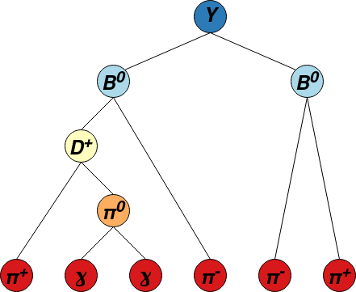
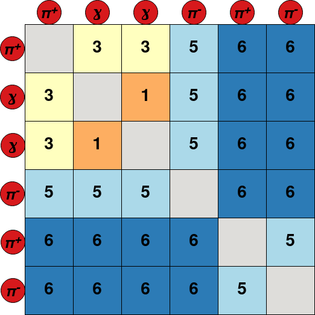

.. _GraFEI:

Graph-based Full Event Interpretation
=====================================

**Author: J. Cerasoli**

The **Graph-based Full Event Interpretation** (graFEI) is a machine learning tool to inclusively reconstruct events in Belle II 
using information on the final state particles only, without any prior assumption about the structure of the underlying decay chain.
This task is achieved with the use of deep Graph Neural Networks (GNNs), a particular class of neural networks acting on *graphs*. 
Graphs are entities composed of a set of *nodes* :math:`V=\{v_{i}\}_{i=1}^N`` 
connected by *edges* :math:`E = \{e_{v_{i} v_{j}} \equiv e_{ij}\}_{i \neq j}`.
You can find a brief description of the model in the documentation of the `GraFEIModel` class.

.. seealso::
   The model is described in `these proceedings <https://indico.cern.ch/event/1106990/papers/4996235/files/12252-ACAT_2022_proceedings.pdf>`_.
   This work is based on 
   `'Learning tree structures from leaves for particle decay reconstruction' <https://iopscience.iop.org/article/10.1088/2632-2153/ac8de0>`_ 
   by Kahn et al. Please consider citing both papers. 
   The code is adapted from the work of Kahn et al (available `here <https://github.com/Helmholtz-AI-Energy/BaumBauen>`_).
   A detailed description of the model is also available in this `Belle II internal note <https://docs.belle2.org/record/3649>`_.

The network is trained to predict the mass hypotheses of final state particles and the **Lowest Common Ancestor** (LCA) matrix of the event.
Each element of this matrix corresponds to a pair of final state particles, and contains the lowest ancestor common to both particles. 
To avoid the use of a unique identifier for each ancestor, a system of classes is used: 
6 for :math:`\Upsilon (4S)` resonances, 5 for :math:`B^{\pm,0}` mesons, 4 for :math:`{D^{*}_{(s)}}^{\pm, 0}`, 3 for :math:`D^{\pm,0}`, 
2 for :math:`K_{s}^{0}`, 1 for :math:`\pi^{0}`` or :math:`J/\psi` and 0 for particles not belonging to the decay tree. 
This new representation of the LC.A is called LCAS matrix, where the S stands for "stage".
An example of decay tree with its corresponding LCAS matrix is:

The model can be trained and evaluated in two modes:

* :math:`\Upsilon (4S)` **reconstruction mode**: the model is trained to reconstruct the LCAS matrix of the whole event, i.e. the maximum depth of
  the LCAS matrix is 6;
* :math:`B` **reconstruction mode**: the model is trained to reconstruct single :math:`B` decays, i.e. the maximum depth of the LCAS matrix is 5. 
  In this case, when applying the model to some data, a signal-side must be reconstructed first, and the graFEI is used to reconstruct the rest-of-event.

Model training
##############

The graFEI code is contained in ``analysis/scripts/grafei``.

The model is trained with ``ROOT`` ntuples produced with the steering file ``grafei/scripts/create_training_files.py``.
The file requires the argument ``-t`` to be set to either ``B+``, ``B0`` or ``Ups`` for :math:`B^{+}`, :math:`B^{0}` or :math:`\Upsilon (4S)` reconstruction respectively.
This is the only place where you specify which reconstruction mode you wish to perform: the code will figure it out automatically in later steps.
The output files used for training and evaluation must be placed in the folders ``root/train`` and ``root/val`` respectively, where ``root`` is a folder of your choice.

The training is performed with the python script ``grafei/scripts/train_model.py``. It requires a ``.yaml`` config file with the ``-c`` argument.
You can find a prototype of config file at ``grafei/config.yaml``, where all   options are documented.
The training will output a copy of the config file used and a weight file in the format ``.pt`` that can be used to apply the model to some other data.
The output folder is defined in the config file.

The loss function is of the form

.. math::
   \mathcal{L} = \text{Cross-entropy}_{\text{LCA}} + \alpha \cdot \text{Cross-entropy}_{\text{Masses}},

where :math:`\alpha` is a parameter tunable in the config file.

Applying the model to data
##########################

The model ``.yaml`` and ``.pt`` output files can be saved to a payload with the script ``grafei/scripts/save_model_to_payload.py`` 
and uploaded to a global tag in order to run on the grid.

Finally, the model can be included in a steering file via the modules `FlagBDecayModule <grafei.FlagBDecayModule>` and `GraFEIModule <grafei.GraFEIModule>`, 
in order to apply the model to Belle II data and MC.
Example of steering files for :math:`B` and :math:`\Upsilon (4S)` reconstruction modes are available in ``grafei/scripts/steering_file_examples``.
In both cases the LCAS matrix and mass hypotheses are not directly saved in the final ntuples, but several variables labelled with the prefix ``graFEI`` can be added.
When using the model in :math:`\Upsilon (4S)` reconstruction mode you have also the possibility of specifying an LCAS matrix (in the form of a nested list) and a list
of mass hypotheses (following the convention outlined in the `select_good_decay` class) for your **signal-side**: in the case where the predicted LCAS matrix describes a valid tree structure, 
the code checks if a subset of particles in the tree matches the given LCAS and mass hypotheses 
(the ordering of the final state particles does not matter because all the permutations are checked, however the mass hypotheses and the LCAS rows/columns should match). 
If so, the ``graFEI_goodEvent`` variable is set to 1. This allows to get rid of badly reconstructed events. 
Moreover, you can construct signal- and tag-side candidates with the following lines of code (as documented in the examples):

.. code:: python

   part_types = ["e+", "mu+", "pi+", "K+", "p+", "gamma"]

   for part in part_types:
      ma.cutAndCopyList(
         f"{part}:Bsig",
         f"{part}:graFEI",
         cut="extraInfo(graFEI_sigSide) == 1",
         writeOut=True,
         path=path,
    )
      ma.cutAndCopyList(
         f"{part}:Btag",
         f"{part}:graFEI",
         cut="extraInfo(graFEI_sigSide) == 0",
         writeOut=True,
         path=path,
    )

   ma.combineAllParticles([f"{part}:Bsig" for part in part_types], "B0:Bsig_graFEI", path=path)
   ma.combineAllParticles([f"{part}:Btag" for part in part_types], "B0:Btag_graFEI", path=path)

The ``PART:graFEI`` particle lists in the example are those used as input for the model.
The ``extraInfo(graFEI_sigSide)`` is set to 1 for particles predicted to belong to the signal-side, 0 for particles predicted to belong to the tag-side
and -1 for particles in events with ``graFEI_goodEvent = 0``. Therefore, if you want meaningful distributions you should cut on events with ``graFEI_goodEvent = 1``.

The variables added by the `GraFEIModule <grafei.GraFEIModule>` are filled with ``nan`` if there are less than two reconstructed particles in the event.
Otherwise, they are defined as follows:

======================================== ==================================================================================================================================
Variable                                 Description
======================================== ==================================================================================================================================
``graFEI_probEdgeProd``                  Discriminating variable obtained as the product of predicted edge class probabilities in the event.
``graFEI_probEdgeMean``                  Discriminating variable obtained as the arithmetic mean of predicted edge class probabilities in the event.
``graFEI_probEdgeGeom``                  Discriminating variable obtained as the geometric mean of predicted edge class probabilities in the event.
``graFEI_validTree``                     1 for valid tree structures, 0 otherwise.
``graFEI_goodEvent``                     1 for events having a correctly reconstructed signal-side, 0 otherwise (:math:`\Upsilon (4S)` reconstruction mode only).
``graFEI_nFSP``                          Number of reconstructed final state particles in the event.
``graFEI_nCharged_preFit``               Number of reconstructed charged particles in the event, according to mass hypotheses assigned with likelihood functions.
``graFEI_nPhotons_preFit``               Number of reconstructed photons in the event, according to mass hypotheses assigned with likelihood functions.
``graFEI_nElectrons_preFit``             Number of reconstructed electrons in the event, according to mass hypotheses assigned with likelihood functions.
``graFEI_nMuons_preFit``                 Number of reconstructed muons in the event, according to mass hypotheses assigned with likelihood functions.
``graFEI_nPions_preFit``                 Number of reconstructed pions in the event, according to mass hypotheses assigned with likelihood functions.
``graFEI_nKaons_preFit``                 Number of reconstructed kaons in the event, according to mass hypotheses assigned with likelihood functions.
``graFEI_nProtons_preFit``               Number of reconstructed protons in the event, according to mass hypotheses assigned with likelihood functions.
``graFEI_nLeptons_preFit``               Number of reconstructed leptons in the event, according to mass hypotheses assigned with likelihood functions.
``graFEI_nOthers_preFit``                Number of other reconstructed particles in the event, according to mass hypotheses assigned with likelihood functions.
``graFEI_nCharged_postFit``              Number of reconstructed charged particles in the event, according to mass hypotheses assigned with the graFEI model.
``graFEI_nPhotons_postFit``              Number of reconstructed photons in the event, according to mass hypotheses assigned with the graFEI model.
``graFEI_nElectrons_postFit``            Number of reconstructed electrons in the event, according to mass hypotheses assigned with the graFEI model.
``graFEI_nMuons_postFit``                Number of reconstructed muons in the event, according to mass hypotheses assigned with the graFEI model.
``graFEI_nPions_postFit``                Number of reconstructed pions in the event, according to mass hypotheses assigned with the graFEI model.
``graFEI_nKaons_postFit``                Number of reconstructed kaons in the event, according to mass hypotheses assigned with the graFEI model.
``graFEI_nProtons_postFit``              Number of reconstructed protons in the event, according to mass hypotheses assigned with the graFEI model.
``graFEI_nLeptons_postFit``              Number of reconstructed leptons in the event, according to mass hypotheses assigned with the graFEI model.
``graFEI_nOthers_postFit``               Number of other reconstructed particles in the event, according to mass hypotheses assigned with the graFEI model.
``graFEI_nPredictedUnmatched``           Number of reconstructed particles predicted as being "unmatched" by the model, i.e. the corresponding line in the LCAS matrix is filled with 0's.
``graFEI_nPredictedUnmatched_noPhotons`` Number of reconstructed particles predicted as being "unmatched" by the model, excluding photons.
``graFEI_truth_perfectLCA``              Truth-matching variable: 1 if LCAS matrix of the event if perfectly reconstructed, 0 otherwise.
``graFEI_truth_perfectMasses``           Truth-matching variable: 1 if all mass hypotheses in the event are perfectly assigned, 0 otherwise.
``graFEI_truth_perfectEvent``            Truth-matching variable: logical ``AND`` of ``perfectLCA`` and ``perfectMasses``.
``graFEI_truth_isSemileptonic``          Truth-matching variable: 1 if a neutrino is present in the true underlying decay chain, 0 if not present, -1 if no decay chain can be matched to the event.
``graFEI_truth_nFSP``                    Truth-matching variable: number of final state particles in the true underlying decay chain, -1 if no decay chain can be matched to the event.
``graFEI_truth_nPhotons``                Truth-matching variable: number of final state particles matched to true photons.
``graFEI_truth_nElectrons``              Truth-matching variable: number of final state particles matched to true electrons.
``graFEI_truth_nMuons``                  Truth-matching variable: number of final state particles matched to true muons.
``graFEI_truth_nPions``                  Truth-matching variable: number of final state particles matched to true pions.
``graFEI_truth_nKaons``                  Truth-matching variable: number of final state particles matched to true kaons.
``graFEI_truth_nProtons``                Truth-matching variable: number of final state particles matched to true protons.
``graFEI_truth_nOthers``                 Truth-matching variable: number of final state particles matched to true other particles.
======================================== ==================================================================================================================================

Code documentation
##################

This section describes the grafei code.

Basf2 modules
*************

You can import these modules in a steering file with ``from grafei import MODULENAME``.

.. automodule:: grafei
   :members:

Other modules and functions
***************************

Here the core code of the graFEI is described. This section is intended for developers, 
users usually do not need to manipulate these components.

.. autofunction:: grafei.modules.FlagBDecayModule.get_object_list

.. automodule:: grafei.model.config
   :members:

.. automodule:: grafei.model.create_trainer
   :members:

.. automodule:: grafei.model.dataset_split
   :members:

.. automodule:: grafei.model.dataset_utils
   :members:

.. automodule:: grafei.model.edge_features
   :members:

.. automodule:: grafei.model.geometric_datasets
   :members:
   :exclude-members: process

.. automodule:: grafei.model.geometric_layers
   :members:

.. automodule:: grafei.model.geometric_network
   :members:

.. automodule:: grafei.model.lca_to_adjacency
   :members:

.. automodule:: grafei.model.metrics
   :members:

.. automodule:: grafei.model.multiTrain
   :members:

.. automodule:: grafei.model.normalize_features
   :members:

.. automodule:: grafei.model.tree_utils
   :members:

.. automodule:: grafei.modules.RootSaverModule
   :members:

.. automodule:: grafei.modules.IsMostLikelyTempVarsModule
   :members:

