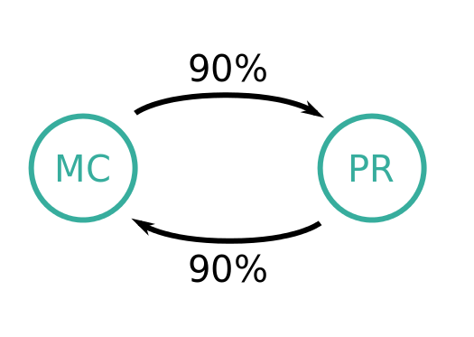
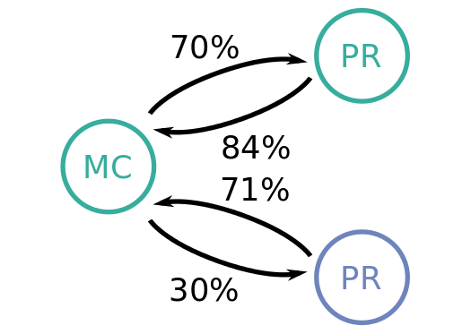
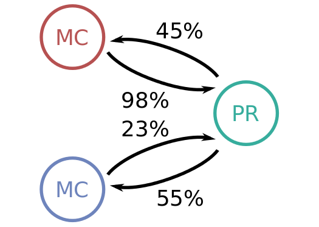
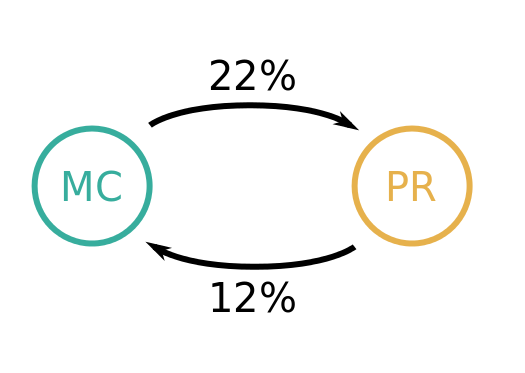

.. _mcmatching:

-----------
MC matching
-----------


~~~~
Core
~~~~

MC matching at in Belle II returns two important pieces of information: the true PDG id of the particle (``mcPDG``), and an error flag (``mcErrors``). 

Both variables will have non-trivial values only if the MCMatching module, which relates composite Particle(s) and MCParticle(s), is executed. mcPDG is set to the PDG code of the first common mother MCParticle of the daughters of this Particle.


.. b2-variables::
        :variables: mcPDG,mcErrors
        :noindex:

~~~~~~~~~~~
Convenience
~~~~~~~~~~~

There are several extra variables defined *for your convenience*, however all information is contained in the first two.

.. b2-variables::
        :variables: isSignal,isExtendedSignal,isSignalAcceptMissingNeutrino,isSignalAcceptMissingMassive,isSignalAcceptMissingGamma,isSignalAcceptMissing,isWrongCharge,isMisidentified,isCloneTrack,isOrHasCloneTrack,genNStepsToDaughter(i),genNMissingDaughter(PDG)
        :noindex:

~~~~~~~~~~~~~~~
The error flags
~~~~~~~~~~~~~~~

The error flag (mcErrors) is a bit set where each bit flag describes a different kind of discrepancy between reconstruction and MCParticle. The individual flags are described by the MCMatching::MCErrorFlags enum. A value of mcErrors equal to 0 indicates perfect reconstruction (signal). Usually candidates with only FSR photons missing are also considered as signal, so you might want to ignore the corresponding c_MissFSR flag. The same is true for c_MissingResonance, which is set for any missing composite particle (e.g. K_1, but also D*0).


=============================  ================================================================================================
Flag                           Explanation  
=============================  ================================================================================================  
 c_Correct       = 0           This Particle and all its daughters are perfectly reconstructed. 
 c_MissFSR       = 1           A Final State Radiation (FSR) photon is not reconstructed (based on MCParticle: :c_IsFSRPhoton). 
 c_MissingResonance = 2        The associated MCParticle decay contained additional non-final-state particles (e.g. a rho)
                               that weren't reconstructed. This is probably O.K. in most cases. 
 c_DecayInFlight = 4           A Particle was reconstructed from the secondary decay product of the actual particle. 
                               This means that a wrong hypothesis was used to reconstruct it, which e.g. for tracks might mean
                               a pion hypothesis was used for a secondary electron. 
 c_MissNeutrino  = 8           A neutrino is missing (not reconstructed). 
 c_MissGamma     = 16          A photon (not FSR) is missing (not reconstructed). 
 c_MissMassiveParticle = 32    A generated massive FSP is missing (not reconstructed). 
 c_MissKlong     = 64          A Klong is missing (not reconstructed).  
 c_MisID = 128                 One of the charged final state particles is mis-identified (wrong signed PDG code).
 c_AddedWrongParticle = 256    A non-FSP Particle has wrong PDG code, meaning one of the daughters (or their daughters)
                               belongs to another Particle. 
 c_InternalError = 512         There was an error in MC matching. Not a valid match. Might indicate fake/background 
                               track or cluster. 
 c_MissPHOTOS    = 1024        A photon created by PHOTOS was not reconstructed (based on MCParticle: :c_IsPHOTOSPhoton). 
=============================  ================================================================================================


~~~~~~~~~~~~~~
Example of use
~~~~~~~~~~~~~~

The two variables together allow the user not only to distinguish signal (correctly reconstructed) and background (incorrectly reconstructed) candidates, but also to study and identify various types of physics background (e.g. mis-ID, partly reconstructed decays, ...). To select candidates that have a certain flag set, you can use bitwise and to select only this flag from mcErrors and check if this value is non-zero: ``(mcErrors & MCMatching::c_MisID) != 0``.
For use in a TTree selector, you'll need to use the integer value of the flag instead:

.. code-block:: cpp

        ntuple->Draw("M", "(mcErrors & 128) != 0")

You can also make use of ``MCMatching::explainFlags()``` which prints a human-readable list of flags present in a given bitset. Can also be used in both C++ and python:

.. code-block:: python

        import basf2
        from ROOT import Belle2, gInterpreter
        gInterpreter.ProcessLine('#include "analysis/utility/MCMatching.h"')
        print(Belle2.MCMatching.explainFlags(a_weird_mcError_number)) 


If instead only binary decision (1 = signal, 0 = background) is needed, then it for convenience one can use ``isSignal`` (or ``isSignalAcceptMissingNeutrino`` for semileptonic decays).

.. code-block:: python
        
        from modularAnalysis import variablesToNtuple
        variablesToNtuple("X:mycandidates -> Y Z", variables = ["isSignal"] + other_interesting_variables)
        
assuming you have reconstructed :code:`X -> Y Z` :

.. code-block:: python

        from modularAnalysis import applyCuts
        applyCuts('X:myCandidates', 'isSignal==1')

--------------------------------------
MC decay finder module `MCDecayFinder`
--------------------------------------

Analysis module to search for a given decay in the list of generated particles (MCParticle).

The module can be used for:

* Determination of the number of generated decays for efficiency studies, especially in the case of inclusive decays (e.g.: What's the generated number of B -> D^0 X decays?).
* Matched MC decays as input for a truth matching module.

~~~~~~~~~~~~~~~~~~~~~
Steering file snippet
~~~~~~~~~~~~~~~~~~~~~
 
.. code-block:: python

  import basf2
  
  # Create main path
  main = basf2.create_path()
  
  # Modules to generate events, etc.
  ...
  
  mcfinder = register_module('MCDecayFinder')
  # Search for B+ decaying to anti-D0 + anything, where the anti-D0 decays to K+ pi-.
  # Ignore additional photons emitted in the anti-D0 decay. Charge conjugated decays
  # are matched, too. If there is a match found, save to ParticleList 'testB'
  mcfinder.param('strDecayString', 'B+ -> [anti-D0 => K+ pi-] ...')
  mcfinder.param('strListName', 'testB')
  main.add_module(mcfinder)
  
  # Modules which can use the matched decays saved as Particle in the ParticleList 'testB'
  ...
 

~~~~~~
Status
~~~~~~

Skipping of intermediate states in decay chain not supported yet, e.g. $B \to \pi \pi K$.

---------------
MC decay string
---------------

Analysis module to search for a generator-level decay string for given particle.

~~~~~~~~~~~~~~~~~~
Using decay hashes
~~~~~~~~~~~~~~~~~~

The use of decay hashes is demonstrated in :code:`B2A502-WriteOutDecayHash.py` and :code:`B2A503-ReadDecayHash.py`.

B2A502-WriteOutDecayHash.py creates one ROOT file, via `variablesToNtuple` containing the requested variables including the two decay hashes, and a second root file containing the two decay hashes, and the full decay string.  The decay strings can be related to the candidates that they are associated with by matching up the decay hashes.  An example of this using python is shown in B2A503-ReadDecayHash.py.

.. code-block:: python

  path.add_module('ParticleMCDecayString', listName='my_particle_list', fileName='my_hashmap.root')

This will produce a file with all of the decay strings in it, along with the decayHash (hashes the MC decay string of the mother particle) and decayHashExtended (hashes the decay string of the mother and daughter particles).  The mapping of hashes to full MC decay strings is stored in a ROOT file determined by the fileName parameter.

Then the decayHash and decayHashExtended can be included in NtupleTools by including them as extrainfo as a custom float:

.. code-block:: python

  from variables import variables
  variables.addAlias('decayHash', 'extraInfo(DecayHash)')
  variables.addAlias('decayHashExtended', 'extraInfo(DecayHashExtended)')
  ...
  variables += ['decayHash', 'decayHashExtended']
  variablesToNtuple('mydecay', variables, path=mypath)

------------------
Tau decay MC modes
------------------

A special case is the decay of generated tau lepton pairs. For their study, it is useful to call the function ``labelTauPairMC`` in the steering file.

.. code-block:: python

        from modularAnalysis import labelTauPairMC
        labelTauPairMC()

.. b2-variables::
        :variables: tauPlusMcMode,tauMinusMcMode,tauPlusMCProng,tauMinusMCProng

Using MC information, ``labelTauPairMC`` identifies if the generated event is a tau pair decay.

The variables ``tauPlusMCProng`` and ``tauMinusMCProng`` stores the prong (number of final state charged particles) coming from each one of the generated tau leptons. If the event is not a tau pair decay, the value in each one of these variables will be 0.

The channel number will be stored in the variables ``tauPlusMcMode``, and ``tauMinusMcMode`` (one for the positive and the other for the negative) according to the following table:

============  ===============================================  ============  ==================================================
MC mode       Decay channel                                    MC mode       Decay channel
============  ===============================================  ============  ==================================================
 -1           Not a tau pair event                             24            :math:`\tau^- \to \pi^- \omega \pi^0 \nu`
 1            :math:`\tau^- \to e^- \nu \bar{\nu}`             25            :math:`\tau^- \to \pi^- \pi^+ \pi^- \eta \nu`
 2            :math:`\tau^- \to \mu^- \nu \bar{\nu}`           26            :math:`\tau^- \to \pi^- \pi^0 \pi^0 \eta \nu`
 3            :math:`\tau^- \to \pi^- \nu`                     27            :math:`\tau^- \to K^- \eta \nu`
 4            :math:`\tau^- \to \rho^- \nu`                    28            :math:`\tau^- \to K^{*-} \eta \nu`
 5            :math:`\tau^- \to a_1^- \nu`                     29            :math:`\tau^- \to K^- \pi^+ \pi^- \pi^0 \nu`
 6            :math:`\tau^- \to K^- \nu`                       30            :math:`\tau^- \to K^- \pi^0 \pi^0 \pi^0 \nu`
 7            :math:`\tau^- \to K^{*-} \nu`                    31            :math:`\tau^- \to K^0 \pi^- \pi^+ \pi^- \nu`
 8            :math:`\tau^- \to \pi^- \pi^+ \pi^- \pi^0 \nu`   32            :math:`\tau^- \to \pi^- \bar{K}^0 \pi^0 \pi^0 \nu`
 9            :math:`\tau^- \to \pi^- \pi^0 \pi^0 \pi^0 \nu`   33            :math:`\tau^- \to \pi^- K^+ K^- \pi^0 \nu`
 10           :math:`\tau^- \to 2\pi^- \pi^+ 2\pi^0 \nu`       34            :math:`\tau^- \to \pi^- K^0 \bar{K}^0 \pi^0 \nu`
 11           :math:`\tau^- \to 3\pi^- 2\pi^+ \nu`             35            :math:`\tau^- \to \pi^- \omega \pi^+ \pi^- \nu`
 12           :math:`\tau^- \to 3\pi^- 2\pi^+ \pi^0 \nu`       36            :math:`\tau^- \to \pi^- \omega \pi^0 \pi^0 \nu`
 13           :math:`\tau^- \to 2\pi^- \pi^+ 3\pi^0 \nu`       37            :math:`\tau^- \to e^- e^- e^+ \nu \bar{\nu}`
 14           :math:`\tau^- \to K^- \pi^- K^+ \nu`             38            :math:`\tau^- \to f_1 \pi^- \nu`
 15           :math:`\tau^- \to K^0 \pi^- K^0bar \nu`          39            :math:`\tau^- \to K^- \omega \nu`
 16           :math:`\tau^- \to K^- K^0 \pi^0 \nu`             40            :math:`\tau^- \to K^- K^0 \pi^+ \pi^- \nu`
 17           :math:`\tau^- \to K^- \pi^0 \pi^0 \nu`           41            :math:`\tau^- \to K^- K^0 \pi^0 \pi^0 \nu`
 18           :math:`\tau^- \to K^- \pi^- \pi^+ \nu`           42            :math:`\tau^- \to \pi^- K^+ \bar{K}^0 \pi^- \nu`
 19           :math:`\tau^- \to \pi^- \bar{K}^0 \pi^0 \nu`
 20           :math:`\tau^- \to \eta \pi^- \pi^0 \nu`
 21           :math:`\tau^- \to \pi^- \pi^0 \gamma \nu`
 22           :math:`\tau^- \to K^- K^0 \nu`
 23           :math:`\tau^- \to \pi^- 4\pi^0 \nu`
============  ===============================================  ============  ==================================================


--------------
Track matching
--------------

This section describes the definition of the various status, that the matching of tracks can produce. The four main figures of merit for the track finder - the finding efficiency, the hit efficiency, the clone rate and the fake rate - are defined using these matching labels as described below.

~~~~~~~~~~~~~~~~~~~~~~~~~~
Overview: Available Status
~~~~~~~~~~~~~~~~~~~~~~~~~~

After running the `TrackFinderMCTruth` (which creates Genfit Track Candidates in the following called MC track candidates) and the "normal" track finder algorithm (in the following called PR track candidates), you can apply the `MCMatcherTracksModule`, which creates relations between the two `StoreArrays` of track candidates by looking on the hit content. If the hit content of two track candidates has a non-zero intersection, a relation is created with the ration between the intersection number of hits to the total number of hits in the candidate as a weight (in both directions because the weight can be different as the total number of hits in a track can be different for MC and PR track candidates). The weights from PR to MC track candidates are called purity and from MC to PR track candidates efficiency. Only the single highest value for each PR and MC track candidates is stored in the relation array (so only the "best match" is stored) and only if the purity is above 2/3 and the efficiency is above 0.05.

After the matching, each PR and each MC track candidate is given a single label:

Tracks from Pattern Recognition can be,

*    matched,
*    clone, and
*    fake (= background or ghost)

as it can be seen in the `PRToMC::MatchInfo` in ``TrackMatchLookUp.h``

Charged MCParticles can be

*    found or matched (we will call it found to not confuse with the PR track candidates)
*    merged or
*    missing.

as it can be seen in the `MCToPR::MatchInfo` in `TrackMatchLookUp.h`.

~~~~~~~~~~~~~~~~~~~~~~~~~~~~~~~~
When is a Track/MCParticle What?
~~~~~~~~~~~~~~~~~~~~~~~~~~~~~~~~

We will first describe the labels here briefly (as it can also be found in the comments in the MCMatcherTracksModule.h) and then show some examples.

The PRTracks can be classified into four categories, which are described in the following

*    MATCHED
    #        The highest efficiency PRTrack of the highest purity MCTrack to this PRTrack is the same as this PRTrack. This means the PRTrack contains a high contribution of only one MCTrack and is also the best of all PRTracks describing this MCTrack.
*    CLONE
    #        The highest purity MCTrack has a different highest efficiency PRTrack than this track. This means the PRTrack contains high contributions of only one MCTrack but a different other PRTrack contains an even higher contribution to this MCTrack.
*    BACKGROUND
    #        The PRTrack contains mostly hits, which are not part of any MCTrack. This normally means, that this PRTracks is made of beam background hits. Be careful: If e.g. only creating MC track candidates out of primary particles, all found secondary particles will be called background (which is happening in the default validation)
*    GHOST
  #        The highest purity MCTrack to this PRTrack has a purity lower than the minimal purity given in the parameter minimalPurity (2/3) or has an efficiency lower than the efficiency given in the parameter minimalEfficiency (0.05). This means that the PRTrack does not contain a significat number of a specific MCTrack nor can it considered only made of background.

MCTracks are classified into three categories:

*    MATCHED
    #        The highest purity MCTrack of the highest efficiency PRTrack of this MCTrack is the same as this MCTrack. This means the MCTrack is well described by a PRTrack and this PRTrack has only a significant contribution from this MCTrack.
*    MERGED
    #        The highest purity MCTrack of the highest efficiency PRTrack of this MCTrack is not the same as this MCTrack. This means this MCTrack is mostly contained in a PRTrack, which in turn however better describes a MCTrack different form this.
*    MISSING
    #        There is no highest efficiency PRTrack to this MCTrack, which also fullfills the minimal purity requirement.

Four examples are shown in the pictures. The circles on the left side shows the MC track candidates, the right side stands for the PR track candidates. The arrows depict that there are common hits, the percentage values shows the ratio.

 

  There is a one to one connection between a MCTrackCand and a track from the track finder. The MCTrackCand is labeled found and the other track is labeled matched.


  The MCTrackCand is found twice. The track from the track finder with the higher percentage (the green one in this example) is labeled matched, the other one cloned. The MCTrackCand is nevertheless labeled found.


  The track from the track finder is created with hits from many different MCTrackCands. As none of the corresponding hit ratios exceeds 66%, the track is called ghost or fake. The hit ratios of the MCTrackCands itself do not play any role here.


  The found track does not describe any of the MCTrackCands well (or well enough) - but is made out of background hits. This track is also called a fake or background.

~~~~~~~~~~~~~~~~
Figures of Merit
~~~~~~~~~~~~~~~~

The four main figures of merit, as also shown on the validation side, are:

*    Finding efficiency: Number of MC track candidates which are labeled found divided by the total number of MC track candidates
*    Hit efficiency: Mean of all single hit efficiency of the MC track candidates labeled as found. The single hit efficiency is defined as the number of found hits divided by the number of all hits in a track. This information is encoded in the weight of the relations created by the `MCTrackMatcherModule`.
*    Clone rate: Number of PR track candidates which are labeled clone divided by the number of PR track candidates which are labeled clone or matched
*    Fake rate: Number of PC track candidates which are labeled fake divided by the total number of PR track candidates.

These definitions can be looked up in `tracking/scripts/validation/mc_side_module.py` and `tracking/scripts/validation/pr_side_module.py`.

.. TODO: fill with material.
---------------
Photon matching
---------------
Detalis of photom matching efficeincy can be found `in this talk <https://confluence.desy.de/download/attachments/53768739/2017_12_mcmatching_ferber.pdf>`_. If you want to `contribute <https://agira.desy.de/browse/BII-5306>`_ to the Belle II Software, please feel free to move material from the talk to this section.

