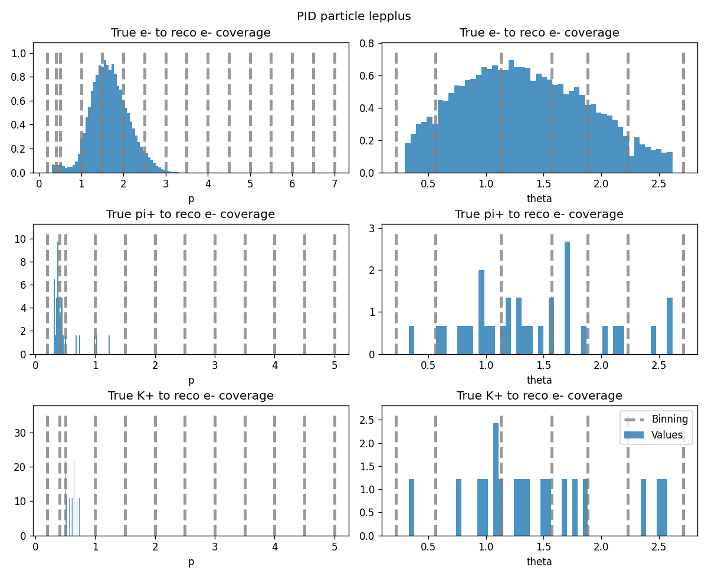

.. _analysis_reweighting:

Offline reweighting
===================

Introduction
------------

The majority of physics analyses at Belle II rely on simulation for setting up the selection cuts for the process of interest.
The selection on simulated data (MC) will often result in a different efficiency if the same selection is applied on the real experimental data,
hence data/MC corrections are necessary.
The data/MC tables can be applied online, i.e. during basf2 processing, or offline, on the resulting analysis ntuples.
One can find the latest approved correction tables for offline reweighting in the following `Git repository <https://gitlab.desy.de/belle2/performance/correction-tables>`_.
These data/MC corrections often depend on particle properties, so they are typically provided in bins of kinematics, channel IDs, or other properties.
The `add_weights_to_dataframe <sysvar.add_weights_to_dataframe>` helper function can add the data/MC corrections to the ntuples according to the defined binning
and it can simplify the uncertainty propagation. 

Charged Particle Identification corrections
~~~~~~~~~~~~~~~~~~~~~~~~~~~~~~~~~~~~~~~~~~~

Typically, the Particle IDentification (PID) correction tables are provided in bins of momentum, polar angle and charge of a particle
and for a particular PID selection cut.
The offline PID tables are provided as files in CSV format. They can be easily loaded as a DataFrame in a Jupyter Notebook or in a python script
via the ``pandas.from_csv()`` function.
Each charged final state particle can have corresponding efficiency and fake rate correction tables.

For the offline reweighting one needs to specify the reconstructed and generated PDG codes for each table, e.g. the electron efficiency
table is ``(11, 11)`` and the pion to electron fake rate is ``(11, 211)``.
The user ntuple may contain variables for a mother particle and several daughter particles and
the daughter particles have their own unique prefix, so here we expect that all necessary variables for the reweighting have the same prefix.

The PID selection thresholds should be specified per particle to select correct entries from the PID correction tables.

The following code snippet provides an example of reweighting particles with prefixes ``lepminus_`` and ``lepplus_`` in the ``user_df`` DataFrame:

.. code-block:: python

  from sysvar import add_weights_to_dataframe
  tables = {(11, 11): efftable_e,
            (11, 211): faketable_pi_e,
            (11, 321): faketable_K_e}
  thresholds = {11: ('pidChargedBDTScore_e', 0.9)}
  add_weights_to_dataframe('lepminus_',
                           user_df, 
                           systematic='custom_PID', 
                           custom_tables=tables, 
                           custom_thresholds=thresholds)
  add_weights_to_dataframe('lepplus_',
                           user_df, 
                           systematic='custom_PID', 
                           custom_tables=tables, 
                           custom_thresholds=thresholds)

.. warning::
    Please make sure that the correction tables and the ntuple are compatible before application of the weights!
    In the example above, it is expected that ``pidChargedBDTScore_e > 0.9`` cut has been already applied on ``user_df``.

By default, the `add_weights_to_dataframe <sysvar.add_weights_to_dataframe>` function calls will add ``lepminus_Weight`` and ``lepplus_Weight``
columns to the ``user_df`` and they will add additional columns of ``lepminus_Weight_0`` to ``lepminus_Weight_99`` and
``lepplus_Weight_0`` to ``lepplus_Weight_99``, which are the variations of the nominal weights according to the total PID uncertainty.
The systematic uncertainties can be correlated by providing the same seed value to the particles
by providing the same ``sys_seed`` argument value to the ``add_weights_to_dataframe`` method calls.

One can switch off the weight variations by providing the ``generate_variations=False`` flag to the ``add_weights_to_dataframe`` function,
and in this case only ``data_MC_ratio`` and the corresponding statistical and systematic uncertainty columns will be added to the ntuples
with corresponding particle prefix.

The coverage plots can be shown by providing the ``show_plots=True`` argument. 

This plot shows the distributions of momentum and theta of the ``lepplus`` particle split by ``mcPDG`` values, 
and the binning of the corresponding correction tables.
The entries that are not covered by the correction tables will assigned a NaN value, which is replaced by default with ``1.0`` and 
the replaced value can be regulated via ``fillna`` argument.

Full Event Interpretation corrections
~~~~~~~~~~~~~~~~~~~~~~~~~~~~~~~~~~~~~

Similarly to PID weights, the FEI tables are provided as files in CSV format.
The corrections are binned in FEI decay mode ID and they are provided for several thresholds of FEI probability.
Because of the high cross-feed rates between the FEI modes, a covariance matrix must be provided either as a separate ``.npy`` file or
as columns within the table.

.. code-block:: python

  from sysvar import add_weights_to_dataframe
  add_weights_to_dataframe('Btag',
                           user_df,
                           systematic='custom_FEI',
                           custom_tables=table,
                           custom_thresholds=0.01,
                           cov_matrix=cov,
                           variable_aliases={'dec_mode': 'Btag_mode'},
                           show_plots=True)

In the snippet above, the reweighting is performed for ``Btag`` particle in ``user_df`` DataFrame.
The FEI correction table is loaded as ``table`` DataFrame via the ``pandas.from_csv()`` function and the covariance matrix ``cov``
is loaded as a separate ``numpy.ndarray`` via the ``numpy.load()`` method.
The `add_weights_to_dataframe <sysvar.add_weights_to_dataframe>` function expects that the FEI decay mode ID is provided 
in the ``{prefix}_dec_mode`` column of the ``user_df``, but if this is not the case, one can provide a variable alias 
to point the object to the existing column.

Modules and functions
~~~~~~~~~~~~~~~~~~~~~

This section provides the documentation for the classes that are used for offline reweighting.

.. automodule:: sysvar
   :members: add_weights_to_dataframe