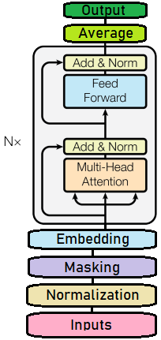
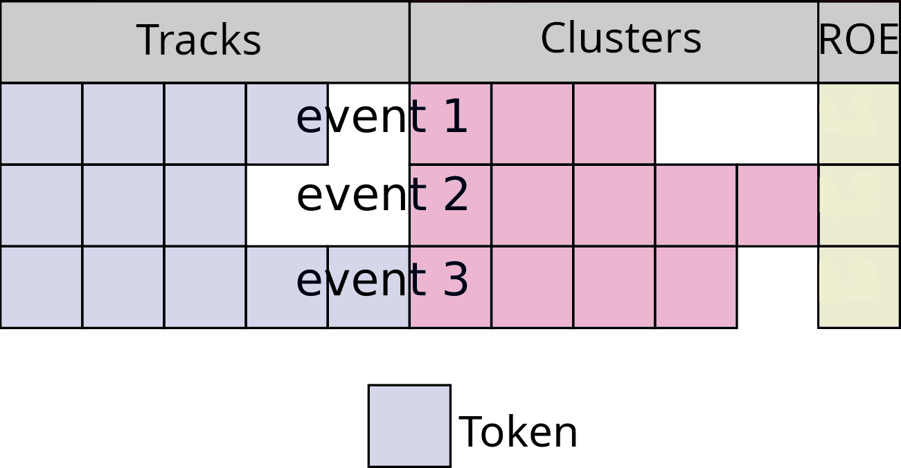

.. _TransformerFlavorTagger:

Transformer Flavor Tagger (TFlaT)
=================================

**Authors: B. Schwenker and L. Herzberg**

The Transformer Flavor Tagger is a multivariate tool to estimate the
flavor of :math:`B_{tag}` mesons, without having to reconstruct the decays
explicitly. The detected charged tracks and photon clusters in the rest
of event are directly used as inputs to TFlaT.

Principle
---------
Many B mesons decay in flavor specific decay modes, which offer a unique
signature for their final state particles. Certain attributes, like fast
leptons or slow pions can be used to infer directly to the flavor of the
tag B meson.

As opposed to the category based flavor tagger, see :ref:`analysis/doc/FlavorTagger:Flavor Tagging Principle` ,
those specific attributes are not incorporated by hand, but the best representation is directly 'learned' by a deep
neural network. The advantage of this method is that the algorithm is potentially susceptible to exploit a wider
case of attributes of the dataset, than putting in only explicit knowledge by pre crafted features.

Algorithm
---------

The core of the algorithm is a stack of six transformer blocks processing the detected tracks and photon clusters
as input tokens. It is trained with the AdamW stochastic gradient descent optimizer.

The model is implemented with the `keras <https://keras.io>` framework using `torch <https://pytorch.org>` as the
backend. The final trained model is exported to `ONNX <https://onnx.ai>` and can directly be used by the basf2
MVAExpert.

Currently, the input of the algorithm is based on charged tracks, photon clusters and global rest of event
properties. The charged tracks and photon clusters are sorted by momentum. If an event has less then 10
charged tracks a specific kind of zero padding is applied. The zero padding is also applied if the event has
less than 20 photon clusters. A padding mask is created to signal if a track or photon was padded or not.

The scheme of the input parameters are shown below:

Each charged track is described by 27 variables or features. The variables range from kinematics in the center
of mass frame to particle identification variables. A MultiLayerPerceptron is used to map the features of each
track into a 128 dimensional embedding space.

Similarly, each photon is described by six input features. The input feature range from the momentum
in the center of mass frame to cluster shape variables. A second MultiLayerPerceptron is used to map the features
of each photon into a 128 dimensional embedding space.

TFlaT uses four features describing the rest of event globally: (1) The number of photons, (2) the number of charged
tracks, (3) the number of K_S and (4) the total transverse momentum of tracks in the rest of event. A third
MultiLayerPerceptron is used to map these four features into a 128 dimensional embedding space.

After these padding and embedding steps, we have a now sequence of 31 tokens with a dimension of 128. We also have a mask
telling us if a token was padded. The sequence of tokens and the mask are now processed by a stack of six transformer
blocks. Each transformer block utilizes MultiHeadAttention to compute contextualized embeddings. Padded tokens are excluded
from the computation of attention. After the last transformer block, the final 31 embeddings are averaged. Again, padded tokens are
excluded from the averaging. The averaged embedding is fed into a final MultiLayerPerceptron with a single output neuron.

The output of the algorithm is the variable ``'qrTFLAT'``, which corresponds to the tag-side :math:`B` flavor :math:`q_{\textrm TFlaT}`
times the dilution factor :math:`r_{\textrm TFlaT}`. The range of ``'qrTFLAT'`` is :math:`[-1, 1]`.
The output is close to :math:`-1` if the tag side of an event is likely to be related to a :math:`\bar{B}^0`,
and close to :math:`1` for a :math:`B^0`. The value :math:`0` corresponds to a random decision.

How to use
----------

The usage of the Transformer Flavor Tagger is pretty simple and straight forward.

In your *steering file*, you first have to import the interface to the Transformer Flavor Tagger

::

    import tflat.flavorTagger as ft

After reconstructing your signal :math:`B` meson, make sure that you build the rest of event:

::

    ma.buildRestOfEvent('B0:sig', path=path)

To use the Transformer Flavor Tagger with basic functionality on Belle II data or MC, use

::

    ft.flavorTagger(particleLists=['B0:sig'],
                     path=main)

Presently, TFlaT cannot be used on Belle data or MC with ``b2bii``. We are working on implementing
this feature.

Finally, do not forget to save the output variable ``'qrTFLAT'`` into your ntuples.
It is probably also helpful for MC studies, to write out the MC truth flavor of the
tag side ``'mcFlavorOfOtherB'``.

::

    ma.variablesToNtuple(decayString='B0:sig',
                         variables=['qrTFLAT', 'mcFlavorOfOtherB'],
                         path=path)

Tutorials
---------

An example tutorial for normal use can be found under:

::

  analysis/examples/tutorials/B2A803-TransformerFlavorTagger.py

Functions
---------

.. automodule:: tflat.flavorTagger
   :members:
   :undoc-members:
