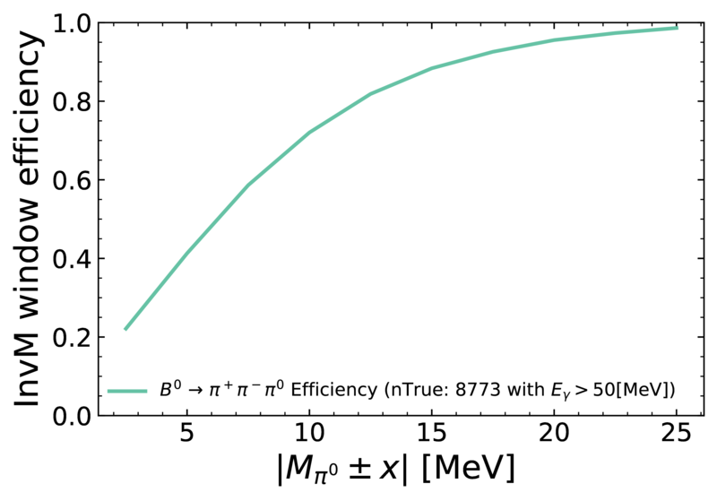

.. _treeFitter:

Tree Fitter
===========

Tree Fitter is a tool to perform simultaneous vertex fitting of a single decay
chain. The work is based on `arXiv:physics/0503191 <https://arxiv.org/abs/physics/0503191>`_.
The decay structure to use is defined by the user when reconstructing
the particles; TreeFitter will then attempt to fit accordingly.
In other words, it is hypothesis-based fitting. In addition to vertexing, it can apply the
following constraints:

  - **Mass Constraint:** Require the mass of selected composite particles to match the PDG mass. Energy-momentum free parameters of the fit drop from 4 to 3.
  - **IP Constraint:** The production vertex of the head of the decay is constrained to the IP. Note that this is different from the ipconstraint/iptube in RAVE/KFit, which constrains the decay vertex to the IP. This is a much lighter constraint but significantly helps in stabilising the fit.
  - **Custom Origin Constraint:** Set the production vertex position of your particle as well as the corresponding covariance matrix manually (default values are for B-mesons and extracted from generator distribution width of B-mesons, respectively). This is useful when fitting D*/D without wanting to fit a B but constraining the process to be B-decay like (think of semi-leptonic modes and stuff with a neutrino in the B decay).

Some notes to keep in mind:

  - Use TreeFitter in complex topologies and modes with neutrals.
  - TreeFitter updates all particles in the specified list with the fit results.
  - TreeFitter is slow compared to KFit, but roughly as fast as RAVE (depends on the topology).
  - Lifetime/Decay Lenght of a composite are a fit parameter and are saved as ExtraInfo("decayLength") and ExtraInfo(lifeTime). These will be fully interfaced with NtupleTools in the future; they are currently still in testing and strange features may surface.

.. warning:: If you fit modes with neutrals: check your preselection efficiency!

For example, a selection of :math:`0.130 < \texttt{InvM} < 0.14~\rm{GeV}/c^2` already cuts away 60% of true :math:`\pi^0`  in :math:`B\to\pi^+\pi^-\pi^0`.

        The efficiency for :math:`B\to\pi^+\pi^-\pi^0`, with :math:`E_{\gamma}>0.05~\rm{GeV}`, :b2:var:`pionID`>0.5 and :b2:var:`chiProb`>0.001.

.. autofunction:: vertex.vertexTree
