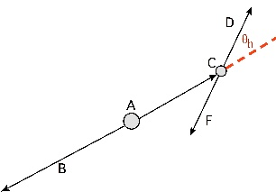

.. _analysis_variablemanager_class:

VariableManager
===============

The VariableManager handles all variables in ``basf2`` analysis.
It is implemented as a `singleton <https://en.wikipedia.org/wiki/Singleton_pattern>`_
C++ class with a python interface.

The C++ documentation is `here <https://b2-master.belle2.org/software/development/classBelle2_1_1Variable_1_1Manager.html>`_.

.. tip::

        For (unfortunate) historical reasons, the python accessor to the VariableManager
        singleton is called ``variables`` and is in the python ``variables`` module.
        This leads to strange-looking python ``import`` commands.

        For example:

        .. code-block:: python

            from variables import variables

        To avoid confusion, example/tutorial scripts often use a namespace alias ``vm``.
        You might want to use this in your scripts.

        .. code-block:: python

            from variables import variables as vm # shorthand for VariableManager

.. py:class:: VariableManager

   Singleton class to hold all variables and aliases in the current scope.

   .. py:method:: addAlias(alias, expression)

      Create a new alias.

      Variable names are deliberately verbose and explicit (to avoid ambiguity).
      However, it is often not desirable to deal with long unwieldy variable names particularly in the context of :doc:`VariableManagerOutput`.

      Example:

          Aliases to a verbose variable may be set with:

          >>> from variables import variables as vm
          >>> vm.addAlias("shortname", "aReallyLongAndSpecificVariableName(1, 2, 3)")

      .. seealso::

          `variables.utils.create_aliases` and `variables.utils.create_aliases_for_selected`
          might be helpful if you find yourself setting many aliases in your analysis script.

      .. warning::

          The VariableManager instance is configured independently of the `basf2.Path`.
          In case of adding the same alias twice, the configuration just before calling `basf2.process` is what wins.

      :param str alias: New alias to create
      :param str expression: The expression the alias should evaluate to

      :return: True if the alias was successfully added

   .. py:method:: getAliasNames()

      Get a list of all alias names (in reverse order added)

      .. tip::

          This returns a ``ROOT.vector`` which you will probably
          need to convert into a python ``list(str)``.

          >>> my_aliases = list(vm.getAliasNames())

      :returns: ``ROOT.vector`` list of alias names

   .. py:method:: addCollection(collection, variables)

      Create a new variable collection.

      .. tip::

         This method takes a ``ROOT.vector<string>`` as input.
         It's probably easier to use `variables.utils.add_collection` which wraps this function for you.

      :param str collection: The new collection to create.
      :param variables: A ``ROOT.std.vector(string)`` instance of variables to add as the variable collection.

      :returns: True if the collection was successfully added

   .. py:method:: getCollection(collection)

      Get a list of all variables in the ``collection``.

      :param str collection: The name of the existing variable collection

      :returns: ``ROOT.vector`` list of variable names

   .. py:method:: printAliases()

      Prints all aliases currently registered.
      Useful to call just before calling `basf2.process` on an analysis `basf2.Path` when debugging.

.. _variablesByGroup:

Variables by group
==================

Here is a categorised list of variables known to ``basf2``.
You can also look at the alphabetical index: :ref:`b2-varindex`.

Kinematics
~~~~~~~~~~

.. b2-variables::
   :group: Kinematics

Helicity
~~~~~~~~

.. b2-variables::
      :group: Helicity variables

Tracking
~~~~~~~~

Here is a list of track variables.
In the following descriptions, PR refers to "pattern recognition" tracks (i.e. reconstructed). And MC refers to MC tracks.
This notation follows the convention of the tracking paper.

.. seealso:: For more details see: "*Track finding at Belle II*" `Comput.Phys.Commun. 259 (2021), 107610 <https://doi.org/10.1016/j.cpc.2020.107610>`_

.. b2-variables::
   :group: Tracking

V0 Tracking
~~~~~~~~~~~

Here is a list of track variables for V0 daughters:

.. b2-variables::
   :group: V0Daughter

PID
~~~

Here is a list of particle identification variables:

.. warning ::
  The **definitions** of the default PID variables have changed between
  release-01 and release-02.

  Prior to release-02-00-00 (i.e. in release-01-XX-YY) each ID was calculated
  against the pion likelihood alone, or the kaon in the case of the pion itself.
  Namely the pair probability (also known as the binary probability) was returned:

    * for all particles: :math:`\text{<Part>ID}=\mathcal{L}_{\text{<Part>}}/\mathcal{L}_\pi`, where :math:`\text{<Part>}\in[e,\mu,K,p,d]`.

    * for pions: :math:`\text{PionID}=\mathcal{L}_\pi/\mathcal{L}_K`.

  In other words, pionID was sensitive only to the pion-kaon mis-id, and not to
  the pion-proton or pion-muon mis-identification.

.. b2-variables::
   :group: PID

Basic particle information
~~~~~~~~~~~~~~~~~~~~~~~~~~

.. b2-variables::
   :group: Basic particle information

PID for expert
""""""""""""""
These expert-level variables are metavariable that allow the used to access the
LogLikelihood values, the binary likelihood ratios and the global likelihood
ratios for any arbitrary detector combination of mass hypothesis. The accepted
detector codes are SVD, TOP, CDC, ARICH, ECL, KLM and ALL.

If a likelihood is not available from the selected detector list, **NaN** is returned.

.. warning ::
  These variables are not to be used in physics analyses, but only by experts doing performance studies.

.. b2-variables::
   :group: PID_expert

ECL Cluster
~~~~~~~~~~~

Here is a list of variables related to ECL cluster.
All ECLCluster-based variables return NaN if no ECLCluster is found.

.. _importantNoteECL:

.. note::
    All floating type variables in the mdst dataobject ECLCluster use ROOT Double32_t types with
    specific range declaration to save disk storage. This has two important consequences for a user:

        - All ECL cluster variables have a limited precision. This precision is always better than
          the intrinsic ECL data acquisition precision. However, if these variables are histogrammed,
          binning effects are likely.
        - All ECL cluster variables are clipped at the lower and upper boundaries: Values below (above)
          these boundaries will be set to the lower (upper) bound.

    Lower and upper limits, and precision of these variables are mentioned inside the note box below them.
    One should note this in the context of binning effects.

.. b2-variables::
   :group: ECL Cluster related

There are also some special variables related to the MC matching of ECL clusters (specifically).

.. b2-variables::
   :group: MC Matching for ECLClusters

Acceptance
~~~~~~~~~~

Here is a list of variables for acceptance cuts:

.. b2-variables::
   :group: Acceptance

Trigger
~~~~~~~

Here is a list of trigger variables:

.. b2-variables::
   :group: L1 Trigger

.. b2-variables::
   :group: Software Trigger

Event
~~~~~

Here is a list of event variables:

.. b2-variables::
   :group: Event

Parameter Functions
~~~~~~~~~~~~~~~~~~~

Here is a list of variables that require a parameter:

.. b2-variables::
   :group: ParameterFunctions

Meta Functions
~~~~~~~~~~~~~~

Here is a list of variables that returns extra info of a given particle:

.. b2-variables::
   :group: MetaFunctions

MC matching and MC truth
~~~~~~~~~~~~~~~~~~~~~~~~

Here is a list of MC truth-related variables.
For some variables, you will need to run truth matching in order to get sensible results.

.. code-block:: python

    from modularAnalysis import matchMCTruth
    matchMCTruth("B0:myCandidates")  # for example

Variables will also work on generator-level particles:

.. code-block:: python

    from modularAnalysis import fillParticleListFromMC
    fillParticleListFromMC("B0:generator", "") # the generator-level B particles

.. b2-variables::
   :group: MC matching and MC truth

.. b2-variables::
   :group: MC particle seen in subdetectors

.. b2-variables::
   :group: MCParticle tag variables
   :noindex:

.. b2-variables::
   :group: Generated tau decay information
   :noindex:

Daughter info
~~~~~~~~~~~~~

Here is a list of variables getting info from particle's daughters:

.. b2-variables::
   :group: DirectDaughterInfo

KLM Cluster and :math:`K_{L}^0` Identification
~~~~~~~~~~~~~~~~~~~~~~~~~~~~~~~~~~~~~~~~~~~~~~

Here is a list of KLM Cluster and :math:`K_{L}^0` identification variables:

.. warning ::
  Please note that these variables refer to KLMClusters, which are designed to reconstruct :math:`K_{L}^0` and other
  neutral particles with the KLM subdetector. These variables **must not be used to do particle identification of
  charged tracks** (for example, they must not be used to identify muons), otherwise there is a serious risk to spoil
  a physics analysis.

  For particle identification of charged tracks, please use the canonical PID variables.

.. b2-variables::
   :group: KLM Cluster and KlongID

Time Dependent CPV Analysis Variables
~~~~~~~~~~~~~~~~~~~~~~~~~~~~~~~~~~~~~

To use most of the variables in this section on need to run `vertex.TagV` method:

.. b2-variables::
   :group: Time Dependent CPV Analysis Variables

Flavor Tagger
~~~~~~~~~~~~~

Analysis variables
""""""""""""""""""

.. b2-variables::
   :group: Flavor Tagger Analysis Variables

Training and expert variables
"""""""""""""""""""""""""""""

.. b2-variables::
   :group: Flavor Tagger Expert Variables

.. _restOfEventVariables:

Rest of Event
~~~~~~~~~~~~~

.. b2-variables::
   :group: Rest Of Event

Continuum Suppression
~~~~~~~~~~~~~~~~~~~~~

For a detailed description of the continuum suppression, see `ContinuumSuppression`.
All variables in this group require the :b2:mod:`ContinuumSuppressionBuilder` module to be added to the path,
and a rest of event for the candidate particles. This can be done with both the
`modularAnalysis.buildRestOfEvent`, and the `modularAnalysis.buildContinuumSuppression`
convenience functions.

.. b2-variables::
    :group: Continuum Suppression

.. _eventShapeVariables:

Event Shape
~~~~~~~~~~~

These variables are available after adding the event shape builder modules.
This can be done with the function `modularAnalysis.buildEventShape`.
For a detailed description of the event shape variables,  see `EventShape`

.. b2-variables::
    :group: EventShape

.. _eventKinematicsVariables:

Event Kinematics
~~~~~~~~~~~~~~~~

These variables are available after adding the event kinematics module.
This can be done with the function `modularAnalysis.buildEventKinematics`.
The variable collection ``event_kinematics`` allows to add all of them comfortably to your ntuple.

.. b2-variables::
    :group: EventKinematics

.. _flight_information:

Flight Information
~~~~~~~~~~~~~~~~~~

Here is a list of flight time and distance variables of a (grand)daughter particle w.r.t. its (grand)mother decay vertex:

.. b2-variables::
   :group: Flight Information

.. _vertex_information:

Vertex Information
~~~~~~~~~~~~~~~~~~

Here is a list of production and decay vertex variables:

.. b2-variables::
   :group: Vertex Information

.. _orca_kin_fit_variables:

Orca Kinematic Fitter
~~~~~~~~~~~~~~~~~~~~~

.. warning::
    In order to populate these variables, you need to run the Orca kinematic fitter. I.e.

    .. code-block:: python

        import kinfit
        kinfit.fitKinematic4C(your_candidates, path=mypath) # or similar

.. seealso:: :ref:`kinfit`

.. b2-variables::
   :group: OrcaKinFit

For fully-inclusive particles
~~~~~~~~~~~~~~~~~~~~~~~~~~~~~

Here is a list of useful variables to work with fully-inclusive particles, which are produced via :doc:`RestOfEvent`, `AllParticleCombiner` or other inclusive reconstruction modules:

.. b2-variables::
   :group: For fully-inclusive particles

Specific kinematic variables
~~~~~~~~~~~~~~~~~~~~~~~~~~~~

This variables group is reserved for the variables for analyses of specific decays like, :math:`B \to h l \nu`, :math:`B \to h l^\pm l^\mp`, etc.

.. b2-variables::
   :group: Specific kinematic variables

Belle and ``b2bii`` variables
~~~~~~~~~~~~~~~~~~~~~~~~~~~~~

Several legacy Belle variables are provided.

.. note::
   These are intended for studies with ``b2bii`` and for comparison between Belle and Belle II.

.. b2-variables::
   :group: Belle Variables

PID for B2BII
"""""""""""""

.. warning::
   These variables are to be used only when analysing converted Belle samples.

.. b2-variables::
   :group: Belle PID variables

Miscellaneous
~~~~~~~~~~~~~

Other variable that can be handy in development:

.. b2-variables::
   :group: Miscellaneous

Calibration
~~~~~~~~~~~

There are several variables also available for calibration experts who are working on ``cdst`` format files.

.. warning:: Many of these will not work for- and should not be used by- normal analyses.

They have a **[Calibration]** pretag.

.. b2-variables::
   :group: Event (cDST only)
.. b2-variables::
   :group: ECL calibration
.. b2-variables::
   :group: ECL trigger calibration

Collections and Lists
=====================

To avoid very long lists of variable names in `variablesToNtuple <modularAnalysis.variablesToNtuple>`,
it is possible to use collections of variables or lists of variables instead.

Lists of variables are just python lists of variables names.
One can use the list in the steering file as follows:

.. code:: python

  # Defining the list
  my_list = ['p','E']

  # Passing it as an argument to variablesToNtuple
  modularAnalysis.variablesToNtuple(variables=my_list, ...)

It is also possible to create user-defined variable collections.
The name of the variable collection can be treated as a variable name.

.. autofunction:: variables.utils.add_collection

Predefined collections
~~~~~~~~~~~~~~~~~~~~~~

We provide several predefined lists of variables.
For each predefined list, there is a collection with the same name:

.. automodule:: variables.collections
   :members:

Operations with variable lists
==============================

It is possible to create new variable lists using meta-variables.  For example,
one can define list of kinematic variables in LAB frame and create another
lists of kinematic variables in CMS using ``useCMSFrame(variable)`` meta-variable:

.. code:: python

  from variables.utils import create_aliases
  # Replacement to Kinematics tool
  kinematics = ['px', 'py', 'pz', 'pt', 'p', 'E']

  # Kinematic variables in CMS
  cms_kinematics = create_aliases(kinematics, "useCMSFrame({variable})", "CMS")

Now we can use the list of aliases ``cms_kinematics`` and add them to the
output in one go or modify them further. The following functions are provided
to help to easily create aliases.

.. we don't document all of the stuff on this module and we choose the order
   because the remaining functions will not be helpful for users and this is a
   user manual after all.

.. autofunction:: variables.utils.create_aliases
.. autofunction:: variables.utils.create_aliases_for_selected
.. autofunction:: variables.utils.create_daughter_aliases
.. autofunction:: variables.utils.create_mctruth_aliases
.. autofunction:: variables.utils.create_isSignal_alias

Miscellaneous helpers for using variables
=========================================

.. autofunction:: variables.getAllTrgNames
.. autofunction:: variables.std_vector
.. autofunction:: variables.printVars

Writing your own variable
=========================

The code of VariableManager lives inside the analysis package. If you want to write your own variables you have a couple of options. You can (and should) try to make your variables general, so that they are useful for many collaborators. In this case, we recommend you make a pull request. Then your variables will be made available in a central release to many people.

In case you have something really analysis-specific that no one else will need. You can still use the VariableManager.

Below are step-by-step instructions for implementation of helicity angle for arbitrary granddaughter particle.

Step 1. Check whether your function would fit in any of the existing source files
~~~~~~~~~~~~~~~~~~~~~~~~~~~~~~~~~~~~~~~~~~~~~~~~~~~~~~~~~~~~~~~~~~~~~~~~~~~~~~~~~

If yes, go to the next step.

If not, create new header/source files. In case of our example, we will create ``AngularVariables.h`` and ``AngularVariables.cc``

``AngularVariables.h`` in ``analysis/VariableManager/include/``:

.. code:: C++

  #pragma once
  // include VariableManager
  #include <analysis/VariableManager/Manager.h>

  // include the Belle II Particle class
  #include <analysis/dataobjects/Particle.h>

  // put variable in the Belle2::Variable namespace
  namespace Belle2 {
    namespace Variable {

      // Your code goes here

    } // Variable namespace
  } // Belle2 namespace

``AngularVariables.cc`` in ``analysis/VariableManager/src/``:

.. code:: C++

  // Own include
  #include <analysis/VariableManager/AngularVariables.h>

  // put variable in the Belle2::Variable namespace
  namespace Belle2 {
    namespace Variable {

      // Your code goes here
    } // Variable namespace
  } // Belle2 namespace

Step 2. Add function definition in the header file
~~~~~~~~~~~~~~~~~~~~~~~~~~~~~~~~~~~~~~~~~~~~~~~~~~

Here we define a method helicityAngle that has 3 arguments:

  * pointer to a Particle
  * index of the daughter Particle
  * index of the granddaughter (daughter's daughter) Particle

in the ``AngularVariable.h`` header file. The return value of every variable has to be double.

.. code:: C++

  /**
    * returns cosine of the helicity angle: angle between granddaughter and this particle in the daughter's rest frame.
    * The daughter and granddaughter particles are specified with the additional parameter.
    */
  double helicityAngle(const Particle* particle, const std::vector<double>& daughter_indices);

Step 3. Implement the function in the source file
~~~~~~~~~~~~~~~~~~~~~~~~~~~~~~~~~~~~~~~~~~~~~~~~~

  * Info on getters for the Particle class
  * Info on getters for the TLorentzVector class
  * Pictorial definition of the helicity angle

.. code:: C++

  double helicityAngle(const Particle* particle, const std::vector<double>& daughter_indices) {
    // for the calculation of the helicity angle we need particle (=particle in the argument)
    // its daughter and granddaughter. The particle is given as an argument, but the daughter
    // and granddaughter are specified as the indices in the vector (second argument)
    // daughter_indices[0] = index of the daughter
    // daughter_indices[1] = index of the granddaughter

    if (!particle)
      return std::numeric_limits<float>::quiet_NaN();
    int nDaughters = particle->getNDaughters();
    if(nDaughters < 2)
      return std::numeric_limits<float>::quiet_NaN();
    if (daughter_indices.size() != 2)
      return std::numeric_limits<float>::quiet_NaN();

    // get the daughter particle
    int daughterIndex = daughter_indices[0];
    const Particle *daughter = particle->getDaughter(daughterIndex);
    nDaughters = daughter->getNDaughters();
    if(nDaughters < 2)
      return std::numeric_limits<float>::quiet_NaN();

    // get the granddaughter
    int grandDaughterIndex = daughter_indices[1];
    const Particle *grandDaughter = daughter->getDaughter(grandDaughterIndex);

    // do the calculation
    TLorentzVector particle4Vector = particle->get4Vector();
    TLorentzVector daughter4Vector = daughter->get4Vector();
    TLorentzVector gDaughter4Vector = grandDaughter->get4Vector();
    TVector3 boost2daughter = -(daughter4Vector.BoostVector());
    particle4Vector.Boost(boost2daughter);
    gDaughter4Vector.Boost(boost2daughter);
    TVector3 particle3Vector = particle4Vector.Vect();
    TVector3 gDaughter3Vector = gDaughter4Vector.Vect();
    double numerator = gDaughter3Vector.Dot(particle3Vector);
    double denominator = (gDaughter3Vector.Mag())*(particle3Vector.Mag());
    return numerator/denominator;
  }

Step 4. Register the new variable
~~~~~~~~~~~~~~~~~~~~~~~~~~~~~~~~~

At the end of the source file, add the following lines:

.. code:: C++

  VARIABLE_GROUP("AngularVariables");
  REGISTER_VARIABLE("helicityAngle(i,j)", helicityAngle,
                  "cosine of the angle between particle->getDaughter(i)->getDaughter(j) and this particle in the  particle->getDaughter(i) rest frame.");

Step 5. Compile
~~~~~~~~~~~~~~~

Execute scons in your local release directory

Step 6. Done!
~~~~~~~~~~~~~

You can check if your variable is visible to VariableManager

>>> basf2 analysis/scripts/variables.py
AngularVariables: helicityAngle(i,j) cosine of the angle between particle->getDaughter(i)->getDaughter(j) and this particle in the particle->getDaughter(i) rest frame.

You can use your variable in the same way as you use standard variables.

How to use my variable at grid?
~~~~~~~~~~~~~~~~~~~~~~~~~~~~~~~

  * Prepare the environment with the ``b2analysis-create`` tool.

>>> b2analysis-create myanalysis <current central release, e.g. release-04-00-00>
>>> cd myanalysis
>>> setupana

  * Define the new variables/functions in a .cc and register them with the variable manager.
    This means that in the new .cc you should add:

.. code:: C++

  #include <framework/core/Module.h>
  #include <analysis/VariableManager/Manager.h>
  #include <analysis/dataobjects/Particle.h>
  namespace Belle2 {
    namespace Variable {
        double myVarFunction(const Particle* particle) { **your code** }
        VARIABLE_GROUP("CUSTOM_VARIABLES");
        REGISTER_VARIABLE("myVar", myVarFunction, "My custom variable");
    }
    // Create an empty module which does nothing at all. What it does is allowing
    // basf2 to easily find the library and load it from the steering file
    class EnableMyVariableModule: public Module {}; // And register this module to create a .map lookup file.
    REG_MODULE(EnableMyVariable);
  }

Then:

  * Run scons and you will get a ``.so`` and a ``.b2modmap`` files in ``modules/Linux_x86_64/opt``.

  * Load the libraries and make the variables available you need to add these lines to your steering file:

.. code:: python

  import basf2
  basf2.register_module("EnableMyVariable") # This is the relevant line: now you can use your variable
  from variables import variables
  print(variables.getVariable("myVar").description)

These lines will add the local directory to the module search path and instantiate the module we created.
This is enough to load the library and register the variables.
Now you should be able to use your custom variables for your analysis and there is no need to add this
module to the path, it just needs to be registered to load the library.

In the end you can run your analysis on the grid adding the ``.so`` and ``.map`` files to the input sandbox
with the -f option of ``gbasf2``:

>>> gbasf2 ./steering.py -p project -i dataset -f myanalysis.so myanalysis.b2modmap

.. warning:: This line implies that you already have working ``gbasf2`` installation and ``gbasf2`` syntax didn't
  change since the moment of writing. Please refer gbasf2 `documentation <https://confluence.desy.de/display/BI/Computing+GBasf2>`_ for more details.
