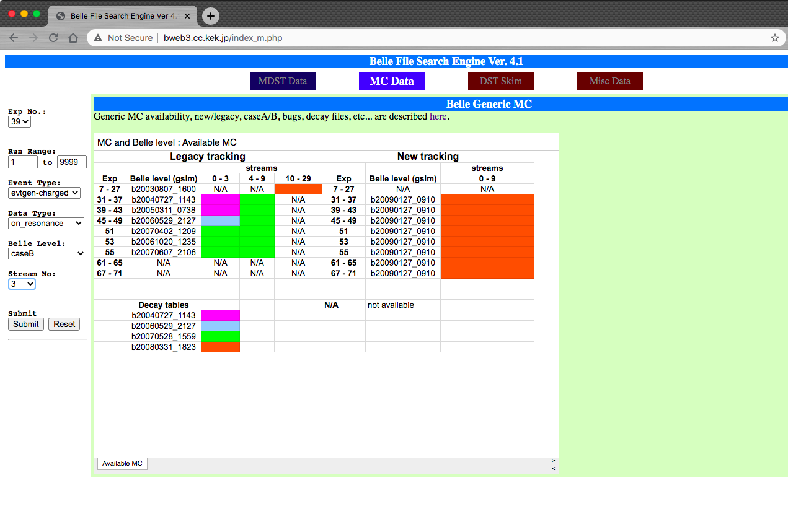

Belle MDST samples
==================
The most important argument in `convertBelleMdstToBelleIIMdst` function is the first
one, specifying the input Belle MDST sample to be converted and analysed. You can
either specify the location of the input Belle MDST file (e.g. when running over
your privately produced signal MC):

.. code-block:: python3

   convertBelleMdstToBelleIIMdst('/location_to_my_mdst_files/myMDSTFile.mdst', path=mypath)

or specify the url of real data or generic MC samples. For example:

.. code-block:: python3

   convertBelleMdstToBelleIIMdst('http://bweb3/montecarlo.php?ex=37&rs=100&re=200&ty=evtgen-mixed&dt=on_resonance&bl=caseB&st=0', path=mypath)

The form of the url is the same as used in BASF. More information is available
at `the Belle analysis software page`_.

.. note::
   Belle index files cannot be used in the conversion, please use HadronB(J) skim
   files, or convert your index files to mdst files first and then perform b2bii conversion.

.. _the Belle analysis software page: https://belle.kek.jp/secured/wiki/doku.php?id=software:data_search

There are different kind of MC/data samples available at Belle.

.. _belledatamc:

-------------------------
Belle Data and Generic MC
-------------------------
Generic MC is the official MC samples at Belle, which was generated with
run-dependent beam background. There are multiple ``streams`` of these samples,
and each ``stream`` contains the same amount of events as present in the real
Belle data.

There are several different categories of Belle MC:
- Generic :math:`B` samples : charged (:math:`B^+ B^-`) and mixed (:math:`B^{0}\bar{B}^{0}`)
- Continuum samples  : uds, charm
- Y(5S) samples      : bsbs, nonbsbs

Generic :math:`B` samples only contain decay modes with :math:`b \to c` quark
transitions, and have been generated based on the decay tables at

.. code-block::

   /sw/belle/belle/b20090127_0910/share/data-files/evtgenutil/DECAY.DEC.

~~~~~~~~~~~~~~~~~~~~~~~~~~~~~~~~~~~~~~~~
How to find Generic MC and data samples?
~~~~~~~~~~~~~~~~~~~~~~~~~~~~~~~~~~~~~~~~

You can find the sample(s) you want through
`Belle File Search Engine`_

.. _Belle File Search Engine: http://bweb3.cc.kek.jp/

.. warning::
   `Belle File Search Engine <http://bweb3.cc.kek.jp/>`_ is only
   accessible within KEK domain or via VPN. Or look in the :ref:`onlinebook_ssh`
   tutorial for a way to access it via SSH forwarding.

   The Belle File Search Engine

By specifying ``Exp No``, ``Event Type``, ``Data Type``, and ``Stream No``,
``Event Type`` means different MC types (charged, mixed, uds, .. ).
``Data Type`` is for different energy runs (on-resonance, off-resonance, ...).
In total there are 10 streams of Generic :math:`B` samples and 6 streams of
continuum samples.

You can either use the file list (physical path) or URL as input file list for
b2bii jobs.

.. seealso::

   More information about official MC and data can be found
   `here <https://belle.kek.jp/secured/wiki/doku.php?id=software:data_search>`__

---------
Rare B MC
---------
Just from this name you can guess that this type of MC aims for
rarer processes, such as :math:`b \to u \ell \nu`, :math:`e^+ e^- \to \tau^+ \tau^-`...

Rare :math:`B` MC was generated with an experiment-dependent beam
energy, but not run-dependent (i.e. The same beam energy and IP profile in
the same experiment).

The location of those special MC files can be found
`here <https://belle.kek.jp/secured/wiki/doku.php?id=software:rare_mc_search>`__.

--------------------
Generating MC sample
--------------------
There are two parts when generating a MC sample:

1. `evtgen`_ generation
2. `Geant3`_-based detector simulation

.. _evtgen: https://www.slac.stanford.edu/~lange/EvtGen/
.. _Geant3: https://cds.cern.ch/record/1119728?ln=en

Users can choose between basf or B2BII to generate a set of signal MC for one's analysis.

~~~~~~~~~~~~~~~~~~~~~~~~~~~~~~
Generating signal MC with basf
~~~~~~~~~~~~~~~~~~~~~~~~~~~~~~
The ``mcproduzh`` package has been used to generate signal MC in Belle for many years.
This package was developed by Ushiroda-san, A. Zupanc, and Horii-san, and
it consists of generation, simulation, and reconstruction based on ``evtgen`` and
``gsim`` scripts (``gsim`` is Belle slang for the simulated detector response
that results from the use of ``Geant3`` within the Belle analysis software
framework ``basf`` – the output of ``gsim`` scripts are Belle mdst files).

It will create MC samples for a list of experiments, normalized by their
:math:`N(B\bar{B})` or integrated luminosity.

The beam energy, IP profile, and detector configuration of this MC will be
experiment-dependent, but not run-dependent.
Moreover, ``RunNo`` for these events will be set to 0 in the ``mcproduzh`` package,
hence it doesn't work for off-resonance or :math:`\Upsilon(nS)`.

.. seealso::
   More information of generating Belle MC in ``basf`` can be found
   `here <https://belle.kek.jp/secured/wiki/doku.php?id=software%3Amcprod_scripts>`__

~~~~~~~~~~~~~~~~~~~~~~~~~~~~~~~
Generating signal MC with B2BII
~~~~~~~~~~~~~~~~~~~~~~~~~~~~~~~

Signal MC samples can also be generated in basf2, using the ``BelleMCOutput`` module.
An example script of how to generate a MC sample with ``BelleMCOutput`` is at

.. code-block:: csh

   ls $BELLE2_RELEASE_DIR/b2bii/examples/BelleMCGeneration.py

Here are several notes while using ``BelleMCOutput``.

.. rubric:: Beam energy for MC generation

The default global tag for analysis jobs is ``B2BII_MC``; however, this does not take into
account beam smearing.
Therefore, for the MC generation one must use ``b2bii_beamParameters_with_smearing``.

.. code-block:: python

   # Use B2BII global tag.
   basf2.conditions.prepend_globaltag('b2bii_beamParameters_with_smearing')

.. rubric:: Run dependent MC

If you like to generate run-dependent beam energy MC for non-:math:`\Upsilon(4S)`
analysis, please contact conveners of your physics subgroup at Belle to get
more information regarding the list of runs for your analysis.

Then modify the following line in your generation script:

.. code-block:: python3

   # Generate for experiment 55, run 402 (run-dependent MC).
   main.add_module('EventInfoSetter', expList=55, runList=402, evtNumList=100)

This will generate signal MC using the beam energy from run 402 in experiment 55.

.. rubric:: User signal decay files

To generate user-defined decay files (aka signal decay files), use the following line in the script:

.. code-block:: python3

   from generators import add_evtgen_generator
   add_evtgen_generator(path=mypath,
                        finalstate="signal",
                        signaldecfile="user_defined_decfile.dec"
   )

.. note::
   Because the Belle detector geometry is not and will not be implemented in basf2, the simulation part can
   only be done in basf.

