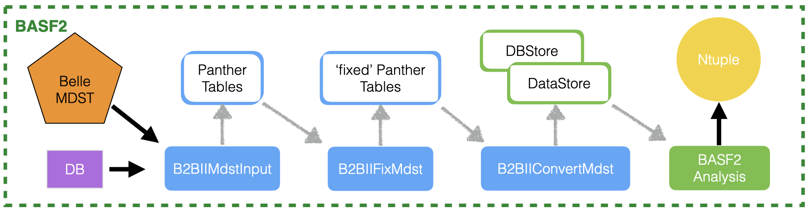

.. _b2bii:

=====
B2BII
=====

The b2bii package in basf2 converts Belle MDST files (BASF data format) to
Belle II MDST (basf2 data format). This enables performing physics analysis
using data collected with Belle detector with the analysis software and algorithms
developed for the analysis of data collected with the Belle II detector.
The B2BII converter allows for estimation and validation of performances of
various advanced algorithms being developed for Belle II.

Overview
========

The B2BII converter reads and converts Belle MDST within basf2. The converted
data is to be analysed within the same job, without any intermediate conversion
to output ROOT file (Belle II MDST format). The B2BII conversion plus analysis
workflow is illustrated in this figure:

and is divided between

Conversion modules:

- **B2BIIMdstInput**: opens and reads Belle MDST file,
- **B2BIIFixMdst**: performs correction to Belle MDST data before the
  conversion is performed,
- **B2BIIConvertMdst**: performs Belle mdst to Belle II mdst conversion.
  After this final step the DataStore is filled with Belle II-type MDST
  dataobjects (Tracks, ECLClusters, PIDLikelihhoods,...).

basf2 analysis:

- This part contains the usual sequence of basf2 physics analysis modules.

B2BII Analysis
==============

Prerequisites
-------------
The recommended versions to be used are ``release-06-00-08`` or the latest light release.

B2BII Converter
---------------
The most straightforward way to perform the analysis is to execute the B2BII
Converter on-the-fly, meaning in the same job as the physics analysis is performed
(reconstruction of specific decay, ..., producing flat ntuples for offline analysis).
Note that it's also possible (and is as well more convenient) first to produce the
converted ROOT files in the Belle II MDST format and then run the analysis script
over converted ROOT files.

Global tags
~~~~~~~~~~~
As all basf2 analysis, the necessary payloads are handled by basf2 and are stored
in the corresponding global tags in the conditions database at BNL.

To avoid creating excess load to the BNL server, we have prepared a local database
cache at KEKCC, which includes ``B2BII``, ``B2BII_MC``, ``BellePID``,
``b2bii_beamParameters_with_smearing``, and ``analysis_tools_light-2012-minos``
global tags.

If you use an older release than ``release-05-02`` or ``light-2103-oceanos``, the
following two lines **must** be added in the beginning of your b2bii analysis script:

.. code-block:: python3

   basf2.conditions.metadata_providers = ["/sw/belle/b2bii/database/conditions/b2bii.sqlite"]
   basf2.conditions.payload_locations = ["/sw/belle/b2bii/database/conditions/"]

.. warning::
   When doing the two-step procedure (1. convert and 2. analyse), please be sure
   these two lines are also added in the script for step 2, if you are using a
   release older than the recommended ones.

It is very easy to run any existing basf2 analysis python script over the Belle MC
or data. If you already have a working basf2 physics analysis python script that
performs some kind of reconstruction, you simply need to replace the loading of
Belle II MDST files with the Belle MDST files and executing the conversion.

To load Belle MDST file(s) and to convert them use `convertBelleMdstToBelleIIMdst`.
This function has input parameters to specify the input MDST files to be converted,
flag to specify whether or not the fix_mdst should be applied or not (it should!)
and path.

.. code-block:: python3

   from b2biiConversion import convertBelleMdstToBelleIIMdst
   convertBelleMdstToBelleIIMdst(inputBelleMDSTFile, path=my_path)

- ``inputBelleMDSTFile`` : a BASF mdst file name or an url of the mdst file location.
- ``path=my_path`` : your basf2 steering process path.

Examples of analysis steering files can be found in example directory of the b2bii package:

.. code-block:: csh

   ls $BELLE2_RELEASE_DIR/b2bii/examples

.. hint:: For an introductory lesson, take a look at :numref:`onlinebook_b2bii`.

Converted data objects and other information
============================================
This section briefly describes what is converted, in what way, and how the
converted objects should be used in the analysis.

.. toctree:: ConvertedObjects

Belle MDST samples
==================
The most important argument in `convertBelleMdstToBelleIIMdst` function is the first
one, specifying the input Belle MDST sample to be converted and analysed. You can
either specify the location of the input Belle MDST file (e.g. when running over
your privately produced signal MC):

.. code-block:: python3

   convertBelleMdstToBelleIIMdst('/location_to_my_mdst_files/myMDSTFile.mdst', path=mypath)

or specify the url of real data or generic MC samples. For example:

.. code-block:: python3

   convertBelleMdstToBelleIIMdst('http://bweb3/montecarlo.php?ex=37&rs=100&re=200&ty=evtgen-mixed&dt=on_resonance&bl=caseB&st=0', path=mypath)

The form of the url is the same as used in BASF. More information is available
at `the Belle analysis software page`_.

.. note::
   Belle index files cannot be used in the conversion, please use HadronB(J) skim
   files, or convert your index files to mdst files first and then perform b2bii conversion.

.. _the Belle analysis software page: https://belle.kek.jp/secured/wiki/doku.php?id=software:data_search

There are different kind of MC/data samples available at Belle.

.. toctree:: BelleDataMC

FAQ
===

.. toctree:: AnalysisKey

b2bii functions
===============

.. toctree:: B2BIIModules.rst

