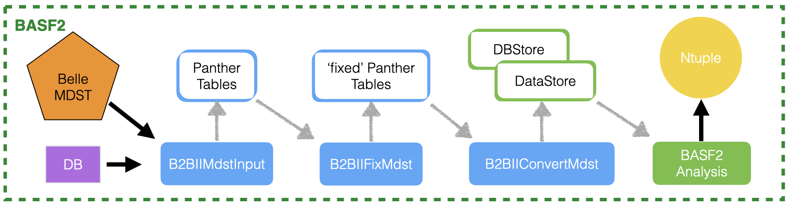

Overview
========

The B2BII converter reads and converts Belle MDST within basf2. The converted
data is to be analysed within the same job, without any intermediate conversion
to output ROOT file (Belle II MDST format). The B2BII conversion plus analysis
workflow is illustrated in this figure:

and is divided between

Conversion modules:

- **B2BIIMdstInput**: opens and reads Belle MDST file,
- **B2BIIFixMdst**: performs correction to Belle MDST data before the
  conversion is performed,
- **B2BIIConvertMdst**: performs Belle mdst to Belle II mdst conversion.
  After this final step the DataStore is filled with Belle II-type MDST
  dataobjects (Tracks, ECLClusters, PIDLikelihhoods,...).

basf2 analysis:

- This part contains the usual sequence of basf2 physics analysis modules.
