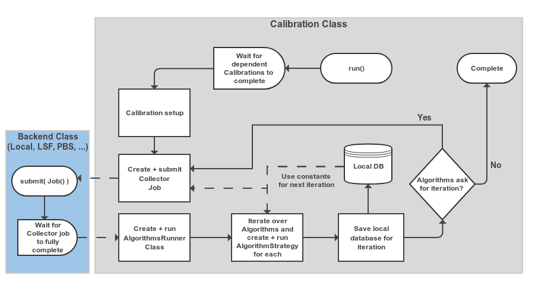
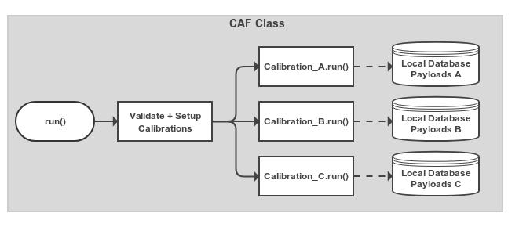
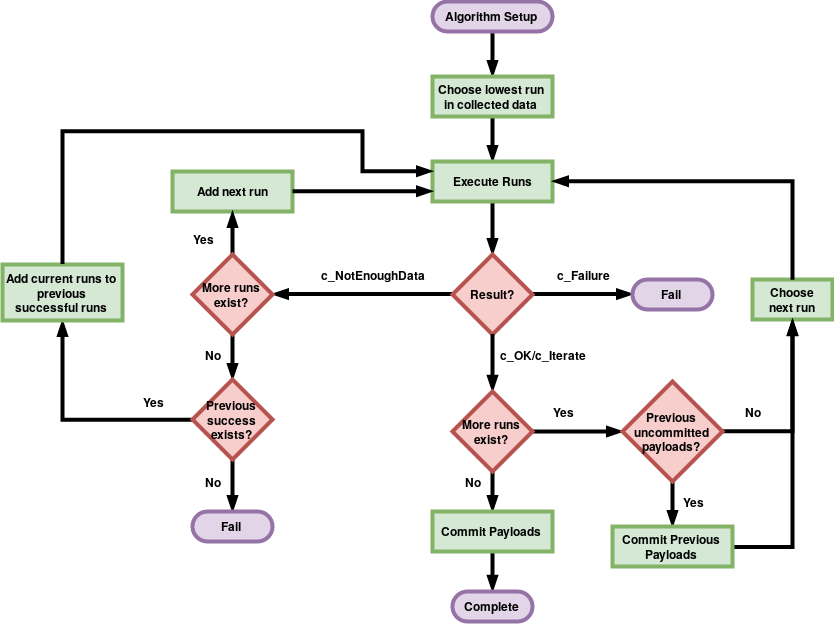

===============================
The Calibration Framework (CAF)
===============================

The Python CAF is a set of Python modules and classes which work together to provide users with a
convenient interface to running calibration jobs. It is assumed that you are using the C++
calibration framework classes e.g. the CalibrationCollectorModule and CalibrationAlgorithm
class in the calibration package. These provide a consistent interface for running calibration
jobs on input data which the Python CAF can automate for you.

Essentially you can think of the Python CAF as providing a way to automatically create basf2 scripts
that run your Collector module and Algorithm for you. That way you don't have to create multiple
shell submission scripts and any improvements made to the CAF will benefit you. It is important to
remember that when you are running a CAF process, you are **not** running a basf2 process directly.
You are instead running a Python script that will create basf2 processes for you.

The Calibration Class
=====================

The first part of the CAF to understand is the :py:class:`Calibration <caf.framework.Calibration>` class.
This is where you specify which Collector module and which Algorithms you want to run.
It is also where you can configure the basf2 processes before they are run for you.
This includes setting the input data files, different global tags, and making reconstruction paths to run
prior to your Collector module.

.. autoclass:: caf.framework.Calibration
    :members:
    :show-inheritance:

Overall the :py:class:`Calibration <caf.framework.Calibration>` class basically runs a State Machine (SM).
Where it progresses from the initial state to completion or (failure) via several processing steps e.g. Submitting collector jobs.
Below is a simplified version of what is happening when `caf.framework.Calibration.run()` is called.

.. _cal_machine:

    Schematic view of the processing flow in a single :py:class:`Calibration <caf.framework.Calibration>` object

The CAF Class
=============

The :py:class:`caf.framework.CAF` class is essentially an overall configuration object for the calibrations you want
to run in a single processing run.
You add :py:class:`Calibration <caf.framework.Calibration>` objects to the CAF in order to have them run.
The CAF will start them when their dependent calibrations have completed.
The CAF also creates the overall output directory, checks the basic validity of calibrations (including cyclic-dependency)
before running, and assigns some default options to calibrations if they weren't set in the calibration itself.

    Very simple view of the processing in the overall :py:class:`Calibration <caf.framework.CAF>` object.
    Calibration objects that have been added are set up and have their `caf.framework.Calibration.run()` method called.
    The Calibration threads started automatically wait until other Calibrations that they depend on have completed before
    starting their main processing logic (see :numref:`cal_machine`).

.. autoclass:: caf.framework.CAF
    :members:

The Algorithm Class
===================

.. warning::  You probably don't need to interact with this class unless you are attempting to set the
              `caf.framework.Algorithm.params` dictionary.

.. autoclass:: caf.framework.Algorithm
    :members:

Restarting The CAF From Failure
===============================

During development you will likely find that sometimes your Calibration fails to complete due to problems in the code.
When using the full `caf.framework.CAF` class this can be quite problematic.
For example, if your algorithm fails after the collector step has already completed (which may take a long time depending
on how much data you're using) then you might have to re-run your entire CAF process again.

In order to prevent this issue, the CAF uses a checkpoint system to save the state of each Calibration once it reaches a
recoverable position in the workflow.
If you run the CAF using the same output directory again the CAF will restart each Calibration requested from the *checkpoint*
state of that Calibration i.e. the last recoverable state.

Put simply, if you get a failure when running the CAF try to fix the problem and then re-run your Python CAF script.
The CAF should restart from a safe position and try to run the (now fixed) code again.

Multiple Collections
====================

Sometimes you may have multiple data types which you want to use as input to your `Calibration`.
In this case you essentially want to run your Collector module with different pre-collection reconstruction
parameters and use all the data merged as input to the algorithm.
By using the `Calibration.add_collection` function you can add multiple different `Collection` objects to your
`Calibration`.

.. autoclass:: caf.framework.Collection
    :members:

.. warning:: If you are merging different data types in this way it is likely that they come from very different run ranges.
             Therefore your should take care that your AlgorithmStrategy setup makes sense and that you have checked that the
             output IoVs of the payloads are correct.

The b2caf-status Tool
=====================

In order to save these checkpoint states the CAF is creating a SQLite3 database file in your `CAF.output_dir` directory.
The b2caf-status command line tool lets you show the current status of the Calibrations *even while the CAF is running*.
It also lets you change the values in this database, so an advanced user could choose to reset a Calibration back to an earlier
iteration or checkpoint state.
This could be useful if a Collector step succeeded previously, but now needs to be re-run with different parameter values. 

.. argparse::
    :filename: calibration/tools/b2caf-status
    :func: get_argparser
    :prog: b2caf-status
    :nodefaultconst:
    :nogroupsections:

The b2caf-filemap Tool
======================

Sometimes you will want to run over many input files. If you are ignoring certain runs from these files the CAF requires
that it knows which IoV each file corresponds to.
This is handled automatically by the CAF during startup, however this can take a long time to process if you have many files.
A better solution is to use the `caf.framework.Calibration.files_to_iovs` attribute and set a pre-calculated dictionary
manually.
To create this dictionary the b2caf-filemap tool can be used (though it isn't necessary to use it) to create a pickle file
containing the dictionary.

.. argparse::
    :filename: calibration/tools/b2caf-filemap
    :func: get_argparser
    :prog: b2caf-filemap
    :nodefaultconst:
    :nogroupsections:

Job Submission Backends
=======================

Quite often, your Collector processes will take some time to finish.
You may be collecting data from many files, with a large amount of pre-processing happening.
Running this all inside a single basf2 process is inefficient and could take days.
A better solution is to split the processing of the collector up into smaller processes that take a smaller
number of input files.
Without the CAF, basf2 users might create shell scripts and run them from the Python :py:mod:`multiprocessing` module.
Or they could submit to a Batch queue system on KEKCC using the ``bsub`` command.
To make this easier a small Python interface to job submission has been created in the :py:mod:`backends <caf.backends>` module.
The CAF uses classes inheriting from :py:class:`Backend <caf.backends.Backend>` to submit the collector jobs to either
local multiprocessing, or several Batch queue systems like LSF used at KEKCC.
Although the CAF uses these classes, they are general enough that they can also be used from any Python program using the
basf2 library to submit commands/shell scripts.

.. automodule:: caf.backends

You will first want to create a :py:class:`Job <caf.backends.Job>` object to configure the process(es) you want to run.

.. autoclass:: caf.backends.Job
    :members:
    :inherited-members:

After creating a :py:class:`Job <caf.backends.Job>` and configuring it, you need to actually run it.
The :py:mod:`backends <caf.backends>` module provides several classes inheiriting from the
:py:class:`Backend <caf.backends.Backend>` class which you can use to submit a :py:class:`Job <caf.backends.Job>`.

.. autoclass:: caf.backends.Backend
    :members:
    :inherited-members:

The most simple option that should work everywhere is the :py:class:`Local backend <caf.backends.Local>`.
This runs the Job using a Pool object with a configurable process Pool size.

.. autoclass:: caf.backends.Local
    :members:
    :inherited-members:

If you have dozens of input files containing thousands of events, it may be slow to run your processing using the
:py:class:`Local backend <caf.backends.Local>` backend.
At this point you should consider using a backend inheriting from the :py:class:`Batch backend <caf.backends.Batch>` class.

.. autoclass:: caf.backends.Batch
    :members:
    :inherited-members:

Currently there are three :py:class:`Batch <caf.backends.Batch>` classes.
The :py:class:`LSF <caf.backends.LSF>`, the :py:class:`PBS <caf.backends.PBS>`, and the
:py:class:`HTCondor <caf.backends.HTCondor>` backends.
If you are running at KEKCC (or any site providing the ``bsub`` command) you should use the :py:class:`LSF <caf.backends.LSF>`
backend.
If you are running at a site that uses the ``qsub`` command, you should use the :py:class:`PBS <caf.backends.PBS>` backend.
For NAF (DESY) and BNL you should use the HTCondor backends (they use ``condor_submit``).

.. autoclass:: caf.backends.LSF
    :members:
    :inherited-members:

.. autoclass:: caf.backends.PBS
    :members:
    :inherited-members:

.. autoclass:: caf.backends.HTCondor
    :members:
    :inherited-members:

Configuring SubJob Creation
---------------------------

You probably want to use basically the same setup for many (possibly 1000's) of jobs but with different input data or
arguments. For this situation you can create `SubJob` objects of `Job` objects. SubJobs inherit most of the same attributes
as the parent job. However they can have different input files and arguments.

.. autoclass:: caf.backends.SubJob
    :members:
    :inherited-members:

SubJobSplitters and Arguments Generation
****************************************

.. autoclass:: caf.backends.SubjobSplitter
    :members:
    :inherited-members:

.. autoclass:: caf.backends.MaxFilesSplitter
    :members:
    :inherited-members:

.. autoclass:: caf.backends.MaxSubjobsSplitter
    :members:
    :inherited-members:

.. autoclass:: caf.backends.ArgumentsSplitter
    :members:
    :inherited-members:

.. autoclass:: caf.backends.ArgumentsGenerator
    :members:
    :inherited-members:

Utility Functions + Objects
===========================

.. automodule:: caf.utils
    :members:

Advanced Usage
==============

There are several options for the CAF that most users will never need.
But for more adventurous calibration developers there are quite a lot of configuration options and possibilities for extending
the functionality of the CAF.

Writing Your Own Calibration Class
----------------------------------

.. autoclass:: caf.framework.CalibrationBase
    :members:
    :inherited-members:
    :show-inheritance:

Strategy Objects
----------------

.. automodule:: caf.strategies

.. autoclass:: caf.strategies.AlgorithmStrategy
    :members:
    :special-members:

SingleIoV
*********

.. autoclass:: caf.strategies.SingleIOV
    :members:
    :show-inheritance:

SequentialRunByRun
******************

.. _seqrunbyrun:

    Approximate execution logic of the :py:class:`SequentialRunByRun <caf.strategies.SequentialRunByRun>` strategy

.. autoclass:: caf.strategies.SequentialRunByRun
    :members:
    :show-inheritance:

SimpleRunByRun
******************

.. autoclass:: caf.strategies.SimpleRunByRun
    :members:
    :show-inheritance:

SequentialBoundaries
********************

.. _seqboundaries:

    Approximate execution logic of the :py:class:`SequentialBoundaries <caf.strategies.SequentialBoundaries>` strategy

.. autoclass:: caf.strategies.SequentialBoundaries
    :members:
    :show-inheritance:

State Machine Framework
-----------------------

.. automodule:: caf.state_machines
    :members:
    :inherited-members:
    :show-inheritance:

Runner Objects
--------------

.. automodule:: caf.runners
    :members:
    :inherited-members:
    :show-inheritance:

Skimming Events With The SoftwareTriggerResult
==============================================

Each event recorded by Belle II must have passed the High Level Trigger (HLT).
The HLT runs some reconstruction online and applies cuts on the reconstructed objects in order to to make decisions
about which events to keep.
The decisions are made by the SoftwareTrigger Module and stored in the output basf2 file in a SoftwareTriggerResult object.

Certain calibration analyses require broad types of events (di-muon, Bhabha, ...) which can be skimmed out of the basf2 file
by requiring that some HLT trigger decisions were True/False.
The :b2:mod:`TriggerSkim` Module is provided to help extract the decisions stored in the SoftwareTriggerResult object.
You can then use the :py:func:`if_value() <basf2.Module.if_value>` to decide what to do with the returned value of the
:b2:mod:`TriggerSkim` Module.

.. b2-modules::
    :package: calibration
    :modules: TriggerSkim
