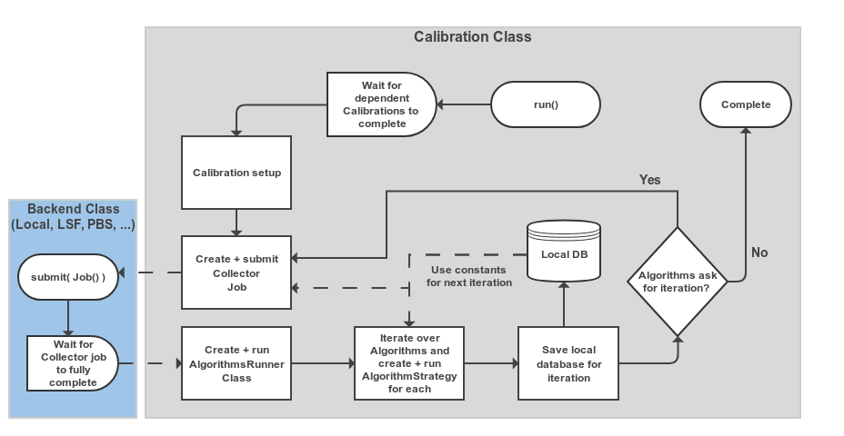
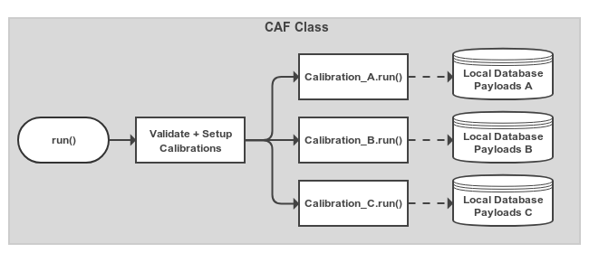

:tocdepth: 3

===========
Calibration
===========

The Calibration Framework (CAF)
===============================

The Python CAF is a set of Python modules and classes which work together to provide users with a
convienient interface to running calibration jobs. It is assumed that you are using the C++
calibration framework classes e.g. the CalibrationCollectorModule and CalibrationAlgorithm
class in the calibration package. These provide a consistent interface for running calibration
jobs on input data which the Python CAF can automate for you.

Essentially you can think of the Python CAF as providing a way to automatically create basf2 scripts
that run your Collector module and Algorithm for you. That way you don't have to create multiple
shell submission scripts and any improvements made to the CAF will benefit you. It is important to
remember that when you are running a CAF process, you are **not** running a basf2 process directly.
You are instead running a Python script that will create basf2 processes for you.

The Calibration Class
---------------------

The first part of the CAF to understand is the :py:class:`Calibration <caf.framework.Calibration>` class.
This is where you specify which Collector module and which Algorithms you want to run.
It is also where you can configure the basf2 processes before they are run for you.
This includes setting the input data files, different global tags, and making reconstruction paths to run
prior to your Collector module.

.. autoclass:: caf.framework.Calibration
    :members:
    :show-inheritance:

Overall the :py:class:`Calibration <caf.framework.Calibration>` class basically runs a State Machine (SM).
Where it progresses from the initial state to completion or (failure) via several processing steps e.g. Submitting collector jobs.
Below is a simplified version of what is happening when `caf.framework.Calibration.run()` is called.

.. _cal_machine:

    Schematic view of the processing flow in a single :py:class:`Calibration <caf.framework.Calibration>` object

The CAF Class
-------------

    Very simple view of the processing in the overall :py:class:`Calibration <caf.framework.CAF>` object.
    Calibration objects that have been added are set up and have their `caf.framework.Calibration.run()` method called.
    The Calibration threads started automatically wait until other Calibrations that they depend on have completed before
    starting their main processing logic (see :numref:`cal_machine`).

.. autoclass:: caf.framework.CAF
    :members:

Job Submission Backends
-----------------------

Quite often, your Collector processes will take some time to finish.
You may be collecting data from many files, with a large amount of pre-processing happening.
Running this all inside a single basf2 process is inefficient and could take days.
A better solution is to split the processing of the collector up into smaller processes that take a smaller
number of input files.
Without the CAF, basf2 users might create shell scripts and run them from the Python :py:mod:`multiprocessing` module.
Or they could submit to a Batch queue system on KEKCC using the ``bsub`` command.
To make this easier a small Python interface to job submission has been created in the :py:mod:`backends <caf.backends>` module.
The CAF uses classes inheriting from :py:class:`Backend <caf.backends.Backend>` to submit the collector jobs to either
local multiprocessing, or several Batch queue systems like LSF used at KEKCC.
Although the CAF uses these classes, they are general enough that they can also be used from any Python program using the
basf2 library to submit commands/shell scripts.

.. automodule:: caf.backends

You will first want to create a :py:class:`Job <caf.backends.Job>` object to configure the process(es) you want to run.

.. autoclass:: caf.backends.Job
    :members:
    :inherited-members:

After creating a :py:class:`Job <caf.backends.Job>` and configuring it, you need to actually run it.
The :py:mod:`backends <caf.backends>` module provides several classes inheiriting from the
:py:class:`Backend <caf.backends.Backend>` class which you can use to submit a :py:class:`Job <caf.backends.Job>`.

.. autoclass:: caf.backends.Backend
    :members:
    :inherited-members:

The most simple option that should work everywhere is the :py:class:`Local backend <caf.backends.Local>`.
This runs the Job using a Pool object with a configurable process Pool size.

.. autoclass:: caf.backends.Local
    :members:
    :inherited-members:

If you have dozens of input files containing thousands of events, it may be slow to run your processing using the
:py:class:`Local backend <caf.backends.Local>` backend.
At this point you should consider using a backend inheriting from the :py:class:`Batch backend <caf.backends.Batch>` class.

.. autoclass:: caf.backends.Batch
    :members:
    :inherited-members:

Currently there are two :py:class:`Batch <caf.backends.Batch>` classes.
The :py:class:`LSF <caf.backends.LSF>`, and the :py:class:`PBS <caf.backends.PBS>` backends.
If you are running at KEKCC (or any site providing the ``bsub`` command) you should use the :py:class:`LSF <caf.backends.LSF>`
backend.
If you are running at a site that uses the ``qsub`` command, you should use the :py:class:`PBS <caf.backends.PBS>` backend.

.. autoclass:: caf.backends.LSF
    :members:
    :inherited-members:

.. autoclass:: caf.backends.PBS
    :members:
    :inherited-members:

Utility Functions + Objects
---------------------------

.. automodule:: caf.utils
    :members:

Advanced Usage
--------------

There are several options for the CAF that most users will never need.
But for more adventurous calibration developers there are quite a lot of configuration options and possibilities for extending
the functionality of the CAF.

Writing Your Own Calibration Class
++++++++++++++++++++++++++++++++++

.. autoclass:: caf.framework.CalibrationBase
    :members:
    :inherited-members:
    :show-inheritance:

Strategy Objects
++++++++++++++++

.. autoclass:: caf.framework.Algorithm
    :members:

.. automodule:: caf.strategies

.. autoclass:: caf.strategies.AlgorithmStrategy
    :members: __init__, run

.. autoclass:: caf.strategies.SingleIOV
    :members:
    :inherited-members:
    :show-inheritance:

State Machine Framework
+++++++++++++++++++++++

.. automodule:: caf.state_machines
    :members:
    :inherited-members:
    :show-inheritance:

Runner Objects
++++++++++++++

.. automodule:: caf.runners
    :members:
    :inherited-members:
    :show-inheritance:

Skimming Events With The SoftwareTriggerResult
==============================================

Each event recorded by Belle II must have passed the High Level Trigger (HLT).
The HLT runs some reconstruction online and applies cuts on the reconstructed objects in order to to make decisions
about which events to keep.
The decisions are made by the SoftwareTrigger Module and stored in the output basf2 file in a SoftwareTriggerResult object.

Certain calibration analyses require broad types of events (di-muon, Bhabha, ...) which can be skimmed out of the basf2 file
by requiring that some HLT trigger decisions were True/False.
The :b2:mod:`TriggerSkim` Module is provided to help extract the decisions stored in the SoftwareTriggerResult object.
You can then use the :py:func:`if_value() <basf2.Module.if_value>` to decide what to do with the returned value of the
:b2:mod:`TriggerSkim` Module.

.. b2-modules::
    :package: calibration
    :modules: TriggerSkim
