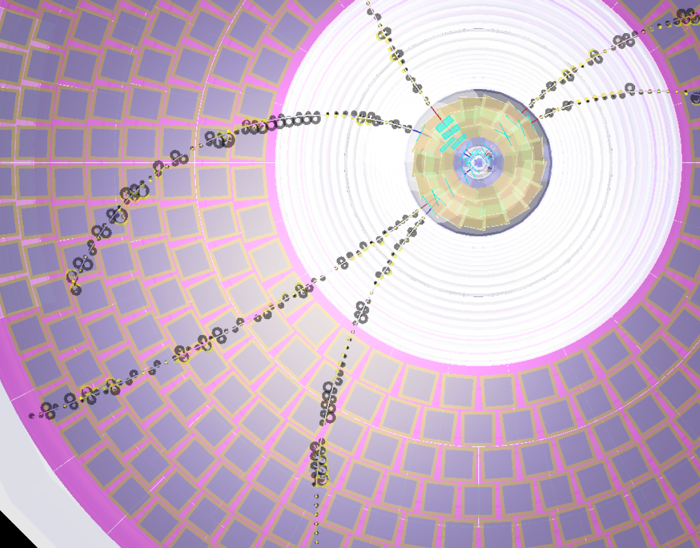
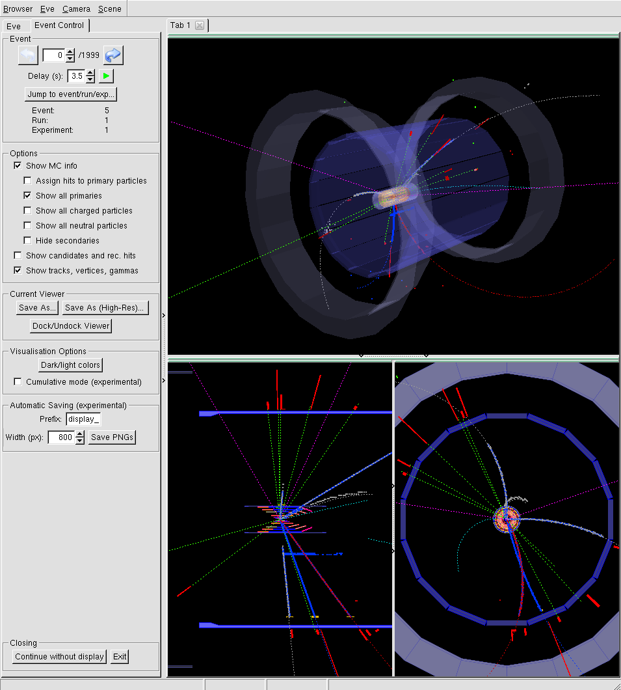
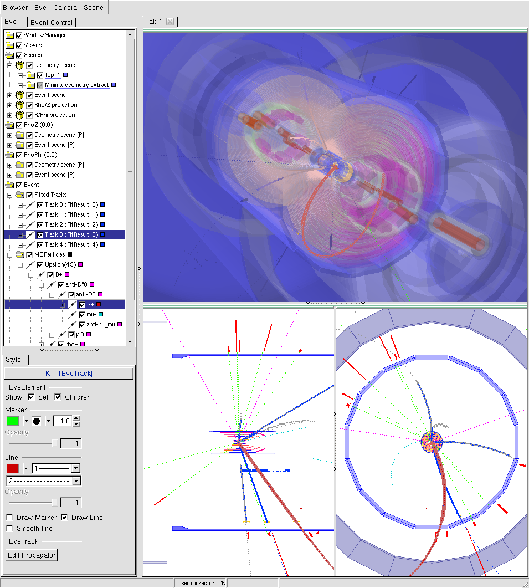

.. _display:

==========================
The Belle II Event Display
==========================

.. seealso:: 
        `evdisp.belle2.org <https://evdisp.belle2.org>`_ for a live event 
        display of the data-taking in real time.

        A pretty view of the tracking detectors of Belle II. This picture was
        created with the event display (so no excuses for ugly low-resolution
        screenshots).

.. seealso::
        `Here is a gallery of nice event display images 
        <https://confluence.desy.de/x/1nQHAg>`_.

.. _display_starting_the_display:

Starting the display
====================

The Belle II event display is invoked with ``b2display``.
You can use it to explore any :ref:`mdst` files.

You must use a :ref:`full release <choosing_a_release>`, and it is usually 
recommended to use the same release that was used to create the file you want 
to explore. If you are working remotely, you will need to connect with 
xforwarding or start a ``vncserver`` (if permitted by your institute).

.. code:: bash

        $ b2setup <any release>
        $ b2file-metadata-show /path/to/your/mdst.root
        $ # read the metadata and find the release number
        $ b2setup release-xx-yy-zz
        $ b2display /path/to/your/mdst.root

.. seealso:: `choosing_a_release`

.. _b2display_tool_doc:

``b2display``: Run the event display (opens an xwindow)
-------------------------------------------------------

Usage::

        b2display input_file.root

Show data in given input file using the event display.

You can also open multiple files using wildcards, though you have to pass the 
string with wildcards to b2display to prevent expansion by the shell, e.g.

::

          b2display "my/files/mdst_*.root".

Using .sroot files, and ``http://`` or ``root://`` URLs is also possible.

Configuration of the display can be changed from the defaults by editing 
display/examples/display.py. See output of ``basf2 -m Display`` for available
options.

.. this ^^ is copied from display/tools/b2display.cc

.. _display_ui:

Viewer navigation and the user interface
========================================

.. role:: gui-highlight-style

.. this ^^ enables a custom gui-like highlighting

The right side shows a 3D view (top) and ρ-z and r-ϕ projections (bottom
left/right). The views can be navigated by clicking in one (to choose) then by
holding the left, middle or right mouse button and moving the cursor, the
scroll wheel will also work. 

Here are all of the mouse and keyboard bindings:

+---------------+------------------------------------------------------------+
|Page Down      |Go to next event                                            |
+---------------+------------------------------------------------------------+
|Page Up        |Go to previous event                                        |
+---------------+------------------------------------------------------------+
|Space          |Toggle automatic event advancing (e.g for online display)   |
+---------------+------------------------------------------------------------+
|s              |Save As (with high resolution)                              |
+---------------+------------------------------------------------------------+
|Ctrl+q         |Quit                                                        |
+---------------+------------------------------------------------------------+
|Left drag      |Rotate                                                      |
+---------------+------------------------------------------------------------+
|Right drag     |Dolly (move camera along view axis)                         |
+---------------+------------------------------------------------------------+
|Middle drag    |Move view                                                   |
+---------------+------------------------------------------------------------+
|Mouse wheel    |Zoom                                                        |
+---------------+------------------------------------------------------------+
|Arrow keys     |Move view                                                   |
+---------------+------------------------------------------------------------+
|Ctrl           |Slower (combine with arrow keys or mouse actions)           |
+---------------+------------------------------------------------------------+
|Ctrl+Shift     |Even slower (combine with arrow keys or mouse actions)      |
+---------------+------------------------------------------------------------+
|Shift          |Faster (combine with arrow keys or mouse actions)           |
+---------------+------------------------------------------------------------+
|r              |Normal rendering                                            |
+---------------+------------------------------------------------------------+ 
|w              |Wireframe rendering                                         |
+---------------+------------------------------------------------------------+
|t              |Hybrid rendering (normal + wireframe)                       |
+---------------+------------------------------------------------------------+
|d              |OpenGL debug mode (shows reference points & box)            |
+---------------+------------------------------------------------------------+
|j/k            |Dolly (move camera along view axis)                         |
+---------------+------------------------------------------------------------+

The left side of the window shows two tabs: the :gui-highlight-style:`Event
Control` tab visible after starting the display allows you to switch between
events in the loaded file and shows event/run/experiment numbers. The
:gui-highlight-style:`Delay` field and play/stop button allow you to
automatically advance to the next event after the specified delay (in seconds).

        The :gui-highlight-style:`Event Control` tab on the left-hand panel.

The :gui-highlight-style:`Options` box allows changing some of the options also
available as module parameters at runtime. Most importantly, you can select
which parts of an event should be shown: MC info, track candidates, and/or
reconstructed tracks (and related objects).

You can also save images of the currently active viewer (selected by clicking
anywhere in it) using :gui-highlight-style:`Save As…`. Support for exporting
vector graphics is fairly limited, most likely you should save them as .png
files. The :gui-highlight-style:`Save As (High-Res)…` button creates a high
resolution image.  (Specifying very high resolutions may crash your X server,
4000px should be fine). If you want to print them later, you should probably
also change the background colour using the :gui-highlight-style:`Dark/light
colors` button.

.. important:: 
        We recommend saving high resolution if you intend to show these anywhere 
        outside of the collaboration.

The :gui-highlight-style:`Eve` tab shows a tree representation of all objects
displayed, including geometry and event data, as well as the different
projections and viewers.  Every one of them can be enabled/disabled using the
check box in front of the name, and many can also be changed. For example, the
'Viewers' can be modified to e.g. show only half of the detector (clipping) or
save .gifs showing rotations.

        The :gui-highlight-style:`Eve` tab on the left-hand panel.

It is often useful to disable the geometry if you want to look at some tracks
in detail, which can be done by removing the check mark in front of 'Geometry
scene'. Conversely, you can also enable a more detailed geometry for the 3D view
by enabling the 'Top' node. For the track collections (called 'MCParticles' and
'Fitted tracks'), you can also control which sub-items to show using the
provided p/pT sliders. For individual MCParticles/GFtracks, you can show
additional information like its array index, p/pT, mother particles or pValue
by hovering the mouse pointer over the track in the tree, or also in the viewer
directly (works best in projections).

.. _display_visualised_things:

Visualised objects
==================

Geometry
        By default, a simplified geometry is shown. See the last paragraph for
        instructions on how to disable it or show the full geometry instead.
        The default can be changed using the ``fullGeometry`` module parameter.
        With the full geometry shown, you can also set the level of detail by
        changing the :gui-highlight-style:`VisLevel` setting of
        :gui-highlight-style:`Eve` tab → 'Geometry scene' → 'Top' (then you
        should see it in the bottom panel).  The default value of
        :gui-highlight-style:`VisLevel` will e.g. hide most of the KLM
        structure, which might be interesting to you.

MC info (MCParticles, SimHits)
        MCParticles are coloured depending on their PDG value (pions in gray,
        kaons in red, electrons in blue, muons in cyan, protons in yellow,
        photons in bright green and others in magenta), SimHits share the
        colour of their parent particle. By enabling the
        :gui-highlight-style:`Assign hits to primaries` option, you can hide
        particles generated by Geant4 and have hits instead assigned to their
        primary mother particles.

        By default, only particles that produced hits in the detector are
        shown, with the exception of primary particles. This can be changed
        using the :gui-highlight-style:`Show all primaries`,
        :gui-highlight-style:`Show all charged` and :gui-highlight-style:`Show
        all neutrals` options.

        MCParticles shown as dashed lines use only their starting position and
        momentum plus creation vertices of any secondaries, and may thus be
        wildly inaccurate. If the ``trajectoryStore`` parameter of
        :b2:mod:`FullSim` is used (e.g. set to 2), the real trajectories are
        plotted and MCParticles are shown as solid lines.

Track candidates & reconstructed hits
        This shows track candidates produced by track finders with their
        associated hits in light blue, as well as reconstructed hits in the
        tracking detectors not assigned to a track candidate (in violet).
        Supported hits are PXDClusters, SVDClusters, and CDCHits. If the
        ``useClusters`` parameter is set to False, PXDTrueHits and SVDTrueHits
        will be shown instead of clusters.

Tracks, vertices, clusters
        Fitted tracks are shown as lines between green points generated using
        genfit's track extrapolation, the reco hits are shown as well in
        yellow, for the CDC as tiny drift cylinders. GFRaveVertex objects are
        shown as yellow error ellipsoids, plus a dot in the center (for
        increased visibility). ECLClusters are red blocks representing energy –
        if MC info is shown, they should overlap with the MC photons (thin
        green lines).

.. _display_window_tips:

Window management
=================

Eve allows some advanced window management operations. To access them, expand
the small green bar above the view you want to modify by clicking on it.

The Actions menu then gives you access to different operations. All important
ones are found at the very top:

* :gui-highlight-style:`SwapWindowWithCurrent` swaps this view with the
  currently selected view, which is selected by anywhere in it. 
* :gui-highlight-style:`UndockWindow` moves this view into its own window, so
  it can be freely moved around, or shown in fullscreen.  
* :gui-highlight-style:`DestroyWindow` removes this view entirely until the
  display is restarted.

.. _display_troubleshooting:

Troubleshooting
===============

Unfortunately, the event display is a bit susceptible to xforwarding problems
and graphics driver issues (on both the local and remote machines).  Please
report bugs and ask `questions <https://questions.belle2.org>`_ if you
encounter problems (tag them with "b2display").

Here are some common issues:

* OpenGL errors, e.g. "GL Error invalid operation" indicate problems with your
  video drivers.  Try upgrading your drivers (On Ubuntu, try ``jockey-text -l``
  to list available drivers.)
* On some systems with intel GPUs, as well as on VirtualBox, the accelerated
  drivers may produce crashes (you'll see a stack trace ending in, e.g.,
  ``i965_dri.so``). Setting ``export LIBGL_ALWAYS_SOFTWARE=1`` before starting
  the display may help.
* VMWare VMs also suffer from the same problem, but the workaround (see last
  point) doesn't help there. VirtualBox seems to be more suitable here (it also
  supports reading hard disk images created by VMWare).
* Mac is sometimes particularly problematic. You need to install `Xquartz
  <https://www.xquartz.org>`_ and enable iglx.  ``defaults write
  org.macosforge.xquartz.X11 enable_iglx -bool true``

.. seealso::
        CMS have a `helpful twiki page
        <https://twiki.cern.ch/twiki/bin/view/CMSPublic/WorkBookFireworksHowToFix>`_
        listing some further things that might go wrong.

.. seealso::
        `Questions tagged with b2display
        <https://questions.belle2.org/questions/scope:all/sort:activity-desc/tags:b2display/page:1/>`_
        on questions.belle2.org.

.. _display_modules:

Module documentation
====================

The display package contains two important modules. Here is their full module
documentation.

.. b2-modules::
        :package: display

