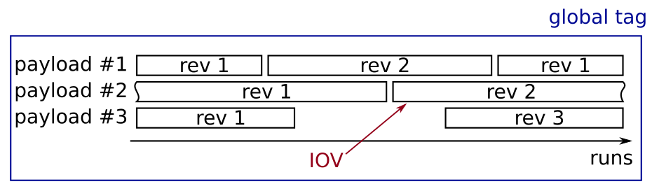

.. _conditionsdb_overview:

Conditions Database Overview
============================

The conditions database consists of binary objects (usually ROOT files) which
are identified by a name and a revision number. These objects are called
**payloads** and can have one or more **intervals of validity (iov)** which is
the experiment and run range this object is deemed to be valid. A collection of
payloads and iovs for a certain dataset is called a **globaltag** and is
identified by a unique name.

Payload
    An atom of conditions data identified by name and revision number

    * usually ROOT files containing custom objects
    * a payload cannot be modified after creation.

Interval of Validity (iov)
    An experiment and run interval for which a payload should be valid

    * consists of four values: ``first_exp``, ``first_run``, ``final_exp``,
      ``final_run``
    * it is still valid for the final run (inclusive end)
    * ``final_exp>=0 && final_run<0``: valid for all runs in ``final_exp``
    * ``final_exp <0 && final_run<0``: valid forever, starting with ``fist_exp, first_run``

Globaltag:
    A collection of payloads and iovs

    * has a unique name and a description
    * can have gaps and overlaps, a payload is not guaranteed to be present for
      all possible runs.
    * are not necessarily valid for all data
    * are not valid for all software versions
    * are immutable once "published"
    * can be "invalidated"

  Schematic display of a globaltag: Different payloads with different revisions
  are valid for a certain set of runs.

Once a globaltag is prepared it is usually immutable and cannot be modified any
further to ensure reproducibility of analyses: different processing iterations
will use different globaltags. The only exceptions are the globaltag used online
during data taking and for prompt processing of data directly after data taking:
These two globaltags are flagged as running and information for new runs is
constantly added to them as more data becomes available.

All globaltags to be used in analysis need to be fixed. Globaltags which are
not fixed, i.e. "OPEN", cannot be used for data processing. Otherwise it is not
possible to know exactly which conditions were used. If a globaltag in the
processing chain is in "OPEN" state processing will not be possible.

.. versionchanged:: release-04-00-00
   Prior to release-04-00-00 no check was performed on the state of globaltags
   so all globaltags could be used in analysis

When processing data the software needs to know which payloads to use for which
runs so the globaltag (or multiple globaltags) to be used needs to be specified.
This is done automatically in most cases as the globaltag used to create the
file will be used when processing, the so called **globaltag replay**. However
the user can specify additional globaltags to use in addition or to override the
globaltag selection completely and disable globaltag replay.

.. versionchanged:: release-04-00-00
   Prior to release-04 the globaltag needed to always be configured manually and
   no automatic replay was in place

If multiple globaltags are selected the software will look for all necessary
payloads in each of them in turn and always take each payload from the first
globaltag it can be found in.

.. _configuring_cdb:

Configuring the Conditions Database
===================================

By default the software will look for conditions data in

1. user globaltags: Look in all globaltags provided by the user by setting `conditions.globaltags <ConditionsConfiguration.globaltags>`
2. globaltag replay: Look in different base globaltags depending on the use case:

    - **Processing existing files (i.e. mdst)**: the globaltags specified in the input file are used.
    - **Generating and events**: the default globaltags for the current software version (`conditions.default_globaltags <ConditionsConfiguration.default_globaltags>` are used.

The globaltag replay can be disabled by calling `conditions.override_globaltags() <ConditionsConfiguration.override_globaltags>`
If multiple files are processed all need to have the same globaltags specified,
otherwise processing cannot continue unless globaltag replay is disabled.

There are more advanced settings available via the `conditions <basf2.ConditionsConfiguration>`
object which should not be needed by most users, like setting the URL to the central
database or where to look for previously downloaded payloads.

.. versionchanged:: release-04-00-00
   In release-04 the configuration interface has been changed completely to
   before. Now all settings are grouped via the `conditions` object.

.. attribute:: basf2.conditions

   Global instance of a `basf2.ConditionsConfiguration` object containing all he
   settings relevant for the conditions database

.. autoclass:: basf2.ConditionsConfiguration
   :members:

Configuration in C++
--------------------

You can also configure all of these settings in C++ when writing standalone
tools using the conditions data. This works very similar to the configuration in
python as all the settings are exposed by a single class

.. code-block:: c++

   #include <framework/database/Configuration.h>

   auto& config = Conditions::Configuration::getInstance();
   config.prependGlobltag("some_tag");

Environment Variables
---------------------

These settings can be modified by setting environment variables

.. envvar:: BELLE2_CONDB_GLOBALTAG

   if set this overrides the default global tag returned by
   `conditions.default_globaltags <ConditionsConfiguration.default_globaltags>`.
   This can be a list of tags separated by white
   space in which case all global tags are searched.

   ::

       export BELLE2_CONDB_FALLBACK="defaultTag additionalTag"

   .. versionchanged:: release-04-00-00
      This setting doesn't affect globaltag replay, only the default globaltag
      used when replay is disabled or events are generated.

      Previously if set to an empty value access to the central database was
      disabled, now it will just set an empty list of default globaltags

.. envvar:: BELLE2_CONDB_SERVERLIST

    this environment variable can be set to a list of URLS to look for the
    conditions database. The urls will at the beginning of
    `conditions.metadata_providers <ConditionsConfiguration.metadata_providers>`

    If :envvar:`BELLE2_CONDB_METADATA` is also set it takes precedence over this setting

    .. versionadded:: release-04-00-00

.. envvar:: BELLE2_CONDB_METADATA

   a whitespace separated list of urls and sqlite files to look for payload
   information. Will be used to populate
   `conditions.metadata_providers <ConditionsConfiguration.metadata_providers>`

   .. versionadded:: release-04-00-00

.. envvar:: BELLE2_CONDB_PAYLOADS

   a whitespace separated list of directories or urls to look for payload files.
   Will be used to populate
   `conditions.payload_locations <ConditionsConfiguration.payload_locations>`

   .. versionadded:: release-04-00-00

.. envvar:: BELLE2_CONDB_PROXY

   Can be set to specify a proxy server to use for all connections to the
   central database. The parameter should be a string holding the host name or
   dotted numerical IP address. A numerical IPv6 address must be written within
   [brackets]. To specify port number in this string, append ``:[port]`` to the
   end of the host name. If not specified, libcurl will default to using port
   1080 for proxies. The proxy string should be prefixed with ``[scheme]://``
   to specify which kind of proxy is used.

   http
     HTTP Proxy. Default when no scheme or proxy type is specified.

   https
     HTTPS Proxy.

   socks4
     SOCKS4 Proxy.

   socks4a
     SOCKS4a Proxy. Proxy resolves URL hostname.

   socks5
     SOCKS5 Proxy.

   socks5h
     SOCKS5 Proxy. Proxy resolves URL hostname.

   ::

      export BELLE2_CONDB_PROXY="http://192.168.178.1:8081"

   If it is not set the default proxy configuration is used (e.g. honor
   ``$http_proxy``). If it is set to an empty value direct connection is
   used.

Offline Mode
============

Sometimes you might need to run the software without internet access, for
example when trying to develop on a plane or somewhere else where internet is
spotty and unreliable.

To do that you need to download all the information on the payloads and the
payload files themselves before running the software:

1. Find out which globaltags you need. If you just want to run
   generation/simulation you only might need the default globaltag. To see which
   one that is you can run ::

       basf2 --info

   if you want to run over some existing files you might want to check what
   globaltags are stored in the file information using ::

       b2file-metadata-show --all inputfile.root

2. Download all the necessary information using the :ref:`b2conditionsdb <b2conditionsdb>`
   command line tool. The tool will automatically download all information in a
   globaltag as well as the payload files and put it all in a sqlite file and the
   payload files in the same directory ::

       b2conditionsdb download -o /path/where/to/download/metadata.sqlite globaltag1 globaltag2 ...

3. Tell the software to use only this downloaded information and not try to
   contact the central server. This can be done in the steering file with the
   `conditions.metadata_providers <ConditionsConfiguration.metadata_providers>`
   and `conditions.payload_locations <ConditionsConfiguration.payload_locations>`
   settings but the easiest is to use environment variables ::

       export BELLE2_CONDB_METADATA=/path/where/to/download/metadata.sqlite
       export BELLE2_CONDB_PAYLOADS=/path/where/to/download

.. _cdb_payload_creation:

Creation of new payloads
========================

New payloads can be created by calling ``Belle2::Database::storeData()`` from
either C++ or python. It takes a ``TObject*`` or ``TClonesArray*`` pointer to
the payload data and an interval of validity. Optionally, the first argument can
be the name to store the Payload with which usually defaults to the classname of
the object.

.. code-block:: c++

   #include <framework/database/Database.h>
   #include <framework/database/IntervalOfValidity.h>
   #include <framework/dbobjects/BeamParameters.h>

   std::unique_ptr<BeamParameters> beamParams(new BeamParameters());
   Database::Instance().storeData(beamParams.get(), IntervalOfValidity::always());

In python the name of the payload cannot be inferred so it always needs to be
specified explicitly

.. code-block:: python

   from ROOT import Belle2
   beam_params = Belle2.BeamParameters()
   iov = Belle2.IntervalOfValidity(0,0,3,-1)
   Belle2.Database.Instance().storeData("BeamParameters", beam_params, iov)

By default this will create new payload files in the subdirectory "localdb"
relative to the current working directory and also create a text file
containing the metadata for the payload files.

These payloads can then be tested by adding the filename of the text file to
`conditions.testing_payloads <basf2.ConditionsConfiguration.testing_payloads>`
and once satisfied can be uploaded with :ref:`b2conditionsdb-upload <b2conditionsdb>`
or :ref:`b2conditionsdb-request <b2conditionsdb-request>`

.. versionchanged:: release-06-00-00

When new payloads are created via ``Belle2::Database::storeData`` the new
payloads will be assigned a revision number consisting of the first few
characters of the checksum of the payload file. This is done for efficient
creation of payload files but also to distuingish locally created payload files
from payloads downloaded from the database.

* If a payload has an alphanumeric string similar to a git commit hash as
  revision number then it was created locally

* If a payload has a numeric
  revision number it was either downloaded from the database or created with
  older release versions.

In any case the local revision number is not related with the revision number
obtained when uploading a payload to the server.
