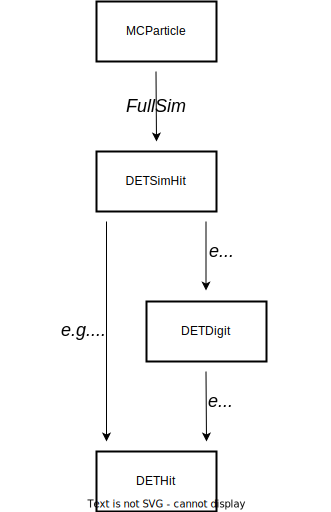

How to write basf2 code (coding conventions)
============================================

The following rules and conventions should ensure a good usability and maintainability of
the Belle II software. They are written for C++, but have to be followed for Python code
as well, unless other rules for Python are given.

General rules
-------------

Try to keep your code as simple as possible:

1. The interfaces should be easy to use and consistent throughout the entire software.
   Use inheritance and templates with care: try aggregation instead of inheritance, avoid
   multiple inheritance or friends, don't use private inheritance.

2. Aim for high coherence (only things belonging to a class should be there, and the class
   should be complete) and low coupling.

3. The code should compile without warning messages and must be portable (e.g. it should
   run on x86_64 64 bit machines, we do not support ARM processors).

Please, please avoid:

1. Hacks and fancy features. If you really know what you are doing, and you really, really
   want to implement a hack like the infamous
   `fast inverse square root hack <https://www.youtube.com/watch?v=p8u_k2LIZyo>`_
   please provide detailed documentation on what you do and why.

2. Interfaces to interfaces to interfaces.

3. Too much dependence on external software; check whether a plug-in mechanism can be used
   if external software is required.

4. Flexibility if it significantly increases the possibility of making mistakes: the
   system should behave correctly by default; a user should not be required to change any
   parameters from their default value to get a correct result.

5. Side effects: if code has side effects this must be clearly documented.

6. Preprocessor definitions if possible; in particular don't use them for constants.

Naming conventions
------------------

Names should be precise, colorful and in self-explanatory English:

1. Avoid abbreviations where possible, e.g. use ``TrackFitter`` instead of ``TrFt``.

2. Use plurals for containers (lists, vectors, etc.), e.g. ``particles``, ``tracks``.

3. When combining several words, use the order corresponding to natural English language,
   e.g. ``CDCHit`` instead of ``HitCDC``.

4. Use first-letter capitalization instead of underscore for constructing names, e.g.
   ``getTotalEnergy()`` instead of ``get_total_energy()`` in C++.

5. Use the ``get`` prefix for methods that return the value of the data member (getters).
   Use the ``set`` prefix for methods that set the value of a data member by parsing an
   argument (setters).
   In addition, usage of ``is`` instead of ``get`` as prefix for methods that return a
   boolean is recommended, e.g. ``isPhoton(const auto& someParticle)`` instead of
   ``getPhotonStatus(const auto& someParticle)`` or ``isFittedTrack(const auto& track)``
   instead of ``getTrackFitStatus(const auto& track)``.

6. *Python*: except for class names, use lower case words with underscores,
   e.g. ``find_particle()``.

7. Specifically:

   * class and type names start with a capital letter (``CapWords``, same for Python)

   * local variable and method names start with a lower case letter

   * enum types start with ``E`` followed by a capital letter

   * template arguments begin with ``A`` followed by a capital letter

   * use the prefix ``m_`` for member variables, ``s_`` for static member variables, and
     ``c_`` for constants

   * *Python*: use all upper case with underscores for constants; always use
     ``self``/``cls`` as first argument of instance/class methods

   * module parameter names are equal to the corresponding variable name, but without
     ``m_`` prefix

8. If values are not given in standard units the used units have to be stated explicitly
   in the variable name. Standard units are cm, nanosecond, radian, GeV, Kelvin, Tesla,
   elementary charge as defined in `Unit.h <https://github.com/belle2/basf2/blob/main/framework/gearbox/include/Unit.h>`_.

9. Executable that are part of the official interface on which users and other tools can
   rely on must have the prefix ``b2`` and must be documented in Sphinx. Other executables
   must have a prefix equal to the name of the package to which they belong.

10. Avoid the usage of "slave/master", "blacklist/whitelist". Prefer instead:
    "controller/agent", "primary/secondary", "denylist/allowlist".

11. In general, avoid anything that might cause distress or feelings of exclusion to other
    collaborators.

In case of doubts, don't hesitate to contact the coordinators.

In the following table ``Xyz`` stands for an arbitrary name and DET for a detector name,
like PXD or ARICH.

=======================  ===========================================================================
Name                     Description
=======================  ===========================================================================
*DET* **SimHit**         MC truth information about an energy deposition
*DET* **Digit**          simulated or real detector signal, the raw data information
*DET* **Hit**            reconstructed hit, after clustering
*DET* **Digitizer**      class (usually a module, see below) that creates digits from simulated hits
*DET* **Clusterizer**    class (usually a module, see below) that creates hits from digits
*DET* **Trigger** *Xyz*   classes for detector related triggers
*Xyz* **Collection**     a class for an array of objects of class *Xyz*, if not a ``StoreArray``
*Xyz* **Module**         a basf2 module class
*Xyz* **Base**           a class whose main purpose is to serve as a base class for derived classes
Abc *Xyz*                Classes derived from *Xyz* **Base**
*Xyz* **Error**          an exception class
=======================  ===========================================================================

.. _class_naming_conventions:

   
   Object naming conventions in basf2.

.. warning::

   Some subdetector packages may use slightly different naming conventions. In case you
   need further clarifications, please check the sphinx documentation of the subdetector
   package (when available) or contact the subdetector librarians.

Namespaces
----------

1. All the definitions should be done in ``namespace Belle2``.

2. Use sub-namespaces with names equal to the package names for everything (e.g.:
   ``namespace Belle2::Something``), except for datastore objects and anything in a
   ``dataobjects``, ``dbobjects`` or ``modules`` subdirectory.

3. ``using namespace`` is forbidden in header files; include statements must be outside
   namespaces.

4. ``enum class`` should be used to implement enumerations to contain the constant within
   the enum’s scope

Classes
-------

Each class implementation should go into a single source code file.

The ordering in the class definition is ``public``, ``protected``, ``private``, and in
each such section elements shall be ordered like:

* typedefs and enums,

* constructors and destructor,

* operators,

* other methods,

* data members, while in case of modules the steerable data members before non-steerable
  ones,

with static methods and members after non-static ones. **Public data members are forbidden**.

The only exception to the rule above are simple structs with no methods except for a
default constructor. In this case public data members (without ``m_`` prefix) are allowed.
Use the ``struct`` instead of the ``class`` keyword for such structures.

*Python*: follow basically the same rules, but put data members first.

Only very short functions like simple setters and getters should be in the declaration.
Implementation of non-template methods should go to the source file.

Methods should be declared ``const`` if possible. When overriding a virtual method of a
base class, the ``override`` keyword should be used to mark this intention. The ``final``
keyword may be used for methods that should not be overridden or classes from which no
other classes should be derived.

Try to pass function parameters by value, const reference, or const pointer, especially
if they are not meant to be changed in the function.

Order of class members
----------------------

It is advisable to order the data members in the following order:

1. ``std::string`` (has size of 32 bytes on 64 bit PCs as we usually use)

2. ``double`` and ``long`` / ``unsigned long`` and pointers (have size of 8 bytes)

3. ``float`` and ``int`` / ``unsigned int`` (have size of 4 bytes)

4.  ``short`` / ``unsigned short`` (have size of 2 bytes)

5. ``bool`` (has size of 1 byte)

The reason for this order is how processors and memory work. Modern PCs usually have a
so-called cache that holds data (data cache) and instructions (instruction cache) that
either are used often, or expected to be used in the next O(100) clock cycles. The
content of the cache is retrieved from memory in *cache lines* of up to 64 bytes. Thus,
the data should be ordered such that the bytes in the cache lines are filled.
Although a ``bool`` technically can be represented by a single bit, it occupies a
byte in memory as memory addresses are based on units of 1 byte, thus the smallest
addressable chunk of memory is a byte but not a bit.

In a simple example of a cache line of 16 bytes these should either be filled by two
``double`` or four ``float`` or ``int``. Having a ``double`` followed by a ``bool``
followed by another ``double`` would create 7 empty bytes that cannot be filled
properly, and the second ``double`` would end up in the next cache line, potentially
causing a `cache miss <https://www.geeksforgeeks.org/types-of-cache-misses/>`_.
Cache misses can significantly slow down a program, as retrieving data from cache only
costs a few CPU clock cycles, while retrieving data from RAM usually costs O(100) CPU
clock cycles.

Additionally, ordering the data types as described above will lead to a smaller memory
footprint of the class, which is critical for basf2 on the HLT.

Because usually classes contain several data members, there is no clear rule where to add
classes as data members in other classes, usually it would be at position 1, 2, or 3.

Initialisation
--------------

Always initialize variables immediately in the same statement where you create them
(see `explanation <https://confluence.desy.de/download/attachments/34036872/dangerousC.pdf?version=3&modificationDate=1467725383373&api=v2>`_).

All data members of a class must be initialized at their declaration. Specific
constructors should use the initialization list (after the colon of the constructor
declaration) instead of an initialization in the body of the constructor if possible.

Data objects
------------

1. Place all classes that should be used in the data store and written to output files into
   the ``dataobjects`` folder.

2. These classes must not depend on any other basf2 code. The only exception are other data
   objects classes and the core framework.

3. Classes that will be stored as single objects (not in ``TClonesArrays``) in the data store
   must implement the Clear method.

4. Use normal C++ types for basic types (``int``, ``double``, etc) and ``ROOT`` classes for
   vectors and matrices (``ROOT::Math::XYZVector``, TMatrixD, etc.).

5. Classes that are used for temporary or intermediate objects in the data store and are not
   written to output files can be put into any folder. They must always be registered as
   transient in the data store.

Random numbers
--------------

Always use ``gRandom`` for generating random numbers.

Error handling
--------------

In case of serious errors an exception should be thrown, otherwise return codes should be
used to indicate whether an operation was successful or not.

When an exception is thrown a ``B2ERROR`` message should be issued, too.

Use ``BELLE2_DEFINE_EXCEPTION(name, description)`` to define exceptions. Define them inside
the classes to which they belong.

Use the logging system:

* ``B2FATAL(message)`` for situations were the program execution cannot be continued.
  (An advantage of this type of message is that it cannot be ignored.)
  
* ``B2ERROR(message)`` for things that went wrong and **must be fixed**.

* ``B2WARNING(message)`` for potential problems that should not be ignored and only **accepted if
  understood**.

* ``B2INFO(message)`` for informational messages that are **relevant to the user**.

* ``B2DEBUG(level, message)`` **everything else**, in particular debug information that is
  useful for developers. The following debug levels should be used
  
  * 0-9 for user code. The use case is that a user wants to debug their analysis code. Debug
    levels below 10 must not be used is basf2 code.
    
  * 10-19 for analysis package code. The use case is that a user wants to debug problems in
    analysis jobs with the help of experts.
    
    * For even more output control: 10 is enabled when running debug with no arguments, so
      messages 0-10 will be shown when running --debug <no args>
      
  * 20-29 for simulation/reconstruction code. The use case is that a developer wants to debug
    their code or the debugging of production jobs by experts.
        
  * 30-39 for framework code. The use case is that an expert wants to debug problems in the core software.

Files
-----

For C++, header files have the extension ``.h``, sources ``.cc`` with the base file name corresponding
to the class name defined / implemented in the file. Each header file should have a multiple inclusion
protection using::

  #pragma once

close to the beginning of the file. In older files you can still find protections using ``ifndef``::

  #ifndef FILENAME_H
  #define FILENAME_H
   ...
  #endif

which is perfectly valid and doesn't need to be changed, but for new files ``#pragma once`` is
preferred.

All include statements must be at the top of the beginning of the file and should use the
``<>`` - notation for global available includes of the form::

  #include <package/dir/otherclass.h>

Includes should be kept to a minimum: all necessary symbols in the header should be forward declared
if possible (to reduce depedencies between the header files), or, if that is not possible, the
appropriate header needs to be included.

You must add the following header to all C++ files::

  /**************************************************************************
  * basf2 (Belle II Analysis Software Framework)                           *
  * Author: The Belle II Collaboration                                     *
  *                                                                        *
  * See git log for contributors and copyright holders.                    *
  * This file is licensed under LGPL-3.0, see LICENSE.md.                  *
  **************************************************************************/

and the following to all python files::

  ##########################################################################
  # basf2 (Belle II Analysis Software Framework)                           #
  # Author: The Belle II Collaboration                                     #
  #                                                                        #
  # See git log for contributors and copyright holders.                    #
  # This file is licensed under LGPL-3.0, see LICENSE.md.                  #
  ##########################################################################

You do not need to add your name (your work is attributed via the git log) to the file
**unless** as a contact person for a validation script or another operational reason.

*Python*: All files have the extension ``.py``.

Code Formatting Style
---------------------

In general use

  * 2 spaces for indentation,
  * Stroustrup style for brackets, i.e. brackets are attached except for functions,
  * spaces around keywords, operands and parentheses.

Example::

  if (x == y) {  
    ...   
  } else if (x > y) {  
    ...   
  } else {  
    ....   
  }   

*Python*: Follow the `Style Guide for Python Code <http://www.python.org/dev/peps/pep-0008/>`_.

.. tip::
    You can use the ``b2code-style-fix`` tool to format your code according to the style rules. Only
    code that follows the required style can be committed to the git repository! The
    ``b2code-style-check`` tool can be used to print the changes that the ``b2code-style-fix`` tool would apply.

In the definition of pointers and references the \* and \& symbols have to be attached to
the variable type, not the variable name, e.g.::

  int* pIndex;   
  int& index = *pIndex;   

Be aware of the (wrong) C++ convention for definitions of multiple variables in one statement.
E.g. ``int* a, b;`` will define a pointer a and an int variable (not a pointer) b. It is
recommended to split multiple pointer definitions to separate statements.

Documentation
-------------

All code has to be documented using Software.DoxyGen style comments – you can find examples
in the `DoxyGen <https://confluence.desy.de/display/BI/Software+DoxyGen>`_ article. Rules on
what should be documented, and how:

  * Each class needs a detailed comment describing the purpose of the class.
  
  * Each method needs a comment describing at least the input and output quantities.
  
  * Comments on data members are encouraged, unless their meaning is obvious.
  
  * Comments on design decisions and implementation details may be added if appropriate.
    External documentation may be more useful to describe the overall design.
  
  * *Python*: Use docstrings instead of comments for the documentation of classes and
    methods/functions.
  
  * If a file contains functions that are not methods of a class, the documentation generation
    has to be enabled by documenting the file. This is done by adding ``/** @file filename */``
    at the beginning of the file, where filename should be replaced by the actual file name.
    Further documentation describing the file can be added in the comment.
    *Python* : The corresponding statement for python files is ``##@package`` followed by a
    package name. This has to be added before the function definitions, e.g. directly after
    the utf-coding definition. Further documentation describing the package can be added after
    this line as comments.
  
  * Documentation about the input and output of modules is
    `automatically generated <https://confluence.desy.de/display/BI/Software+VisualizeDataFlow>`_
    if both are registered in the initialize method.

Further Suggestions
-------------------

  * Use ``iXxx`` to indicate the identifying integer for an object, e.g. a variable for asking
    for a specific layer is ``iLayer``.
  
  * Use ``nXxx`` to indicate the total number of something, e.g. the number of layers, that a
    subdetector has is ``nLayer``.
  
  * If you get a warning about too large or unbound stack usage, use ``std::vector`` instead
    of a one-dimensional C array or ``boost::multi_array`` instead of multi-dimensional C arrays.
    See these `slides <http://kds.kek.jp/getFile.py/access?contribId=0&resId=0&materialId=slides&confId=19219>`_
    or `mail <https://belle2.kek.jp/sympa/arc/software/2015-07/msg00061.html>`_ for more information.
