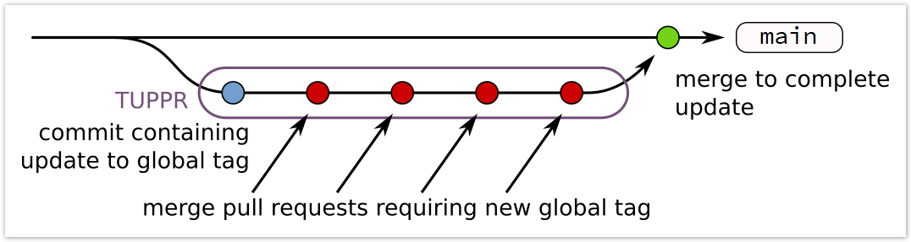

.. _tuppr:

Updating the main globaltag
+++++++++++++++++++++++++++

.. tip::
   Please have a look to :ref:`this page<conditionsdb_overview>` for a broader overview about the Conditions Database.

basf2 needs payloads to work so we need a special globaltag (usually called "main" globaltag) for software development.
The main globaltag is also used as baseline for our run-independent MC productions. Due to the development model there
are a few requirements for this globaltag:

- The contents of the database should work correctly for any commit on the main basf2 branch. We have to be sure that
  updates to the globaltag do not affect existing development on other branches. As such every change to the code which
  requires changes to the payloads to work needs to be coordinated and result in a new globaltag.

- The globaltag should not contain run-dependent calibrations for data.

- The globaltag should clearly fail when running on data. Running with wrong calibrations is worse than not running
  at all. The main globaltag only contains payloads for experiment 0 (nominal Phase 3), 1003 (early
  Phase 3, pre LS1) and 1004 (early Phase 3, post LS1).

.. tip::
   If you want to know who is the manager of the main globaltag, please browse
   `the relevant file in the versioning repository
   <https://gitlab.desy.de/belle2/software/versioning/-/tree/main/versioning.py>`__, go down to the ``jira_global_tag_v2``
   function and look for the assignee of the task labelled as ``main``.

Preparation of payloads
-----------------------

Before requesting any changes of payloads, or introduction of new payloads, the the payload code needs to be prepared.
Please create a pull request which contains the changes to the code which are required. In all cases you should create
a local database containing the new payload versions. This is one text file containing a description of which payload
is valid for which experiment and run range and the payloads themselves as root files named
``dbstore_${payloadName}_rev_${revision}.root`` where the revision number is just an alphanumeric string (the first few
characters of the MD5 checksum of the payload file) to distinguish different versions. A local database file might
look something like this:

::

  dbstore/KLMStripEfficiency b82d5b 0,0,0,-1
  dbstore/KLMStripEfficiency b82d5b 1003,0,1003,-1
  dbstore/KLMStripEfficiency b82d5b 1004,0,1004,-1
  dbstore/ECLLeakageCorrections a211cd3 0,0,-1,-1

Each line describes one interval of validity for one payload and consists of:

1. A ``dbstore/`` prefix. This one is always the same and is there for historical reasons.

2. The payload name. This is usually the class name of your payload.

3. The revision code. Note that the revision code is not the final revision in the Conditions Database, that is
   instead a number and it is unique

4. The Interval of Validity (IoV) for which the payload is valid, see the
   :ref:`Conditions Database overview <conditionsdb_overview>`.

.. warning::
   The payload name should start with the package name and should clearly indicate somehow what this payload is for (no
   ``MyPayload`` or similar).

Valid values for IoVs to be included in the main globaltag are listed in the following table:

==============  ======================================
IoV             Valid for
==============  ======================================
0,0,0,-1        Valid only for nominal Phase 3
1003,0,1003,-1  Valid only for early Phase 3, pre LS1
1004,0,1004,-1  Valid only for early Phase 3, post LS1
0,0,-1,-1       Valid for all the phases
==============  ======================================

Mostly the ``database.txt`` file should be generated automatically if you use the ``DBImport`` interface but please
review it and make sure all payloads have the correct IoV and make sure it contains all the payloads you want to add
and nothing else. The ``database.txt`` and the corresponding payload files should then be provided to the globaltag
manager (using the :ref:`b2conditionsdb-request <b2conditionsdb-request>` tool) for each of the three following use
cases:

.. warning::
   The IoV (1002,0,1002,-1), covering Phase 2, was supported until the globaltag `main_2023-06-29`.

Create a new payload
~~~~~~~~~~~~~~~~~~~~

If you create new payloads it is advisable to split the creation of the payloads and the usage of the payloads in
separate pull requests:

1. Create, review and merge a pull request to create the payload definition without using it.

2. Request payloads to be added to the globaltag by just providing the payloads.

3. Create, review and merge a pull request to actually use the payload already in the globaltag.

This allows to merge the actual code changes without any coordination with the globaltag manager and greatly speeds
up and simplifies the globaltag update procedure.

.. tip::

   To create new payload, please check the :ref:`corresponding documentation<cdb_payload_creation>`.

.. warning::
   
   If you cannot manage to split the pull requests please create a pull request with the code changes and make sure
   that, apart from the missing payload, it is approved by all necessary people and can be merged on short notice.
   Only then should you ask for an update of the globaltag by providing the pull request number and the new payloads
   to the globaltag manager.

Update a payload to contain new contents without changing its definition
~~~~~~~~~~~~~~~~~~~~~~~~~~~~~~~~~~~~~~~~~~~~~~~~~~~~~~~~~~~~~~~~~~~~~~~~

This is the simplest type of operation: just provide new payloads to the globaltag manager for inclusion in the
globaltag.

Modify an existing payload definition
~~~~~~~~~~~~~~~~~~~~~~~~~~~~~~~~~~~~~

This is the most tricky one as changes in payload definitions often lead to problems: globaltags might contain older
versions of the payload and cannot be read correctly.

.. warning::
   
   If you change the member definition of a payload class:
   
     - you must make sure you increase the ``ClassDef`` version number
       `correctly <https://root.cern/manual/io_custom_classes/#the-classdef-macro>`__;
     - you run the tool ``b2code-classversion-update`` over the corresponding ``linkdef.h`` file;
     - you should provide schema evolution rules or otherwise make sure the code still works if an older version of
       the payload is found in a globaltag.

If you manage to make sure that the code also works with the old payload you can just review and test the changes as
usual and don't need to coordinate with the globaltag manager. Once your new payload definition is merged you can
just provide the new payloads to the globaltag manager.

.. warning::

   If you cannot ensure backwards compatibility, you should discuss about this with the globaltag manager or during a
   `Software Developers meeting <https://indico.belle2.org/category/18/>`__. Then, after having found a proper
   solution, please create a pull request with the code changes and make sure that, apart from the missing payload, it
   is approved by all necessary people and can be merged on short notice. Only then you should ask for an update of
   the globaltag by providing the pull request number and the new payloads to the globaltag manager.

Testing of all changes
----------------------

Please make sure the payloads contain the contents you expect them to have. You can easily inspect a payload file
using the tool ``b2conditionsdb-dump`` (see the full documentation :ref:`here <b2conditionsdb>`).

.. warning::

   It's not recommended to inspect very large payloads like the magnetic field as this can take up to half an hour
   and :math:`\mathcal{O}(10)` GB of RAM.

.. tip::
   
   You can also pipe the output of this command into a file to compare different revisions with ``diff``.

All pull requests and payload requests must be tested. Once you have prepared your local database file please run the
following snippet:

.. code-block:: bash

   # include your local database in the fallbacks
   export BELLE2_CONDB_FALLBACK="/cvmfs/belle.cern.ch/conditions /full/path/to/your/database.txt"
   # disable access to central database to make your local database the most important one
   export BELLE2_CONDB_GLOBALTAG=""
   # run the tests
   b2test-units
   b2test-scripts
   # don't forget to unset the environment variables afterwards
   unset BELLE2_CONDB_FALLBACK
   unset BELLE2_CONDB_GLOBALTAG

and make sure there are no failing tests. You might want to run ``b2test-scripts -j N`` to execute ``N`` tests in
parallel.

Update procedure
----------------

Once you have prepared all the payloads, and the pull request if one is required, you need to notify the globaltag
manager that you need a change to payloads on main using the :ref:`b2conditionsdb-request <b2conditionsdb-request>`
tool by calling

.. code-block:: bash

   b2condtionsdb-request /path/to/database.txt

and following the instructions (select ``main`` as target of your request).

You need to provide appropriate information so that the other groups know how to handle this payload in other
globaltags:

1. The new payloads.

2. Is a pull request needed (see above)?

3. Does a previous version of this payload exist? If so, is the new code compatible or will it crash if the old
   version is found?

4. Is this payload required when processing existing data? If so, can a common payload be prepared for existing data
   processing or is a dedicated calibration needed?

The globaltag manager for software development will create a new main globaltag and a pull request to change the
software to use this globaltag, the "Tag Update Procedure Pull Request" (TUPPR). This pull request is like a box to
contain a set of changes to the globaltag in an airtight way to make sure they all stay fresh and don't break other
branches until the change to the globaltag is actually added to main.

Additional changes to the main globaltag by other developers can thus join in on this update.

.. tip::

   All the TUPPRs names start with the tag ``TUPPR`` for clearly distinguishing them from the other pull requests.

.. warning::

   All pull requests to join into this globaltag update will be modified to not merge against main but against the
   TUPPR branch. After these changes the pull requests should be able to see any payloads uploaded to the new
   globaltag.

.. warning::

   Review of the separate pull requests can then proceed as usual: once all reviewers have approved the pull request
   can be merged as usual. However this will not directly make these changes available on main. Instead the changes
   will be aggregated into TUPPR first.

Once all pull requests requiring changes are approved and merged, the globaltag manager for software development will
review the changes in the globaltag.

1. IoVs for common payloads will be split into separate Phase 2 and Phase 3 IoVs.

2. All duplicate payloads will be removed (for example older revisions).

3. The remaining changes to the main globaltag will be posted on the TUPPR description

Finally, once these changes are reviewed the globaltag will be published and the TUPPR will be merged which makes the
changes available on the main branch.

    Workflow for updating the main globaltag via TUPPR.
