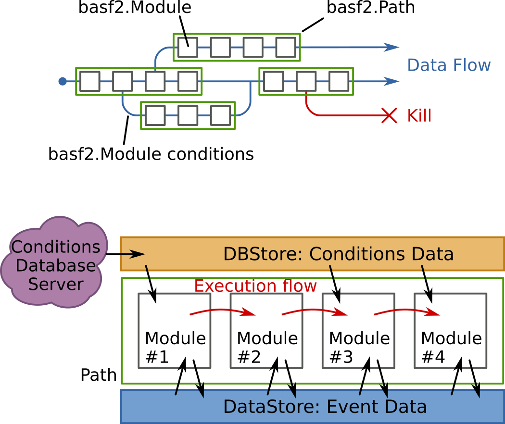

:tocdepth: 3

=========================
Belle II Python Interface
=========================

.. module:: basf2

The Belle II Software has an extensive interface to the Python 3 scripting
language: All configuration and steering is done via python and in principle
also simple algorithms can be implemented directly in python. All main
functions are implemented in a module called `basf2` and most people will just
start their steering file or script with ::

    import basf2
    main = basf2.Path()

.. _general_modpath:

Modules and Paths
-----------------

A typical data processing chain consists of a linear arrangement of smaller
processing blocks, called :py:class:`Modules <basf2.Module>`. Their tasks vary
from simple ones like reading data from a file to complex tasks like the full
detector simulation or the tracking.

In basf2 all work is done in modules, which means that even the reading of data
from disk and writing it back is done in modules. They live in a
:py:class:`Path <basf2.Path>`, which corresponds to a container where the
modules are arranged in a strict linear order. The specific selection and
arrangement of modules depend on the user's current task. When processing data,
the framework executes the modules of a path, starting with the first one and
proceeding with the module next to it. The modules are executed one at a time,
exactly in the order in which they were placed into the path.

Modules can have conditions attached to them to steer the processing flow
depending of the outcome of the calculation in each module.

The data, to be processed by the modules, is stored in a common storage, the
DataStore. Each module has read and write access to the storage. In addition
there's also non-event data, the so called conditions, which will be loaded from
a central conditions database and are available in the DBStore.

.. _framework_modpath_diagram:

  Schematic view of the processing flow in the Belle II Software

.. Functions concerning modules and Paths
.. ++++++++++++++++++++++++++++++++++++++

Usually each script needs to create a new path using `Path()`, add
all required modules in the correct order and finally call :py:func:`process` on
the fully configured path.

.. warning:: Preparing a `Path` and adding `Modules <Module>` to it **does not
   execute anything**, it only prepares the computation which is only done when
   `process` is called.

The following functions are all related to the handling of modules and paths:

.. autofunction:: basf2.create_path
.. autofunction:: basf2.register_module
.. autofunction:: basf2.set_module_parameters
.. autofunction:: basf2.print_params
.. autofunction:: basf2.print_path
.. autofunction:: basf2.process

The Module Object
+++++++++++++++++

Unless you develop your own module in Python you should always instantiate new
modules by calling `register_module` or `Path.add_module`.

.. autoclass:: basf2.Module
   :members:

The Path Object
+++++++++++++++

.. autoclass:: basf2.Path
   :members:
   :special-members:
   :exclude-members: __init__, __str__

Other Related Classes
+++++++++++++++++++++

.. autoclass:: basf2.ModuleParamInfo
   :members:
.. autoclass:: basf2.ModulePropFlags
.. autoclass:: basf2.AfterConditionPath

Logging
-------

The Logging system of the Belle II Software is rather flexible and allows
extensive configurations. In the most simple case a call to
`set_log_level` is all that is needed to set the minimum severity of
messages to be printed. However in addition to this global log level one can
set the log level for specific packages and even for individual modules
separately. The existing log levels are defined as

.. autoclass:: basf2.LogLevel

.. autofunction:: basf2.set_log_level
.. autofunction:: basf2.set_debug_level
.. attribute:: basf2.logging

    An instance of the `LogPythonInterface` class for fine grained control
    over all settings of the logging system.

Creating Log Messages
+++++++++++++++++++++

Log messages can be created in a very similar way in python and C++. You can
call one of the logging functions like `B2INFO` and supply the message as
string, for example

.. code-block:: python

   B2INFO("This is a log message of severity INFO")

In Python you can supply multiple arguments which will all be converted to
string and concatenated to form the log message

.. code-block:: python

   for i in range(1,4):
       B2INFO("This is log message number ", i)

which will produce

.. code-block:: text

  [INFO] This is log message number 1
  [INFO] This is log message number 2
  [INFO] This is log message number 3

This works almost the same way in C++ except that you need the ``<<`` operator
to construct the log message from multiple parts

.. code-block:: c++

   for(int i=1; i<4; ++i) {
     B2INFO("This is log message " << i << " in C++");
   }

.. _logging_logvariables:

.. rubric:: Log Variables

.. versionadded:: release-03-00-00

However, the log system has an additional feature to include variable parts in
a fixed message to simplify grouping of similar log messages: If a log message only
differs by a number or detector name it is very hard to filter repeating
messages. So we have log message variables which can be used to specify varying
parts while having a fixed message.

In Python these can just be given as keyword arguments to the logging functions

.. code-block:: python

   B2INFO("This is a log message", number=3.14, text="some text")

In C++ this again almost works the same way but we need to specify the
variables a bit more explicitly.

.. code-block:: c++

   B2INFO("This is a log message" << LogVar("number", 3.14) << LogVar("text", "some text"));

In both cases the names of the variables can be chosen feely and the output
should be something like

.. code-block:: text

   [INFO] This is a log message
           number = 3.14
           text = some text

.. rubric:: Logging functions

To emit log messages from within Python we have these functions:

.. autofunction:: basf2.B2DEBUG
.. autofunction:: basf2.B2INFO
.. autofunction:: basf2.B2RESULT
.. autofunction:: basf2.B2WARNING
.. autofunction:: basf2.B2ERROR
.. autofunction:: basf2.B2FATAL

The same functions are available in C++ as macros once you included ``<framework/logging/Logger.h>``

The Logging Configuration Objects
+++++++++++++++++++++++++++++++++

The `logging` object provides a more fine grained control over the
settings of the logging system and should be used if more than just a global
log level should be changed

.. autoclass:: basf2.LogPythonInterface
   :members:

.. autoclass:: basf2.LogConfig
   :members:

.. autoclass:: basf2.LogInfo

Module Statistics
-----------------

The basf2 software takes extensive statistics during event processing about the
memory consumption and execution time of all modules. For most users a simple
print of the `statistics` object will be enough and creates a text table of the
execution times and memory conumption::

    import basf2
    print(basf2.statistics)

However the statistics object provides full access to all the separate values
directly in python if needed. See
:download:`module_statistics.py </framework/examples/module_statistics.py>` for a full example.

.. note::

    The memory consumption is measured by looking into :file:`/proc/{PID}/statm`
    between execution calls so for short running modules this might not be
    `accurate <https://stackoverflow.com/a/30799817/3596741>`_
    but it should give a general idea.

.. attribute:: basf2.statistics

   Global instance of a `ProcessStatistics` object containing all the statistics

.. autoclass:: basf2.ProcessStatistics
   :members:
   :special-members:
   :exclude-members: __init__

Conditions Database
-------------------

The conditions database is the place where we store additional data needed to
interpret and analyse the data that can change over time, for example the
detector configuration or calibration constants.

In many cases it should not be necessary to change the configuration but except for
maybe adding an extra globaltag to the list via `conditions.globaltags <ConditionsConfiguration.globaltags>`

.. toctree:: conditions-database

Additional Functions
--------------------

.. autofunction:: find_file
.. autofunction:: get_file_metadata

.. autofunction:: get_random_seed

..
  .. autofunction:: is_mod_function

.. autofunction:: log_to_console
.. autofunction:: log_to_file
.. autofunction:: reset_log

..
  .. autofunction:: serialize_conditions
  .. autofunction:: serialize_module
  .. autofunction:: serialize_path
  .. autofunction:: serialize_path
  .. autofunction:: serialize_value

.. autofunction:: set_nprocesses
.. autofunction:: set_random_seed
.. autofunction:: set_streamobjs

..
  .. autofunction:: update_file_metadata
  .. autofunction:: write_path_to_file
  .. attribute:: fw
   Global instance of the `Framework` class
  .. autoclass:: Framework
   :members:
   :undoc-members:

Other Modules
-------------

There more tools available in the software framework which might not be of
general interest to all users and are separated into different python modules:

.. toctree::
   :glob:

   modules/*
