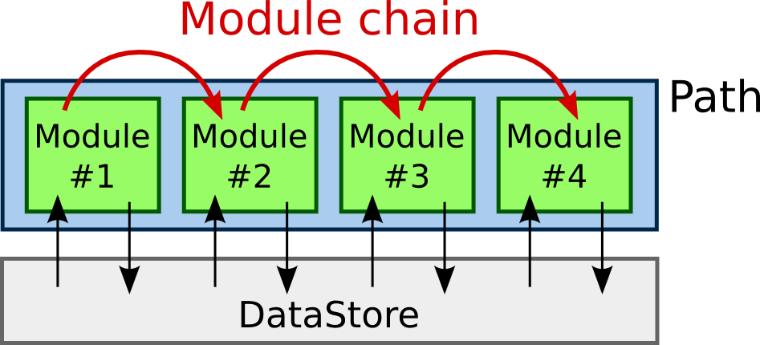

:tocdepth: 3

=========================
Belle II Python Interface
=========================

.. module:: basf2

The Belle II Software has an extensive interface to the Python 3 scripting
language: All configuration and steering is done via python and in principle
also simple algorithms can be implemented directly in python. All main
functions are implemented in a module called `basf2` and most people will just
start their steering file or script with ::

    from basf2 import *
    main = create_path()

but it is recommended (escpecially in scripts to be used by others) to import
the module and call all methods by prefix::

    import basf2
    main = basf2.create_path()

Modules and Paths
-----------------

A typical data processing chain consists of a linear arrangement of smaller
processing blocks, called :py:class:`Modules <basf2.Module>`. Their tasks vary
from simple ones like reading data from a file to complex tasks like the full
detector simulation or the tracking.

In basf2 all work is done in modules, which means that even the reading of data
from disk and writing it back is done in modules. They live in a
:py:class:`Path <basf2.Path>`, which corresponds to a container where the
modules are arranged in a strict linear order. The specific selection and
arrangement of modules depend on the user's current task. When processing data,
the framework executes the modules of a path, starting with the first one and
proceeding with the module next to it. The modules are executed one at a time,
exactly in the order in which they were placed into the path.

The data, to be processed by the modules, is stored in a common storage, the
DataStore. Each module has read and write access to the storage.

  Schematic view of the processing flow in the Belle II Software

.. Functions concerning modules and Paths
.. ++++++++++++++++++++++++++++++++++++++

Usually each script needs to create a new path using `create_path`, add
all required modules in the correct order and finally call :py:func:`process` on
the fully configured path. The following functions are all related to the
handling of modules and paths:

.. autofunction:: basf2.create_path
.. autofunction:: basf2.register_module
.. autofunction:: basf2.set_module_parameters
.. autofunction:: basf2.print_params
.. autofunction:: basf2.print_path
.. autofunction:: basf2.process

The Module Object
+++++++++++++++++

Unless you develop your own module in Python you should always instantiate new
modules by calling `register_module` or `Path.add_module`.

.. autoclass:: basf2.Module
   :members:

The Path Object
+++++++++++++++

.. autoclass:: basf2.Path
   :members:
   :special-members:
   :exclude-members: __init__, __str__

Other Related Classes
+++++++++++++++++++++

.. autoclass:: basf2.ModuleParamInfo
   :members:
.. autoclass:: basf2.ModulePropFlags
.. autoclass:: basf2.AfterConditionPath

Logging
-------

The Logging system of the Belle II Software is rather flexible and allows
extensive configurations. In the most simple case a call to
`set_log_level` is all that is needed to set the minimum severity of
messages to be printed. However in addition to this global log level one can
set the log level for specific packages and even for individual modules
separately. The existing log levels are defined as

.. autoclass:: basf2.LogLevel

.. autofunction:: basf2.set_log_level
.. autofunction:: basf2.set_debug_level
.. attribute:: basf2.logging

    An instance of the `LogPythonInterface` class for fine grained control
    over all settings of the logging system.

To emit log messages from within Python we have these functions:

.. autofunction:: basf2.B2FATAL
.. autofunction:: basf2.B2ERROR
.. autofunction:: basf2.B2WARNING
.. autofunction:: basf2.B2INFO
.. autofunction:: basf2.B2RESULT
.. autofunction:: basf2.B2DEBUG

The Logging Configuration Objects
+++++++++++++++++++++++++++++++++

The `logging` object provides a more fine grained control over the
settings of the logging system and should be used if more than just a global
log level should be changed

.. autoclass:: basf2.LogPythonInterface
   :members:

.. autoclass:: basf2.LogConfig
   :members:

.. autoclass:: basf2.LogInfo

Module Statistics
-----------------

The basf2 software takes extensive statistics during event processing about the
memory consumption and execution time of all modules. For most users a simple
print of the `statistics` object will be enough and creates a text table of the
execution times and memory conumption::

    import basf2
    print(basf2.statistics)

However the statistics object provides full access to all the separate values
directly in python if needed. See
:download:`module_statistics.py </framework/examples/module_statistics.py>` for a full example.

.. note::

    The memory consumption is measured by looking into :file:`/proc/{PID}/statm`
    between execution calls so for short running modules this might not be
    `accurate <https://stackoverflow.com/a/30799817/3596741>`_
    but it should give a general idea.

.. attribute:: basf2.statistics

   Global instance of a `ProcessStatistics` object containing all the statistics

.. autoclass:: basf2.ProcessStatistics
   :members:
   :special-members:
   :exclude-members: __init__

Conditions Database
-------------------

The conditions database is used for configuration objects (payloads) which
might change over time. There are two different "backends" to obtain conditions
data:

1. A local database which stores configuration objects in local files. The
   valid set of configuration constants is configured in a plain text file.

2. A central database where the conditions are stored on a central server and
   are downloaded on demand. In this case the valid set of configuration
   constants is identified by a ``globalTag`` which is a text identifier known
   to the database.

   .. note::

      To inspect (and modify) this central database please have a look at
      :ref:`b2conditionsdb`

The default configuration of the Belle2 software is to look in a chain of
backends one at a time until the required constants can be found:

1. in a local database configured in :file:`localdb/database.txt` in the
   current working directory.

   If conditions are found there use them but emit a `WARNING
   <LogLevel.WARNING>` message to indicate that custom condtitions have been
   used.

2. in the central database under a default global tag name which is dependent
   on the software version and can be queried with `get_default_global_tags()`
   and is also displayed when running :program:`basf2 --info`

   If possible the payloads are not downloaded but taken from
   :file:`/cvmfs/belle.cern.ch/conditions`, otherwise they are downloaded from
   the server and cached in a directory :file:`centraldb` in the current
   working directory.

3. in a local database configures in
   :file:`/cvmfs/belle.cern.ch/conditions/{globalTag}.txt` where ``globalTag``
   is the default global tag as mentioned above.

Environment Variables
+++++++++++++++++++++

These settings can be modified by setting environment variables

.. envvar:: BELLE2_CONDB_GLOBALTAG

   if set this overrides the default global tag returned by
   `get_default_global_tags`. This can be a list of tags separated by white
   space in which case all global tags are searched.

   ::

       export BELLE2_CONDB_FALLBACK="defaultTag additionalTag"

   If set to an empty value
   access to the central database is disabled.

.. envvar:: BELLE2_CONDB_FALLBACK

   if set this overrides the fallback local database which is searched if the
   constants could not be found in the central database. This can either be a
   filename or a directory or a combination of both separated by whitespace. In
   case of a directory the database configuration is taken from
   :file:`{directory}/{globalTag}.txt` for each globalTag returned by
   `get_default_global_tags`.

   ::

       export BELLE2_CONDB_FALLBACK="/cvmfs/belle.cern.ch/conditions ./mylocaldb.txt"

   If set to an empty value no fallback database will be configured.

.. envvar:: BELLE2_CONDB_PROXY

   Can be set to specify a proxy server to use for all connections to the
   central database. The parameter should be a string holding the host name or
   dotted numerical IP address. A numerical IPv6 address must be written within
   [brackets]. To specify port number in this string, append ``:[port]`` to the
   end of the host name. If not specified, libcurl will default to using port
   1080 for proxies. The proxy string should be prefixed with ``[scheme]://``
   to specify which kind of proxy is used.

   *http*
     HTTP Proxy. Default when no scheme or proxy type is specified.

   *https*
     HTTPS Proxy.

   *socks4*
     SOCKS4 Proxy.

   *socks4a*
     SOCKS4a Proxy. Proxy resolves URL hostname.

   *socks5*
     SOCKS5 Proxy.

   *socks5h*
     SOCKS5 Proxy. Proxy resolves URL hostname.

   ::

      export BELLE2_CONDB_PROXY="http://192.168.178.1:8081"

   If it is not set the default proxy configuration is used (e.g. honor
   ``$http_proxy``). If it is set to an empty value direct connection is
   used.

Settings in Python
++++++++++++++++++

All the configurations of the conditions database access can also be performed
directly in python using the following functions:

.. autofunction:: basf2.get_default_global_tags
.. autofunction:: basf2.reset_database
.. autofunction:: basf2.use_database_chain
.. autofunction:: basf2.use_local_database
.. autofunction:: basf2.use_central_database
.. autofunction:: basf2.set_central_database_networkparams

Additional Functions
--------------------

.. 
  .. autofunction:: deserialize_conditions
  .. autofunction:: deserialize_module
  .. autofunction:: deserialize_path
  .. autofunction:: deserialize_value
  .. autofunction:: get_path_from_file

.. autofunction:: get_random_seed
.. autofunction:: get_terminal_width

..
  .. autofunction:: is_mod_function

.. autofunction:: list_functions
.. autofunction:: log_to_console
.. autofunction:: log_to_file
.. autofunction:: make_code_pickable
.. autofunction:: pretty_print_description_list
.. autofunction:: pretty_print_table
.. autofunction:: print_all_modules
.. autofunction:: reset_log

..
  .. autofunction:: serialize_conditions
  .. autofunction:: serialize_module
  .. autofunction:: serialize_path
  .. autofunction:: serialize_path
  .. autofunction:: serialize_value

.. autofunction:: set_nprocesses
.. autofunction:: set_random_seed
.. autofunction:: set_streamobjs

..
  .. autofunction:: update_file_metadata
  .. autofunction:: write_path_to_file
  .. attribute:: fw
   Global instance of the `Framework` class
  .. autoclass:: Framework
   :members:
   :undoc-members:

Other Modules
-------------

There more tools available in the software framework which might not be of
general interest to all users and are separated into different python modules:

.. toctree::
   :glob:

   modules/*
