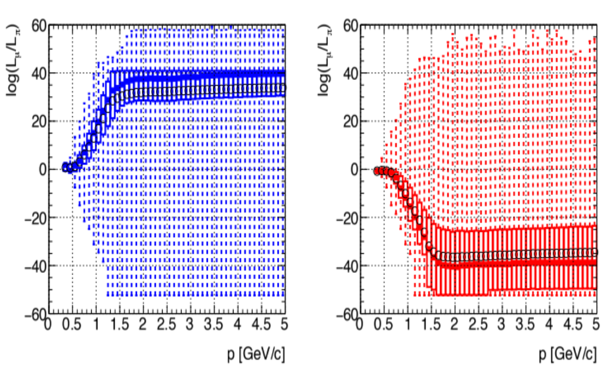
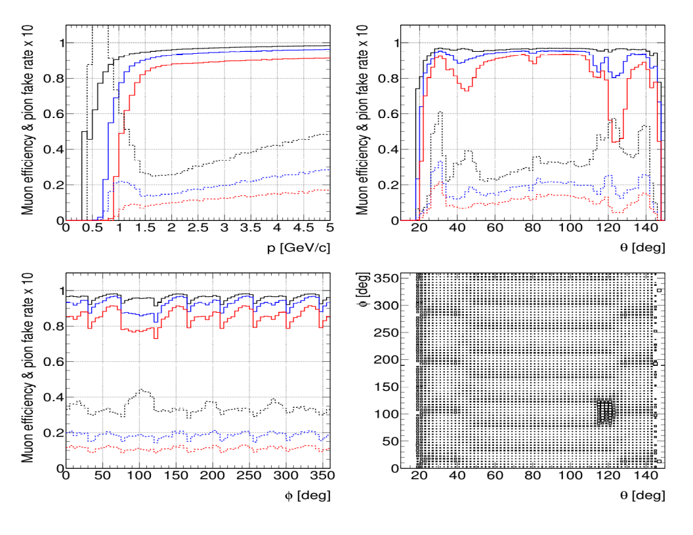

KLM (:math:`K_{L}^0` and Muon Detector)
=======================================

In the following we describe the ``klm`` package (documentation still under development).

Modules
-------

This is a list of the ``klm`` modules. Some modules (in the ``klm/bklm`` and ``klm/eklm`` subfolders) that are currently used only for debugging or specific studies are omitted here.

.. b2-modules::
   :package: klm
   :regex-filter: ^KLM
   :io-plots:

.. b2-modules::
   :modules: MCMatcherKLMClusters 
   :io-plots:

Clusterization
--------------

Few words about how a ``KLMCluster`` is built starting from ``BKLMHit2d`` and ``EKLMHit2d`` are more than desiderable.

Muon identification
-------------------
Muon identification for the extrapolated tracks in KLM uses differences in longitudinal penetration
depth and transverse scattering of the extrapolated track. It is handles by the ``Muid`` module,
that is part of the tracking package of ``BASF2`` and proceeds in two steps:

1. **Track extrapolation** using the muon hypothesis only;
2. **Likelihood extraction** for each of six particle hypothesis: :math:`\mu`, :math:`\pi`, :math:`K`, :math:`p`, :math:`d`, :math:`e`.

The six likelihoods that are assigned to a given track are stored as log-likelihood values in the
``KLMMuidLikelihood`` data-object. In the post-reconstruction analysis, the log-likelihood
differences may be used to select or reject the muon hypothesis for a give track.

.. b2-modules::
   :modules: Muid
   :io-plots:
   :no-parameters:
   
Track extrapolation
~~~~~~~~~~~~~~~~~~~
The **extrapolation** proceeds step by step through the detector geometry, starting at the outermost
point of the reconstructed track's trajectory and with phase-space coordinates and covariance
matrix. Upon crossing a KLM detector layer, the nearest two-dimensional hit -if any- in that layer
is considered for association with the track. If the hit is within about :math:`3.5\sigma` (where
:math:`\sigma` is the 2d hit uncertainty) in either of the two local-coordinates directions then it
is declared a matching hit and the Kalman filter uses it to adjust the track properties before the
next step in extrapolation. At the same time, the Kalman filter's fit quality (:math:`\chi^{2}`) is
accumulated for the track.

The extrapolation ends when the kinetic energy falls below a user-defined threshold (nominally 2
MeV) or the track curls inward to a cylindrical radius below the beam pipe one or the tracks escapes
from KLM. If the track reached the KLM, it is classified according to how and where the
extrapolation ended (stop or exited and in the barrel or the endcap).

Likelihood extraction
~~~~~~~~~~~~~~~~~~~~~

The likelihood of having the matched-hit range and transverse-scattering :math:`\chi^{2}`
distribution is obtained from pre-calculated probability density functions (PDFs). There are
separate PDFs for each charged-particle hypothesis and charge and for each extrapolation outcome.

* The *longitudinal-profile* PDF value :math:`P_{L}(\vec{x}; O, l, H)` for extrapolation ending
outcome :math:`O` and outermost layer :math:`l` and for particle hypothesis :math:`H \in {\mu^{\pm},
\pi^{\pm}, K^{\pm}, e^{\pm}, p, \bar{p}, d, \bar{d}}` is sampled according to the measurement vector
:math:`\vec{c}` given by: (a) the pattern of of all KLM layers touched during the extrapolation (not
just the outermost one) and (b) the pattern of matched hits in the touched layers. Sample PDF for
exiting tracks are shown in :numref:`LongitudinalPdfs` for muons and pions.
 |

* The *transverse-scattering* probability density function :math:`P_{L}(\chi^2, n; D, H)`  for KLM
region :math:`D` (barrel-only, endcap-only, or overlap) and particle hypothesis :math:`H` is sampled
according to the measurement of :math:`\chi^{2}` from the Kalman filter and the number of degrees of
freedom, which is twice the number of matched hits. The muon-hypothesis PDF is very close to the
ideal :math:`\chi^2` distribution for the given number of degrees of freedom, while the the non-muon
hypothesis PDFs are considerably broader for low degrees of freedom. Sample PDFs are shown in
:numref:`rchiSquared` for muons and pions.

 .. _LongitudinalPdfs:

 .. figure:: figures/Longitudinal-PDFs-MuonPion.png
    :width: 90 %
    :align: center

    Sample longitudinal-profile PDFs for energetic positively-charged muons (top) and pions
    (bottom), for the barrel (left), forward endcap (middle) and a selected barrel-endcap overlap
    (right). The purple histogram represents the PDF. Barrel (endcap) layers are numbered 0-14
    (15-28).

 .. _rchiSquared:

 .. figure:: figures/rchisquared-MuonPlus-PionPlus-ndof.png
    :width: 90 %
    :align: center

    Sample transverse-profile (reduced :math:`\chi^{2}`) distributions for positively charged muons
    (top) and pions (bottom) for 2, 6 and 10 degrees of freedom. In each panel the red curve is the
    fit to the upper tail of the histogram, starting at the given cutoff.

The pre-calculated PDFs are stored in our conditions database as payload of the
``KLMLikelihoodParameters`` database object.

For each track, the **likelihood** for a given particle hypothesis is the product of the
corresponding longitudinal-profile and transverse-scattering PDF values:

.. math::

   L(H; O, l, D, \vec{x}, \chi^{2}, n) = P_{L}(\vec{x}; O, l, H)\cdot P_{T}(\chi^{2}, n; D, H). 

The natural logarithm of this value is stored in the ``KLMMuidLikelihood`` data-object. Then, the
six likelihood values are normalized by dividing by their sum and stored in the
``KLMMuidLikelihood`` data-object.

Muon Efficiency and Pion Fake Rate
~~~~~~~~~~~~~~~~~~~~~~~~~~~~~~~~~~

The log-likelihood difference :math:`\Delta` is the most powerful discriminator between the competing hypothesis:

.. math::

   \Delta = \log(L(\mu^{+}; O, l, D, \vec{x}, \chi^{2}, n)) - \log(L(\pi^{+}; O, l, D, \vec{x}, \chi^{2}, n)).

The requirement :math:`\Delta > \Delta_{min}` for a user-selected :math:`\Delta_{min}` provides the
best signal efficiency for the selected background rejection. Log-likelihood differences for true
muons and pions are shown in :numref:`LogLikelihood` as a function of the track momentum. Choosing a
momentum-independent cut on :math:`\Delta_{min}` that is positive and non-zero will reject soft
muons preferentially, and a similar behavior is seen when choosing a cut that is independent of the
polar or azimuthal angles, because the log-likelihood differences are softer in the azimuthal cracks
between sectors and in the barrel-endcap overlap region where KLM is thinner.

.. _LogLikelihood:

   Log-likelihood difference between muon and pion hypotheses for true muons (left) and pions
   (right) as a function of the track momentum in GeV/c. In each plot five features are shown: (1)
   minimum and maximum values (bounden by the dashed vertical line); (3) the lower and upper
   quartiles (below or above the rectangular box); (4)the median (the thick horizontal line
   segment); (5) and the mean (circle).

Muid Likelihoods are constructed by ``MuidBuilder`` class.

.. cpp:class:: MuidBuilder 

Build the Muid likelihoods starting from the hit pattern and the transverse scattering in KLM.

**Parameters:**

* pdg (*int*): PDG code of the particle hypothesis.
  

.. see also:: `"MuidElementNumber Class" <https://b2-master.belle2.org/software/development/classBelle2_1_1MuidElementNumbers.html#abac5ea6b84578687bc483bb611738e35>`_

Muon efficiency and pion fake rate are shown in :numref:`MuonEffPionFakeRate` as a function of
momentum,  polar angle, and azimuthal angle for three values of the log-likelihood-difference
threshold.

.. _MuonEffPionFakeRate:

   Muon efficiency (solid) and pion fake rate scaled by 10 (dashed) for three values of the
   log-likelihood-difference cut: :math:`\Delta_{min}` = 0 (black), 10 (blue), and 20 (red) as a
   function of momentum (top-left), polar angle (top-right), and azimuthal angle (bottom left). Muon
   inefficiency as a function of :math:`\phi` vs :math:`\theta` (bottom right), illustrating the
   geometric inefficiencies at the sector boundaries and in the vicinity of the solenoid chimney.

.. seealso:: `"Track extrapolation and muon identification using GEANT4E in event reconstruction in the Belle II experiment" <https://docs.belle2.org/record/502/files/BELLE2-TALK-CONF-2017-026.pdf>`_

.. seealso:: `"Description and performances of the μID" <https://docs.belle2.org/record/1818?ln=en>`_

Calibration
-----------

This seems the best place to cite our internal note `KLM offline calibration`_.

.. _KLM offline calibration: https://docs.belle2.org/record/1848?ln=en

Tools
-----

Section for our beautiful tools.

``b2klm-create-dqm``: Create DQM reference plots
~~~~~~~~~~~~~~~~~~~~~~~~~~~~~~~~~~~~~~~~~~~~~~~~

.. argparse::
   :filename: klm/tools/b2klm-create-dqm
   :func: arg_parser
   :prog: b2klm-create-dqm
   :nodefault:
   :nogroupsections:

``b2klm-mask-dqm``: Mask very hot channels in DQM reference plots
~~~~~~~~~~~~~~~~~~~~~~~~~~~~~~~~~~~~~~~~~~~~~~~~~~~~~~~~~~~~~~~~~

.. argparse::
   :filename: klm/tools/b2klm-mask-dqm
   :func: arg_parser
   :prog: b2klm-mask-dqm
   :nodefault:
   :nogroupsections:
