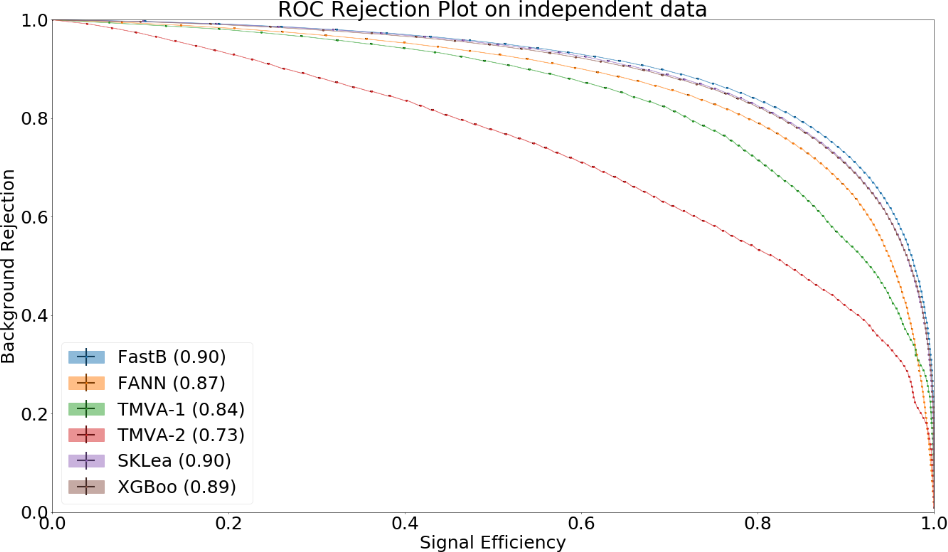

.. _mva:

MVA package
===========

Overview
--------

.. _overview_mva_package:

Main goals
^^^^^^^^^^

The mva package was introduced to provide:

- Tools to integrate mva methods in basf2
- Collection of examples for basic and advanced mva usages
- Backend independent evaluation and validation tools

The mva package is NOT:

- Yet another mva framework - Avoids reimplementing existing functionality
- A wrapper around existing mva frameworks - Tries to avoid artificial restrictions

Use cases
^^^^^^^^^

Use cases include:

- Analysis:

    - Full Event Interpretation, over 100 classifiers have to be trained without user interaction and have to be loaded from the database automatically if a user wants to apply the FEI to MC or data
    - Flavor Tagger
    - Continuum Suppression

- Tracking:

    - Track finding in CDC and VXD, classifiers should be retrained automatically using the newest MC, maybe even run-dependent, and automatically loaded and applied on MC and data during the reconstruction phase

- ECL:

    - Classification and regression tasks

- BKLM:

    - KLong ID

Interface
^^^^^^^^^

The mva package provides a basic interface in bash, C++ and python consisting of the following tools

Fitting and Inference
"""""""""""""""""""""

- basf2_mva_merge_mc
- basf2_mva_teacher
- basf2_mva_expert

Condition database
""""""""""""""""""

- basf2_mva_upload
- basf2_mva_download
- basf2_mva_available

Evaluation
""""""""""

- basf2_mva_evaluate.py
- basf2_mva_info
- basf2_mva_extract

Supported frameworks/backends
-----------------------------

FastBDT
^^^^^^^

is the default method used in basf2.
It provides a good out-of-the-box performance, is robust against over-fitting and fast in training and application.
It only supports classification and there are only a few parameters and features, hence it has less pitfalls than other methods and as a starting point this is a good choice.

TMVA
^^^^

is part of the ROOT framework and provides a multitude of different methods including BDTs, NeuralNetworks, PDF estimators, ... Classification and Regression is supported.
Advanced feature preprocessing like Decorrelation, PCA, Gaussianisation, ... are available.
Each method provides a lot of configuration options.
Often the methods are rather slow and there are bugs and pitfalls (e.g. TMVA crashes in case it encounters NaNs, has too few statistics, sometimes with negative weights, and other reasons).

FANN
^^^^

is the fast artificial neural network.
It is used in the Flavor Tagger and by the HLT people.

NeuroBayes
^^^^^^^^^^

was the default method in Belle I and widely used for a lot of analyses.
It provides a smart feature preprocessing, converges a lot faster and more robust than other neural network implementations.
In addition, it provides an analysis-pdf output which describes the importance of each feature.
However, NeuroBayes is a commercial product and is no longer supported by the company, only some minimal legacy support is available, no bug fixes, new features, ... Use it for comparison with Belle I results.

Python-based
^^^^^^^^^^^^

All frameworks which provide a python interface are supported e.g. XGBoost, SKLearn, Tensorflow, Theano.
However, only TensorFlow and Theano are installed by default, the others you can only use in your local installation by installing them using pip3.
It is possible to include these other methods in the externals as well i.e. to ship them with basf2, but you will have to give a good justification for this.
In general, these options mainly provide a playground to test new technologies e.g. deep-learning frameworks like Tensorflow and Theano.

Using the mva package
---------------------

Configuration
^^^^^^^^^^^^^

The configuration of an mva package is split into three objects:

GlobalOptions
"""""""""""""

Contains backend independent options

.. code-block:: python

    import basf2_mva
    go = basf2_mva.GeneralOptions()
    go.m_datafiles = basf2_mva.vector('train.root')
    go.m_treename = 'tree'
    go.m_identifier = 'Identifier'
    go.m_variables = basf2_mva.vector('p', 'pz', 'M')
    go.m_target_variable = 'isSignal'

SpecificOptions
"""""""""""""""

Contains backend specific options

.. code-block:: python

    sp = basf2_mva.FastBDTOptions()
    sp.m_nTrees = 100
    sp.m_shrinkage = 0.2
    fastbdt_options.m_nLevels = 3
    sp = basf2_mva.TMVAOptionsClassification()
    sp.m_config = '!H:!V:CreateMVAPdfs:BoostType=Grad:'
                  'NTrees=100:Shrinkage=0.2:MaxDepth=3'

MetaOptions
"""""""""""

Change the type of the training, this is for experts only.
You can look at the advanced examples to learn more.

Fitting / How to perform a training
^^^^^^^^^^^^^^^^^^^^^^^^^^^^^^^^^^^

You can use the MVA package via C++, Python or the command-line.
All three are nearly identical (they call the same code internally).
Lets look at an example in python:

.. code-block:: python

    import basf2_mva

    go = basf2_mva.GeneralOptions()
    go.m_datafiles = basf2_mva.vector('train.root')
    go.m_treename = 'tree'
    go.m_identifier = 'DatabaseIdentifier'
    go.m_variables = basf2_mva.vector('p', 'pz', 'M')
    go.m_target_variable = 'isSignal'

    sp = basf2_mva.FastBDTOptions()

    basf2_mva.teacher(go, sp)

The same thing can be done using the command line via::

    basf2_mva_teacher --datafiles train.root \
                      --treename tree \
                      --identifier DatabaseIdentifier \
                      --variables p pz M \
                      --target_variable isSignal \
                      --method FastBDT

The given root file has to contain the variables and target as branches.
You can write out such a file using VariablesToNtuple module of the analysis package, or a custom module if you want to train a classifier for another package than analysis.
Multiple weightfiles and wildcard expansion like it is done by the RootInput module is supported.
Look at the examples in mva/examples to learn more.

You can create the necessary data files to execute the examples (if you have some current MC files available) using ``mva/examples/basics/create_data_sample.py``

.. _basf2_mva_merge_mc:

``basf2_mva_merge_mc``: Combine signal and background MC to a single file or a train and test file
""""""""""""""""""""""""""""""""""""""""""""""""""""""""""""""""""""""""""""""""""""""""""""""""""

.. argparse::
    :filename: mva/tools/basf2_mva_merge_mc
    :func: get_argument_parser
    :prog: basf2_mva_merge_mc
    :nodefault:
    :nogroupsections:

Inference / How to apply a trained mva method onto data
^^^^^^^^^^^^^^^^^^^^^^^^^^^^^^^^^^^^^^^^^^^^^^^^^^^^^^^

Depending on your use-case there are different possibilities.
Most often you want to apply the training online (inside basf2) like it is done by the FEI or the FlavourTagger: You can use the MVAExpert module if your training is based on Particle objects of the analysis package:

.. code-block:: python

    path.add_module('MVAExpert',
                    listNames=['D0'],
                    extraInfoName='Test',
                    identifier='DatabaseIdentifier')

If you use the mva method in another context (like tracking), you have to write your own C++ or Python module to apply the training, because the MVA package cannot know how to extract the necessary features from the basf2 DataStore (in the above case based on Particle objects the VariableManager can be used for this task).

It is recommended to look at the MVAPrototype Module code to learn how to correctly implement the usage of an mva classifier.
This module can be directly be used as a template for your own classifier.
Very roughly:

1. Create a DBObjPtr to the DatabaseRepresentationOfWeightfile object, this will automatically fetch the correct weightfile from the Condition Database at runtime
2. Convert the DatabaseRepresentation into an actual weightfile and create an MVA::Expert from it
3. Extract your features from the DataStore and put them into a MVA::Dataset which you can pass to the MVA::Expert to retrieve the result of the mva method

Finally, you can also apply the MVA method onto a ROOT file using the basf2_mva_expert, either in Python

.. code-block:: python

    import basf2_mva
 
    basf2_mva.expert(basf2_mva.vector('DatabaseIdentifier'),
                     basf2_mva.vector('test.root'),
                    'tree', 'expert.root')

or in bash::

    basf2_mva_expert --identifiers DatabaseIdentifier \
                     --datafiles test.root \
                     --treename tree \
                     --outputfile expert.root

Evaluation / Validation
^^^^^^^^^^^^^^^^^^^^^^^

You can create a zip file with a LaTeX report and evaluation plots using the ``basf2_mva_evaluate.py`` tool::

    basf2_mva_evaluate.py -id DatabaseIdentifier \
                          -train train.root \
                          -data test.root \
                          -o validation.zip

The LaTeX file can also be compiled directly to PDF by passing the ``-c`` command line argument.                          
If this fails, you can transfer the ``.zip`` archive to a working LaTeX environment, unpack it there and compile 
the ``latex.tex`` with ``pdflatex`` there.

Some example plots included in the resulting PDF are:

.. _correlation:

  The correlation and importance of the features used in the training

.. _invariant_mass:

  The distribution of the features for signal and background with uncertainties

.. _comparison:

  The Receiver Operating Characteristic of several classifiers

.. _splot_combined_boosted:

  The distribution of the classifier output on training and independent test data

How to upload/download the training into the database
-----------------------------------------------------
If you don't put a suffix onto the weightfile name, the weightfile is automatically stored in your local database under the given name.
If the files ends on ``.root`` it is stored on your hard-disk.
You can upload (download) weightfiles to (from) the database using ``basf2_mva_upload`` (``basf2_mva_download``) via the shell or ``basf2_mva.upload`` (``basf2_mva.download``) via Python.
Usually new weightfiles are stored in your local database, to make the weightfiles available to all people you have to upload them to the global database, this functionality is not provided by the mva package, but by the framework itself (so if something fails here you have to talk to the database people).
Use the ``b2conditionsdb`` upload command to upload your current local database to the global database.
See :ref:`b2conditionsdb` for details.

Examples
--------

A major goal of the mva package is to provide examples for basic and advanced usages of multivariate methods.
You can find these examples in ``mva/examples``.
There are different sub-directories:

- ``mva/examples/basics`` – basic usage of the mva package: ``basf2_mva_teacher``, ``basf2_mva_expert``, ``basf2_mva_upload``, ``basf2_mva_download``, ...
- ``mva/examples/advanced`` – advanced usages of mva: hyper-parameter optimization, sPlot, using different classifiers
- ``mva/examples/python`` – how to use arbitrary mva frameworks with a python interface
- ``mva/examples/orthogonal_discriminators`` – create orthongonal discriminators with ugBoost or adversary networks
- ``mva/examples/<backend>`` – backend specific examples e.g. for tmva and tensorflow

Contributions
-------------

The `MVA/ML subgroup <https://confluence.desy.de/pages/viewpage.action?pageId=104035532>`_ is the place to go for getting involved in MVA-related projects.
If you want to contribute your are welcome to do so by creating a pull request or initiating your own project.

You can add examples if you have interesting applications of MVA, or you can add plots to the ``basf2_mva_evaluation.py`` script.

Python-based frameworks
-----------------------

You can use arbitrary mva frameworks which have a Python interface.
There is a good description how to do this in ``mva/examples/python/how_to_use_arbitrary_methods.py``

In short, there are several hook functions which are called by the 'Python' backend of the mva package.
There are sensible defaults for these hook functions implemented for many frameworks like tensorflow, theano, sklearn, hep_ml (see ``mva/scripts/basf2_mva_python_interface/``).
However, you can override these hook functions and ultimately have full control:

During the fitting phase the following happens:

the total number of events, features and spectators, and a user-defined configuration string is passed to get_model returning a state-object, which represents the statistical model of the method in memory and is passed to all subsequent calls;
a validation dataset is passed to begin_fit, which can be used during the fitting to monitor the performance;
the training dataset is streamed to partial_fit, which may be called several times if the underlying method is capable to perform out-of-core fitting;
finally end_fit is called returning a serializable object, which is stored together with the user-defined Python file in the Conditions Database, and can be used later to load the fitted method during the inference-phase. 
During the inference-phase:

the user-defined Python file is loaded into the Python interpreter and the serialized object is passed to load returning the state-object, which represents the statistical model of the method in memory;
the state-object and a dataset is passed to apply returning the response of the statistical model, usually either the signal-probability (classification) or an estimated value (regression).
It should also be noted, that your full steering file you pass to the Python backend of the mva package will be included in the weightfile, and injected into the basf2 python environment during the creation of the MVA::Expert. So if you rely on external classes or functions you can include them in your file.

Backward Compatibility
----------------------

Variable Name changed in the analysis package
^^^^^^^^^^^^^^^^^^^^^^^^^^^^^^^^^^^^^^^^^^^^^

If a variable name changed in the analysis package which you used in your training, you cannot apply the training anymore because the mva package won't find the variable in the VariableManager and you will end up with a segmentation fault.

There are two possible solutions:

Either you add an alias in your steering file to re-introduce the variable using an alias. This only works if you call the expert from python.

.. code-block:: python

    from variables import variables as v
    v.addAlias('OldName', 'NewName')

Or you change the name of the variable in the weightfile.
For this you have to save your weightfile in the .xml format

E.g. with ``basf2_mva_download`` if you saved it in the database (or ``basf2_mva_upload`` followed by download if you saved it in root previously).

Afterwards you can open the .xml file in a text-editor and change the variable name by hand.
Finally you can use ``basf2_mva_upload`` again to add the weightfile to your local database again.

Reading List
------------

This section is probably definitely outdated, better to see the `HEP-ML-Resources <https://github.com/iml-wg/HEP-ML-Resources>`_ github page instead.

In this section we collect interesting books and papers for the different algorithms and methods which can be used by Belle II.

Most of the mentioned techniques below have an example in the mva package under ``mva/examples``

General Machine Learning 
^^^^^^^^^^^^^^^^^^^^^^^^^

- Christopher M. Bishop. `Pattern Recognition and Machine Learning <http://dx.doi.org/10.1117/1.2819119>`_
- Trevor Hastie, Robert Tibshirani, and Jerome Friedman. `The Elements of Statistical Learning. <http://dx.doi.org/10.1007/978-0-387-84858-7>`_
- J. Han, M. Kamber, J. Pei. `Data Mining: Concepts and Techniques <https://doi.org/10.1145/565117.565130>`_

Focused on HEP
^^^^^^^^^^^^^^

- O. Behnke, K. Kröninger, G. Scott, T. Schörner-Sadenius. `Data Analysis in High Energy Physics: A Practical Guide to Statistical Methods <http://doi.org/10.1002/9783527653416>`_

Boosted Decision Trees
^^^^^^^^^^^^^^^^^^^^^^

Boosted decision trees are the working horse of classification / regression in HEP.
They have a good out-of-the-box performance, are reasonable fast, and robust

Original papers
"""""""""""""""

- Jerome H. Friedman. „Stochastic gradient boosting“ `<http://statweb.stanford.edu/~jhf/ftp/stobst.pdf>`_
- Jerome H. Friedman. „Greedy Function Approximation: A Gradient Boosting Machine“ `<http://statweb.stanford.edu/~jhf/ftp/trebst.pdf>`_

uGBoost
^^^^^^^

Boosting to uniformity allows to enforce a uniform selection efficiency of the classifier for a certain variable to leave it untouched for a fit

- Justin Stevens, Mike Williams 'uBoost: A boosting method for producing uniform selection efficiencies from multivariate classifiers' `<https://arxiv.org/abs/1305.7248>`_
- Alex Rogozhnikov et al. „New approaches for boosting to uniformity“. `<http://iopscience.iop.org/article/10.1088/1748-0221/10/03/T03002/meta>`_

Deep Learning (Neural Networks)
^^^^^^^^^^^^^^^^^^^^^^^^^^^^^^^

Deep Learning is the current revolution ongoing in the field of machine learning. Everything from self-driving cars, speech recognition and playing Go can be accomplished using Deep Learning. There is a lot of research going on in HEP, how to take advantage of Deep Learning in our analysis. 

Standard textbook
"""""""""""""""""

- I. Goodfellow, Y. Bengio, A. Courville. Deep Learning (Adaptive Computation and Machine Learning) available online `<http://www.deeplearningbook.org/>`_

First paper on usage in HEP (to my knowledge)
"""""""""""""""""""""""""""""""""""""""""""""

- Pierre Baldi, Peter Sadowski, and Daniel Whiteson. „Searching for Exotic Particles in High-Energy Physics with Deep Learning“ `<https://arxiv.org/abs/1402.4735>`_

Why does Deep Learning work?
""""""""""""""""""""""""""""

- Henry W. Lin, Max Tegmark, and David Rolnick. Why does deep and cheap learning work so well? `<https://arxiv.org/abs/1608.08225>`_

Famous papers by the founding fathers of Deep Learning
""""""""""""""""""""""""""""""""""""""""""""""""""""""

- Yann Lecun, Yoshua Bengio, and Geoffrey Hinton. „Deep learning“. `<https://www.cs.toronto.edu/~hinton/absps/NatureDeepReview.pdf>`_
- Yoshua Bengio, Aaron C. Courville, and Pascal Vincent. „Unsupervised Feature Learning and Deep Learning: A Review and New Perspectives“. `<https://arxiv.org/abs/1206.5538>`_

Adversarial Networks
""""""""""""""""""""""

Adversarial networks allow to prevent that a neural networks uses a certain information in its prediction

- Gilles Louppe, Michael Kagan, and Kyle Cranmer. „Learning to Pivot with Adversarial Networks“. `<https://arxiv.org/abs/1611.01046>`_

Hyperparameter Optimization
^^^^^^^^^^^^^^^^^^^^^^^^^^^

All multivariate methods have hyper-parameters, so some parameters which influence the performance of the algorithm and have to be set by the user.
It is common to automatically optimize these hyper-parmaeters using different optimization algorithms.
There are four different approaches: grid-search, random-search, gradient, bayesian

Random search
"""""""""""""

- James Bergstra and Yoshua Bengio. „Random Search for Hyper-parameter Optimization“ `<http://www.jmlr.org/papers/volume13/bergstra12a/bergstra12a.pdf>`_

Gradient-based
""""""""""""""

- Dougal Maclaurin, David Duvenaud, and Ryan Adams. „Gradient-based Hyperparameter Optimization through Reversible Learning“. `<http://jmlr.org/proceedings/papers/v37/maclaurin15.pdf>`_

Bayesian
""""""""

- Jasper Snoek, Hugo Larochelle, and Ryan P Adams. „Practical Bayesian Optimization of Machine Learning Algorithms“.  `<http://papers.nips.cc/paper/4522-practical-bayesian-optimization-of-machine-learning-algorithms.pdf>`_

sPlot
^^^^^

With sPlot you can train a classifier directly on data, other similar methods are: side-band substration and training data vs mc, both are described in the second paper below

- Muriel Pivk and Francois R. Le Diberder. „SPlot: A Statistical tool to unfold data distributions“. `<https://arxiv.org/abs/physics/0402083>`_
- D. Martschei, M. Feindt, S. Honc, and J. Wagner-Kuhr. „Advanced event reweighting using multivariate analysis“. `<http://iopscience.iop.org/article/10.1088/1742-6596/368/1/012028>`_

Machine Learning Frameworks
^^^^^^^^^^^^^^^^^^^^^^^^^^^

Websites and papers for the frameworks which are supported by the mva package

* FastBDT

  * `<https://github.com/thomaskeck/FastBDT>`_
  * Thomas Keck. "FastBDT: A speed-optimized and cache-friendly implementation of stochastic gradient-boosted decision trees for multivariate classification". `<http://arxiv.org/abs/1609.06119.>`_

* TMVA

  * `<http://tmva.sourceforge.net/>`_
  * Andreas Hoecker et al. „TMVA: Toolkit for Multivariate Data Analysis“. `<https://arxiv.org/abs/physics/0703039>`_

* FANN

  * S. Nissen. Implementation of a Fast Artificial Neural Network Library (fann). `<http://fann.sourceforge.net/fann.pdf>`_

* SKLearn

  * Website `<http://scikit-learn.org/>`_
  * F. Pedregosa et al. "Scikit-learn: Machine Learning in Python". `<http://www.jmlr.org/papers/volume12/pedregosa11a/pedregosa11a.pdf>`_

* hep_ml

  * Website `<https://arogozhnikov.github.io/hep_ml/>`_

* XGBoost

  * Website `<https://xgboost.readthedocs.io/en/latest/>`_
  * Tianqi Chen and Carlos Guestrin. "XGBoost: A Scalable Tree Boosting System". `<https://arxiv.org/abs/1603.02754>`_

* Tensorflow

  * Website `<https://www.tensorflow.org/>`_
  * Martin Abadi et al. "TensorFlow: A system for large-scale machine learning" `<https://arxiv.org/abs/1605.08695>`_

* Theano

  * Website `<http://deeplearning.net/software/theano/>`_
  * Rami Al-Rfou et al. "Theano: A Python framework for fast computation of mathematical expressions" `<https://arxiv.org/abs/1605.02688>`_

* NeuroBayes

  * M. Feindt and U. Kerzel. "The NeuroBayes neural network package" `<http://www-ekp.physik.uni-karlsruhe.de/~feindt/acat05-neurobayes>`_

Meetings
^^^^^^^^

There are regular meetings at the inter experimental LHC machine learning (IML) working group, which you can join 

`<https://iml.web.cern.ch/>`_
