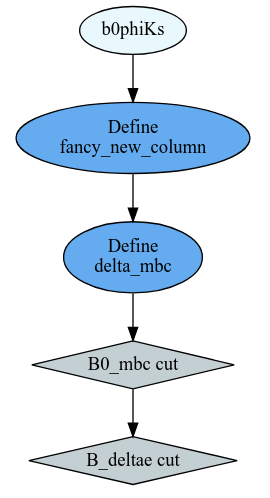

ROOT
====

RDataFrames 
---------------------------------

RDataFrames are ROOT's recommended interface to analysis.
They can interpret trees in a root file into a table-like object.

.. code:: python

   import ROOT

The ``RDataFrame`` constructor takes the name of a tree and one or more
files.

.. code:: python

   df = ROOT.RDataFrame("treename", "file.root")
   # or
   df = ROOT.RDataFrame("treename", ["file1.root", "file2.root", ...])

The location of the files can be local or remote.  

To follow this tutorial, download the ntuple from https://rebrand.ly/00vvyzg (it is the same as 
the one in the pandas tutorial) and read it:

.. code:: python

   filepath = "pandas_tutorial_ntuple.root"
   df = ROOT.RDataFrame("b0phiKs", filepath)

Inspect the contents of a tree

.. code:: python

   df.Describe()   # new in ROOT v6.26.00

.. code:: text

   Dataframe from TChain b0phiKs in file /project/agkuhr/users/dkoch/data/pandas_tutorial_ntuple.root

   Property                Value
   --------                -----
   Columns in total           50
   Columns from defines        0
   Event loops run             0
   Processing slots            1

   Column                  Type    Origin
   ------                  ----    ------
   B0_CosTBTO              Float_t Dataset
   B0_CosTBz               Float_t Dataset
   B0_ErrM                 Float_t Dataset
   B0_K_S0_ErrM            Float_t Dataset
   B0_K_S0_M               Float_t Dataset
   B0_K_S0_SigM            Float_t Dataset
   B0_M                    Float_t Dataset
   B0_R2                   Float_t Dataset
   B0_SigM                 Float_t Dataset
   B0_ThrustB              Float_t Dataset| B0_M     | B0_ErrM     | 
   +-----+----------+-------------+
   | 0   | 5.02445f | 0.0224362f  | 
   +-----+----------+-------------+
   | 1   | 5.10793f | 0.0823563f  | 
   +-----+----------+-------------+
   | 2   | 5.11921f | 0.0868997f  | 
   +-----+----------+-------------+
   | 3   | 5.36136f | 0.00969569f | 
   +-----+----------+-------------+
   | 4   | 5.30105f | 0.00664467f | 
   +-----+--
   +-----+----------+-------------+
   | Row | B0_M     | B0_ErrM     | 
   +-----+----------+-------------+
   | 0   | 5.02445f | 0.0224362f  | 
   +-----+----------+-------------+
   | 1   | 5.10793f | 0.0823563f  | 
   +-----+----------+-------------+
   | 2   | 5.11921f | 0.0868997f  | 
   +-----+----------+-------------+
   | 3   | 5.36136f | 0.00969569f | 
   +-----+----------+-------------+
   | 4   | 5.30105f | 0.00664467f | 
   +-----+----------+-------------+

Get the number of events in this tree

.. code:: python

   df.Count().GetValue()

.. admonition:: Note

   RDataFrames are *lazy* which means that operations on them are not carried out immediately, but only
   if a user requests it. For example, ``df.Count()`` does not return the number of events, but a ``Result``
   object that promises to compute the number of events in the future. The ``GetValue()`` method extracts the actual 
   result for us.

Functionality for data analysis
-------------------------------

Think of an RDataFrame as a table that you can use to compute new
columns from existing ones and filter based on various conditions.

.. code:: python

   df_filtered = df.Filter("condition", "optional name for this cut")

The condition can be passed either as a C++ expression in a string or as a python function.  
Defining new columns works in the same way:

.. code:: python

   df_new = df_filtered.Define("columnname", "c++ expression")

.. note::
    
   ``Filter`` and ``Define`` do not mutate the
   dataframe object but rather return a new RDataFrame object. These operations are
   also *lazy* meaning that nothing is computed until the result is
   actually requested by the user.

For example, we could define two new columns in our RDataFrame like this:

.. code:: python

   df = df.Define("fancy_new_column", "TMath::Power((B0_deltae * B0_et), 2) / TMath::Sin(B0_cc2)")\
          .Define("delta_mbc", "B0_M - B0_mbc")

and filter it like this:

.. code:: python

   df = df.Filter("B0_mbc>5.2", "B0_mbc cut")\
          .Filter("B0_deltae>-1", "B_deltae cut")

Because of RDataFrame's lazyness, these operations return almost
instantly. The computations are only “booked”.

.. admonition:: Exercise
  :class: exercise stacked

  Create two RDataFrames, one for Signal and one for Background only.

.. admonition:: Hint
  :class: xhint stacked toggle

  Split between signal and background using the ``B0_isSignal`` column.

.. admonition:: Solution
  :class: solution toggle

  .. code:: ipython3

    bkgd_df = df.Filter("B0_isSignal==0")
    signal_df = df.Filter("B0_isSignal==1")

Experimental new feature: Systematic variations
-----------------------------------------------

RDataFrames offer a declarative way to define systematic variations of
columns:

.. code:: python

   nominal_df = df.Vary("pt", "ROOT::RVecD{pt*0.9, pt*1.1}", ["down", "up"])
                  .Define(...)
                  .Filter(...)        
   histo = ROOT.RDF.Experimental.VariationsFor(nominal_df)
   histo["nominal"].Draw()
   histo["pt:down"].Draw("SAME")

Interoperability
----------------

The columns in RDataFrames can be converted to numpy arrays for usecases where you
don't want to continue working with ROOT.

Converting to numpy is one example of the user requesting to get the
data and therefore triggering the execution of all previously booked
computations. You can convert one or more columns at a time:

.. code:: python

   delta_mbc = df.AsNumpy(["delta_mbc"])

We get back a dict

.. code:: python

   {'delta_mbc': ndarray([-0.18043327, -0.10750389, -0.09657669, ...,  0.02187395,
           0.04272509,  0.01566553], dtype=float32)}

and can now continue to work on the result outside of the ROOT-world.

Inspection
----------

RDataFrames offer easily accessible methods to track down what actually
happened in a computation.

For example get a report of the efficiencies of each filter applied:

.. code:: python

   df.Report().Print()

.. code:: text

   B0_mbc cut: pass=327351     all=329135     -- eff=99.46 % cumulative eff=99.46 %
   B_deltae cut: pass=327349     all=327351     -- eff=100.00 % cumulative eff=99.46 %

Or get the computational graph

.. code:: python

   # visualize the computation graph
   ROOT.RDF.SaveGraph(df, "DAG.dot")

   from graphviz import Source
   Source.from_file("DAG.dot")

Scaling up
----------

RDataFrames have the (as of now still experimental) option to run
distributed on a cluster (eg. `dask <https://www.dask.org/>`_) to scale up your analysis.

.. code:: python

   import dask_jobqueue
   from dask.distributed import Client
   import ROOT
   DistRDataFrame = ROOT.RDF.Experimental.Distributed.Dask.RDataFrame

   cluster = dask_jobqueue.SLURMCluster(
      name="myanalysis",
      cores=1,
      queue="my-slurm-cluster",
      memory="4GB",
      job_extra_directives=[...],
   )
   cluster.scale(90)
   client = Client(cluster)

   df = DistRDataFrame("treename", filelist, daskclient=client)

Note that the interface to distributed RDataFrames is the same as normal RDataFrames, so there's no need to change
any analysis code.

Dask comes with a handy dashboard that shows the progress of all tasks across the workers, a flamegraph and many more monitoring utilities.

