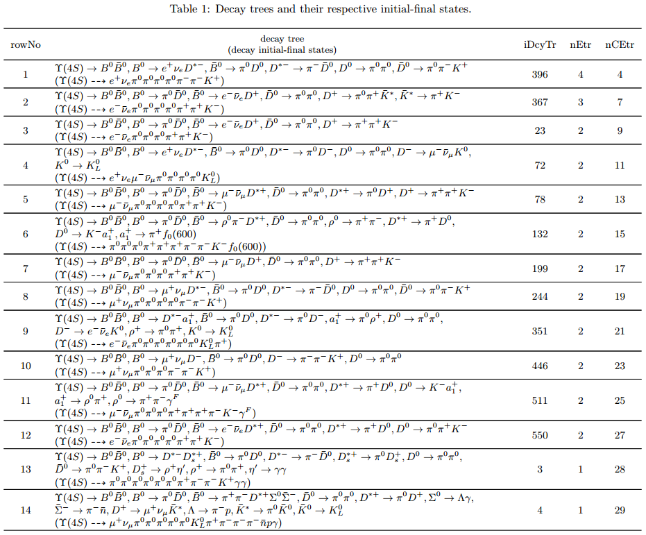

.. _onlinebook_topoana:

Topology analysis
=================

.. sidebar:: Overview
    :class: overview

    **Teaching**: 45 min

    **Additional Exercises**: 45 min

    **Prerequisites**:

        * Command Line Tutorial (Bash)

    **Questions**:

        * What's inside my MC?
        * How frequently do I have certain different decay modes in my MC?

    **Objectives**:

        * Install `TopoAna`.
	* Generate a PDF report with a lot of information about your MC.

.. tip::

   This online textbook introduces ``TopoAna`` very briefly.
   For more descriptions of the tool, please refer to the documents introduced
   in :numref:`TopologyAnalysis`.
   Please feel free to contact Xingyu Zhou (zhouxy@buaa.edu.cn) if you have any
   questions or comments on ``TopoAna`` and this online textbook.

Introduction
------------

In the data analysis of high energy physics experiments, a comprehensive
understanding of the inclusive/generic MC samples is required to select signals
with a higher efficiency and meanwhile suppress backgrounds to a lower level.
In particular, a clear knowledge of the physics processes, namely the event types,
involved in the samples is quite helpful.

With the physics process information, we can figure out the main backgrounds
(especially the peaking ones).
Then, we can optimize the selection criteria further by analyzing the differences
between the main backgrounds and the signals.
Even if it is difficult to further suppress these backgrounds, the knowledge of
their types is beneficial to estimate the systematic uncertainties associated
with them.

Sometimes, we need to search for certain processes of interests.
Mostly, signal and background events coexist in inclusive MC samples. It is
useful to differentiate them in such cases.
The identified signal events can be used to make up a signal sample in the absence
of specialized signal samples, or they can be removed to avoid repetition in the
presence of specialized signal samples.
Occasionally, we have to pick out some decay branches in order to re-weight them
according to new theoretical predictions or updated experimental measurements.

.. _topology_diagrams:

.. figure:: topoana/topology_diagrams.png
   :width: 40em
   :align: center

   Topology diagrams of (a) :math:`e^+ e^- \to J/\psi`, :math:`J/\psi \to \rho^+
   \pi^-`, :math:`\rho^+ \to \pi^+ \pi^0`, :math:`\pi^0 \to \gamma \gamma` and
   (b) :math:`e^+ e^- \to \Upsilon(4S)`, :math:`\Upsilon(4S) \to B^0 \bar{B}^0`,
   :math:`B^0 \to K_S^0 J/\psi`, :math:`\bar{B}^0 \to \mu^- D^{*+} \nu_{\mu}`,
   :math:`K_S^0 \to \pi^+ \pi^-`, :math:`J/\psi \to e^+ e^-`, :math:`D^{*+} \to
   D^0 \pi^+`, :math:`D^0 \to \pi^0 \pi^+ K^-`, :math:`\pi^0 \to \gamma \gamma`.

Processes in high energy physics can be visualized with topology diagrams.
As an example, :numref:`topology_diagrams` shows the topology diagrams of two
typical physics processes occurring at :math:`e^+e^-` colliders.
From the figure, the hierarchies of the processes and the relationships among
the particles are clearly illustrated with the diagrams.
Though the complexities of topology diagrams vary with physics processes, there
is only one diagram corresponding to each process.
For this reason, we refer to the physics process information/analysis mentioned
thereinbefore as topology information/analysis hereinafter.

Since the raw topology truth information of inclusive MC samples is counter-intuitive,
diverse, and overwhelming, it is difficult for analysts to check the topology
information of the samples directly.
To help them do the checks quickly and easily, a topology analysis program called
``TopoAna`` is developed with ``C++``, ``ROOT``, and ``LaTeX``.

Basics of the program
---------------------

The input of the program is one or more root files including a ``TTree`` object
which contains the raw topology truth information of the inclusive MC samples
under study.
To be specific, the information in each entry of the ``TTree`` object consists
of the following three ingredients associated with the particles produced in an
event of the samples: **the number of the particles**, **the PDG codes of the
particles**, and **the mother indices of the particles**.

.. note::

   1. The particles do not include the initial state particles (:math:`e^+` and
      :math:`e^-` in the Belle II experiment), which are default and thus omitted.

   2. The indices of particles are integers starting from zero (included) to the
      number of particles (excluded); they are obvious and hence not taken as an
      input ingredient for topology analysis.

Fundamentally, the program resolves counter-intuitive, diverse, and overwhelming
input data

.. _input_data:

into highly readable symbolic expressions of physics processes

.. _physics_process:

.. tip::

   * Here, the decay branches in the process are placed into two blocks in order
     to make full use of the page space.

   * In both blocks, the first, second, and third columns are the indices, symbolic
     expressions, and mother indices of the decay branches.

   * Notably, all the decay branches of :math:`\pi^0 \to \gamma \gamma` are omitted
     in order to make the process look more concise.

Generally, the functionalities of the program are as follows.

  1. The program recognizes, categorizes, and counts physics processes in each
     event of the samples.

  2. It tags the physics processes in the corresponding entry of the output root
     files.

     .. tip:: Except for the tags, the input ``TTree`` object in the output root
              files is entirely the same as that in the input root files.

  3. After processing the events, the program exports the obtained topology
     information at the sample level (topology maps) to the output plain text,
     tex source, and pdf files.

    .. tip::

       * Although the files are in different formats, they have the same
         information.

       * The pdf file is the easiest to read. It is converted from the tex source
         file by the ``pdflatex`` command.

       * The plain text file is convenient to be checked with text processing
         commands as well as text editors.

.. note::

   Below are some general remarks on the relationship between the ``TopoAna``
   program and the :ref:`mcmatching` module in ``basf2``, namely
   :b2:mod:`MCMatcherParticles`.

     1. As we introduce in :numref:`TopologyAnalysis`, ``TopoAna`` is an offline
        tool independent of ``basf2``. It gets the human-friendly topology
        information on its own from the raw MC truth information obtained with
        the interface ``MCGenTopo``. Obviously, it does not rely on
        :b2:mod:`MCMatcherParticles`.

     2. On the other hand, in order to analyze some backgrounds more effectively,
        a series of newly developed parameters in a few functionality items in
        ``TopoAna`` can make use of the MC matching results obtained with
        :b2:mod:`MCMatcherParticles`. For more details, please see Section 5.2.3
        (titled **Reconstruction restrictions on truth particles**) in the user
        guide we introduce in :numref:`TopologyAnalysis`.

     3. In addition, there are some functionality overlaps between ``TopoAna``
        and :b2:mod:`MCMatcherParticles`. If highly needed, in the future we could
        also develop some new functionalities in ``TopoAna`` for the cross-checks
        of the MC matching results obtained with :b2:mod:`MCMatcherParticles`.

Install the software
--------------------

Please follow the steps below to install the software.

  1. Set up ``basf2`` (see :numref:`cvmfs_setup`) if you have not

     .. note::

        This guarantees you have ``ROOT`` installed in your environment.
        It does not mean ``TopoAna`` is a software based on ``basf2``.
        Instead, the software is only based on ``ROOT``.

  2. ``cd yourDirectoryForTopoAna``

  3. Clone the ``TopoAna`` repository from Stash with
     ``git clone ssh://git@stash.desy.de:7999/~zhouxy/topoana.git topoana``

  4. ``cd topoana``

  5. Switch to the latest release with ``git checkout vxx-yy-zz``

     .. note::
        Please replace it with the concrete version number, which you can find
        with ``git tag | tail -1``.

  6. Configure the package path with ``./Configure``

     .. note::

        You need to manually set up the environment variable ``PATH`` according
        to the guidelines printed out by the command.

  7. Compile and link the program with ``make``

     .. tip::

        The installation succeeds if you see the following line: ``"topoana.exe"
        installed successfully!``

  8. Set up the experiment name with ``./Setup Belle_II``

     .. note::

        If you want to try the program with examples under the directory
        ``examples``, please execute ``./Setup Example``.

Get the input data
------------------

As we mention in :numref:`TopologyAnalysis`, ``MCGenTopo`` is the interface of
``basf2`` to ``TopoAna``.
In the following we introduce the steps to get the input data to ``TopoAna``
with the interface.

  1. Append the following statement at the beginning part of your python
     steering script

     .. code-block:: python

        from variables.MCGenTopo import mc_gen_topo

  2. Use the parameter function ``mc_gen_topo(n)`` as a list of variables in the
     steering function ``variablesToNtuple`` as follow

     .. code-block:: python

        variablesToNtuple(particleList, yourOwnVariableList + mc_gen_topo(n), treeName, fieName, path)

     Here, ``n`` is the number of ``MCGenPDG_i``/``MCGenMothIndex_i`` variables,
     and its default value is 200.

  3. Run your python steering script with ``basf2``

Below is an example of the python steering script.

.. literalinclude:: topoana/MCGenTopo.py
   :language: python

.. note::

   In practice, we usually use the interface ``MCGenTopo`` together with detailed
   particle lists and variable lists for specific physics analyses.
   For the sake of simplification, we do not include the latter in this script.

After the following steps:

  1. ``mkdir test`` under the ``TopoAna`` package.

  2. ``cd test``

  3. Create a new python steering script named ``MCGenTopo.py``, and copy and
     paste the content of the script above into it.

  4. ``basf2 MCGenTopo.py``

you get a root file ``MCGenTopo.root`` containing a ``TTree`` object ``MCGenTopo``,
which in return contains the MC truth information for topology analysis.
With the ``C/C++`` interpreter of ``ROOT``, you can check and see the MC truth
information as follows.
Notably, the comments on the right side are the explanations on the command lines
and the key variables.

.. code-block:: none

   [zhouxy@ccw04 test]$ root -l                         // Get into the interpreter
   root [0] TFile f("MCGenTopo.root")                   // Open the root file
   (TFile &) Name: MCGenTopo.root Title:
   root [1] f.ls()                                      // List the objects in the root file
   TFile**         MCGenTopo.root
    TFile*         MCGenTopo.root
     KEY: TTree    MCGenTopo;1
   root [2] MCGenTopo->Show(0)                          // Show the first entry of the TTree object
   ======> EVENT:0
    __experiment__  = 0
    __run__         = 0
    __event__       = 1
    __production__  = 0
    __weight__      = 1
    nMCGen          = 59                                // nMCGen is the number of the particles
    MCGenPDG_0      = 300553
    MCGenMothIndex_0 = nan
    MCGenPDG_1      = 511
    MCGenMothIndex_1 = 0
    MCGenPDG_2      = -511                              // MCGenPDG_i is the PDG code
    MCGenMothIndex_2 = 0                                              of the i^th particle

    ...

    MCGenPDG_197    = nan                               // MCGenMothIndex_i is the mother index
    MCGenMothIndex_197 = nan                                                of the i^th particle
    MCGenPDG_198    = nan
    MCGenMothIndex_198 = nan
    MCGenPDG_199    = nan
    MCGenMothIndex_199 = nan
   root [3] .q                                          // Quit the interpreter

.. tip::

   Normally, the input data contain all the topology information of the samples.
   With the data, all kinds of topology analysis with ``TopoAna`` can be performed.

Prepare the card file
---------------------

To carry out topology analysis desired in your work, you have to provide some
necessary input, functionality, and output information to the program.
The information is required to be filled in the setting items designed and
implemented in the program, and the items have to be put in a plain text file
named with a suffix ``.card``.

.. note::

   * A template card file ``template_topoana.card`` can be found in the ``share``
     directory of the ``TopoAna`` package.

   * For the concision of your own card file, it is recommended to **just copy
     the setting items you need from the template card file and paste them to
     your own card file**.

   * Since there are plenty of setting items in the template card file, it is
     **NOT** recommended to create your own card file **simply by copying and
     revising the whole template card file**.

Below is an example of the card file.

.. code-block:: none

   % Names of input root files
   {
     MCGenTopo.root
   }

   % TTree name
   {
     MCGenTopo
   }

   % Component analysis --- decay trees
   {
     Y     100
   }

   % Common name of output files (Default: Name of the card file)
   {
     topoana
   }

In the card file, ``#``, ``%``, and the pair of ``{`` and ``}``, are used for
commenting, prompting, and grouping, respectively.
The first two items defines the input, the third one specifies the functionality,
and the last one sets the name of the program's output.

Below are some detailed explanations on these setting items.

  * The first item sets the names of the input root files.

    .. tip::

       1. The names ought to be input one per line without tailing characters,
          such as comma, semicolon, and period.

       2. In the names, both the absolute and relative paths are allowed and
          wildcards ``[]``, ``?``, and ``*`` are supported, just like those in
          the root file names input to the method ``Add()`` of the class ``TChain``.

  * The second item specifies the ``TTree`` name.

    .. note::

       Here, the ``TTree`` object should contain the following variables:
       ``nMCGen``, ``MCGenPDG_i``, and ``MCGenMothIndex_i`` (``i = 0, 1, 2 ...``).

  * The third item sets the basic functionality of the program, namely the
    component analysis over decay trees.
    With the second parameter ``100`` in the item, the maximum number of output
    components is set to 100.

    .. note::

       1. The item can be replaced or co-exist with other functionality items.

       2. At least one functionality item has to be specified explicitly in the
          card file, otherwise the program will terminate soon after its start
          because no topology analysis task to be performed is set up.

  * The fourth item specifies the common name of the output files.
    The files will be described in the next part of this section.
    Though in different formats, they are denominated with the same name for the
    sake of uniformity.

    .. tip::

       * This item is optional, with the name of the card file as its default
         input value.

       * It is a good practice to first denominate the card file with the desired
         common name of the output files and then remove this item or leave it
         empty.

Run the program
---------------

With the card file, one can execute the program with the command line
``topoana.exe cardFileName``, where the argument ``cardFileName`` is optional and
its default value is ``topoana.card``.

.. tip:: You can try to execute ``topoana.exe --help`` to see other optional
         arguments supported in the command line.

After the following steps:

  1. Create a new card file named ``topoana.card`` under the ``test`` directory
     we made above, and copy and paste the content of the card file above into it.

  2. ``topoana.exe topoana.card``

     .. tip::

        * Since the name of the card file is the default one, you can just execute
          ``topoana.exe``.

        * If you encounter the following error,

          .. code-block:: none

             topoana.exe: error while loading shared libraries: libCore.so: cannot open shared object
             file: No such file or directory

          setting up ``basf2`` before executing the command solves the problem,
          in cases that you installed ``TopoAna`` in the ``basf2`` environment
          previously.

you can get the following four output files: ``topoana.txt``, ``topoana.tex``,
``topoana.pdf``, and ``topoana.root``.
As we mention above, the program outputs the topology maps to the first three
files.
Although in different formats, the three files have the same information.
You can check and see them.

.. tip::

   If you are working on a remote server, you have two options to take a look at
   the pdf file:

     1. Copy the pdf file to your computer with ``scp`` (see :ref:`onlinebook_ssh`),

     2. Start a jupyter server with ``jupyter notebook`` and open the pdf file
        in the browser with the web interface (see :ref:`onlinebook_python`).

Below is only the screenshot of the first part of the table in the pdf file.

.. _decay_trees:

The column headers expressed with abbreviations are explained as follows:

.. tip::

   * ``rowNo`` --- row number
   * ``iDcyTr`` --- index of decay tree
   * ``nEtr`` --- number of entries
   * ``nCEtr`` --- number of cumulative entries

.. note::

   1. The values of ``iDcyTr`` are assigned from small to large in the program
      but listed according to the values of ``nEtr`` from large to small in the
      table. This is the reason why they are not in natural order like the
      values of ``rowNo``.

   2. Considering :math:`\pi^0` has a very large production rate and approximatively
      99\% of it decays to :math:`\gamma \gamma`, the program is designed to discard
      the decay :math:`\pi^0 \to \gamma \gamma` by default at the early phase of
      processing the input data. As a result, :math:`\pi^0 \to \gamma \gamma`
      does not show itself in the table.

In the table, ``iDcyTr`` is the topology tag for decay trees.
Thus, it is also saved in the ``TTree`` object of the output root file.
With the ``C/C++`` interpreter of ``ROOT``, you can check it as follow and see
it at the end of the code block.
Similarly, the right side presents the explanations on the command lines and
the key variables.

.. code-block:: none

   [zhouxy@ccw04 test]$ root -l                         // Get into the interpreter
   root [0] TFile f("MCGenTopo.root")                   // Open the root file
   (TFile &) Name: MCGenTopo.root Title:
   root [1] f.ls()                                      // List the objects in the root file
   TFile**         MCGenTopo.root
    TFile*         MCGenTopo.root
     KEY: TTree    MCGenTopo;1
   root [2] MCGenTopo->Show(0)                          // Show the first entry of the TTree object
   ======> EVENT:0
    __experiment__  = 0
    __run__         = 0
    __event__       = 1
    __production__  = 0
    __weight__      = 1
    nMCGen          = 59                                // nMCGen is the number of the particles
    MCGenPDG_0      = 300553
    MCGenMothIndex_0 = nan
    MCGenPDG_1      = 511
    MCGenMothIndex_1 = 0
    MCGenPDG_2      = -511                              // MCGenPDG_i is the PDG code
    MCGenMothIndex_2 = 0                                              of the i^th particle

    ...

    MCGenPDG_197    = nan                               // MCGenMothIndex_i is the mother index
    MCGenMothIndex_197 = nan                                                of the i^th particle
    MCGenPDG_198    = nan
    MCGenMothIndex_198 = nan
    MCGenPDG_199    = nan
    MCGenMothIndex_199 = nan
    iDcyTr          = 0                                 // This is the newly added topology tag!
   root [3] .q                                          // Quit the interpreter

.. tip::

   The topology tag ``iDcyTr`` can be used to pick out the entries of specific
   decay trees and then examine the distributions of the other quantities over
   the decay trees.
   This is an important application of topology analysis.

Exercises
---------

The example above only introduces the basic usage of ``TopoAna``.
You can refer to the documents we introduce in :numref:`TopologyAnalysis` for
more descriptions of the tool.
At the end of this online textbook, we provide the following six exercises for
you to further explore the usage of ``TopoAna``.
You will benefit a lot when you accomplish these exercises.
To do these exercises (except for the first one), you need to look up the proper
setting items in the quick-start tutorial or the user guide we introduce in
:numref:`TopologyAnalysis`, add them to the card file, and re-run the program.

.. admonition:: Exercise 1
   :class: exercise stacked

   In the example above, we execute ``basf2 MCGenTopo.py`` and ``topoana.exe
   topoana.card`` in two steps. This is a regular practice and does not take
   too much efforts. However, sometimes you may want to execute the two command
   lines in one step. Could you figure out a way to do this?

.. admonition:: Hint
   :class: toggle xhint stacked

   Use the ``system`` function of the ``os`` module in your python steering script.

.. admonition:: Solution
   :class: toggle solution stacked

   Reivse your python steering script by adding ``import os`` to the end of its
   preamble and appending ``os.system('topoana.exe topoana.card')`` at its end,
   and then run the script with ``basf2``.

   Below is an example of the revised script.

   .. literalinclude:: topoana/topoana.py
      :language: python

.. admonition:: Extension
   :class: toggle xhint

   Could you think of another way to do this? For example, with a shell script?

.. admonition:: Exercise 2
   :class: exercise stacked

   Try to examine the top 30 decay branches of :math:`B^{0}` and all the decay
   branches of :math:`D^{*+}` in the input sample.

.. admonition:: Hint
   :class: toggle xhint stacked

   * See Section 3 in the quick-start tutorial for the introduction of the
     setting item.
   * See Section 3.3 in the user guide for the description of the setting item.

.. admonition:: Solution
   :class: toggle solution stacked

   Add the following setting item to the card file, re-run the program, and
   check the changes of the output files.

   .. code-block:: none

      % Component analysis --- decay branches of particles
      {
        B0         B0        30
        D*+        Dsp
      }

.. admonition:: Extension
   :class: toggle xhint

   * See Section 3 in the user guide for the description of other similar
     setting items.

.. admonition:: Exercise 3
   :class: exercise stacked

   Try to identify the decay branches :math:`B^{0} \rightarrow \pi^{0} \bar{D}^{0}`
   and :math:`\bar{B}^{0} \rightarrow \mu^{-} \bar{\nu}_{\mu} D^{*+}` in the input
   sample.

.. admonition:: Hint
   :class: toggle xhint stacked

   * See Section 4 in the quick-start tutorial for the introduction of the setting
     item.
   * See Section 4.4 in the user guide for the description of the setting item.

.. admonition:: Solution
   :class: toggle solution stacked

   Add the following setting item to the card file, re-run the program, and check
   the changes of the output files.

   .. code-block:: none

      % Signal identification --- decay branches
      {
        B0 --> pi0 anti-D0                    &       B2pi0D0bar
        anti-B0 --> D*+ mu- anti-nu_mu        &       B2munuDsp
      }

.. admonition:: Extension
   :class: toggle xhint

   * See Section 4 in the user guide for the description of other similar setting
     items.

.. admonition:: Exercise 4
   :class: exercise stacked

   In the previous example and the above two exercises, we did not consider charge
   conjugation, which is an important concept in high energy physics.
   In this exercise, try to process the charge conjugate particles, decay branches,
   and decay trees together.

.. admonition:: Hint
   :class: toggle xhint stacked

   * See Section 5 in the quick-start tutorial for the introduction of the setting
     item.
   * See Section 5.2.2 in the user guide for the description of the setting item.

.. admonition:: Solution
   :class: toggle solution stacked

   Add the following setting item to the card file, re-run the program, and check
   the changes of the output files.

   .. code-block:: none

      % Process charge conjugate objects together (Two options: Y and N. Default: N)
      {
        Y
      }

.. admonition:: Extension
   :class: toggle xhint

   * See Section 5.2 in the user guide for the description of other similar
     setting items.

.. admonition:: Exercise 5
   :class: exercise stacked

   Try to impose some cuts to select events. For example, impose one cut
   to select only the events with ``nMCGen>=20 && nMCGen<=40``.

.. admonition:: Hint
   :class: toggle xhint stacked

   * See Section 5.1.1 in the user guide for the description of the setting
     item.

.. admonition:: Solution
   :class: toggle solution stacked

   Add the following setting item to the card file, re-run the program, and
   check the changes of the output files.

   .. code-block:: none

      % Cut to select entries
      {
        nMCGen>=20 && nMCGen<=40
      }

.. admonition:: Extension
   :class: toggle xhint

   * See Section 5.1 in the user guide for the description of other similar
     setting items.

.. admonition:: Exercise 6
   :class: exercise stacked

   Try to remove the input ``TBranch`` objects ``nMCGen``, ``MCGenPDG_i``, and
   ``MCGenMothIndex_i`` (``i = 0, 1, 2 ...``) from the output root files before
   the program terminates.

.. admonition:: Hint
   :class: toggle xhint stacked

   * See Section 5.3.2 in the user guide for the description of the setting item.

.. admonition:: Solution
   :class: toggle solution stacked

   Add the following setting item to the card file, re-run the program, and check
   the changes of the output files.

   .. code-block:: none

      % Remove input tbranches from output root files (Two options: Y and N. Default: N)
      {
        Y
      }

.. admonition:: Extension
   :class: toggle xhint

   * See Section 5.3 in the user guide for the description of other similar
     setting items.

.. include:: ../lesson_footer.rstinclude

.. topic:: Author(s) of this lesson

   Xing-Yu Zhou
