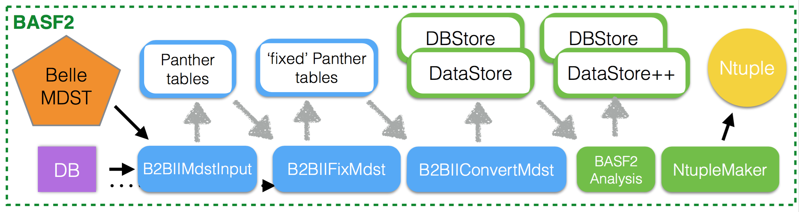
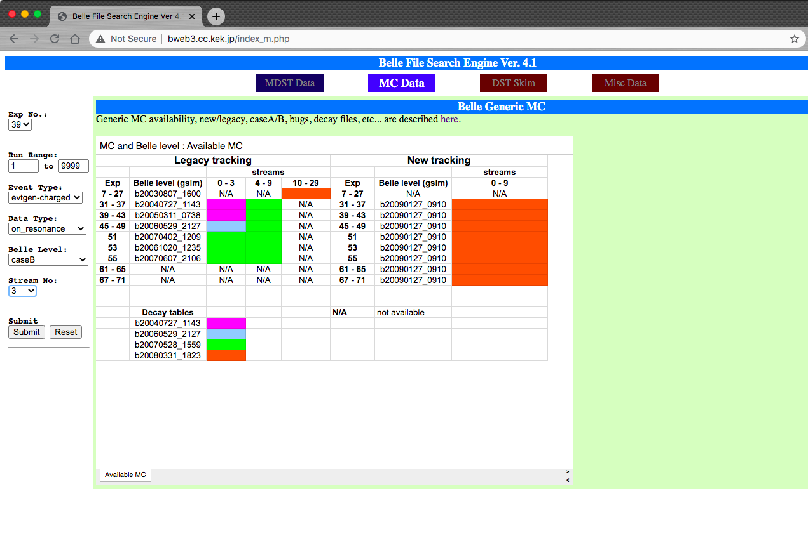
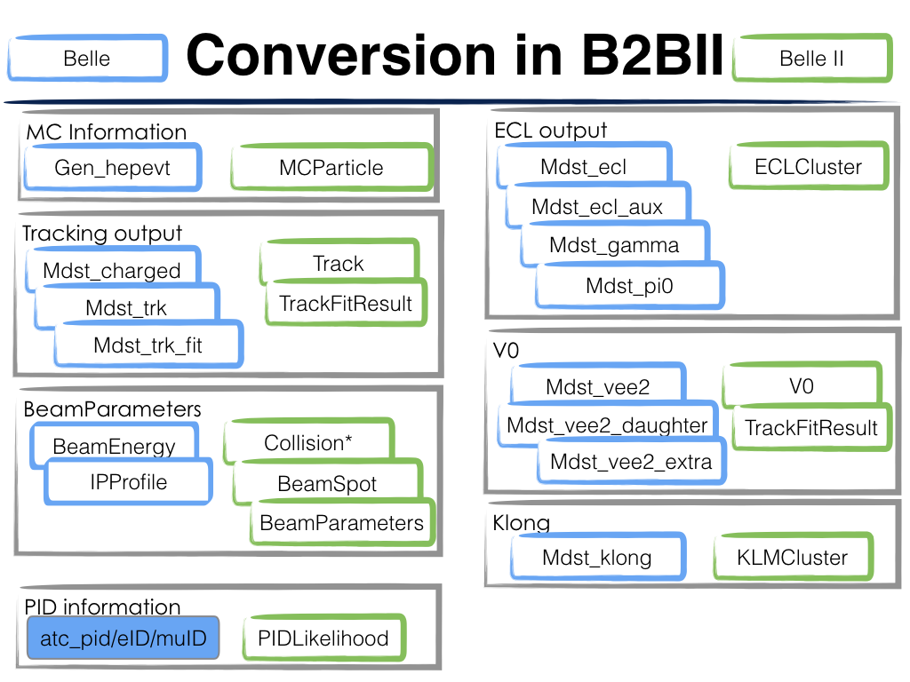

.. _onlinebook_b2bii:

B2BII
=====

.. sidebar:: Overview
   :class: overview

   **Teaching**: 30 min

   **Exercises**: 60 min

   **Prerequisites**:

       * First steering file
       * Batch submission

   **Questions**:

       * Can I use basf2 to analysis Belle data?
       * Why can't I use the same basf2 particle lists and variables in my b2bii analysis?

   **Objectives**:

       * Process Belle data with basf2

The ``b2bii`` package in basf2 converts Belle MDST files (basf data format) to
Belle II MDST (basf2 data format). This enables performing physics analysis
using data collected with Belle detector with the analysis software and
algorithms developed for the analysis of data collected with the Belle II
detector. It allows for estimation and validation of
performances of various advanced algorithms being developed for
Belle II
(such as Full Event Interpretation, Flavour Tagger, Tag Vertex, ...).

B2BII converter
---------------
The b2bii convert reads and converts Belle MDST within basf2, and
the converted data can be then analysed within the same job, without any
intermediate steps.

The workflow is illustrated in this figure:

* Read Belle MDST file.
* Apply momentum or energy corrections in the objects.
* Save objects in basf2 format
* Time for basf2 analysis!

MC samples
----------
As the Belle detector geometry is not implemented in basf2, one needs to either
use the official Belle MC samples or generate own signal MC using basf.
The information of generating Belle MC can be found
`here <https://belle.kek.jp/secured/wiki/doku.php?id=software%3Amcprod_scripts>`__

.. rubric:: Generic MC

Generic MC is the official MC samples at Belle, which was generated with
run-dependent beam background. There are multiple ``streams`` of these samples,
and each ``stream`` contains the same amount of events as present in the real
Belle data.

But which types of MC samples are exactly there?
Similar to Belle II MC, there are also different categories of Belle MC:

* Generic :math:`B` samples : charged (:math:`B^+ B^-`) and mixed (:math:`B^{0}\overline{B}^{0}`)
* Continuum samples  : uds, charm
* Y(5S) samples      : bsbs, nonbsbs

Generic :math:`B` samples only contain decay modes with :math:`b \to c` quark
transitions, and have been generated based on the decay tables at

.. code-block::

   /sw/belle/belle/b20090127_0910/share/data-files/evtgenutil/DECAY.DEC.

.. rubric:: How to find Generic MC samples?

You can find the sample(s) you want through
`Belle File Search Engine <http://bweb3.cc.kek.jp/>`_

.. warning::
   `Belle File Search Engine <http://bweb3.cc.kek.jp/>`_ is only
   accessible within KEK domain or via VPN. Or look in the :ref:`onlinebook_ssh`
   tutorial for a way to access it via SSH forwarding.

   The Belle File Search Engine

By specifying ``Exp No``, ``Event Type``, ``Data Type``, and ``Stream No``,
``Event Type`` means different MC types (charged, mixed, uds, .. ).
``Data Type`` is for different energy runs (on-resonance, off-resonance, ...).
In total there are 10 streams of Generic :math:`B` samples and 6 streams of
continuum samples.

You can either use the file list (physical path) or URL as input file list for
b2bii jobs.

.. note::
   `Belle File Search Engine <http://bweb3.cc.kek.jp/>`_ is also
   for data files.

.. seealso::

   More information about official MC and data can be found
   `here <https://belle.kek.jp/secured/wiki/doku.php?id=software:data_search>`__

.. rubric:: Rare MC

Just from this name you can guess that this type of MC aims for
rarer processes, such as :math:`b \to u \ell \nu`, :math:`e^+ e^- \to \tau^+ \tau^-`...

Rare :math:`B` MC was generated with an experiment-dependent beam
energy, but not run-dependent (i.e. The same beam energy and IP profile in
the same experiment).

The location of those special MC files can be found
`here <https://belle.kek.jp/secured/wiki/doku.php?id=software:rare_mc_search>`__.

.. rubric:: Signal MC

As there is no Belle detector description, you can only use basf to produce
signal MC samples.

Now we will learn how to use the ``mcproduzh`` package to generate signal MC in Belle.
This package was developed by "U"shiroda-san, A. "Z"upanc, and "H"orii-san, and
it consists of generation, simulation, and reconstruction based on ``evtgen`` and
``gsim`` scripts (``gsim`` is Belle slang for the simulated detector response
that results from the use of ``Geant3`` within the Belle analysis software
framework ``basf`` – the output of ``gsim`` scripts are Belle mdst files).

It will create MC samples for a list of experiments, normalized by their
:math:`N(B\overline{B})` or integrated luminosity.

The beam energy, IP profile, and detector configuration of this MC will be
experiment-dependent, but not run-dependent.
Moreover, RunNo for these events will be set to 0, hence it doesn't
work for off-resonance or :math:`\Upsilon(nS)`.

First step: copy the file and unzip it

.. code-block:: bash

   cp /home/belle/capid/public/B2SKW/mc/mcproduzh.tar.gz your_working_directory
   tar -zxvf mcproduzh.tar.gz

There will be two directories ``evtgen`` and ``gsim``, and one file ``READER``.

Second step: generate events according to a decay table

Go to your evtgen directory

.. code-block:: bash

   cd mcproduzh/evtgen

   ./runEvtgen nBB.txt [user-decay-table].dec [module-param-config].conf \
      [TotalNomberOfEvents] [EventsPerJob]

``[module-param-config].conf`` is for evtgen module configuration setting.
There are config setting examples in the package. For B analysis,
just choose ``Y4S.conf`` for your jobs.

In this step, you will get ``*.gen`` files stored in the
``mcproduzh/evtgen/gen`` directory.

Finally, run the simulation and produce the mdst file.
Go to gsim directory

.. code-block:: bash

   cd mcproduzh/gsim/

   ./runGsimReco.csh "[absolutePathToEvtgenGeneratorFiles/]"

.. warning::

   The path to the evtgen files has to be an absolute path!

Now you have MDST files produced in the ``mcproduzh/gsim/mdst/`` directory.

.. admonition:: Exercise
   :class: exercise stacked

   Try to generate a MC sample with 1000
   :math:`B^{+} \to \overline{D}^{0}(\to K^{+} \pi^{-}) \pi^{+}` events.

.. admonition:: Solution
   :class: toggle solution

   Generation:

   .. code-block:: bash

      cd <your_working_directory>/mcproduzh/evtgen
      ./runEvtgen nBB-Y4S.txt BptoD0pip-D0toKpi.dec Y4S.conf 1000 1000

   Simulation:

   .. code-block:: bash

      cd ../gsim
      ./runGsimReco.csh <your_working_directory>/mcproduzh/evtgen/gen/

More information about MC can be found
`here <https://belle.kek.jp/secured/wiki/doku.php?id=software%3Amcprod_scripts>`__.

Analysis with b2bii
-------------------
With Belle MDST in hand, you can use it for your first b2bii analysis.
It is very simple, just replace `inputMdst` in your script with two
simple lines:

.. code-block:: python

   from b2biiConversion import convertBelleMdstToBelleIIMdst
   convertBelleMdstToBelleIIMdst(inputfile, path=mypath)

Now we can use basf2 and analysis tools in basf2 to perform analyses
over Belle MDST files.

The relations between basf and basf2 objects are shown in this figure:

However, there are still many differences between the Belle detector and the
Belle II detector, as well as basf and basf2.
Therefore, we can't simply use the same basf2 steering files, small
modifications are needed.

.. _Charged_Final_State_Particles:
.. rubric:: Charged Final State Particles

basf and basf2 use different Helix parameterisations, however there exist a well
defined transformation from one parameterisation to the other.
Belle MDST stores in addition to the five helix parameters also the reference
point (or pivot point), which is assumed to be always point ``(0,0,0)`` in the
case of Belle II MDST.

Despite the different parameterisations, charged final state particles can still
be reconstructed using `fillParticleList` function in basf2.
But due to the different definition, as well as detector, it is not
recommended to use Belle II style PID in b2bii.

basf provided three different packages for PID:

* atc_pid (KID) to separate kaons and pions, but also used for proton id
* eID (electron ID) to separate electrons from hadrons
* muid (muon ID) to separate muons from hadrons

Each of them in its own way combined information collected from various
subdetector systems (CDC, ACC, TOF, ECL, KLM). The combination of individual
likelihoods from each sub detector system is in some cases (eID) combined
with the usage of external information, such as a priori probabilities of
each particle type that is read from the Belle DB. Due to this fact the
Belle-like PID probabilities can not be reproduced in basf2 from the raw
likelihoods.

Alternatively, we can use the following predefined Belle-style PID variables to
reproduce them:

   +------------------------------+------------------+
   | Separation                   | basf2            |
   +==============================+==================+
   | Kaon vs pion                 | atcPIDBelle(3,2) |
   +------------------------------+------------------+
   | electron vs hadron           | eIDBelle         |
   +------------------------------+------------------+
   | muon likelihood              | muIDBelle        |
   +------------------------------+------------------+
   | muon likelihood quality flag | muIDBelleQuality |
   +------------------------------+------------------+

.. admonition:: Exercise
   :class: exercise stacked

   Try to create a list of :math:`K^{+}` with :math:`\text{KID}>0.6`,
   and another list of :math:`\pi^{+}` with :math:`\text{KID}<0.4`.

.. admonition:: Solution
   :class: toggle solution

   .. code-block:: python

      import basf2
      import modularAnalysis as ma

      mypath = basf2.create_path()
      ma.fillParticleList('K+:sig', 'atcPIDBelle(3,2)>0.6', path=mypath)
      ma.fillParticleList('pi+:sig', 'atcPIDBelle(3,2)<0.4', path=mypath)

.. rubric:: Neutral Final State Particles

Belle MDST has two additional data types: ``mdst_gamma`` and ``mdst_pi0``,
for which there exist no equivalent data type in the Belle II MDST format.
In other words, photons and :math:`\pi^0` particles are already created in basf.
During the conversion, b2bii converter by default creates ``gamma:mdst`` and ``pi0:mdst``.

.. warning::
   Don't use `fillParticleList` to create photon candidates and
   don't reconstruct :math:`\pi^0` candidates from pairs of two photons by yourself.

.. admonition:: Exercise
   :class: exercise stacked

   Reconstruct the decay :math:`D^0 \to K^{-} \pi^{+} \pi^{0}` with mass
   between 1.7 to 2.0 GeV in a b2bii analysis.

.. admonition:: Hint
   :class: toggle xhint stacked

   Always use premade particle lists for neutrals!

.. admonition:: Solution
   :class: toggle solution

   .. code-block:: python

      ma.reconstructDecay('D0:Kpipi0 -> K-:sig pi+:sig pi0:mdst', '1.7 < M < 2.0', path=mypath)

.. rubric:: V0 Particles

As mentioned in :ref:`Charged_Final_State_Particles`, all charged tracks are
parametrised with a helix with the reference point set to ``(0,0,0)`` in basf2.
This is not optimal in the case of ``V0s`` whose decay vertices can be far away
from the origin.
Therefore, all V0 candidates from the ``Mdst_Vee2`` table in basf are converted to
``Particles`` and saved in the particle lists ``K_S0:mdst``, ``Lambda0:mdst``,
and ``gamma:v0mdst``.

The created particles have momentum and decay vertex position set to values
given in Belle's ``Mdst_Vee2`` table and their daughters particles with momentum
and position at the pivot equal to V0 decay vertex.
In addition, the quality indicators for :math:`K_{S}^{0}` and
:math:`\Lambda^{0}` can be used by simply calling :b2:var:`goodBelleKshort` and
`goodBelleLambda`, respectively.

.. admonition:: Exercise
   :class: exercise stacked

   Select ``good Kshort`` from ``K_S0:mdst`` list.

.. admonition:: Hint
   :class: toggle xhint stacked

   Use `cutAndCopyList` to select candidates from an existing list.

.. admonition:: Solution
   :class: toggle solution

   .. code-block:: python

      ma.cutAndCopyList('K_S0:good', 'K_S0:mdst', cut='goodBelleKshort', path=mypath)

.. rubric:: :math:`K_{L}^{0}`

``KLMClusters`` (``Mdst_KLM_Cluster``) and ``Klongs`` (Mdst_Klong) are converted.
The Klongs are stored in the default ``K_L0:mdst``.

.. warning::
   Don't use `fillParticleList` to create Klong candidates.

.. admonition:: Task
   :class: exercise stacked

   Use the final task in :ref:`onlinebook_first_steering_file` lesson as a
   template, try to convert it to your first b2bii analysis script.

   This time, let's reconstruct
   :math:`B^{-} \to D^{0} \pi^{-}` with :math:`D^{0} \to K^{-}\pi^{+}\pi^{0}`.

   Apply the same PID selections for your :math:`K` and :math:`\pi` as in the
   earlier exercise.

   In the end, save the PID (Belle-style electronID, muonID, and KID),
   with other variables for all particles in the decay chain to the ntuple.

   You can use this line to get the example file:

   .. code-block::

      basf2.find_file('b2bii_input_evtgen_exp_07_BptoD0pip-D0toKpipi0-0.mdst', 'examples', False)

.. admonition:: Hint
   :class: toggle xhint stacked

   :ref:`onlinebook_first_steering_file` lesson is your best friend!

   Remember always using premade particle lists for neutrals,
   Don't forget to use Belle-style PID for charged particles.

.. admonition:: Solution
   :class: toggle solution

   .. literalinclude:: b2bii/b2bii_example.py
      :linenos:

.. admonition:: Key points
   :class: key-points

   * Making basf2 process Belle data is as easy as adding
     ``convertBelleMdstToBelle2Mdst()`` to the top of your steering file.
   * Be careful with particle lists and variables in your analysis.
   * **Never use** `fillParticleList` **to create neutral final state particles!!**

.. include:: ../lesson_footer.rstinclude

.. topic:: Author of this lesson

   Chia-Ling Hsu

