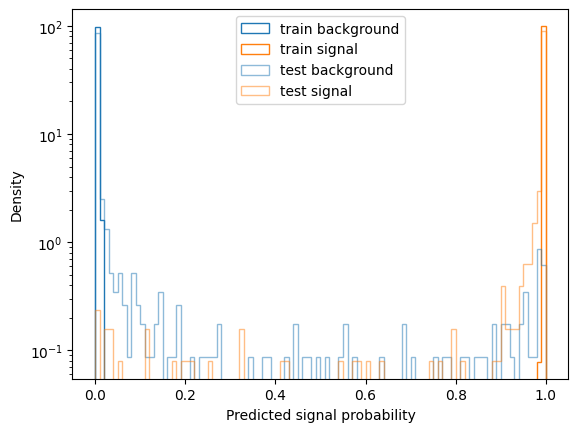
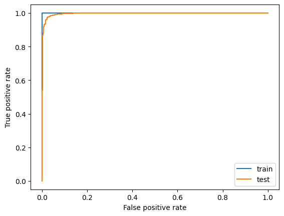
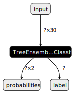
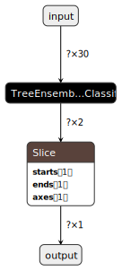
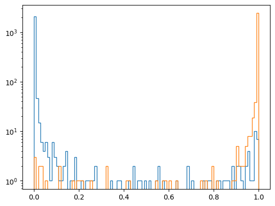

ONNX MVA tutorial
=================

.. note::

    This tutorial closely follows the :ref:`online_book_cs_bdt` tutorial. If you are new to either Continnum suppression or Machine Learning in general read that one first.

.. admonition:: Intended audience

    This tutorial is directed towards analyzers who wish to use custom machine learning methods (e.g. with libraries like scikit-learn, tensorflow, torch, xgboost, lightgbm, ...) and still want to apply inference with the resulting trained models within basf2. The tutorial uses scikit-learn, but the general approach should be applicable to other libraries as well.

The recommended way to run inference with custom machine learning methods in basf2 is via ONNX. In this tutorial we will use the ONNX method within the :ref:`mva/doc/index-01-mva:MVA package`. That means we don't write any basf2 modules, but will use the existing functionality from the MVAExpert module and only write steering files.

Creating an ntuple with training data
-------------------------------------

We will start by creating an ntuple for training our ML model with the following steering file - it's identical to the one in :ref:`online_book_cs_bdt`, but we will process all events since we intend to split between train and test dataset in the custom ML part outside basf2.

.. literalinclude:: steering_files/100_cs_onnx.py
    :language: python

Train a BDT classifier with scikit-learn
----------------------------------------

The following part of the tutorial is best followed by executing the code snippets in a **jupyter notebook**. We will need the following packages, best installed in a virtual environment. It works without any basf2 dependencies, so for simplicity we run it in an isolated environment, e.g. using `uv <https://docs.astral.sh/uv>`__:

.. code-block:: bash

    uv venv
    source .venv/bin/activate
    uv pip install scikit-learn matplotlib pandas uproot awkward-pandas skl2onnx onnxmltools onnx onnxruntime onnxscript netron jupyter

    jupyter lab

So for this tutorial we need to keep one terminal with a basf2 environment open for executing steering files and code that needs basf2 and have jupyter running in the isolated environment in a second terminal.

First, we load our ntuple into a pandas DataFrame:

.. code-block:: python

    import uproot

    with uproot.open({"ContinuumSuppression.root": "tree"}) as tree:
        df = tree.arrays(library="pd")
        # undo the replacement for the brackets in variable names
        df.columns = [col.replace("__bo", "(").replace("__bc", ")") for col in df.columns]

Now, we prepare input and output arrays and split randomly 50:50 into train and test datasets:

.. code-block:: python

    variables = [
        "R2",
        "thrustBm",
        "thrustOm",
        "cosTBTO",
        "cosTBz",
        "KSFWVariables(et)",
        "KSFWVariables(mm2)",
        "KSFWVariables(hso00)",
        "KSFWVariables(hso02)",
        "KSFWVariables(hso04)",
        "KSFWVariables(hso10)",
        "KSFWVariables(hso12)",
        "KSFWVariables(hso14)",
        "KSFWVariables(hso20)",
        "KSFWVariables(hso22)",
        "KSFWVariables(hso24)",
        "KSFWVariables(hoo0)",
        "KSFWVariables(hoo1)",
        "KSFWVariables(hoo2)",
        "KSFWVariables(hoo3)",
        "KSFWVariables(hoo4)",
        "CleoConeCS(1)",
        "CleoConeCS(2)",
        "CleoConeCS(3)",
        "CleoConeCS(4)",
        "CleoConeCS(5)",
        "CleoConeCS(6)",
        "CleoConeCS(7)",
        "CleoConeCS(8)",
        "CleoConeCS(9)",
    ]

    X = df[variables].to_numpy()
    y = df["isContinuumEvent"].to_numpy()

    from sklearn.model_selection import train_test_split

    X_train, X_test, y_train, y_test = train_test_split(X, y, test_size=len(X) // 2, random_state=42)

We will use the HistGradientBoostingClassifier in default settings from scikit-learn for this exercise

.. code:: python

    from sklearn.ensemble import HistGradientBoostingClassifier

    bdt = HistGradientBoostingClassifier()
    bdt.fit(X_train, y_train)

For a quick evaluation we plot the distribution of predicted probabilities for train and test set:

.. code:: python

    import matplotlib.pyplot as plt

    p_train = bdt.predict_proba(X_train)[:, 1]
    p_test = bdt.predict_proba(X_test)[:, 1]

    def plot(p, y, **kwargs):
        label = kwargs.pop("label", "")
        kwargs = dict(kwargs, bins=100, range=(0, 1), histtype="step", density=True)
        plt.hist(p[y==0], color="C0", label=f"{label} background", **kwargs)
        plt.hist(p[y==1], color="C1", label=f"{label} signal", **kwargs)
        plt.yscale("log")

    plot(p_train, y_train, label="train")
    plot(p_test, y_test, alpha=0.5, label="test")
    plt.xlabel("Predicted signal probability")
    plt.ylabel("Density")
    plt.legend()

And we also look at the ROC curves:

.. code:: python

    from sklearn.metrics import roc_curve, roc_auc_score

    plt.plot(*roc_curve(y_train, p_train)[:2], label="train")
    plt.plot(*roc_curve(y_test, p_test)[:2], label="test")
    plt.xlabel("False positive rate")
    plt.ylabel("True positive rate")
    plt.legend()

.. code:: python

    roc_auc_score(y_test, p_test)

.. parsed-literal::

    0.9961197133415023

All in all we see the classifier is pretty overtrained on this rather small dataset (roughly 2000 events), but still the Area Under Curve (AUC) score is quite high for the test data set still. Optimizing the Hyperparameters of the model probably does not make too much sense at this point - we would first try to gather a larger data sample.

Convert the scikit-learn model to ONNX
--------------------------------------

Now, to be able to run inference for this model within basf2 we have to convert it to ONNX. We will use `skl2onnx <https://onnx.ai/sklearn-onnx>`__, which provides conversion for most models within scikit-learn

.. code:: python

    import onnx
    import skl2onnx
    from skl2onnx.common.data_types import FloatTensorType

    options = {id(bdt): {'zipmap': False}}
    bdt_onnx = skl2onnx.convert_sklearn(
        bdt,
        initial_types=[("input", FloatTensorType([None, len(variables)]))],
        options={id(bdt): {"zipmap": False}}
    )
    onnx.save(bdt_onnx, "bdt.onnx")

The option ``{"zipmap": False}`` is necessary to get an ONNX model that outputs a single tensor. Consult `the corresponding section in the skl2onnx documentation <https://onnx.ai/sklearn-onnx/auto_examples/plot_convert_zipmap.html>`__ for more information.

Now, we can visuzualize the model graph using `netron <https://netron.app>`__. We can either load our model in the web application or in a jupyter notebook we can run a widget via

.. code:: python

    import netron

    netron.widget(netron.start("bdt.onnx", browse=False))

Now, looking at this graph we have a problem - the ONNX MVA method currently **supports only models that output a tensor of shape (?, 1)** when run in non-multiclass mode (which will be used in the MVAExpert module when we have a binary classifier). Our BDT classifier however outputs the predicted probailities in multi-class mode with one probability for class 0 and one for class 1 (shape ``(?, 2)``). So we have to modify this graph to pick out the probability of label 1. This is easiest to do by merging 2 onnx graphs, one that contains our BDT classifier and one that slices the output tensor to only keep the second one of the probabilties. We will use `onnxscript <https://microsoft.github.io/onnxscript>`__ to create a graph that only contains one node applying the `Slice <https://onnx.ai/onnx/operators/onnx__Slice.html>`__ operation

.. code:: python

    from onnxscript import script, FLOAT
    from onnxscript import opset21 as op

    @script()
    def pick_class1(probabilities: FLOAT["N", 2]) -> FLOAT["N", 1]:
        output =  op.Slice(probabilities, starts=[1], ends=[2], axes=[1])
        return output

The variable names in the decorated function will turn into intput and output names of the ONNX graph. Note the versioning of the opsets in the code above (using version 21). That version has to match the version used in the bdt model. We can query the opset versions used via

.. code:: ipython3

    [(opset.domain, opset.version) for opset in bdt_onnx.opset_import]

.. parsed-literal::

    [('ai.onnx.ml', 1), ('', 21), ('', 21)]

The domain ``ai.onnx.ml`` corresponds to higher-level ML operations such as the TreeDecisionClassifier node we have seen above. The domain with name ``''`` is the default one for the standard operations.

Now we can combine the models by connecting the outputs of the BDT model (``probabilites``) to the inputs of the ``pick_class1`` model (we also called them ``probabilities``):

.. code:: python

    from onnx import compose

    bdt_1d = compose.merge_models(
        bdt_onnx,
        pick_class1.to_model_proto(),
        io_map=[("probabilities", "probabilities")],
        outputs=["output"],
    )
    onnx.save(bdt_1d, "bdt.onnx")

We have also decided to only keep the single output tensor ``output`` of the ``pick_class1`` subgraph.

So our graph now looks like this:

.. code:: python

    netron.widget(netron.start("bdt.onnx", browse=False))

Before we run this through basf2, let's quickly cross check if the outputs from the sklearn model and the ONNX model match reasonably close:

.. code:: python

    import onnxruntime as ort
    import numpy as np

    session = ort.InferenceSession("bdt.onnx")
    p_test_onnx = session.run(["output"], {"input": X_test.astype(np.float32)})[0]

    np.allclose(p_test_onnx.ravel(), p_test, atol=1e-4)

.. parsed-literal::

    True

Matches with absolute differences between 1e-3 and 1e-5 are typical. In general one should validate if this leads to the same performance - we will do that shortly after having run the model in basf2.

Save model to MVA Weightfile and run in basf2
---------------------------------------------

We can now store the ONNX model in a MVA Weightfile:

.. code:: python

    # this code has to run in a basf2 environment
    from basf2_mva import Weightfile, ONNXOptions, GeneralOptions, vector

    variables = [...] # copy this from above

    onnx_options = ONNXOptions()
    #onnx_options.m_outputName = "myOutputName" # -> set this in case your model has multiple outputs and none of them named "output"
    general_options = GeneralOptions()
    general_options.m_variables = vector(*variables)
    general_options.m_target_variable = "isContinuumEvent"
    general_options.m_method = onnx_options.getMethod() # don't forget this line!
    weightfile = Weightfile()
    weightfile.addOptions(general_options)
    weightfile.addOptions(onnx_options)
    weightfile.addFile("ONNX_Modelfile", "bdt.onnx")
    weightfile.save("MVA_ONNX_BDT.root")

Now, we can run a steering file that applies our model and dumps a new ntuple with the model outputs included:

.. literalinclude:: steering_files/101_cs_onnx.py
   :emphasize-lines: 41-46

Again, we run over all events and for the purpose of this demonstration we only write out the inference results.

We can now cross check the result in our notebook:

.. code:: python

    with uproot.open({"ContinuumSuppression_applied.root": "tree"}) as tree:
        df = tree.arrays(library="pd")

    np.allclose(df["ContProb"].to_numpy(), bdt.predict_proba(X)[:, 1], atol=1e-4)

.. parsed-literal::

    True

And have a look at the output distributions - note this is now train and test sample merged:

.. code:: ipython3

    p_mva = df["ContProb"].to_numpy()

    kwargs = dict(bins=100, range=(0, 1), histtype="step")
    plt.hist(p_mva[y==0], **kwargs)
    plt.hist(p_mva[y==1], **kwargs)
    plt.yscale("log")

Run the basf2 mva evaluation
----------------------------

We can also run the ``basf2_mva_evaluate.py`` script. To do so we first create ntuples from our notebook to reflect the same train/test splitting we have actually used for our training:

.. code:: python

    import pandas as pd
    root_variables = [var.replace("(", "__bo").replace(")", "__bc") for var in variables]

    def write_rootfile(X, y, filename):
        df = pd.DataFrame(X, columns=root_variables)
        df["isContinuumEvent"] = y
        with uproot.recreate(filename) as f:
            f["tree"] = df

    write_rootfile(X_train, y_train, "train.root")
    write_rootfile(X_test, y_test, "test.root")

Now we can run the evaluation and enjoy the plots - the probability output distributions and ROC curves should look familiar 🙂

.. code:: bash

   basf2_mva_evaluate.py -id MVA_ONNX_BDT.root -train train.root -data test.root -o evaluate.zip
