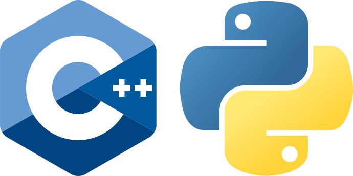

.. _onlinebook_basf2_introduction:

The basics.
===========

.. sidebar:: Overview
    :class: overview

    **Teaching**: 20 min

    **Exercises**: 10-20 min

    **Prerequisites**:

        * An internet browser
        * DESY accounts
        * :ref:`onlinebook_collaborative_tools` lesson.
        * An ``ssh`` client and the :ref:`onlinebook_ssh` lesson.
        * Basic bash

    **Questions**:

        * What is basf2 and what does it do?
        * What is a basf2 module, path, steering file?
        * How can I get help?

    **Objectives**:

        * Correctly set up the Belle II environment.
        * Find the right chapters in this documentation.
        * Run basf2 and display a list of variables
        * Run basf2 in interactive ipython shell mode.
        * Access the help in 3 different ways.
        * Confidently read the source code for a `modularAnalysis` convenience
          function.

The Belle II software is called basf2.
It is an abbreviation for "Belle II Analysis Software Framework".
You might wonder why we didn't choose "b2asf", and when you get a bit further
you will probably wonder why it has "analysis" in the name (it does much more
than analysis)?
Well historic reasons: Belle had BASF, we have basf2.

basf2 is used in all aspects of the data-processing chain at Belle II:

* generating simulated data,
* unpacking of real raw data,
* reconstruction (tracking, clustering, ...),
* and high-level "analysis" reconstruction (such as applying cuts,
  vertex-fitting, ...).

basf2 is not normally used for the final analysis steps (histogramming, fitting
1D distributions, ...).
These final steps are usually called the "offline" analysis and will be covered
in later lessons :ref:`onlinebook_offline_analysis`.

There is a citable reference for basf2:

Kuhr, T. *et al*. *Comput Softw Big Sci* **3**, 1 (2019)
https://doi.org/10.1007/s41781-018-0017-9

... and a logo.

    The basf2 logo.

Pragmatically, you will encounter two separate objects named ``basf2``.
It is both a **command-line executable which you can invoke**, and a **python
module** from which you import functions.

You will soon be running commands that look like:

.. code-block:: bash

        basf2 myScript -i myInputFile.root

... and *inside* the scripts you might see code like:

.. code-block:: python

        from basf2 import Path
        mypath = Path()

.. _onlinebook_basf2basics_coreconcepts:

Core concepts
-------------

There are some concepts we use in basf2, which you will definitely need to
understand.
These are:

        * basf2 module,
        * path,
        * package,
        * steering script / steering file.

Most of the other jargon terms we use are generic software development terms
(so you can search the internet).
A good place to look for Belle II-specific jargon is the **Belle II Glossary**.

.. admonition:: Exercise
     :class: exercise stacked

     Find the Belle II Glossary (again).

.. admonition:: Hint
     :class: toggle xhint stacked

     You might need to revisit the tutorial pages about
     :ref:`onlinebook_collaborative_tools`.

.. admonition:: Solution
     :class: toggle solution

     `Belle II Glossary <https://confluence.desy.de/display/BI/Main+Glossary>`_

basf2 modules
~~~~~~~~~~~~~

A basf2 module is a piece of (usually) C++ code that does a specific "unit" of
data processing.
The full documentation can be found here in this website under
the section :ref:`general_modpath`.

.. warning::

    It is an unfortunate clash of naming that `python uses the word
    "module" <https://docs.python.org/3/tutorial/modules.html>`_
    for a separate concept.
    In these tutorials we will always specify **python module** (and **basf2
    module**) if there is ambiguity.

Path
~~~~

A basf2 path is an ordered list of modules that will be used to process the
data.
You can think of building a path by adding modules in a chain.
It is a python object: `basf2.Path`.

.. warning::

    A common misconception is that adding modules to a path is processing
    data.
    This is not true, you will **prepare** your path for data-processing by
    adding modules.
    The event-loop starts when you process your path.

.. admonition:: Exercise
     :class: exercise stacked

     Find a diagram of a path with modules in this documentation.

.. admonition:: Hint
     :class: toggle xhint stacked

     I have already given you a link to the relevant page.

.. admonition:: Solution
     :class: toggle solution

     Take a look at the :ref:`general_modpath` page.
     The diagram is `here <framework_modpath_diagram>`.

Package
~~~~~~~

A package is a logical collection of code in basf2.
A typical package has several modules and some python scripts which configure
paths to do common things.

You will encounter some basf2 packages in these lessons.
We try to give them meaningful names (tracking, reconstruction, ...)
or name the package after the subdetector that they are related to (ecl, klm,
cdc, top, ...).

During these lessons, you will mostly interact with the analysis package.
You will meet this at the end of this lesson.

.. admonition:: Exercise
     :class: exercise stacked

     Find the source code and find a list of all packages.

.. admonition:: Hint
     :class: toggle xhint stacked

     You might need to revisit the tutorial pages about
     :ref:`onlinebook_collaborative_tools`.

.. admonition:: Solution
     :class: toggle solution

     The source code is online `here <https://stash.desy.de/projects/B2/repos/software>`_.
     The list of **packages** is simply the list of directories in the software
     directory.

Steering
~~~~~~~~

A steering file or a steering script is some python code that sets up some
analysis or data-processing task.
A typical steering file will declare a `basf2.Path`, configure basf2 modules,
and then add them to the path.
Then it will call `basf2.process` and maybe print some information.
We use the word "steering" since no real data **processing** is done in python.

    The C++ and python logos.

.. admonition:: Question
     :class: exercise stacked

     Why do we use both C++ and python?

.. admonition:: Solution
     :class: toggle solution

     Generally speaking, the heavy data processing tasks are done in C++.
     This is because of the performance.
     Python is used as a user-friendly and readable language for configuration.

     .. note::

         There are some exceptions, some modules are written in python for
         instance, but they are not very common.

Databases
~~~~~~~~~

There are a couple more concepts that you might come across:

* the **conditions database**
* and the **run database**.

For these lessons and exercises you should not need to know too much but it's
good to be aware of the jargon.

.. The **conditions database** is a web-hosted database which collects all of the
.. run- and experiment-dependent metadata (calibrations, beam energies, etc) that
.. are needed to reconstruct and process data.

.. The **run database** collects data about specific runs (the luminosity, if all
.. subdetectors were working, etc)

.. seealso:: :ref:`conditionsdb_overview`

.. seealso:: https://rundb.belle2.org

.. seealso:: "rundb" in the glossary (no link this time, you should have it bookmarked!)

.. admonition:: Key points
    :class: key-points

    * basf2 is the name of the Belle II software.
    * You work in basf2 by adding modules to a path.
    * *Most* basf2 modules are written in C++.
    * Data-processing happens when you process the path.
    * You do all of this configuration of the path, etc in python in
      a *steering file*.
    * You can navigate this online documentation.

.. tip::

    After you've progressed a bit more through these lessons, you should
    revisit the :ref:`general_modpath` documentation page and
    reread the opening paragraphs.

    By that stage everything should be clear.

.. _onlinebook_basf2basics_gettingstarted:

Getting started, and getting help interactively
-----------------------------------------------

Now let's setup the environment, actually execute ``basf2``, and navigate the
command line help.

Please ``ssh`` onto your favourite site.
If you do not have a preference, you should connect to ``login.cc.kek.jp``.

Before we start though...

You shouldn't need to *install* anything
~~~~~~~~~~~~~~~~~~~~~~~~~~~~~~~~~~~~~~~~

A common misconception by newcomers (and even by senior people in the
collaboration), is that you need to "install" basf2 or "install a release".

It is possible to install from scratch, but you almost certainly **do not**
want or need to do this.
If you are working at KEK (for certain) and at many many other sites, basf2
is available preinstalled.
It is distributed by something called `/cvmfs <https://cernvm.cern.ch/fs/>`_.

b2setup
~~~~~~~

To set up your environment to work with ``basf2`` you first have to source the
setup script...

.. code-block:: bash

        source /cvmfs/belle.cern.ch/tools/b2setup

Some people like to put an alias to the setup script in their ``.profile`` (or
``.bashrc``, ``.zshrc``, ...) file.
You are welcome to do this if you like.

So now you have a Belle II environment.
You might have noticed that you still don't have the ``basf2`` executable:

.. code-block:: bash

        $ source /cvmfs/belle.cern.ch/tools/b2setup
        Belle II software tools set up at: /cvmfs/belle.cern.ch/tools
        $ basf2
        command not found: basf2

Note: we only used the ``$`` character to distinguish the commands from the
expected output, it should not be typed.

In order to get the ``basf2`` executable you need to choose a release
(a specific version of the software).
If you don't know what release you want, you should take the latest stable
full release or the latest light release (see below).

There is a command-line tool to help with this.
Try:

.. code-block:: bash

        b2help-releases --help

To setup the release of your choice simply call ``b2setup`` again with the
name of your release.
Since you've already set up the environment, the ``b2setup`` executable itself
is already in your ``PATH`` (that means we don't need the full path ``/cvmfs/.../b2setup`` anymore):

.. code-block:: bash

        b2setup <your choice of release>

.. seealso::

   If you already know what release you want, you can do the first and second
   step in one go:

   .. code-block:: bash

        source /cvmfs/belle.cern.ch/tools/b2setup <your choice of release>

Note that if you setup an unsupported, old, or strange release you should see a
warning:

.. code-block:: bash

        $ b2setup release-01-02-09
        Environment setup for release: release-01-02-09
        Central release directory    : /cvmfs/belle.cern.ch/el7/releases/release-01-02-09
        Warning: The release release-01-02-09 is not supported any more. Please update to ...

Sometimes people have good reason to use old releases but you should know that
you will get limited help and support if you are using a very old version.

And you expose yourself to strange bugs that will not be fixed in your version
(because they are fixed in some later release).

It is also true that using the latest supported release makes you cool.

.. admonition:: Exercise
     :class: exercise stacked

     There is a detailed page in this documentation describing the differences
     between a full release and a light release and also a Belle II question.

.. admonition:: Hint
     :class: toggle xhint stacked

     There is no hint.
     You've got this.

.. admonition:: Solution
     :class: toggle solution

     It is described in the section :ref:`choosing_a_release`.

.. admonition:: Question
     :class: exercise stacked

     What is semantic versioning?

.. admonition:: Hint
     :class: toggle xhint stacked

     This is jargon but it is not specific to Belle II.

.. admonition:: Solution
     :class: toggle solution

     A rule for version numbers.
     See the summary at https://semver.org

.. admonition:: Question
     :class: exercise stacked

     If you have **code** that worked in ``release-AA-00-00`` will it work in
     ``release-AA-01-00`` ?

.. admonition:: Solution
     :class: toggle solution

     **Yes**.
     There should not be anything that breaks backward compatibility between minor versions.

.. admonition:: Question
     :class: exercise stacked

     If you have **code** that worked in ``release-AA-00-00`` will it work in
     ``release-BB-00-00`` ?

.. admonition:: Solution
     :class: toggle solution

     **No, it is not guaranteed**.
     Unfortunately there is no guarantee of backward compatibility between major versions.
     And for good reason: sometimes things need to be changed to introduce new features.

.. admonition:: Question
     :class: exercise stacked

     If you have code that worked in ``light-5501-future`` will it work in
     ``light-5602-reallyfarfuture`` ?

.. admonition:: Solution
     :class: toggle solution

     **No, it is not guaranteed**.
     Unfortunately there is no guarantee of backward compatibility between light releases.
     And for good reason: sometimes things need to be changed to introduce new features.
     For more information:
     `Do light releases break backward compatibility? <https://questions.belle2.org/question/2841/do-light-releases-break-backward-compatibility/>`_.

.. admonition:: Exercise
     :class: exercise stacked

     Typically there are two supported full releases.
     What are they?

.. admonition:: Hint
     :class: toggle xhint stacked

     .. code-block:: bash

         b2help-releases # no arguments

.. admonition:: Solution
     :class: toggle solution

     It will be the current recommended full release and the one previous.
     So execute:

     .. code-block:: bash

         b2help-releases

     And then subtract one from the major version number.

.. admonition:: Exercise
     :class: exercise stacked

     Find the source code for the recommended full release.

.. admonition:: Hint
     :class: toggle xhint stacked

     We use git to tag releases.
     You might need to revisit the lesson on collaborative tools.

.. admonition:: Solution
     :class: toggle solution

     1. Go to https://stash.desy.de/projects/B2/
     2. Click on "source".
     3. At the top it probably says "master". Choose the drop-down menu.
     4. Click on "tags" and search for the release tag.

     .. image:: introduction/find_a_tag.png
         :width: 300px

A useful command
~~~~~~~~~~~~~~~~

If you're ever stuck and you are writing a post on `questions.belle2.org
<https://questions.belle2.org>`_ or an email to an expert they will always want
to know what version you are using.

Try

.. code-block:: bash

    basf2 --info

to check everything was set up correctly.
If that worked, then paste the information at the bottom (after the ascii art)
into any correspondence with experts.

Help at the command line
~~~~~~~~~~~~~~~~~~~~~~~~

There are quite a lot of standard python tools/ways to get you help at the
command line or in an interactive environment.
The Belle II environment supports
`pydoc3 <https://docs.python.org/3/library/pydoc.html>`_.

Try:

.. code-block:: bash

    pydoc3 basf2.Path

You should notice that this is the same documentation that you will find by
clicking on: `basf2.Path` here in this online documentation.

In addition, there are some basf2-specific commands.

Listing the basf2 modules
^^^^^^^^^^^^^^^^^^^^^^^^^

To find information about a basf2 module, try:

.. code-block:: bash

    b2help-modules # this lists all of them
    b2help-modules | grep "Particle"
    b2help-modules ParticleCombiner

Listing the basf2 variables
^^^^^^^^^^^^^^^^^^^^^^^^^^^

In the next lessons, you will need to refer to physics quantities in plain
text format.
basf2 defines many **variables** for you.
These variables are collected in something called the
:ref:`analysis_variablemanager_class`.

To check the list of basf2 variables known to the :ref:`analysis_variablemanager_class`, run

.. code-block:: bash

    b2help-variables
    b2help-variables | grep "invariant"

There is a :ref:`analysis_variables` section in this documentation which you might find
more helpful than the big dump.

.. seealso::

    :ref:`b2-varindex`, or :ref:`variablesByGroup`.

.. _onlinebook_basf2basics_modularanalysis_help:

Listing the modular analysis convenience functions
^^^^^^^^^^^^^^^^^^^^^^^^^^^^^^^^^^^^^^^^^^^^^^^^^^

We have a python module full of useful shorthand functions which configure
basf2 modules in the recommended way.
It is called `modularAnalysis`.
More on this later.

For now, you can list them all with:

.. code-block:: bash

    basf2 modularAnalysis.py

.. _onlinebook_basf2basics_b2help_particles:

basf2 particles
^^^^^^^^^^^^^^^

Sometimes you will need to write particles' names in plain text format.
basf2 adopts the convention used by ROOT, the PDG, EvtGen, ...

To show information about all the particles and properties known to basf2,
there is a tool ``b2help-particles``.

.. code-block:: bash

    b2help-particles --pdg 313 # how should I write the K*(892)?
    b2help-particles B_s       # what was the pdg cod of the B-sub-s meson again?
    b2help-particles Sigma_b-  # I've forgotten the mass of the Sigma_b- !
    b2help-particles Upsi      # partial names are accepted
    #b2help-particles          # lists them all (this is a lot of output)

.. note:: In the next lesson you will need to use these names.

.. admonition:: Question
     :class: exercise stacked

     What was the luminosity collected in experiment 8?

.. admonition:: Hint
     :class: toggle xhint stacked

     There is a command line tool for that.
     Try tabcompletion ``b2<tab>``.

.. admonition:: Another hint
     :class: toggle xhint stacked

     .. code-block:: bash

         $ b2info-<tab>

.. admonition:: Are you sure you really need another hint?
     :class: toggle xhint stacked

     .. code-block:: bash

          $ b2info-luminosity --help

.. admonition:: Solution
     :class: toggle solution

     .. code-block:: bash

          $ b2info-luminosity  --exp 8 --what offline
          Read 697 runs for experiment 8
          TOTAL offline   : L = 5464553.60 /nb =  5464.55 /pb =    5.465 /fb =   0.0055 /ab

     So the answer is :math:`\sim 5.5\textrm{ fb}^{-1}`.

     .. admonition:: It didn't work

         Did you get an error like this?

         ::

             [INFO] ===Error Summary================================================================
             [FATAL] DB /group/belle2/dataprod/Luminosity/OffLineLuminosity.db not found. The live luminosity is only available on KEKCC (sorry)
             [INFO] ================================================================================

         Sorry about that. Can you try this command at KEK ?
         This should be fixed properly soon.

Other useful features
^^^^^^^^^^^^^^^^^^^^^

If you just execute basf2 without any arguments, you will start an
`IPython <https://ipython.org>`_ session with many basf2 functions imported.
Try just:

.. code-block:: bash

    basf2

In your IPython session, you can try the basf2 python interface to the `PDG
<https://pdg.lbl.gov>`_ database:

.. code-block:: ipython

    In [1]: import pdg
    In [2]: whatisthis = pdg.get(11)
    In [3]: print(whatisthis.GetName(), whatisthis.Mass())

You should also make use of IPython's built-in documentation features.

.. code-block:: ipython

    In [4]: import modularAnalysis
    In [5]: modularAnalysis.reconstructDecay?
    In [6]: # the question mark brings up the function documentation in IPython
    In [7]: print(dir(modularAnalysis)) # the python dir() function will also show you all functions' names

You can remind yourself of the documentation for a `basf2.Path` in yet another way:

.. code-block:: ipython

   In [8]: import basf2
   In [9]: basf2.Path?
   In [10]: # the question mark brings up the function documentation in IPython
   In [11]: # this is equivalent to...
   In [12]: print(help(basf2.Path))

To leave interactive basf2 / IPython, simply:

.. code-block:: ipython

   In [13]: # exit()
   In [14]: # ... or just
   In [15]: exit

Other useful things in your environment
~~~~~~~~~~~~~~~~~~~~~~~~~~~~~~~~~~~~~~~

You might notice that setting up the basf2 environment means that you also have
tools like ROOT, and (an up-to-date version of) git.

These come via the Belle II **externals**.
We call software "external" if is not specific to Belle II but used *by* basf2.

.. seealso::

    If you are interested, you can browse the list of everything included in
    the externals in `this README file
    <https://stash.desy.de/projects/B2/repos/externals/browse/README.md>`_.

Some python packages that are useful for final offline analysis are also
included in the externals for your convenience.
These are tools such as `numpy <https://numpy.org>`_ and
`pandas <https://pandas.pydata.org>`_.
You will meet them in the :ref:`onlinebook_offline_analysis` lessons.

.. admonition:: Key points
    :class: key-points

    * ``b2setup`` sets up the environment.
    * You need to setup a specific release and you should try and keep up-to-date.
    * ``b2help-releases``
    * ``b2setup <choose a release>``
    * ``b2help-particles``
    * basf2 has a python interface. You can use python tools to find help.
    * ``basf2`` without any tools gets you into a basf2-flavoured IPython shell.

The basf2 analysis package
--------------------------

The analysis package of basf2 contains python functions and C++ basf2 modules
to help you perform your specific analysis on *reconstructed dataobjects*.
It will probably become your favourite package.

The collection of "reconstructed dataobjects" is actually a well-defined list.
You will hear people call these "mdst dataobjects".
The "mdst" is both a file-format and another basf2 package containing the
post-reconstruction dataobjects.

.. admonition:: Exercise
     :class: exercise stacked

     Find the documentation for the analysis package and read the first two
     sections.

.. admonition:: Hint
     :class: toggle xhint stacked

     There is no hint. You've got this.

.. admonition:: Solution
     :class: toggle solution

     :ref:`analysis`

.. admonition:: Exercise
     :class: exercise stacked

     Find a list of mdst dataobjects.

.. admonition:: Solution
     :class: toggle solution

     There are (at least) two ways to do this.

     * You can look at the function source code for `mdst.add_mdst_output`.
     * You can browse the mdst/dataobjects directory in the basf2 source code:
       https://stash.desy.de/projects/B2/repos/software/browse/mdst/dataobjects/include

     The important mdst dataobjects are:

      * Track (and TrackFitResult)
      * ECLCluster
      * KLMCluster
      * PIDLikelihood
      * MCParticle

.. seealso::

    `What is the difference between an mdst and a dst?
    <https://questions.belle2.org/question/219/what-is-the-difference-between-an-mdst-and-a-dst/>`_

.. seealso:: "mdst" in the glossary

Earlier we asked some questions about **code** backward-compatibility.
We can now take a brief diversion into the second kind of
backward-compatibility that is guaranteed in the software.

.. centered:: Mdst backward-compatibility is guaranteed for the last two major releases.

.. seealso::

    The confluence page `Software Backward Compatibility
    <https://confluence.desy.de/display/BI/Backward+Compatibility>`_

.. admonition:: Question
     :class: exercise stacked

     If you have an **mdst file** that was created in ``release-AA-00-00``
     will you be able to open it with ``release-BB-00-00``?

.. admonition:: Solution
     :class: toggle solution

     **Yes**.
     If BB is AA+1 (i.e. the next major release).
     You should be able to open the old file, and your analysis code should work.

.. admonition:: Question
     :class: exercise stacked

     If you have an **mdst file** that is from the latest MC campaign.
     Will you be able to open it with the latest light release?

.. admonition:: Solution
     :class: toggle solution

     **Yes**.
     New light releases will always be able to open files from the current,
     and last supported full release.
     An MC campaign is always based on a full release.

You will use mdst data files in the next lesson.

Let's get back to thinking about the reconstructed dataobjects.
An important point to understand is that the analysis package interprets
collections of these dataobjects as particle *candidates*.

In brief:

* A track (with or without a cluster and with or without PID information)
  is interpreted as a charged particle
  (:math:`e^\pm`, :math:`\mu^\pm`, :math:`\pi^\pm`, :math:`K^\pm`, or
  :math:`p^\pm`).
* A cluster with no track in close vicinity is interpreted as a photon
  or a :math:`K_L^0`.

* Two or more of the above particles can be combined to make *composite*
  particle candidates.
  For example:

  * Two photons can be combined to create :math:`\pi^0\to\gamma\gamma`
    candidates.
  * Two tracks can be combined to create :math:`K_S^0\to\pi^+\pi^-`
    candidates.

  ... And so on.

In fact, the analysis package mostly operates on **ParticleList** s.
A **ParticleList** is just the list of all such particle candidates in each
event.
In the next lesson you will make your own particle lists and use analysis
package tools to manipulate them.

Making your life easier
~~~~~~~~~~~~~~~~~~~~~~~

Suggested configuration of the analysis package **basf2 modules** is *usually*
done for you in so-called "convenience functions".
Certainly all the modules needed for these lessons.

The **python module** containing these functions is called `modularAnalysis`.
You have already met the `modularAnalysis` convenience functions
earlier in this lesson: :ref:`onlinebook_basf2basics_modularanalysis_help`.

You are encouraged to look at the source code for the `modularAnalysis`
convenience functions that you find yourself using often.
In pseudo-python you will see they are very often of the form:

.. code-block:: python
        :linenos:

        import basf2

        def doAnAnalysisTask(<arguments>, path):
            """
            A meaningful and clear docstring. Sometimes quite long-winded.
            Occasionally longer than the active code in the function.

            Details all of the function inputs...

            Parameters:
                foo (bar): some input argument
                path (basf2.Path): modules are added to this path
            """
            # register a module...
            this_module = basf2.register_module("AnalysisTaskModule")
            # configure the parameters...
            this_module.param('someModuleParamter', someValue)
            # add it to the path...
            path.add_module(this_module)

.. admonition:: Question
     :class: exercise stacked

     What is the ParticleCombiner module?
     What does it do?

.. admonition:: Hint
     :class: toggle xhint stacked

     You can use either

     .. code-block:: bash

         basf2 -m ParticleCombiner

     or browse this online documentation.

.. admonition:: Solution
     :class: toggle solution

     The :b2:mod:`ParticleCombiner` takes one or more **ParticleList** s
     and combines **Particle** s from the inputs to create *composite* particle
     candidates.

      .. seealso::

           `Particle combiner how does it work?
           <https://questions.belle2.org/question/4318/particle-combiner-how-does-it-work/>`_

.. admonition:: Exercise
     :class: exercise stacked

     Find the `modularAnalysis` convenience function that wraps the
     :b2:mod:`ParticleCombiner` module?
     Read the function.

.. admonition:: Solution
     :class: toggle solution

     You want the `modularAnalysis.reconstructDecay` function.
     You could either read the source code for that on stash,
     or find it here in this documentation and click "[source]".

Congratulations!
You are now ready to write your first steering file.
Good luck.

.. seealso::

    While the next sections will help you to understand the basics of steering
    files step by step, there are also some comple examples for steering files
    `in the main software repository <https://stash.desy.de/projects/B2/repos/software/browse/analysis/examples>`_.
    You might want to take a look there after the starterkit.

.. include:: ../lesson_footer.rstinclude

.. topic:: Author of this lesson

    Sam Cunliffe
