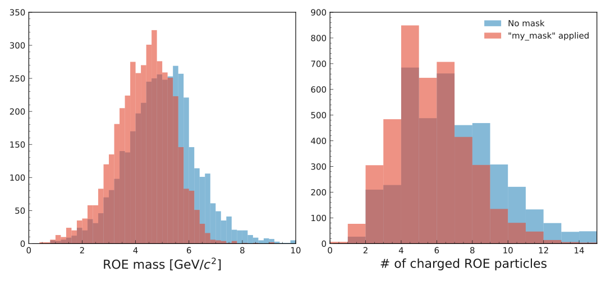

.. _onlinebook_roe:

The Rest of Event (ROE)
=======================

.. sidebar:: Overview
    :class: overview

    **Teaching**: 10-20 min

    **Exercises**: 10-20 min

    **Prerequisites**:

    	* The previous lesson

    **Questions**:

        * I combined several particles into ``X``. How do I select everything
          that is not "in" ``X``?
        * How to exclude some particles from this Rest of Event / what is an ROE mask?

    **Objectives**:

        * Reconstruct the ROE of a B meson

After the reconstruction of the signal particle list it is very useful
to look into the the particles that are not associated to the signal particle list.
In `basf2` these particles are called "Rest of Event" and this is the main topic of the chapter.

The Rest of Event (ROE) can contain a lot of information: in case of B-physics, the ROE of one B-meson includes
particles from the partner B-meson and in case of charm and tau analysis, the ROE of the lepton has the partner
lepton.

.. admonition:: Exercise
     :class: exercise stacked clear

     Find the documentation of the ROE module. What are its use cases for tagged
     and untagged analyses?

.. admonition:: Hint
     :class: toggle xhint stacked

     It's included in the "Advanced Topics" section of the analysis module.

.. admonition:: Solution
     :class: toggle solution

     Documentation is here: `RestOfEvent`. There is quite a bit of content.
     For now, make sure to take a look at the Overview and the "Basic usage"
     sections.

Basics
------

In this chapter we will continue our work on the steering file from the last lesson.
Remember that you have reconstructed a :math:`B^0` particle list.
We now want to reconstruct the Rest of Event of the :math:`B^0`.

.. admonition:: Exercise
     :class: exercise stacked

     Look up how to create a Rest Of Event for your particle list
     (it's a single line of code).
     Add the ``fillWithMostLikely=True`` option.

.. admonition:: Hint
     :class: toggle xhint stacked

     You have already found the `RestOfEvent` chapter in the last exercise.
     Take a look at the basic usage example.

.. admonition:: Solution
     :class: toggle solution

     .. literalinclude:: steering_files/029_roe.py
         :lines: 46-47
         :emphasize-lines: 2
         :lineno-start: 46

That's it, the ROE has been reconstructed!
Behind these python curtains, a ``RestOfEvent`` object is created for each particle in the :math:`B^0`
particle list and it includes all other charged or neutral particles, that have not been
associated to the corresponding signal candidate. By default, the charged particles are assumed to be pions,
and the neutral particles use the photon or :math:`K_L^0` hypothesis.

ROE variables
~~~~~~~~~~~~~

In principle, one can already try to use some of the Rest of Event variables.

.. admonition:: Exercise
     :class: exercise stacked

     Find documentation for the Rest Of Event variables.

.. admonition:: Hint
     :class: toggle xhint stacked

     Use the search feature in the basf2 documentation, or use the offline help by typing ``b2help-variables``
     in your bash terminal (for example ``b2help-variables | grep -i roe``).

.. admonition:: Solution
     :class: toggle solution

     The Rest Of Event variables are in Rest Of Event section of `VariableManager` page,
     which starts from :b2:var:`bssMassDifference` variable.

Among the most universal and useful are ROE invariant mass :b2:var:`roeM`
or ROE energy :b2:var:`roeE`. Also, one can call
:b2:var:`nROE_Charged` or :b2:var:`nROE_Photons` to know how many charged particles or
photons entered the ROE.

Remember that we were collecting all variables in the ``b_vars`` list.
Let's include the following lines to have a useful selection of them:

.. literalinclude:: steering_files/029_roe.py
     :lines: 60-67
     :lineno-start: 60

.. admonition:: Exercise
     :class: exercise

     Run your steering file and check that it completes without error.

In principle we could already start to do an analysis.
However, the ROE variables that we have just defined are not quite useful yet:
we first need to "clean up" the ROE.
For this, we define ROE masks.

ROE masks
~~~~~~~~~

The main philosophy of the ROE is to include *every* particle in the event,
that has not been associated to the signal candidate.
That is why a typical ROE contains not only the partner particle (e.g. the tag or signal B),
but also all other particles, like
hadron split-off particles, :math:`\delta`-rays, unused radiative photons, beam-induced background particles or products of kaon or pion decays.
It is up to the analyst to decide what particles actually matter for the analysis.
This is called "cleaning up" the ROE. For this procedure, *ROE masks* are used.

ROE masks are just sets of selection cuts
to be applied on the ROE particles.

For our example, let's start by defining the following selection cut strings:

.. literalinclude:: steering_files/029_roe.py
     :lines: 46-49
     :emphasize-lines: 3-4
     :lineno-start: 46

Here we created different cuts for charged particles, like electrons or charged pions, and for photons,
because of different methods of measurement used to detect these particles.

.. tip::

    These are example cuts, please use official guidelines from
    Charged or Neutral Performance groups to set up your own selection in a "real" analysis.

.. admonition:: Exercise
     :class: exercise stacked

     Create a ROE mask using the ``charged_cuts`` and ``photon_cuts`` strings with the
     `appendROEMask` or `appendROEMasks` function.

.. admonition:: Hint
     :class: toggle xhint stacked

     A mask is defined as a tuple with three values. Use `appendROEMasks` to
     "activate" it.

.. admonition:: Solution
     :class: toggle solution

     .. literalinclude:: steering_files/029_roe.py
         :lines: 46-51
         :lineno-start: 46
         :emphasize-lines: 5-6

Now we have created a mask with a name ``my_mask``, that will only allow track-based
particles that pass selection cuts ``track_based_cuts`` and ECL-based particles, that pass
``ecl_based_cuts``.

The analyst can create as many ROE masks as needed and use them in different ROE-dependent
algorithms or ROE variables.
For ROE variables, the mask is specified as an argument, like ``roeM(my_mask)``
or ``roeE(my_mask)``.

In the last section, we defined two lists of ROE variables (``roe_kinematics`` and ``roe_multiplicities``).
Now we want to have
the same variables but with the ``my_mask`` argument. Since we're lazy, we use a python
loop to insert this argument.

.. admonition:: Exercise
     :class: exercise stacked

     Write a ``for`` loop that runs over ``roe_kinematics + roe_multiplicities`` and
     replaces the ``()`` of each variable with ``(my_mask)``. Add these new
     variables to the ``b_vars`` list.

.. admonition:: Hint
     :class: xhint stacked toggle

     The variables are nothing more than a string, which has a ``replace``
     method:

     .. code-block:: python

        >>> "roeE()".replace("()", "(my_mask)")
        'roeE(my_mask)'

.. admonition:: Hint
     :class: xhint stacked toggle

     Fill the missing bit of code:

     .. code-block:: python

        for roe_variable in roe_kinematics + roe_multiplicities:
            roe_variable_with_mask = your_code_here
            b_vars.append(roe_variable_with_mask)

.. admonition:: Solution
     :class: solution toggle

     .. literalinclude:: steering_files/029_roe.py
         :lines: 61-72
         :lineno-start: 61
         :emphasize-lines: 9-12

.. tip::

    There are also KLM-based hadrons in ROE, like :math:`K_L^0` or neutrons, but they are
    not participating in ROE 4-momentum computation, because of various temporary
    difficulties in KLM reconstruction. Nevertheless, one can count them using
    :b2:var:`nROE_NeutralHadrons` variable.

.. admonition:: Exercise
     :class: exercise stacked

     Your steering file is now complete. Run it!

.. admonition:: Solution
     :class: solution toggle

     Your steering file should look like this:

     .. literalinclude:: steering_files/029_roe.py
         :emphasize-lines: 46-51,60-72
         :linenos:

Quick plots
~~~~~~~~~~~

.. admonition:: Exercise
     :class: exercise stacked

     Plot ROE invariant mass and number of charged particles in ROE distributions
     and compare masked and unmasked ROE.
     Column names in the ntuple:

     +---------------------+-----------------------+-----------------------------------+
     |                     | :b2:var:`roeM`        | :b2:var:`nROE_Charged`            |
     +---------------------+-----------------------+-----------------------------------+
     |Unmasked ROE         | ``roeM__bo__bc``      | ``nROE_Charged__bo__bc``          |
     +---------------------+-----------------------+-----------------------------------+
     |ROE with ``my_mask`` |``roeM__bomy_mask__bc``| ``nROE_Charged__bomy_mask__bc``   |
     +---------------------+-----------------------+-----------------------------------+

.. admonition:: Hint: Plotting side by side
    :class: xhint stacked toggle

    One can use ``matplotlib`` functions to plot several histograms on one figure side-by-side.
    Documentation is on  `this page <https://matplotlib.org/3.1.1/api/_as_gen/matplotlib.pyplot.subplots.html>`_, but you also saw some examples in your
    python training.

.. admonition:: Hint: Outliers
    :class: xhint stacked toggle

    Some of the distributions contain outliers, which need to be rejected in order to
    get meaningful plots (this means to manually set the plotting range).
    Proposed ranges: :b2:var:`roeM` from 0 to 10 and :b2:var:`nROE_Charged` from 0 to 15.

.. admonition:: Hint: Styling
    :class: xhint stacked toggle

    * Another hint is that comparison plots look better if they are a bit transparent, which
      can be achieved by supplying ``alpha=0.6`` argument to the plotting functions.
      Alternatively you might look into the ``histtype`` argument to only show the outlines
      of the distributions.
    * As we are plotting many distributions on one figure
      `legends <https://matplotlib.org/tutorials/intermediate/legend_guide.html>`_ and axis titles are important

.. admonition:: Hint: Fill in the blanks
     :class: xhint stacked toggle

     .. code-block:: python

        import root_pandas
        import matplotlib.pyplot as plt

        plt.style.use('belle2')
        df = root_pandas.read_root('Bd2JpsiKS.root')
        m_bins = 50
        m_range = (0, 10)
        fig, ax = plt.subplots(1,2, figsize=(15, 7))
        # Left subplot of ROE mass:
        ax[0].hist(...)
        ax[0].hist(...)
        ax[0].set_xlim(m_range)
        ax[0].set_xlabel('ROE mass [GeV/$c^2$]')
        # Right subplot of number of charged ROE particles:
        m_bins = 15
        m_range = (0, 15)
        ax[1].hist(...)
        ax[1].hist(...)
        ax[1].set_xlim(m_range)
        ax[1].set_xlabel('# of charged ROE particles')
        ax[1].legend()
        fig.tight_layout()
        fig.savefig('roe_mask_comparison.svg')

.. admonition:: Solution
     :class: solution toggle

     .. code-block:: python

        import root_pandas
        import matplotlib.pyplot as plt

        plt.style.use('belle2')
        df = root_pandas.read_root('Bd2JpsiKS.root')
        m_bins = 50
        m_range = (0, 10)
        fig, ax = plt.subplots(1,2, figsize=(15, 7))
        # Left subplot of ROE mass:
        ax[0].hist(df['roeM__bo__bc'], label='No mask',
                   bins = m_bins, range=m_range, alpha=0.6)
        ax[0].hist(df['roeM__bomy_mask__bc'], label='"my_mask" applied',
                   bins = m_bins, range=m_range, alpha=0.6)
        ax[0].set_xlim(m_range)
        ax[0].set_xlabel('ROE mass [GeV/$c^2$]')
        # Right subplot of number of charged ROE particles:
        m_bins = 15
        m_range = (0, 15)
        ax[1].hist(df['nROE_Charged__bo__bc'], label='No mask',
                   bins = m_bins, range=m_range, alpha=0.6)
        ax[1].hist(df['nROE_Charged__bomy_mask__bc'], label='"my_mask" applied',
                   bins = m_bins, range=m_range, alpha=0.6)
        ax[1].set_xlim(m_range)
        ax[1].set_xlabel('# of charged ROE particles')
        ax[1].legend()
        fig.tight_layout()
        fig.savefig('roe_mask_comparison.svg')

     The resulting plot should look like the figure below.

.. _roe_mask_plots:

    Distributions of ROE invariant mass (left) and number of charged ROE particles (right).

:numref:`roe_mask_plots` shows a comparison of :b2:var:`roeM` and :b2:var:`nROE_Charged` distributions
for ROE with mask ``my_mask`` case and ROE with no mask applied.

.. admonition:: Strange variable names
    :class: toggle

    You might wonder where these strange variable names came from. This is because
    it is tried to avoid branch names (columns of your output ROOT file) that contain
    special characters (parentheses, spaces and so on).
    For example, every ``(`` is replaced by ``_bo`` for "bracket open". What does
    ``_bc`` stand for?

.. admonition:: Exercise
    :class: exercise stacked

    Take another look at :numref:`roe_mask_plots` and describe what you see.
    Can you explain the differences between the masked and unmasked variables?

.. admonition:: Solution
    :class: solution toggle

    The invariant mass distribution for masked ROE is much narrower and its mean is a little bit below
    nominal :math:`B^0` mass, contrary to the unmasked ROE distribution.
    This is expected, because a generic :math:`B^0` decay may produce particles,
    that are not accounted in ROE mass computation, like :math:`K_L^0` or neutrinos.

    The distribution of the number of charged particles for masked ROE has much more prominent peaks
    at *4* and *6* particles than its unmasked version, which corresponds to the fact that a correctly
    reconstructed :math:`B^0` will have an even number of charged daughter particles.

    This means that even a simple ROE mask like ``my_mask`` does a really good job of cleaning up the particles,
    which are not associated to the partner :math:`B^0`.

This concludes the Rest of Event setup as a middle stage algorithm to run :ref:`onlinebook_cs`,
:ref:`onlinebook_flavor_tagging` or tag :ref:`onlinebook_vertex_fitting`.

.. admonition:: Key points
    :class: key-points

    * The ROE of a selection is build with `buildRestOfEvent`
    * ROE masks are added with `appendROEMask` or `appendROEMasks`.
      Use them to clean up beam-induced or other background particles.
    * For many analyses ROE is used as middleware to get tag vertex fit,
      continuum suppression or flavor tag.
    * Usage of ROE without a mask is **not** recommended.

.. include:: ../lesson_footer.rstinclude

.. topic:: Authors of this lesson

    Sviatoslav Bilokin,
    Kilian Lieret
