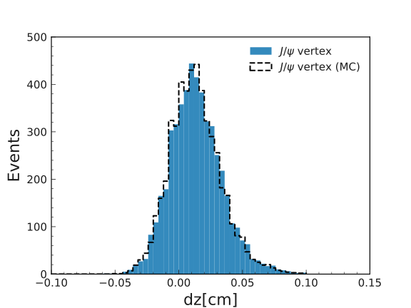
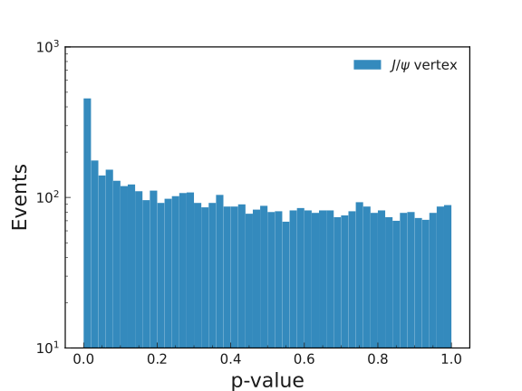

.. _onlinebook_vertex_fitting:

Vertex fitting
==============

.. sidebar:: Overview
    :class: overview

    **Teaching**: 15 min

    **Exercises**: 25 min

    **Prerequisites**:

        * The previous lesson

    **Questions**:

        * What is a vertex fit?
        * When do I want to perform a vertex fit?
        * How should I choose my fit and constraints?

    **Objectives**:

        * Perform vertex fit of a decay

Introduction
------------

In the broadest sense, we call vertex fitting a technique in which one uses
prior knowledge on the nature of a decay to improve the measurement of its
observables. The fits we are going to perform are of two main types:

* **Geometric Fitting:** We use the fit to determine the decay vertex of the
  particle. Usually this is done by fitting together the tracks of its charged
  decay products,  which we know originate from a common point.  Additional
  information could be available ---  for example, if the particle is short lived,
  we can improve this by adding  an IP constraint, i.e. fit the beam spot together
  with the tracks. If there's only one track,  using the beam spot is the only way
  to obtain a vertex.

.. warning::

    If no vertex fit is performed, the corresponding variables for the vertex
    position will not be filled.

* **Kinematic Fitting:** We use the fit to improve our knowledge of the particle
  kinematics.  By default, composite particle kinematics are built off the decay
  products using 4-momentum conservation. If the particle we are reconstructing
  has a well defined mass (either stable, or a narrow resonance) it might make
  sense to apply a mass constraint to help reject combinatorial background.

.. warning::

   If you apply a mass constraint, the invariant mass will be fixed to the
   nominal mass. This is problematic if you then want to use this variable, for
   example if you want to fit a peak. In that case, make sure you save the
   pre-fit mass separately.

.. note::

   Several fitters exist. For this exercise we will focus on ``KFit`` which is
   the most basic one.

.. admonition:: Exercise
     :class: exercise stacked

     Locate the documentation for vertex fitting functions and find KFit.

.. admonition:: Hint
     :class: toggle xhint stacked

     Use the search bar.

.. admonition:: Solution
     :class: toggle solution

     You can find it here: `Vertex`.

Basic Fitting
-------------

This lesson assumes you successfully reconstructed your :math:`B \to J/\Psi(\to
e^+e^-)K_s(\to \pi^+\pi^+)` decay following the previous exercises.
Now suppose you are interested in reconstructing the :math:`B` decay vertex
position using a fit (for example, you're trying to do a time-dependent CPV
study).

.. admonition:: Question
     :class: exercise stacked

     Which particles do you need to fit in order to reconstruct the :math:`B`
     vertex?

.. admonition:: Hint
     :class: toggle xhint stacked

     It can't be the :math:`B` itself: out of its daughters, neither the
     :math:`J/\Psi` nor the :math:`K_s` are charged tracks.

.. admonition:: Answer
     :class: toggle solution

     You must fit the :math:`J/\Psi \to e^+e^-` vertex. The :math:`J/\Psi` is
     short-lived and therefore its vertex is a good approximation of the
     :math:`B`.  Meanwhile, the :math:`K_s` can decay several cm away from where
     it is produced.

.. admonition:: Exercise
     :class: exercise stacked

     Call the fit function with the correct parameters and save the output.
     Include the true vertex position from MC for comparison.

.. admonition:: Hint
     :class: toggle xhint stacked

     Look up the variable collections for vertices. Don't forget to import the
     vertex module!

.. admonition:: Solution
     :class: toggle solution

     .. code-block:: python

          import vertex
          ...
          vertex.kFit("J/psi:ee", conf_level=0.0, path=main)
          ...
          jpsi_ks_vars += vc.vertex + vc.mc_vertex

     You can also set the confidence level to -1, which means failed fits will
     be included. The fit p-value is saved as part of the ``vc.vertex``
     collection.

.. admonition:: Exercise (optional)
     :class: exercise

     Fit the :math:`K_s` as well. How does its flight length compare to the
     :math:`J/\Psi`?

.. admonition:: Exercise (optional)
     :class: exercise

     Look up the documentation for ``TreeFitter`` and fit the whole
     :math:`B \to J/\Psi(\to e^+e^-)K_s(\to \pi^+\pi^+)` decay chain at once.

Tag Vertex Fitting
------------------

Since :math:`B` mesons are produced in pairs, for every signal candidate we
reconstruct, there will also be another (the "tag") which is not explicitly
reconstructed.

We might be interested in knowing the decay position of this meson without
placing any requirements on its decay. This is done using the ``TagV`` module.

``TagV`` performs a geometric fit over the tracks in the ROE to determine the
tag decay vertex. However, not all tracks will necessarily come from the tag
itself; consider for example our signal,  where the pion tracks originate from a
long lived kaon vertex. ``TagV`` is designed to iteratively downweight those tracks,
ultimately excluding them from the fit.

.. admonition:: Exercise
     :class: exercise stacked

     Locate the ``TagV`` documentation.

.. admonition:: Solution
     :class: toggle solution

     It's in the same page as ``KFit``.

.. admonition:: Question
     :class: exercise stacked

     By default, TagV only uses tracks with PXD hits. Why?

.. admonition:: Solution
     :class: toggle solution

     Those tracks provide the best resolution close to the interaction point. As
     a bonus, this selection rejects tracks from displaced vertices.

.. admonition:: Exercise
     :class: exercise stacked

     Call the ``TagV`` module and save the output.

.. admonition:: Hint
     :class: toggle xhint stacked

     In order to reinforce the fit, an IP constraint is applied to the TagV. If
     the signal is fully reconstructed, this condition can be relaxed along the
     signal :math:`B` flight direction.

.. admonition:: Solution
     :class: toggle solution

     .. code-block:: python

          vertex.TagV("B0", constraintType="tube", path=main)
          ...
          b_vars += vc.tag_vertex + vc.mc_tag_vertex

Conclusion and Plotting
-----------------------

Congratulations! Your steering file is ready! Time to run it and check the
results.

.. admonition:: Exercise
   :class: exercise stacked

   Run the steering file.

.. admonition:: Solution
     :class: solution toggle

     Your steering file should look like this:

     .. literalinclude:: steering_files/059_vertex_fitting.py
         :emphasize-lines: 11, 61-62, 84-85, 113, 127
         :linenos:

You can now plot some relevant vertex variables. In general, the choice would
depend on what you need for your analysis. A few examples would include:

   * Vertex position in various coordinates, such as dz and dr.
   * P-value of the fit.
   * Resolution of the vertex fit (:math:`\sigma(x)/x`) where x is each of the
     above variables.
   * Pull (:math:`(x-x(MC)/\sigma(x)`).

As an exercise we will focus on the first two.

.. admonition:: Exercise
     :class: exercise stacked

     Plot the :math:`J/\Psi` vertex position and compare it with the true value.
     Plot the p-value distribution of the fit.

.. admonition:: Hint: Variable names
     :class: toggle xhint stacked

     You can either take another look at the variable collections that you
     included above, or you load your dataframe and then take a look at its
     columns ``print(list(df.columns))``.

.. admonition:: Hint: Plot ranges
     :class: toggle xhint stacked

     Plotting was already discussed in :ref:`onlinebook_roe`. For the sake of this
     exercise, remember we already set the minimum p-value of our fits to 0, so
     failed fits will not be included and you can plot it in the [0,1] interval.

     Should you have changed that, failed fits will be included with a p-value of -1;
     in this case, make sure to change your plotting range accordingly to [-1,1].

.. admonition:: Solution
    :class: toggle solution

    .. literalinclude:: vertex/vertex_plots.py
        :linenos:

.. _vertex_plots:

    Distribution of the fitted vertex position in Z

    Distribution of the fit p-values.

.. admonition:: Exercises (optional)
     :class: exercise

     * Compare the :math:`J/\Psi` and Tag vertex positions and show that they
       are both compatible with being :math:`B` vertices.
     * If you've fit the :math:`K_s` vertex, compare its radial position with
       the :math:`J/\Psi`. Is this what you expect?

.. admonition:: Key points
    :class: key-points

    * Use ``KFit`` to fit simple vertices.
    * Think carefully which vertex you need to fit, and whether it will need
      additional constraints.
    * Study the documentation  if you need a different functionality, such as
      ``TreeFitter`` to fit complex trees.
    * Use ``TagV`` to reconstruct a vertex from the ROE.

.. include:: ../lesson_footer.rstinclude

.. topic:: Authors of this lesson

    Francesco Tenchini
