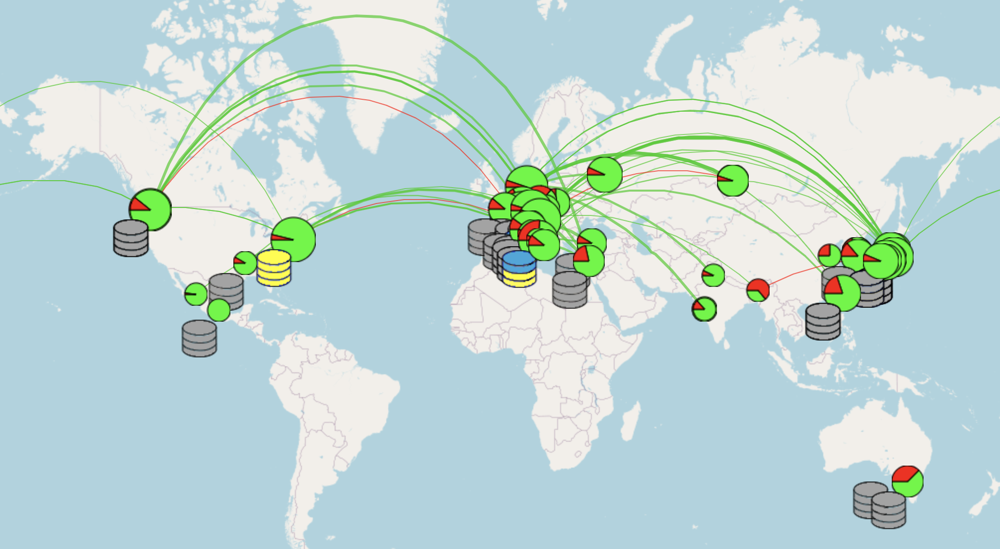
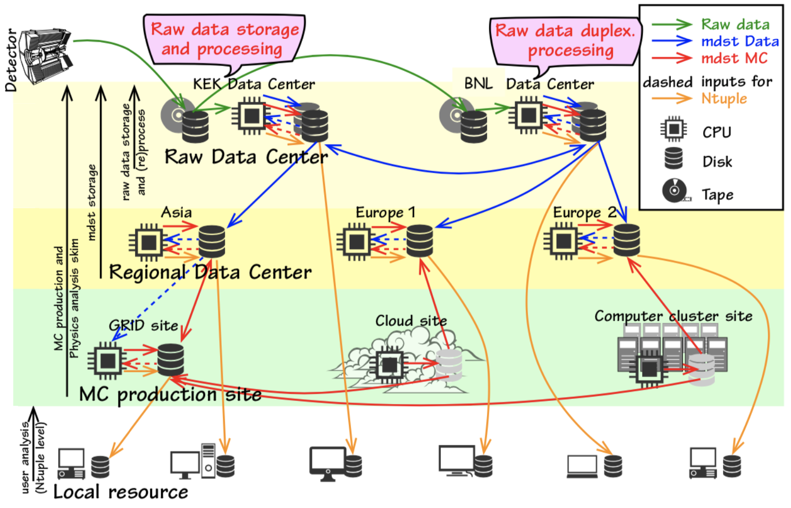

.. _onlinebook_computing_system:

The computing system
====================

.. sidebar:: Overview
    :class: overview

    **Teaching**: 20 min

    **Prerequisites**:

        * An internet browser
        * :ref:`onlinebook_basf2_introduction`
        * :ref:`onlinebook_fundamentals`

    **Questions**:

        * What is the grid?
        * How data is processed?
        * Why the data is skimmed?

    **Objectives**:

        * Understand the basic notions of the distributed computing system.
        * Learn about the data flow and the processing scheme.
        * Locate the relevant information for analysis on the Confluence pages.

The distributed computing system
--------------------------------

The large luminosity to be delivered by the Belle II experiment projects that we will handle tens of Peta bytes
per year. To achieve the physics goals of the experiment, the data has to be reprocessed, distributed
and analyzed. It is hard to expect that a single site provides the computing resources to manage such a large data set.
Additionally, Belle II is a worldwide collaboration with more than 1000 scientists working in different regions
of the planet.
Therefore, it is natural to adopt a distributed computing architecture in order to access data and obtain physics results
in a feasible time.

.. admonition:: Key points
    :class: key-points

    The main tasks of the computing system are:

    * Processing of raw data
    * Production of Monte Carlo samples.
    * Data preservation.
    * Skimming.
    * Analysis.

The Belle II distributed computing system (also known as **the grid**) is a form of computing where a "virtual super computer" is
composed of many loosely networked computers. To the date, 60 computing sites and 35 storage elements contribute to the
distributed computing resources, managed by central services hosted at KEK and BNL. This allow us to execute
20K jobs in a geographically distributed environment.

    Snapshot of the `Belle II grid <https://belle2.jp/computing/>`_, composed by 60 computing sites around the world.

The Belle II grid uses the power of the
`DIRAC <http://diracgrid.org/>`_ Distributed Computing Framework to control the jobs. An extension, BelleDIRAC,
has been written for specific needs of the collaboration.

The client tools that communicate with DIRAC and BelleDIRAC
have been organized in a set of tools named **gbasf2**. As an analyst, datasets are
available for running analysis directly on the grid, download the output and perform the
:ref:`onlinebook_offline_analysis` on local resources. One convenient feature of gbasf2 is it uses the same basf2
steering files used offline as input.

.. admonition:: Key points
    :class: key-points

    * GBasf2 relies in the power of the DIRAC Distributed Computing Framework to control the jobs.

    * DIRAC uses X509 digital certificates to authenticate its users. 

    * Therefore, you will need a certificate to submit jobs to the grid via gbasf2.

.. seealso::

    `"Computing at the Belle II experiment" <https://iopscience.iop.org/article/10.1088/1742-6596/664/1/012002/meta>`_,
    proceedings of the CHEP 2015 conference.

The details on how to run jobs and download the output are explained in the next
chapter :ref:`onlinebook_gbasf2`.

Data Processing Scheme
----------------------

As mentioned before, on the grid the processing of the raw data is performed,
as well as skimming and analysis and production of MC samples.

Raw data processing
^^^^^^^^^^^^^^^^^^^

In our computing model, all raw data produced by the experiment is uploaded and registered on the grid. After the
calibration is performed, data is reprocessed in the raw data centers to produce MDST files.

.. admonition:: Key points
    :class: key-points

    * All data is stored at KEK.
    * Dedicated data centers keep a second copy of the full raw data set.
    * Raw data is processed at the raw data centers to produce mDST files.
    * The mDST files are distributed over storage sites.
    * Analyzers access data sending jobs to the grid and downloading the output to local resources.

    The Belle II distributed computing model. Two copies of the raw data are stored and reprocessed at the raw data
    centers, in order to produce mdst files.

Monte Carlo samples
^^^^^^^^^^^^^^^^^^^

In parallel, Monte Carlo (MC) samples are centrally produced in campaigns labeled as MCXX, being 'XX' a sequential
number (MC10, MC11, etc). Usually, every time a major basf2 release is available, a new campaign is launched.
Details about the produced samples are usually available at
the `Data Production Confluence pages <https://confluence.desy.de/display/BI/Data+production+WebHome>`_.

.. note::

    While generic MC samples are produced every campaign, the data production liaisons of each working group are
    responsible for requesting the production of signal channels.

.. tip::

    Look at the
    `Data Production web home <https://confluence.desy.de/display/BI/Data+production+WebHome>`_ to know who is the
    DP liaison of your group. You will have to talk with him/her about your requirements every new campaign.

.. seealso::

    `"Belle II production system" <https://iopscience.iop.org/article/10.1088/1742-6596/664/5/052028/meta>`_,
    proceedings of the CHEP 2015 conference.

Skimming
^^^^^^^^

Belle II is a multipurpose experiment. Each physics working group defines skims, which are also centrally managed and
processed on the grid, producing uDST files. The purpose of skimming is producing data and MC files containing
events who meet the criteria of each working group, reducing the size of the dataset to be analyzed and therefore the
CPU time required to run the jobs over the samples.

The list of skims available can be found in the :ref:`skim` documentation.

.. note::

    It is strongly recommended that analysts use the skimmed uDST files rather than the original MDST files.

.. seealso:: https://confluence.desy.de/display/BI/Skimming+Homepage

We need your help!
------------------

Computers are not so smart. Sometimes, they fail.

* "Sometimes" x Huge Resources = **"Often"**
* The computing system need 24 hour x 7 day care.

Please join us as a **Data Production Shifter**. You can book at `shift.belle2.org <https://shift.belle2.org/>`_
(a `very nice manual <https://confluence.desy.de/display/BI/Computing+ShiftManual>`_ is already prepared).

If you have some experience as data production shifter, please become an **expert shifter**.
The `Expert Shifter training course <https://confluence.desy.de/display/BI/DC+Operations+Experts+Manual#DCOperationsExpertsManual-RoadtoanExpertShifter>`_ is open.

You will learn a lot about the computing system, and it is a very important service to the collaboration.

.. include:: ../lesson_footer.rstinclude

.. topic:: Author of this lesson

    Michel Villanueva
