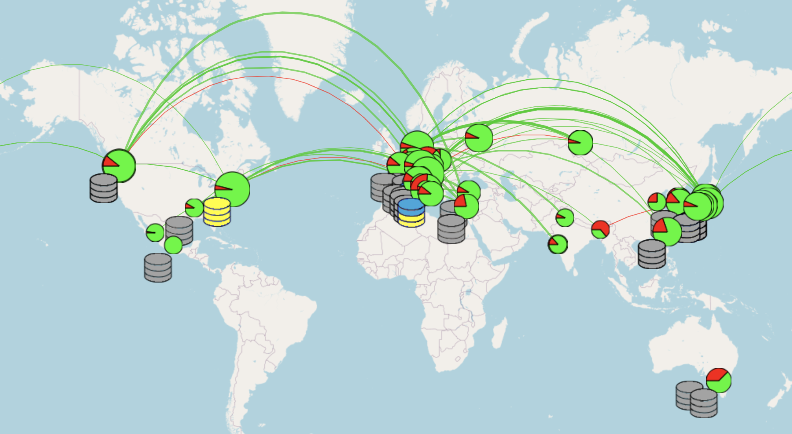
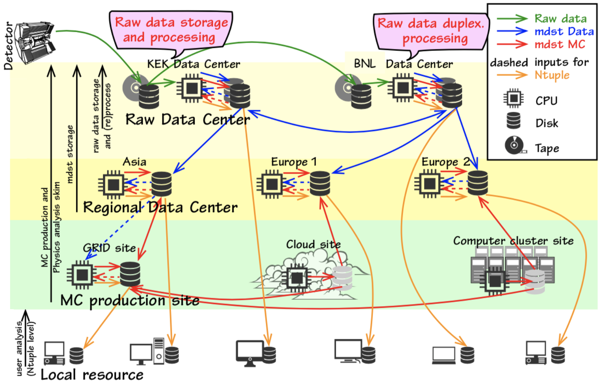

.. _onlinebook_computing_system:

System Overview
===============

The large luminosity delivered by Belle II means that we need to handle tens of petabytes of data
per year. To achieve the physics goals of the experiment, the data has to be reprocessed, distributed
and analyzed. It is hard to expect that a single computing site can provide the resources required to manage such a large data set.
Additionally, Belle II is a worldwide collaboration with more than 1000 scientists working in different regions
of the planet. Therefore, it is natural to adopt a distributed computing architecture in order to access data and obtain physics results
in a feasible time.

The main tasks of the computing system are to:

* process raw data
* produce Monte Carlo samples
* preserve data 
* skim data 
* provide resources for analyses 

The Belle II distributed computing system (also known as **the grid**) is a form of computing where a "virtual super computer" is
composed of many loosely networked computers. To the date, 75 computing sites and 32 storage elements contribute to the
distributed computing resources, managed by central services hosted at KEK and BNL. This allow us to execute
20K jobs in a geographically distributed environment.

    Snapshot of the `Belle II grid <https://belle2.jp/computing/>`_, composed by 75 computing sites around the world.

The Belle II grid uses the power of the
`DIRAC <http://diracgrid.org/>`_ Distributed Computing Framework to control the jobs. An extension, BelleDIRAC,
has been written for specific needs of the collaboration.

The client tools that communicate with DIRAC and BelleDIRAC
have been organized in a set of tools named **gbasf2**. As an analyst, datasets are
available for running analysis directly on the grid. The outputs can then be downloaded so that offline analysis
can be performed using local computing resources. One convenient feature of gbasf2 is it uses the same `basf2`
steering files used offline as input.

If you want to know how to use the grid, you can look at the extensive
`gbasf2 documentation <gbasf2.belle2.org>`_. 

.. seealso::

    More information can be found in the CHEP 2015 conference proceedings titled 
    `"Computing at the Belle II experiment" <https://iopscience.iop.org/article/10.1088/1742-6596/664/1/012002/meta>`_.

Data Processing Scheme
----------------------

The grid is where raw data processing is performed as well as all the processing needed for skimming and
the production of Monte Carlo samples. 

Raw Data Processing
^^^^^^^^^^^^^^^^^^^

In our computing model, all raw data produced by the experiment is uploaded and registered on the grid. After data
calibration is performed, data is reprocessed in the raw data centers to produce mDST files. You will find mDST files
distributed over many different storage sites. Analysts can then access these files by using the grid. 

All raw data is stored at KEK and dedicated data centres keep second copies of the full raw data set for backup. 

    The Belle II distributed computing model. Two copies of the raw data are stored and reprocessed at the raw data
    centers in order to produce mDST files.

Monte Carlo samples
^^^^^^^^^^^^^^^^^^^

In parallel, Monte Carlo (MC) samples are centrally produced in campaigns labeled as MCXX, with 'XX' being a sequential
number (MC15, MC16, etc). Usually, every time a major `basf2` release is available, a new MC campaign is launched.
Details about the produced MC samples are available in the
`Data Production GitLab Homepage <https://gitlab.desy.de/belle2/data-production/data/-/wikis/home>`_.

While generic MC samples are produced every campaign, MC samples for specific signal decays are handled by the
data production liaisons for each working group. You can look at the
`Data Production xWiki HomePage <https://xwiki.desy.de/xwiki/rest/p/df1b0>`_ to know who is the liaison for your
particular working group. 

.. seealso::

    More information on data production can be found in the CHEP 2015 conference proceedings titled
    `"Belle II production system" <https://iopscience.iop.org/article/10.1088/1742-6596/664/5/052028/meta>`_.

Skimming
^^^^^^^^

The purpose of skimming is to produce data and MC files that contain events which meet the criteria of each working
group. The criteria often depends on the type of physics that interests the working group. The benefit of skimming is that
it reduces the size of the dataset to be analysed, and therefore the CPU time required to run analysis jobs. Skims take mDST files
as inputs and produce uDST files, so if you see a uDST file you know it is the result of a skim. 

More information on skimming can be found in the dedicated :ref:`skim` documentation.

.. attention::

    It is now the official recommendation that analysts use skimmed uDST files (if available) rather than original mDST files

Computing Needs Your Help!
--------------------------

Computers are not so smart. Sometimes, they fail...

* "sometimes" x huge resources = **"often"**
* the computing system needs care for 24 hours x 7 days

You can start by caring for the computing system as a **data production shifter**. Not only do you help the computing group, but
you can also help complete the shift requirements for your institution. You can book your shifts
on `shift2.belle2.org <https://shift2.belle2.org/>`_

If you already have some experience as data production shifter, please consider becoming an **expert shifter**.
The `expert shifter training course <https://xwiki.desy.de/xwiki/rest/p/7e2d9/#HRoadtoanExpertShifter>`_ is open.

By doing these shifts, you will learn a lot about the computing system, and it continues to be an important service
for the entire collaboration.  

.. include:: ../lesson_footer.rstinclude

.. rubric:: Author of this lesson

Michel Villanueva, Priyanka Cheema
