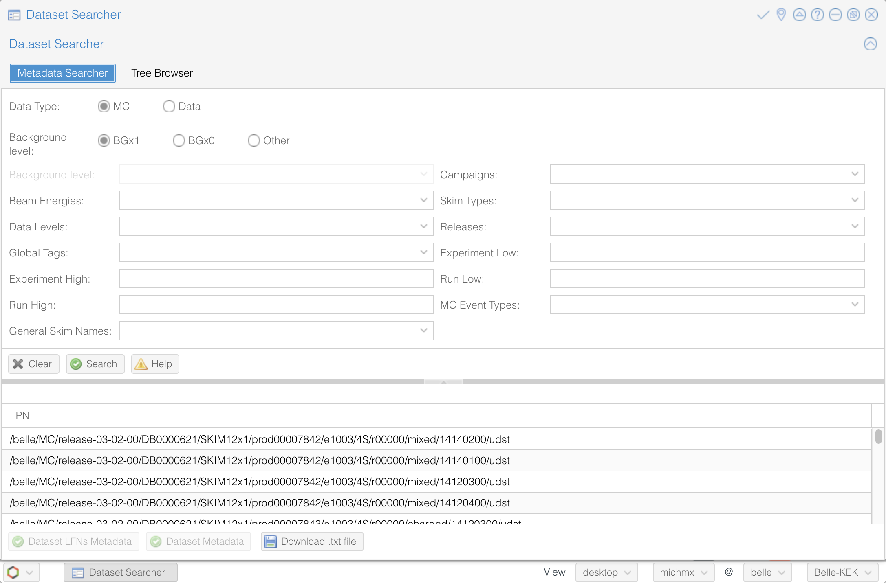
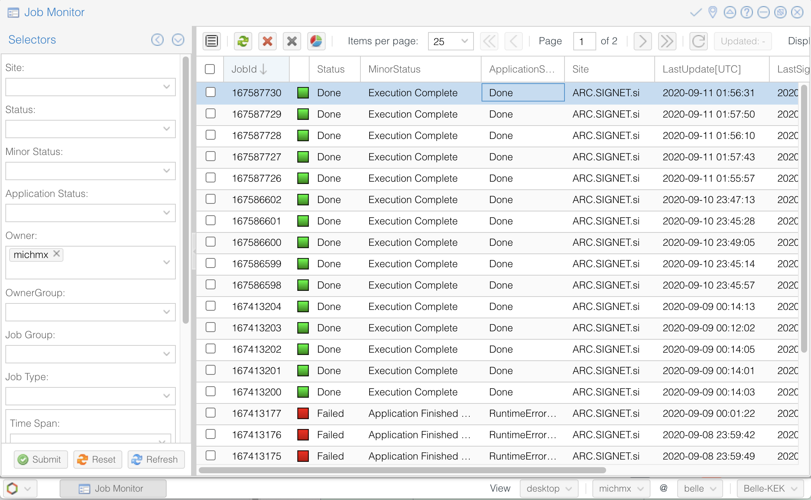

.. _onlinebook_gbasf2:

Gbasf2
======

.. sidebar:: Overview
    :class: overview

    **Teaching**: 45 min

    **Exercises**: 20-30 min

    **Prerequisites**:

        * `Computing getting started <https://confluence.desy.de/display/BI/Computing+GettingStarted>`_.
        * A system with SL6 or CentOS 7.
        * Grid certificate installed in ``~/.globus`` and on the web browser.
        * :ref:`onlinebook_first_steering_file` lesson.

    **Questions**:

        * What is gbasf2?
        * Where to search files on the grid?
        * How I monitor my jobs?
        * What to do if I need help?

    **Objectives**:

        * Install gbasf2 and set the environment for using grid tools.
        * Search datasets stored on the grid.
        * Submit jobs using gbasf2.
        * Monitor your jobs and take action if there are issues.
        * Check the documentation and ask for help if necessary.
        * Download the output for offline analysis.

Gbasf2 is the command-line client for submitting grid-based basf2 jobs.
Data and MC samples are distributed in many storage sites around the world, and the gbasf2 tools allow you to access and
analyze them.

The same steering files used with basf2 work with gbasf2, and the usual workflow is:

* First developing a basf2 steering file.
* Testing it locally.
* Locate your input files.
* Submit jobs to the grid with the same steering file.
* Download the output to perform the offline analysis (plots, fits, etc.)

.. warning::

    Before getting started, make sure you understand the following:

    * The GRID is NOT a local computing system like KEKCC.
    * Once you submit jobs, they will be assigned to computing systems around the world.
    * If your job is problematic, it will be distributed to the world and all sites will be affected.

Go to `computing getting started <https://confluence.desy.de/display/BI/Computing+GettingStarted>`_
and verify that you have the prerequisites. You need:

* A system with SL6 or CentOS 7.
* A valid grid certificate issued within a year and installed in ``~/.globus`` in ``.pem`` format.
* Belle Virtual Organization (VO) membership registered or renewed within a year at the
  `VOMS server <https://voms.cc.kek.jp:8443/voms/belle/>`_.
* Registration in `DIRAC <https://dirac.cc.kek.jp:8443/DIRAC/>`_.

.. note::

    It is required to join the `comp users forum <https://lists.belle2.org/sympa/info/comp-users-forum>`_,
    where you can ask for help and receive announcements on releases and system issues.

Installing gbasf2
-----------------

Since the DIRAC user interface relies on some middleware components, this limits the operating environments in which
gbasf2 can function. At this moment, only SL6 and CentOS 7 are supported.

Also, unfortunately at this moment the basf2 and gbasf2 environments are not compatible. This means gbasf2 requires
a fresh ssh session (without sourcing ``b2setup``).

.. note::

    Be sure that the userkey.pem has the ``rw`` permissions only for the owner and no permission to the others.
    You should see ``-rw-------`` with ``ls -l ~/.globus/userkey.pem``. Otherwise, use

    .. code-block:: bash

        chmod 600 ~/.globus/userkey.pem

Open a terminal and create a directory to store your gbasf2 installation. Inside, let's download the
installation script:

.. code-block:: bash

        mkdir gbasf2 && cd gbasf2
        wget -N http://dirac.cc.kek.jp/dirac/dirac-install.py
        python dirac-install.py -V Belle-KEK

Execute the installation script specifying the installation type with ``-V Belle-KEK``:

.. code-block:: bash

        python dirac-install.py -V Belle-KEK

Check that the execution finished without errors.

.. tip::

    If you see error messages,
    a `gbasf2 troubleshooting <https://confluence.desy.de/display/BI/GBasf2+Troubleshooting>`_ is available.

Proceed to the post-installation configuration:

.. code-block:: bash

        source bashrc && dirac-proxy-init -x
        dirac-configure --cfg defaults-Belle-KEK.cfg

Setting your gbasf2 environment
^^^^^^^^^^^^^^^^^^^^^^^^^^^^^^^

Once the above installation is done, you only need to execute two commands every time that you open a new terminal:

.. code-block:: bash

        source ~/gbasf2/BelleDIRAC/gbasf2/tools/setup
        gb2_proxy_init -g belle

It will ask for your certificate password before generating your credentials. Once created, your proxy will be valid
for 24 hours. You just need to execute ``gb2_proxy_init -g belle`` again if your credentials expire.

.. seealso:: https://confluence.desy.de/display/BI/Computing+GBasf2

Locating datasets on the grid
-----------------------------

The most common task as user of the grid is the submission of jobs with input files

* From the official Belle MC campaigns.

* From the official data reprocessing and skims.

Files are stored around the world in the different storage elements.
Fortunately, as users, you don't have to worry about the physical location.
A file catalog keeps the record of where the files are located, and you just need to provide a logical identifier
of the interesting samples for your analysis.

Datasets and Datablocks
^^^^^^^^^^^^^^^^^^^^^^^

A **logical file name** (LFN) is the unique identifier of a file in the Belle II grid in the form of a unix-like file path
(starting always with /belle):

.. code-block:: bash

        /belle/data_type/some_more_directories/dataset/datablock/file

A replica catalog resolves the LFN, and provides the information of where to find the files.
Then, you only need to provide the LFN(s) relevant for your analysis, without dealing with the physical location of the
samples.

Files are classified inside datasets.
Examples of LFNs for datasets are:

.. code-block:: bash

        # A mdst dataset of data from exp 10
        /belle/Data/proc/release-04-02-02/DB00000938/proc11/prod00013368/e0010/4S/r03774/mdst

        # A udst dataset of data from exp 10
        /belle/Data/release-05-01-03/DB00001363/SkimP11x1/prod00016031/e0010/4S/r04275/18530200/udst

        # A MC sample of charged B mesons
        /belle/MC/release-04-00-03/DB00000757/MC13a/prod00009435/s00/e1003/4S/r00000/charged/mdst

By design, a directory on the grid can only contain 1000 files at most. For this reason, the concept of datablock
is introduced. Each dataset is subdivided by directories with name ``subXX``, where the last two digits are sequential
(``sub00, sub01, ...``).

.. admonition:: Key points
    :class: key-points

    * By design, each datablock contains a maximum of 1000 files.
    * If a dataset contains more than 1000 files, it will be subdivided into at least two datablocks.

The command-line tool for listing the content of a directory on the grid is ``gb2_ds_list``
(it is equivalent to ``ls`` on your local system). You can use it to see how many datablock(s) is/are contained
in each dataset.

.. tip::

    All the gbasf2 command-line tools (sometimes called gb2 tools) have the flags ``--help``
    and ``--usage`` to see all the available options.

.. admonition:: Exercise
     :class: exercise stacked

     Use ``gb2_ds_list`` to see how many datablock(s) is/are contained in the skimmed dataset

     ``/belle/Data/release-05-01-03/DB00001363/SkimP11x1/prod00016031/e0010/4S/r04275/18530200/udst``

.. admonition:: Hint
     :class: toggle xhint stacked

     Remember to set your gbasf2 environment first, otherwise the tool will not be found.

.. admonition:: Solution
     :class: toggle solution

     Executing ``gb2_ds_list /belle/Data/release-05-01-03/DB00001363/SkimP11x1/prod00016031/e0010/4S/r04275/18530200/udst``
     will show you that the dataset contains 1 datablock, ``sub00``.

.. note::

    Sometimes, in the documentation (such as in the Confluence pages) we refer to the **logical path name** (LPN)
    of datasets and datablocks, while for files we use LFN. In practice, LFN and LPN are the same thing.

The Dataset Searcher
^^^^^^^^^^^^^^^^^^^^

The Dataset Searcher is a web application to find datasets on the grid.
Go to the `DIRAC webportal <https://dirac.cc.kek.jp:8443/DIRAC/>`_ and then open
Menu (the icon at the left-bottom) -> BelleDIRACApps -> Dataset Searcher.

You have the option of searching between data or MC, samples
with beam background (BGx1) or without (BGx0), and several other fields to refine your search. Play with all the
available options and get familiar with them.

    The Dataset Searcher at the DIRAC web portal.

.. note::

    Accessing the DIRAC web portal requires that your user certificate is installed in your web browser. See
    `computing getting started <https://confluence.desy.de/display/BI/Computing+GettingStarted>`_ for details.

The ``MC Event types`` box show, by default, the generic samples available (charged, mixed, uubar, etc.).
If you want to search
signal samples, you need to specify the `signal event type <https://confluence.desy.de/display/BI/Signal+EventType>`_.
Also, if you want to search uDST skim samples - which are what we will be using in the examples - you can find them at
:ref:`skim/doc/04-experts:Skim Registry` section in the basf2 software documentation.

.. note::

    Here, and in some of the exercises/examples to follow, we will be using the data-level format known as **uDST**.
    uDSTs (short for **user Data Summary Table**) is a format type that results from performing analysis skims on an
    input dataset (usually of mDST format) that reduces the size of the input dataset to a more manageable size by
    applying certain selection cuts. By doing this, the uDST contains a select amount of events from the input dataset
    that can be useful for a certain type of analysis.

.. note::

    For further information about uDST skims, including the skim code and the decay name associated with that code,
    see the basf2
    `skim registry <https://stash.desy.de/projects/B2/repos/software/browse/skim/scripts/skim/registry.py>`_.

.. admonition:: Exercise
     :class: exercise stacked

     Open the Dataset Searcher and obtain the first LFN you see with an ``MC Event type`` of ``mixed`` from the
     uDST skim sample for the decay mode ``B0 -> [D- -> K_S0 pi-]pi+``, with beam background (BGx1) in the simulation.

.. admonition:: Hint
     :class: toggle xhint stacked

     Search the basf2
     `skim registry <https://stash.desy.de/projects/B2/repos/software/browse/skim/scripts/skim/registry.py>`_ and look
     at the skim codes and names.

.. admonition:: Another hint
     :class: toggle xhint stacked

     The skim code is ``14120601``.

.. admonition:: Solution
     :class: toggle solution

     The first LFN shown with an ``MC Event type`` of ``mixed`` for skim code ``14120601`` is
     ``/belle/MC/release-04-02-00/DB00000898/SkimM13ax1/prod00013006/e1003/4S/r00000/mixed/14120601/udst``.

.. tip::

    You can download a list of LFNs from the Dataset Searcher using the button "Download txt file" at the bottom.

Another way to interact with the dataset searcher is using the command line tool ``gb2_ds_search``.

.. admonition:: Exercise
     :class: exercise stacked

     Set your gbasf2 environment and try to get the LFNs of MC uubar samples using the same skim code from the
     decay mode above (``14120601``), and using campaign ``SkimM13ax1`` along with beam energy of 4S and background
     level BGx1 using ``gb2_ds_search``.

.. admonition:: Hint
     :class: toggle xhint stacked

     Use ``--help`` and ``--usage`` to get all the available options

.. admonition:: Solution
     :class: toggle solution

     The execution and result from the command line are as follows:

     .. code-block:: bash

         gb2_ds_search dataset --data_type mc --skim_decay 14120601 --campaign SkimM13ax1 --beam_energy 4S --mc_event uubar --bkg_level BGx1

         Matching datasets found:
         /belle/MC/release-04-02-00/DB00000898/SkimM13ax1/prod00013046/e1003/4S/r00000/uubar/14120601/udst
         /belle/MC/release-04-02-00/DB00000898/SkimM13ax1/prod00013047/e1003/4S/r00000/uubar/14120601/udst
         /belle/MC/release-04-02-00/DB00000898/SkimM13ax1/prod00013048/e1003/4S/r00000/uubar/14120601/udst
         /belle/MC/release-04-02-00/DB00000898/SkimM13ax1/prod00013049/e1003/4S/r00000/uubar/14120601/udst
         /belle/MC/release-04-02-00/DB00000898/SkimM13ax1/prod00013050/e1003/4S/r00000/uubar/14120601/udst
         /belle/MC/release-04-02-00/DB00000898/SkimM13ax1/prod00013051/e1003/4S/r00000/uubar/14120601/udst
         /belle/MC/release-04-02-00/DB00000898/SkimM13ax1/prod00013052/e1003/4S/r00000/uubar/14120601/udst
         /belle/MC/release-04-02-00/DB00000898/SkimM13ax1/prod00013053/e1003/4S/r00000/uubar/14120601/udst
         /belle/MC/release-04-02-00/DB00000898/SkimM13ax1/prod00013054/e1003/4S/r00000/uubar/14120601/udst
         /belle/MC/release-04-02-00/DB00000898/SkimM13ax1/prod00013055/e1003/4S/r00000/uubar/14120601/udst

Submit your first jobs to the Grid
----------------------------------

As mentioned before, gbasf2 uses exactly the same steering files of basf2 to submit jobs to the grid. The basic usage is

.. code-block:: bash

        gbasf2 <your_steering_file.py> -p <project_name> -s <available_basf2_release>

where ``project_name`` is a name assigned by you, and ``available_basf2_release`` is the available basf2 software
version to use.

.. note::

    The maximum length for a project name is 32 characters.

.. warning::

    Do not use special characters in the project names ($, #, %, /, etc.),
    it could create problems with file names in some sites and in the databases
    (we allow only ``[^a-zA-Z0-9+-_]``).

Once you located the dataset to use for your analysis, you can specify the LPN of the **dataset** to use as input
with the flag ``-i``.

.. note::

    The Dataset Searcher provides the LPN for datasets which gbasf2 can use as input when submitting jobs.
    Prior to the latest releases of BelleDIRAC, there was a need to append ``sub00, sub01, ...`` to the LPNs provided
    by the Dataset Searcher, but datablocks are now automatically appended to the dataset LPN when jobs are submitted.
    You can, if you wish to use only one datablock, append to the end of the dataset LPN the datablock of your
    choosing, but this is no longer strictly required.

.. note::

    You may hit the 1000 job limit with certain datasets. In those cases, your project should be divided by
    specifying the datablock(s) during the submission.

Everything clear? Ok, let's submit your first jobs.

.. warning::

    Remember: you must carefully check your jobs with a local computing system,
    e.g. KEKCC, before you submit jobs to GRID.

Let's use the steering file located at
``~michmx/public/tutorial2020/Reconstruct_Bd2JpsiKS_template.py`` on KEKCC (take a look at what contains).
If we are interested in running over a generic uubar sample, then the LFN of one datablock is
``/belle/MC/release-04-00-03/DB00000757/MC13a/prod00009436/s00/e1003/4S/r00000/uubar/mdst/sub00`` (you obtained it in a
previous exercise, remember?).

With all this information,
let's submit the gbasf2 jobs:

.. code-block:: bash

    gbasf2 -p gb2Tutorial_Bd2JpsiKs -s light-2106-rhea \
           -i /belle/MC/release-04-00-03/DB00000757/MC13a/prod00009436/s00/e1003/4S/r00000/uubar/mdst/sub00 \
           ~michmx/public/tutorial2020/Reconstruct_Bd2JpsiKS_template.py

A project summary and a confirmation prompt will be displayed after excecuting gbasf2

.. code-block:: bash

    ************************************************
    *************** Project summary ****************
    ** Project name: gb2Tutorial_Bd2JpsiKs
    ** Dataset path: /belle/user/michmx/gb2Tutorial_Bd2JpsiKs
    ** Steering file: /home/michmx/public/tutorial2020/Reconstruct_Bd2JpsiKS_template.py
    ** Job owner: michmx @ belle (105:58:39)
    ** Preferred site / SE: None / None
    ** Input files for first job: LFN:/belle/MC/release-04-00-03/DB00000757/MC13a/prod00009436/s00/e1003/4S/r00000/uubar/mdst/sub00/mdst_000001_prod00009436_task10020000001.root
    ** Number of data sets: 1
    ** Number of input files: 803
    ** Number of jobs: 803
    ** Processed data (MB): 968305
    ** Processed events: 158623897 events
    ** Estimated CPU time per job: 3293 min
    ************************************************
    Are you sure to submit the project?
    Please enter Y or N:

After verifying that everything is correct, you can confirm the submission.

.. admonition:: Question
     :class: exercise stacked

     What is the the basf2 release in the example above?

.. admonition:: Solution
     :class: toggle solution

     The basf2 light release is ``light-2106-rhea``.

.. tip::

    You can check which basf2 releases are available for running jobs on the grid using ``gb2_check_release``.

.. admonition:: Key points
    :class: key-points

    * A gbasf2 project can be submitted **per dataset** or **per datablock**.

      * If submitted **per dataset**, all datablocks within the specified dataset will be resolved.

    * Inside the project, gbasf2 will produce file-by-file jobs.

    * The number of output files in the project will be the number of files in the input datablock.

.. admonition:: Exercise
     :class: exercise stacked

     Submit a gbasf2 job with an steering file built by you in previous chapters of the book, for analyzing
     a datablock of MC13a, MC Event Types ``charged`` with energy ``4S`` and without beam background.
     Use ``light-2106-rhea`` of basf2.

     Remember:

     * Prepare your steering file.
     * Search the input dataset.
     * Submit using gbasf2.

.. admonition:: Hint
     :class: toggle xhint stacked

     Use the Dataset Searcher to locate MC13a datasets of MC Event Types ``charged`` and ``BGx0``.

.. admonition:: Additional hint
     :class: toggle xhint stacked

     The input dataset may be obtained using

     .. code-block:: bash

        gb2_ds_search dataset --data_type mc --campaign MC13a --beam_energy 4S --mc_event charged --bkg_level BGx0

     Next, choose one of the datasets listed after executing the command above and use that dataset with the command
     ``gb2_ds_list <dataset_LPN>`` to see what datablock(s) are available in your chose dataset.
     Recall that, if you wish to run over one specific datablock from a dataset, you can add ``sub00, sub01, ...``
     at the end of the dataset LPN. For the datasets listed from search done above, there is only one datablock
     (``sub00``) available for each dataset. So, for this exercise, we will submit our gbasf2 job using the dataset LPN
     as our input.

.. admonition:: Solution
     :class: toggle solution

     .. code-block:: bash

        gbasf2 -i /belle/MC/release-04-00-03/DB00000757/MC13a/prod00009551/s00/e1003/4S/r00000/charged/mdst
        -s light-2106-rhea -p myFirstProject <your steering file>

Submit jobs with multiple LFNs
^^^^^^^^^^^^^^^^^^^^^^^^^^^^^^

As we have already stated, with the newest releases of BelleDIRAC, there is no longer a need to append the datablock
``(sub00, sub01, ...)`` to the end of the dataset LPN. But, with certain datasets, you may hit the 1000 job limit.
In those instances, you should specify a datablock (or, datablocks). If you want (or need) to submit a project
with several datablocks, you can prepare a list of LFNs on a file and provide it to gbasf2 using ``--input_dslist``.

.. tip::

    If necessary for the dataset you are using, a quick way of appending ``/sub00`` to a list of LFNs obtained from the
    Dataset Searcher is using ``sed``:

    .. code-block:: bash

        sed -i 's/mdst/mdst\/sub00/g' listOfLFNs.list

    .. note::

        In the example above, we are using the ``s/search/replace/g`` syntax of ``sed``. Note that, when applicable,
        we must escape additional slashes. That is, like in the example above, we want to replace ``mdst`` with
        ``mdst/sub00``, so to do this we must use ``\`` before ``/sub00``. In addition, we use the flag ``-i`` which
        allows us to edit files in-place.

.. note::

    For more information on using ``sed``, see the GNU `sed manual <https://www.gnu.org/software/sed/manual/sed.html>`_.

Monitoring jobs
---------------

There are two ways to monitor your jobs on the grid: command-line tools and the DIRAC web portal.

Monitoring in the terminal
^^^^^^^^^^^^^^^^^^^^^^^^^^

For the command-line tools, you can use ``gb2_project_summary``
to have an overview of your project (The flag ``-p`` will specify the project name):

.. code-block:: bash

    gb2_project_summary -p gb2Tutorial_Bd2JpsiKs

           Project          Owner    Status    Done   Fail   Run   Wait   Submission Time(UTC)   Duration
    =====================================================================================================
    gb2Tutorial_Bd2JpsiKs   michmx   Running   0      0      5     0      2020-07-07 08:41:40    00:01:15

.. tip::

    If no project name is specified, the tool will display information of your projects in the last month.

The gb2 tool ``gb2_job_status`` lists all the jobs running in a project, including the status and minor status:

.. code-block:: bash

    gb2_job_status -p gb2Tutorial_Bd2JpsiKs

    5 jobs are selected.

     Job id     Status         MinorStatus        ApplicationStatus      Site
    =============================================================================
    161844659   Running   Application             Running             LCG.KEK2.jp
    161844660   Running   Application             Running             LCG.KEK2.jp
    161844661   Running   Input Data Resolution   Unknown             LCG.Pisa.it
    161844662   Running   Application             Running             LCG.KEK2.jp
    161844663   Running   Application             Running             LCG.KEK2.jp

    --- Summary of Selected Jobs ---
    Completed:0  Deleted:0  Done:0  Failed:0  Killed:0  Running:5  Stalled:0  Waiting:0

Monitoring using the web portal
^^^^^^^^^^^^^^^^^^^^^^^^^^^^^^^

The second way is looking at the job monitor in the `DIRAC web portal <https://dirac.cc.kek.jp:8443/DIRAC/>`_.

* Open the portal, click on the logo at the bottom-left and go to Applications/Job Monitor.
* You have to click on 'Submit' to display the information.

You should see something like this:

    The Job Monitor at the DIRAC web portal.

.. tip::

    The Job Monitor includes many tools and features to track and manage your jobs, including a statistics panel
    (pie icon at the left-top). Get familiar with them.

.. admonition:: Exercise
     :class: exercise stacked

     Monitor the jobs that you have submitted in the previous exercise. Wait until they finish successfully.

.. admonition:: Hint
     :class: toggle xhint stacked

      Do you see failed jobs? Go to the last section "Dealing with issues".

.. admonition:: Solution
     :class: toggle solution

     Use the DIRAC web portal and open the Job Monitor. Jobs in green are in 'Done' status, while the failed ones are in red.

Downloading the output
----------------------

If all your jobs finished successfully (have status 'Done'), then you can download the output.
The output files will be located below your user space (``/belle/user/<username>/<project_name>``).
You can check the output using ``gb2_ds_list <project_name>``:

.. code-block:: bash

    gb2_ds_list gb2Tutorial_Bd2JpsiKs

    /belle/user/michmx/gb2Tutorial_Bd2JpsiKs/Bd2KpsiKs_0.root
    /belle/user/michmx/gb2Tutorial_Bd2JpsiKs/Bd2KpsiKs_1.root
    /belle/user/michmx/gb2Tutorial_Bd2JpsiKs/Bd2KpsiKs_2.root
    /belle/user/michmx/gb2Tutorial_Bd2JpsiKs/Bd2KpsiKs_3.root
    /belle/user/michmx/gb2Tutorial_Bd2JpsiKs/Bd2KpsiKs_4.root

.. tip::

    To see the size of your output and its location, you can use the flags ``-l`` and ``-lg``.

To actually download the files, use ``gb2_ds_get``:

.. code-block:: bash

    gb2_ds_get gb2Tutorial_Bd2JpsiKs

    Download 5 files from SE
    Trying to download srm://kek2-se03.cc.kek.jp:8444/srm/managerv2?SFN=/disk/belle/TMP/belle/user/michmx/gb2Tutorial_Bd2JpsiKs/Bd2KpsiKs_4.root to /home/michmx/gbasf2Tutorial/gb2Tutorial_Bd2JpsiKs/Bd2KpsiKs_4.root
    Trying to download srm://kek2-se03.cc.kek.jp:8444/srm/managerv2?SFN=/disk/belle/TMP/belle/user/michmx/gb2Tutorial_Bd2JpsiKs/Bd2KpsiKs_1.root to /home/michmx/gbasf2Tutorial/gb2Tutorial_Bd2JpsiKs/Bd2KpsiKs_1.root
    ...

    Successfully downloaded files:
    /belle/user/michmx/gb2Tutorial_Bd2JpsiKs/Bd2KpsiKs_4.root
    /belle/user/michmx/gb2Tutorial_Bd2JpsiKs/Bd2KpsiKs_1.root
    /belle/user/michmx/gb2Tutorial_Bd2JpsiKs/Bd2KpsiKs_3.root
    /belle/user/michmx/gb2Tutorial_Bd2JpsiKs/Bd2KpsiKs_0.root
    /belle/user/michmx/gb2Tutorial_Bd2JpsiKs/Bd2KpsiKs_2.root in /home/michmx/gbasf2Tutorial/gb2Tutorial_Bd2JpsiKs

    Failed files:

.. tip::

    Keep in mind: as far as you have a gbasf2 installation, you can submit jobs or download files from any machine.

.. admonition:: Exercise
     :class: exercise stacked

     Download the output of your jobs submitted in a previous exercise. Verify that they are readable using ROOT.

.. admonition:: Hint
     :class: toggle xhint stacked

     First check that all your jobs finished successfully. Issues? Go to the next section.

.. admonition:: Solution
     :class: toggle solution

     Just use ``gb2_ds_get <your project name>`` (Easy, right?).

Dealing with issues
-------------------

Sometimes, things do not go well. A few jobs can fail because a large list of reasons, like

* A timeout in the transfer of a file between sites.
* A central service not available for a short period of time.
* An issue in the site hosting the job.
* etc.

Some of my jobs failed
^^^^^^^^^^^^^^^^^^^^^^

If you find that **some** of your jobs failed, most probably there was a temporal issue with your job or the site.
You need to reschedule these jobs by yourself.

You can use ``gb2_job_reschedule -p <project name>``:

.. code-block::

    gb2_job_reschedule --usage

    Resubmit failed jobs or projects.
    Only jobs which have fatal status (Failed, Killed, Stalled) are affected.
    Exact same sandbox and parameters are reused. Thus you may need to submit different job if they are wrong.

    By default, select only your jobs in current group.
    Please switch group and user name by options.
    All user's jobs are specified by '-u all'.

    Examples:

    % gb2_job_reschedule -j 723428,723429
    % gb2_job_reschedule -p project1 -u user

Or you can use the job monitor in the DIRAC web portal, selecting the failed jobs and clicking the **'Reschedule'**
button.

All my jobs failed
^^^^^^^^^^^^^^^^^^

If **all** your jobs failed, most probably something is wrong with the steering file or the gbasf2 arguments
(Did you test your steering file locally before submitting the jobs?).

A useful way to track which was the problem is (if possible) downloading the output sandbox. It contains the logs
related to your job.

.. figure:: getSandbox.png
    :align: center
    :width: 600px
    :alt: The job monitor

    How to download the output sandbox from the Job Monitor.

It is also possible to retrieve the log files directly from the command line using ``gb2_job_output``:

.. code-block:: bash

    gb2_job_output -j 161846653

    download output sandbox below ./log/JOBID
    1 jobs are selected.
    Please wait...
                               Result for jobs: ['161846653']
    =====================================================================================
    Downloaded: "Job output sandbox retrieved in /home/michmx/gb2_tutorial/log/161846653"

.. admonition:: Exercise
     :class: exercise stacked

     Download the output sandbox of one of your jobs. Check what is inside.

.. admonition:: Hint
     :class: toggle xhint stacked

     One of the logs inside may look very familiar.

.. admonition:: Solution
     :class: toggle solution

     The file ``basf2helper.py.log`` contains the actual output of your basf2 steering file executed on the grid site.

Where to go for help?
---------------------

The `comp users forum <https://lists.belle2.org/sympa/info/comp-users-forum>`_ is the main channel of communication
related to issues with the grid. Feel free to ask every time that you need help.

Additionally, some pages at Confluence are prepared with additional information:

* `Gbasf2 mainpage <https://confluence.desy.de/display/BI/Computing+GBasf2>`_
* `Gbasf2 FAQ <https://confluence.desy.de/display/BI/GBasf2+FAQ>`_ and `troubleshooting <https://confluence.desy.de/display/BI/gbasf2+trouble+shooting>`_
* `Computing glossary <https://confluence.desy.de/display/BI/Computing+Glossary>`_

Take a look to the `gbasf2 tutorials <https://confluence.desy.de/display/BI/GBasf2+Tutorials>`_ (they contain some advanced topics not covered here).

You can also ask in `questions.belle2.org <https://questions.belle2.org/questions>`_.

.. include:: ../lesson_footer.rstinclude

.. topic:: Author of this lesson

    Justin Guilliams
