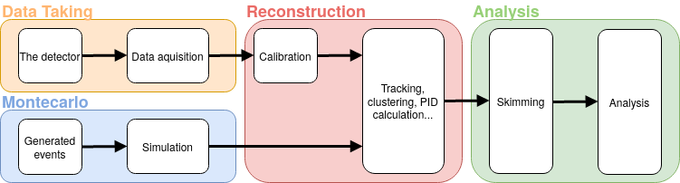

.. _onlinebook_fundamentals:

Fundamentals
============

.. sidebar:: Overview
    :class: overview

    **Teaching**: 2-3 hrs

    **Prerequisites**:

        * What is a B factory?

    **Objectives**:

        * A first introduction to all of the basic concepts in a HEP analysis.
        * A "big picture" overview of what the Belle II software is supposed
          to do.
        * Be aware of important Belle II reference documents and (at least)
          have spend a bit of time navigating them.

In this section you will learn the basic concepts underlying an analysis at
Belle II, starting from how the data acquisition works and ending to the
description of the most common analysis concepts.

The workflow that goes from the data taking to the publication of any
measurement in High-Energy Physics (HEP) experiment is quite complex.
The data analysis itself involves multiple steps that can take months or even years,
and this comes on top of the time required to take the data,
process them, and produce the corresponding simulated events.
While the details of all these procedures can be extremely complex and tedious, the
overall picture is simple enough to be fitted in a human-readable scheme:

Starting from the end, you can see that the input to the analysis are
reconstructed and skimmed events. These come either from the actual real data or
from the generation of simulated events (in jargon Monte Carlo, often misspelled
"Montecarlo", or MC).

* The skimming is necessary to reduce the size of the dataset. This will
  simplify and speed-up the analysis.
* The reconstruction step is the same for both real and simulated data to
  minimize the differences between the two, except that the data need to be
  first calibrated.

The following sections will quickly go through each of the four blocks in which
the workflow is split, covering the very basic concepts and deferring most of the
technical explanations about how the software works to the other chapters.

.. toctree::
   :glob:
   :maxdepth: 1

   fundamentals/*

.. topic:: Author(s) of this lesson

    Umberto Tamponi,
    Martin Ritter,
    Oskar Hartbrich,
    Michael Eliachevitch,
    Sam Cunliffe
