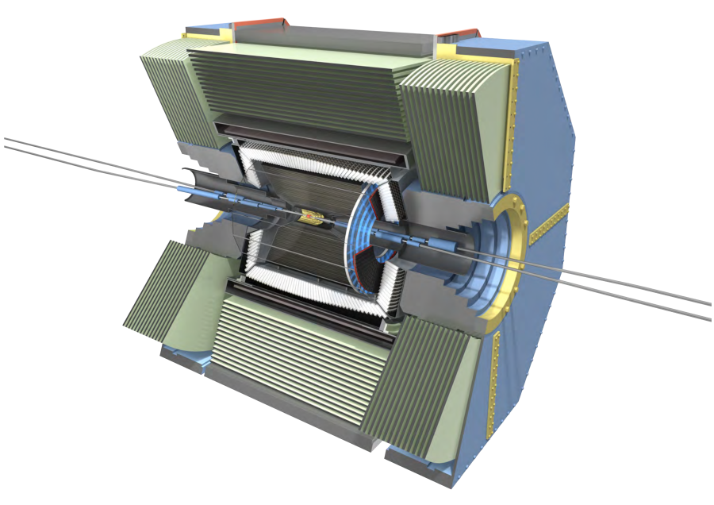
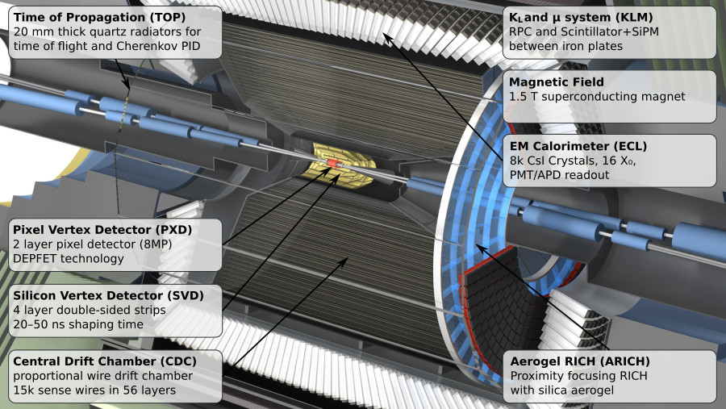
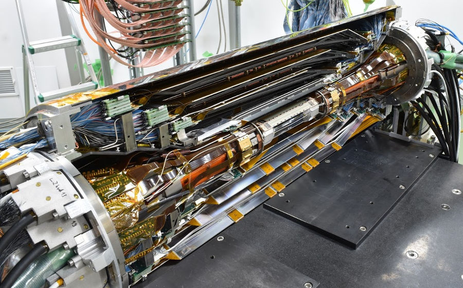
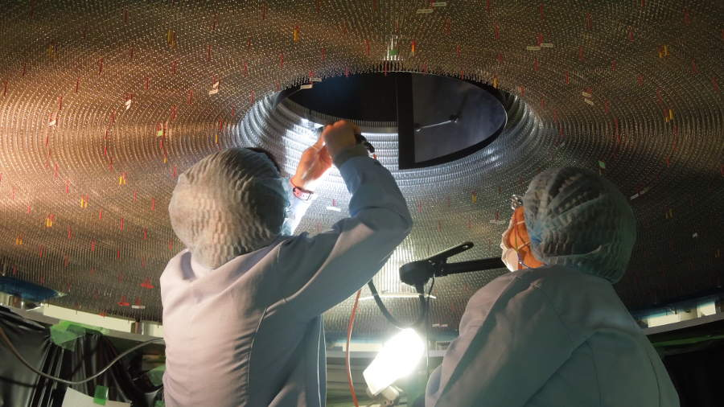
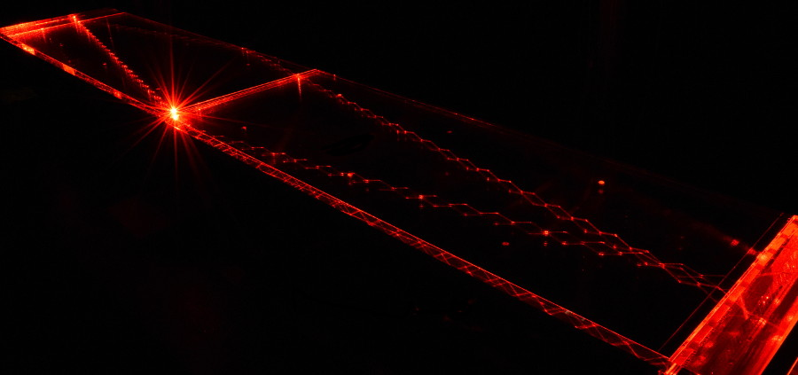
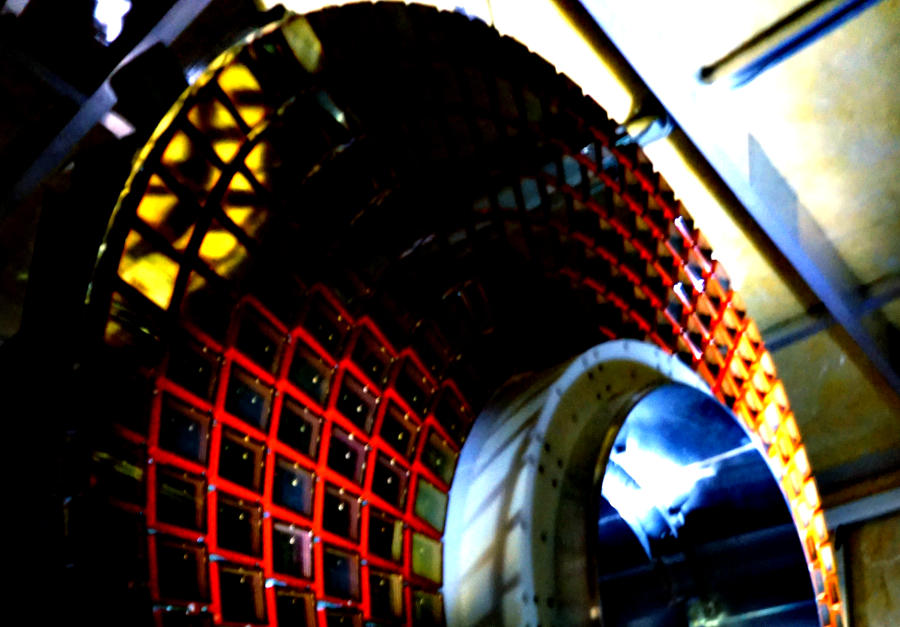
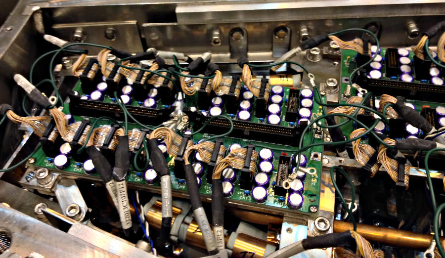
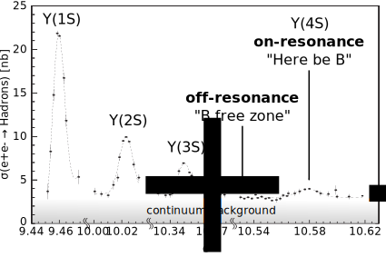
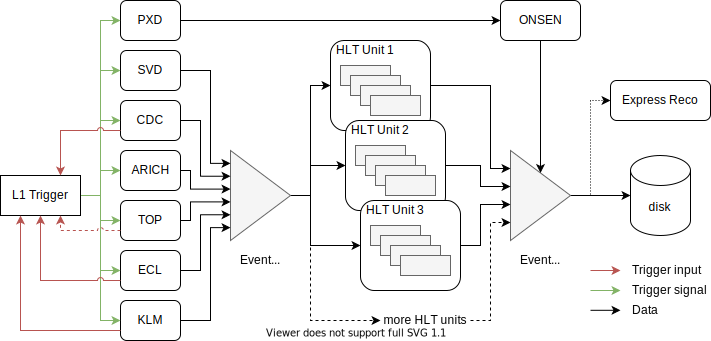
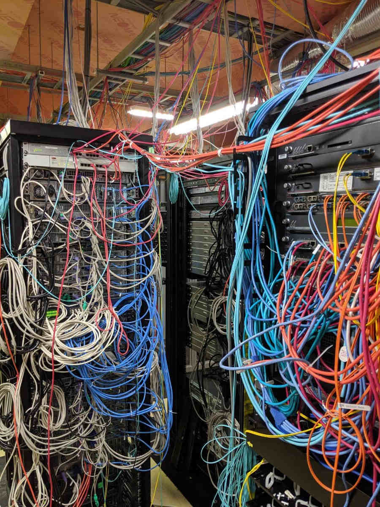

.. _onlinebook_fundamentals_datataking:

Data Taking
===========

.. sidebar:: Overview
    :class: overview

    **Teaching**: 45 min

    **Prerequisites**:

        * :ref:`Fundamentals Introduction <onlinebook_fundamentals_introduction>`

    **Objectives**:

        * Understand the different detector systems in Belle II.
        * Definiton of triggers and their effects.

One of the most important steps is of course to record the data we want to
analyse. In this chapter we will go through the important concepts of the Belle
II detector and how we record data. Understanding these concepts is fundamental
for any analysis.

The Experiment
--------------

If you are reading this manual, you are probably already at least partially
familiar with the general layout of the SuperKEKB accelerator and the Belle II
experiment. However, before moving on, let's very quickly review their structure.

The SuperKEKB accelerator circulates electrons and positrons through its roughly
3 km circumference tunnel in opposite directions. These beams are asymmetric in
momentum, with the electrons kept at around 7 GeV/c and the positrons at around
4 GeV/c. At a single point on the accelerator ring, the two beams are steered
into (almost) head-on collision, resulting in a center-of-mass energy of
typically around 10.58 GeV, corresponding to the :math:`\Upsilon(4S)` resonance.
The point of collision is named the "interaction region".
The  center of mass energy can be changed to take data at other resonances of the
:math:`\Upsilon` family, from around 9.4 to 11 GeV, for the non-B physics part
of the physics program.

.. admonition:: Question
    :class: exercise stacked

    At LHC, every bunch collision generates dozens of individual particle
    interactions that overlay each other in the detectors (pile-up),
    considerably complicating the data analysis.
    This doesn't seem to be a problem at SuperKEKB and Belle II. Why?

.. admonition:: Hint
    :class: toggle xhint stacked

    Start with the planned final instantaneous luminosity of SuperKEKB. How
    many bunch crossings will happen per second?
    Then think about the typical cross sections in :math:`e^+e^-` collisions
    as discussed previously.

.. admonition:: Another hint
    :class: toggle xhint stacked

    The goal instantaneous luminosity of SuperKEKB is :math:`8\times 10^35\, \textrm
    {cm}^{-2} \textrm{s}^{-1}`. It takes a beam particle bunch roughly 10 μs to complete
    a full revolution around the accelerator ring. Up to 2376 bunches will circulate
    in each ring.

.. admonition:: Solution
    :class: toggle solution

    At a final design luminosity of :math:`8\times 10^{35}\, \textrm{cm}^{-2}\textrm{s}^
    {-1}` at 2376 bunches per ring, each taking about 10 μs to complete a revolution, the
    delivered luminosity per bunch crossing is about :math:`8\times 10^{35}\, \textrm
    {cm}^{-2} \textrm{s}^{-1} \cdot 10\times 10^{-6}\ \textrm{s} / 2376 = 3.4\times10^{-6}\,
    (\textrm{nb})^{-1}`, so even the most likely Bhabha process at :math:`125\,
    \textrm{nb}` only happens about once every
    :math:`(3.4\times 10^{-6}\cdot 125)^{-1} \approx 2400` bunch crossings.

    The Belle II detector.

The detector is built around the interaction region, with the goal to
detect and measure as many of the particles produced in the SuperKEKB collisions
as possible. Belle II consists of several sub-systems, each one dedicated to a
specific task: reconstruct the trajectory of charged track, reconstruct the
energy of photons, identify the particle type or to identify muons and
reconstruct long-living hadrons. Of course some systems can be used for
multiple purposes: for example, the ECL is mainly intended as a device to
reconstruct photons, but is also used to identify electrons and hadrons.

Due to the asymmetry of the SuperKEKB collisions, the detector is
asymmetric along the beam axis. In the context of Belle II the "forward"
direction is the direction in which the high energy electron beam points, while "backward"
is the direction in which the lower energy positron beam points.

.. seealso::

    There is an important document for any large HEP detector called the
    **Technical Design Report** (TDR). This document contains the proposed design
    of the experiment.

    The Belle II TDR is `arXiv:1011.0352 <https://arxiv.org/abs/1011.0352>`_.

     Unfortunately, some of the details are now outdated (that document dates 2010).
     Particularly, we do not recommend you rely on this for performance studies.

    Nonetheless you should know what it is, because people might mention it.
    You may need to reference it in your thesis.

    Closeup of the Belle II detector indicating all the different sub detectors.

Beam Pipe
    The beam pipe itself is not an active part of the detector, but plays the crucial
    role of separating the detector from the interaction region, which is located in
    the low-pressure vacuum of the SuperKEKB rings. It is a cylindrical pipe designed
    to be as thin as possible in order to minimize the particle's energy loss in it,
    but it is also crucial to absorb most of the soft synchrotron X-rays emitted by
    the beams before they can hit the detector. Otherwise they would represent
    a major source of noise for the innermost detector, the PXD.

PXD
    The first active system met by the particles that emerge form the IP is the
    PiXel Detector (PXD). With this Pixel detector can measure the position of
    each particle going through this detector with very high precision and thus,
    when combining different particles, get a very precise determination where
    these particles intersect. This intersection is called vertex and is usually
    where all the particles originate from: either the place of collision or
    where they were created when another particle decayed.

    You can think of the PXD as the inner vertex detector. The PXD is
    constructed from DEPFET silicon sensors segmented into individual 8 million
    pixels of down to 50 × 55 μm² size. It consists of two layers at 14 mm and
    22 mm radius from the interaction point.

SVD
    The Silicon Vertex Detector (SVD) is the outer part of the vertex detector.
    It comprises of double sided silicon microstrip sensors with strips widths
    down to 50 μm.

    A double sided strip detector is similar to a pixel detector in terms of
    precision but we don't have one 2D measurement of the position. Instead we
    have strips along the sensor on each side and measure two 1D positions: the
    horizontal and the vertical position on the sensor.

    The four layers of the SVD system extend the outer radius of the vertex
    detector up to 140 mm.

.. _vxd-description:

VXD
    You will occasionally hear people refer to the pair of detectors: PXD+SVD as
    the VerteX Detector (VXD). If you look at :numref:`fig:fundamentals_vxd` you
    can see that this does make sense as both systems are closely integrated
    with almost no space between them. Technically they are also installed
    together as one unit.

.. _fig:fundamentals_vxd:

    Picture of the VXD: In the middle you can see the PXD which is built around
    the Beam Pipe. Outside you can see the four layers of one half of the SVD.

.. admonition:: Optional Question (hard)
    :class: exercise stacked

    This is not a question we expect you to be able to answer but it might be
    good to think about it for a few minutes. So here goes:

    Why do we have both, a pixel and a strip detector?

.. admonition:: Hint
    :class: toggle xhint stacked

    Think about the differences that come from one 2D measurement vs. two 1D measurements

.. admonition:: Answer
    :class: toggle solution

    A strip detector measures the position of a particle by measuring vertical
    and horizontal position in the sensor. This means we get two measurements we
    can correlate to the position of the particle.

    The benefit is that we have much less readout channels: instead of :math:`X
    * Y` pixels we have :math:`X + Y` strips. This means readout can be much
    faster and the data size will be much much smaller.

    But if we have multiple particles hitting the same sensor then this can
    become problematic: we have to combine the horizontal and vertical
    measurements and for :math:`N` particles passing the sensor this gives us
    :math:`N^2` possible combinations.

    So very close to the collision, where we expect the highest density of
    particles, it is usually much better to use a pixel detector even though the
    data size will be much larger.

    And that's why we have a smaller pixel detector very close to the
    interaction region and then a larger strip detector a bit further away.

.. _cdc-description:

CDC
    The main tracking system for Belle II is the Central Drift Chamber (CDC).
    It is comprised of so-called sense wires suspended in He-C₂H₆ gas. Charged
    particles passing through the gas cause ionisation charges, which then
    drift (hence the name) to nearby sense wires, where `gas amplification
    <https://en.wikipedia.org/wiki/Townsend_discharge>`_ causes signal
    propagation. You will hear people refer to these ionisation signals as
    "hits" in the CDC.

    A charged particle passing through the CDC results in a succession of hits
    following the trajectory of the particle. From the timing of each wire
    signal it is possible to infer the drift time and thus the distance at which
    the primary ionization was caused. You can approximate the resulting
    isochrone with a "drift circle" for each wire, to which the particle
    trajectory must have been tangent (see
    :numref:`fig:reconstruction-trackfinding`) . This allows for a much better
    point resolution than the wire spacing alone might let you assume.

.. _fig:fundamentals_CDC:

    Testing of the inner CDC wires before installation.

TOP
    The Time Of Propagation (TOP) detector provides particle identification
    information in the barrel region of Belle II .
    The subdetector comprises of quartz bars and works by utilizing the
    `Cherenkov effect <https://en.wikipedia.org/wiki/Cherenkov_radiation>`_.
    Particles passing through will cause Cherenkov photons to be emitted at an
    angle that directly depends on the particle velocity. Combining this
    velocity information with the particle momentum measured in the preceding
    tracking detectors yields a mass measurement, which identifies the particle
    species.

    Emitted Cherenkov photons are captured inside the quartz bars by total
    internal reflection (see :numref:`fig:fundamentals_top`). TOP reconstructs
    the Cherenkov emission angle by measuring the effective propagation time of
    individual Cherenkov photons from their emissions point to the TOP sensor
    plane. At a given momentum, heavier particles will have lower velocities,
    thus a lower Cherenkov opening angle and thus, on average, a longer photon
    propagation path, causing a longer time of propagation of individual
    photons. You might also hear people refer to the TOP as the iTOP (imaging
    TOP).

.. _fig:fundamentals_top:

    Internal reflection of a laser inside one of the 16 bars of the TOP detector.

ARICH
    The Aerogel Ring-Imaging Cherenkov detector is another dedicated particle
    identification subdetector using aerogel as its radiator medium. It covers
    the forward region of the detector.

    Just as with the quartz in TOP, Cherenkov photons are emitted when a charged particle
    of sufficient velocity passes through the aerogel. Contrary to the TOP quartz, the
    aerogel does not capture the emitted Cherenkov photons, so they are forming a cone of
    Cherenkov light around a particle track which is imaged as a ring of characteristic
    radius, providing an orthogonal source of particle mass information.

.. _fig:fundamentals_arich:

    Picture of the ARICH before installation.

.. admonition:: Question
    :class: exercise stacked

    Why is it OK to only have an ARICH in forward region and why do we not need
    any particle identification in the backwards direction of the detector?

.. admonition:: Hint
    :class: toggle xhint stacked

    Think of the beam energies at Belle II

.. admonition:: Another hint
    :class: toggle xhint stacked

    The nominal beam energies are 7 GeV on 4 GeV. That means the center of mass
    is boosted in forward direction.

.. admonition:: Solution
    :class: toggle solution

    The center of mass is boosted due to the asymmetric beam energies. As such,
    any particles generated in the collision are boosted in forward direction
    and the fraction of particles actually hitting the backwards direction of
    the detector is low.

    With higher boost we would not need a backawards detector at all. And if we
    could go even higher with the boost we might not even need a barrel region.

    So now if you look at the LHCb detector you might understand why its only a
    forward spectrometer: their boost is so high that they simply don't need a
    barrel or backwards region at all and thus saved the money.

    However they do loose hermiticity so they sacrifice the possibility to do
    some analysis.

ECL
    The Electromagnetic CaLorimeter (ECL) is chiefly tasked with measuring the
    electromagnetic energy of photons and electrons produced in the collision.
    In combination with tracking information, the calorimeter can distinguish, for
    example, electrons from muons.

    A track from an electron will stop in the calorimeter, a muon will continue
    through as a minimum-ionising particle. It therefore provides further
    orthogonal information to the particle-identification system.

    The ECL consists of over 8000 Caesium Iodide crystsals which create
    scintillalation light when a particle flies into them. The amount of
    light is proportional to the energy deposited in the crystal so by measuring
    it we can measure the energy of the the particle. Of course this assumes the
    particle is fully stopped and deposits all of its energy in the ECL. This is
    not true for most particles so we need to calibrate the light response to
    energy measurements.

.. _fig:fundamentals_ecl:

    Small part of the ECL electronics in the endcap. oards do the mapping from
    the preamps (which you can’t see) to the cables that go to the ShaperDSPs.
    You can also see the cooling lines under the boards.

KLM
    Finally, there is the KLong and Muon (KLM) system.
    The KLM provides muon identification information to tracks that pass
    through all other subdetectors and also reconstructs :math:`K_L^0` s from
    the collision.

.. seealso::

    There are two more useful reference documents that you should be aware of.
    Now seems like a good time to mention them.

    1. Bevan, A. *et al*. The Physics of the B Factories. *Eur.Phys.J. C* **74** 3026(2014).
       https://doi.org/10.1140/epjc/s10052-014-3026-9

    2. Kou, E. *et al*. The Belle II physics book, *PTEP 2019* **12** 123C01,
       https://doi.org/10.1093/ptep/ptz106.

    The former is a book describing the previous generation B-factories (the detectors and their achievements).
    The latter describes the Belle II detector and the physics goals.
    It is sometimes referred to (rather opaquely) as the B2TiP report.
    If you are a newcomer you should probably refer to it as it's (significantly more sane) official name.

.. admonition:: Key points
    :class: key-points

    * You have heard of all the sub detectors and what their primary measurement is

    * You know where to find the Belle II TDR, "The Physics of the B factories", and "The Belle II physics book".

On Resonance, Continuum, Cosmics
--------------------------------

We saw that to collect :math:`B` mesons one must collide electrons and positrons at the
centre-of-mass energy of :math:`\sqrt{s} = 10.580` GeV, corresponding to the
:math:`\Upsilon(4S)` resonance mass. However this is not the only energy at
which the SuperKEKB accelerator can work, and it's not the only kind of dataset
that Belle II can collect.

On-resonance
    The standard collisions at :math:`\sqrt{s} = 10.580` GeV.

Off-resonance
    :math:`e^+e^- \to \Upsilon(4S) \to B\bar{B}` is not the only process that takes place at
    :math:`\sqrt{s} = 10.580` GeV. The production of light and charm quark pairs in the reaction
    :math:`e^+e^- \to u\bar{u}, d\bar{d}, s\bar{s}, c\bar{c}` has a total cross section of about :math:`3.7`
    nb is more that three times larger than the production of :math:`B` mesons. As the quarks hadronize leaving
    final states that are similar to the :math:`B\bar{B}`. This background can be studied using the Monte Carlo
    simulation, but it's more effective to study it directly on data. Occasionally, 1--2 times per year, a
    special dataset is collected approximately 60 MeV below the :math:`\Upsilon(4S)`. Here no :math:`B` mesons
    can be produced, leaving one with a pure sample of continuum events, called *off-resonance* (or *continuum*) sample.

.. _fig:fundamentals_onresonance:

    Cross section around the Υ resonances showing the difference between on- and off-resonance.

Cosmic
    At the beginning and end of each run period Belle II acquires cosmic muons. These events are used mainly for
    performance studies and for calibration, as they provide an unique sample for aligning the detectors with
    each other. Usually part of this dataset is collected with the solenoid switched off, so that
    muons cross the detectors on straight trajectories. If the SuperKEKB accelerator has a major
    downtime of few days, a cosmic dataset is usually collected to keep the Belle II system running.

Beam
    Beam runs are special, usually short data takings used to study the beam-induced background on
    the inner sub-detectors.
    They are taken with the beams circulating without colliding, to remove all the processes
    related to :math:`e^+e^-` hard scattering.

Scan
   A scan consists of rather short data taking periods (hours or few days long) performed at slightly different energies
   (usually 10--50 MeV apart). The goals of a scan is to measure the line shape of the :math:`e^+e^-` cross section to either
   check that data are collected on the resonance peak (short scans), or to perform real physics measurements
   such as the search for exotic vector resonances (long scans above the :math:`\Upsilon(4S)` energy).

Non-4S
   SuperKEKB can operate across the whole spectrum of bottomonia, from the :math:`\Upsilon(1S)` at
   :math:`9.460` GeV to slightly above the :math:`\Upsilon(6S)` at around :math:`11.00` GeV. These datasets can be used for all the non-B
   parts of the Belle II physics program, but are particularly interesting for the spectroscopy, hadronic physics and
   dark sector studies.

.. _onlinebook_fundamentals_triggers_filters:

Triggers and filters
--------------------

SuperKEKB bunches can cross the interaction region up to every 4 ns. However, in
the vast majority of cases either no collision (more precisely: no hard
interaction) takes place at all, or the collision results are not interesting
(for example :math:`e^+e^-\to e^+e^-` events are the most common, but of
secondary interest to our physics program).

Recording and keeping all detector information for each collision would be
wasteful. Not only are most events not interesting, but the bandwidth
requirements to the offline disks would be impossible to provide. Like most HEP
experiments we therefore trigger and filter events. This is all achieved with
**the Belle II online system** (you might hear people refer to it as "online").
The online system consists of the Data Acquisition (DAQ), Level 1 Trigger (TRG,
also called L1) and the High Level Trigger (HLT). These two trigger systems are
designed to reduce the amount of data as much as possible before they reach the
first storage hard disk.

Generally, when Belle II is running and operational, each subdetector will
transmit its readout data upon receipt of an external trigger signal.
The data gathered from all subdetectors in response to a given external trigger
is what we call "one event". Generating this trigger signal for each
"interesting" collision is the task of the TRG system. The TRG system receives
what effectively amounts to a low resolution "live stream" of the readout data
of CDC, ECL and KLM (for completeness: TOP also sends stream data to TRG  but it
is not used for triggering directly). The streamed data is interpreted in near
realtime using specialized fast electronics (Field Programmable Gate
Arrays, FPGAs) by continuously matching it to predefined trigger conditions. If
TRG determines an interesting collision event has just taken place, it generates
a trigger signal which is distributed to all subdetectors. The TRG system is
designed to issue up to 30 kHz of such triggers at the full SuperKEKB design
luminosity.

.. note::
   The TRG system will issue a trigger decision with a fixed delay of about 4 µs.
   In practice, all subdetector frontend electronics thus have to keep a buffer
   of their readout data of the past several microseconds, so they can transmit
   the measurement they took in the time slice around 4 µs ago.

The DAQ system makes sure that all trigger signals are synchronously delivered
to all subdetectors. It also provides the high-speed data links that are used
to read out the subdetector data for each event and forwards it to the HLT
system.

.. _fig:fundamentals_dataflow:

    Simplified diagram of the Belle II data flow.

The HLT system is a computing cluster of about 10000 CPU cores located right next
to the detector. It receives the full raw subdetector data for each
triggered event and performs an immediate full reconstruction using the
exact same basf2 software as is used in offline data analysis. Based on the
result of this reconstruction, events are classified and either stored to a
local offline storage hard disk drive or discarded. This high level event
selection is expected to reduce the amount of data written to the offline
storage by at least 60%.

.. note::
   The HLT can operate in two modes: **filtering** and **monitoring**. In the former the
   events that do not satisfy any of the HLT  selections (called "lines")
   are discarded and lost forever. In the latter, all the events are kept regardless of the
   HLT decision (which is however stored, so analyses of the HLT filtering efficiency
   can be conducted).
   On top of this, the HLT also performs a first, rought skimming producing the so-called
   **HLT skims**. All the events that are satisfying the HLT conditions (regardless of the
   HLT operation mode), are then assigned according to a quick analysis into few
   possible categories: bhabha, hadronic, tau, mumu and so on attaching a flag to them,
   which can then be read out from the raw data without reconstructing the full event.
   This categorization is mainly done to quickly select the events that are needed for
   calibration and send them to the calibration center, however the hadronic HLT skim
   (called **hlt_hadron**) has become increasingly popular to perform analysis in the
   early stage of the experiment, and is being considered as a starting point
   for many analysis skims (more on them later), so you will likely hear of it.

.. _fig:fundamentals_hlt:

    The HLT is one of the critical parts of our data taking chain. Every part of
    it needs to be carefully installed, maintained, and operated.

Both the TRG system and the HLT classify events based on the data available to
them. While the decision whether to issue a trigger for a given collision (or on
HLT whether to keep the event or discard it) is of course binary, certain event
classes might be intentionally triggered at less than 100% of their occurrence.
For example, while Bhabha scattering events (:math:`e^+e^- \to e^+e^-`, often just
called "Bhabhas") are generally not very interesting for the physics program of
Belle II, keeping some of them for calibration purposes might be very useful.
Since Bhabhas are easily identified even with the limited information available
to the TRG system, the TRG system will not issue a trigger for every single
identified Bhabha event, but only for a configurable fraction. This technique of
intentionally issuing triggers only for fractions of a given event class is
named prescaling. When working on your own analysis, it is very important to
keep in mind potential prescaling of the triggers that yield the events you use
in your analysis. Since the prescaling settings can (and will) change over
the lifetime of the experiment, updated numbers for each run can be
found `here <https://confluence.desy.de/display/BI/TriggerBitTable>`_.. See also
`this question <https://questions.belle2.org/question/9437/where-to-find-pre-scaling-factors/>`_.
for more details.

Since the TRG and HLT systems are ultimately deciding which data is being kept
for offline analysis, understanding and validating their performance vs. their
intended functionality is of highest importance for the success of the experiment.

.. admonition:: Key points
    :class: key-points

    * The TRG system aims to recognize interesting events from the near
      continuous stream of collisions.
    * The HLT system uses the full readout data for each event to further decide
      which events to keep for offline analysis and which ones to discard.
    * Prescaling might be used to only record every n-th event (on average) that
      satisfies given trigger conditions.

.. include:: ../lesson_footer.rstinclude

.. topic:: Author(s) of this lesson

    Umberto Tamponi,
    Martin Ritter,
    Oskar Hartbrich,
    Michael Eliachevitch,
    Sam Cunliffe
