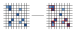
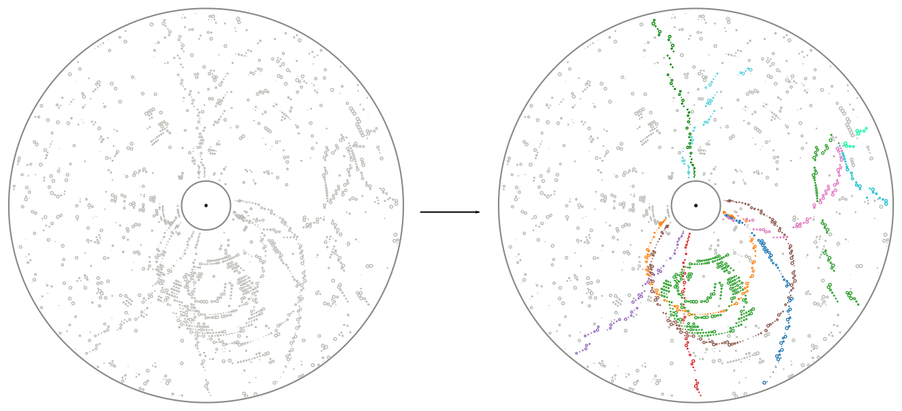

.. _onlinebook_fundamentals_reconstruction:

Reconstruction
==============

.. sidebar:: Overview
    :class: overview

    **Teaching**: 30 minutes

    **Prerequisites**:

        * :ref:`Fundamentals of Data Taking <onlinebook_fundamentals_datataking>`
        * :ref:`Fundamentals of Simulation <onlinebook_fundamentals_simulation>`

    **Objectives**:

        * The key concepts of data reconstruction.
        * How is reconstruction organized in Belle II
        * The different data formats available

Now after the data acquisition or the simulation we have events which contain
the raw detector responses. We need to process this information into something
more usable for analysis. At best we want to be able to reconstruct the
underlying particles as correctly as possible and get the original four-vectors
of particles produced in the interaction.

However, it's never possible to uniquely identify all the particles in the
interaction because for hadronic interactions there are almost always short
lived particles that decay before reaching the detector.

In addition there will be signals in the detector which are not what we want:
Every detector has an intrinsic noise so some detector channels will fire
randomly. In addition there is real background not coming from the event we're
interested in but from other electrons/positrons in the beam randomly
interacting with each other or parts of the accelerator structure.

So all we can do is look at the detector response and find a set of most likely
particles and then leave it to the analyses to do a proper statistical analysis
of the events.

Now the exact same reconstruction is performed on MC data as on real data: We
want the exact same algorithms in both cases. However in MC we actually know the
correct particles and we can trace which detector response was caused by which
particle.

So we run the exact same reconstruction but in addition for MC we also trace the
correctness of the reconstruction which we call "MC Truth".

Clustering
----------

One of the first steps in this reconstruction is called clustering where we need
to combine the detector responses in each sub detector if they are related.

As a simple example we can look at the PXD: If a particle passes the
pixel detector we expect a signal in one of the pixels. But what if the particle
passes between pixel boundaries? Or if it flies through the detector at a
shallow angle along multiple pixels? We will get multiple pixels caused by the
same particle.

So we cluster neighboring pixels, taking the detector intrinsic properties such
as noise into account and form groups of pixels. We can then calculate
properties of these clusters like size, shape or center. Since our pixel detector
has an analog readout and can measure the amount of ionisation per pixel we can
use weighted mean calculate the center position. Or we could even use more
advanced algorithms depending on the readout characteristics of our detector.

.. _fig:reconstruction-clustering:

   Simple example of 2D clustering with analog signals

Now this was an example for the pixel detector but this same principle is also
used in the strip detector (in 1D) or in the calorimeter to group neighboring
crystals into clusters.

In addition the calorimeter now has different characteristic cluster shapes
depending on what particle caused the cluster: hadronic interaction of photons.
So the definition of a cluster in the ECL becomes more complicated as the same
connected region of crystals might be caused by one or more photons or one
hadron. But the principle is the same: Identify all hits caused by a particle
and group them into clusters.

Tracking
--------

A very important part of our reconstruction is the so-called tracking or track
reconstruction. It tries to identify trajectories of particles through the
tracking detectors, called tracks. There are mainly two parts of tracking

Track finding
  Find patterns (i.e. collections of hits) in the hits or hit clusters in the
  tracking detectors that look like they could be from a particle flying
  through the detector.

.. _fig:reconstruction-trackfinding:

   View of a simulated event in an x-y cross-section of the :ref:`CDC
   <cdc-description>`. The shown CDC hits originate either from charged
   particles belonging to the event or from beam-induced :ref:`backgrounds
   <backgrounds>`. The principle of track finding is to identify patterns of
   hits belonging to the same particle, which are then shown in the same color
   on the right. Hits that remain grey are rejected as background. Hits in
   the :ref:`vertex detectors <vxd-description>` are not shown here, but help
   with finding tracks in the CDC.

Track fitting
  Determine the best estimate of the kinematic variables describing the particle
  trajectories corresponding to each found hit/cluster pattern to obtain the
  particle position and momentum close to the interaction region as precisely as
  possible.

Track finding is a very complex process which depends a lot on the detector
layout and characteristics and the most complex part of the reconstruction
process. It would be impossible to describe it properly here. You can find more
details in the Belle II physics book and there is also a paper describing `track
finding at Belle II <https://arxiv.org/abs/2003.12466>`_

What we can say that track finding and fitting requires a lot of computing time
to find all the tracks in our events. As a matter of fact currently our tracking
reconstruction takes about twice as long as the simulation of an event.

.. admonition:: Question
    :class: exercise stacked

    What are possible reasons for the tracking algorithms to occasionally find
    apparent tracks that are not associated with real particles, known as
    *fakes*?

.. admonition:: Hint
    :class: toggle xhint stacked

    Take a good look at the left event display on the left side in
    :numref:`fig:reconstruction-trackfinding`. This is a relatively clean event
    and we might get much more hits from beam-induced :ref:`backgrounds
    <backgrounds>`.

.. admonition:: Solution
    :class: toggle solution

    With high numbers of hits from beam-induced backgrounds and resulting high
    occupancies, the track finding faces a combinatorial challenge: Of the
    exponential number of possible combinations of hits, it has to find those
    that correspond to trajectories of real particles. But there's many wrong
    combinations of hits that might look like tracks originating from the
    interaction point and sometimes, they are miss-identified as tracks. These
    wrong combinations can include both hits from backgrounds or from particles
    originating from the primary event.

    Reconstructed tracks that are caused by an individual beam-background
    particle are also called fakes. However, they are relatively easy to reject
    because they don't originate from the interaction point and have typically
    high boosts along the beam-axis. But their sheer high number relative to
    hits from signal tracks is among the things that make tracking at Belle II
    challenging.

.. admonition:: Question
    :class: exercise stacked

    Now assuming reconstruction takes exactly twice as long as simulation and
    simulation still takes 1 second and we can buy one CPU/hour for $0.025 in a
    commercial cloud as above.

    For the full experiment we will collect :math:`50\ \textrm{ab}^{-1}`. The
    plan is to have a total trigger cross section of 20 nb (so in addition to the
    1.1 nb of :math:`B\bar{B}` we will also have some fraction of continuum,
    tau and other events).

    How many CPUs do we need to reconstruct all the real data and simulate and
    reconstruct an equivalent amount of MC in one year? And what will it cost?

.. admonition:: Hint
    :class: toggle xhint stacked

    It's basically the same question as above but we now have a cross section of
    20 nb we want to simulate.

    And we need to reconstruct both data and MC so we need to simulate once and
    reconstruct twice.

.. admonition:: Solution
    :class: toggle solution

    Now all together we will have 1 trillion events from the detector. We have
    to simulate the same amount of events. And reconstruct both.

    That leads to 5 trillion seconds of CPU time or 1.4 billion CPU hours and
    would require 160 thousand CPUs and cost 35 million dollars.

    This is of course a very rough estimate: The 1 and 2 seconds assumption for
    simulation and reconstruction is very very rough. The time also differs
    slightly for different event types. CPUs or the software might get faster
    and we will not have this amount of data very quickly. Also the CPU price is
    sure to change or be negotiable. Nevertheless, Computing cost will always be
    a major driving factor.

    One of the consequences will be that we cannot produce that much MC so for
    some event types we will only be able have a fraction of the amount of
    events simulated as we have real data.

Particle Identification
-----------------------

Once we have the tracks we can also try to determine the likelihoods for the
track belonging to different particle types. For each given track we can then
check the sub detectors contributing to particle identification if they saw
anything that could be related to this track.

For the CDC we can calculate the total energy loss over the track length and
compare this to the expected values for different particle types. For ARICH we
know where the track entered the detector and can check this area to see if
there are any Cherenkov rings around this position. The same principle applies to
TOP, ECL or KLM: we know where the track entered the detectors and can check for
any related information from these sub detectors.

These detectors then calculate likelihoods for the signal caused by different
particle types which we attach to the track information for later use by
analysts.

Organization of Reconstruction
------------------------------

As mentioned above the reconstruction can take a long time and be very
expensive, especially if we have a lot of data. It also depends on a lot of
expert knowledge:

* the conditions during data taking need to be taken into account: beam energies
  and positions, detector status, ... .
* the conversion from raw detector signal to energy needs to be properly
  calibrated.
* the position of the tracking detector sensors needs to be well known and
  corrected in software (a process called alignment).

As for the simulation this is something which we centrally organize in Belle II.
So, not very surprising, the Data Production group takes charge and
coordinates with the detector experts the reconstruction of our data.

Data formats
------------

When an :math:`e^+e^-` collision happens, the resulting products will leave signal in the Belle II
subdetectors that are acquired, matched in time as each subsystem have a different delay
and response time (event building), and saved to disk in a packed, binary format.
Several steps have to be performed in order to produce a physics result of these
hardly-intelligible raw data. These steps are unpacking, calibration, reconstruction
and finally analysis. Each of these steps reads and writes different objects, and
produces files in different formats.

.. note::
   All the Belle II data files are root files, where the relevant objects are stored
   in the branches of a tree. When we say "different formats", we refer simply to the
   different branches contained in those trees.

Let's start from the data objects we save. There are four groups of them: raw, low-level,
reconstruction-level and analysis-level.

raw objects
    Raw objects are the output of the single
    subsystems: digitized  `PMT <https://en.wikipedia.org/wiki/Photomultiplier_tube>`__ signals from the TOP,
    digitized `ADC <https://en.wikipedia.org/wiki/Analog-to-digital_converter>`__ signals form the CDC, and
    so on. Without any further processing, these objects cannot be used.
low-level objects
    Low-level objects come from the very first step of the data processing, the unpacking. The RAW signals are
    turned into more abstract and understandable objects: the CDC ACD signals are converted
    to CDChits, the TOP PMT signals are turned into TOPDigits, and so on.  The low-level
    objects are fundamental to understand the detector performance, but they cannot yet be
    directly used to perform an analysis.
reconstruction-level objects
    The last step is called reconstruction, and consists
    in running algorithm on the collection of digits to produce analysis-friendly quantities.
    The output of the reconstruction is are high-level variables like ECL clusters, resulting
    from running cluster algorithms on the ECLDigits,  tracks resulting from running the
    tracking algorithms over the collections of CDC, SVD and PXD hits, PID likelihood resulting
    from the analysis of the TOP signals. In the process of reconstruction the calibrations
    are applied, correcting for the fluctuations in the detector response.
analysis-level objects
    These high-level
    objects are finally read by the analysis software, and turned into analysis-level
    objects: charged particles, photons, missing energies and all the quantities used to
    present a physics result.

In Belle II there are four different data formats, reflecting which data objects are
stored in a file:

RAW
  This is the most basic format. It contains the un-processed, un-calibrated output
  of the detector. Analysis cannot be run on these data, but they serve as base for the
  production of the subsequent data format.
cDST (calibration Data Summary Table)
  This format contains the same objects as the RAW
  (so a full reconstruction could be performed starting from it), plus the results of the
  tracking, which is the most demanding part of the reconstruction. The scope of this
  format is to perform low-level detector studies and calculate calibration constants.
mDST (mini Data Summary Table)
  This is the basic data-analysis format. It contains only
  the high level information that can be directly used to perform a physics analysis.
  However, it is not the suggested format to perform analysis.
uDST (user Data Summary Table)
  This is the main format for data analysis. It's the
  result of the analysis skim procedure, that selects from the mDST only the few events
  that can be useful for a certain type of analysis (events with a well reconstructed J/psi
  per example). Skimming is described in more detail in the next section.
  The content of this format is the same as the mDST, with the addition of the
  reconstructed particles used in the skimming selection (if you look at the :math:`J/\psi` skim,
  you will also find a list of :math:`J/\psi` already reconstructed for you in the file).

.. note::
   If you are simply running an analysis, you will mostly use uDST, if you are also involved
   in performance studies you will probably use cDST as well and if your core activity will
   be hardware operations, you will be mostly dealing with the RAW and cDST formats.

.. admonition:: Key points
    :class: key-points

    * The "reconstruction" is the process where we process the raw detector
      signal into high level objects like particle trajectories, ECL clusters
      and PID likelihoods.
    * Clustering is the process of finding connected regions of detector signal
      that most likely originated from the same particle
    * Tracking is the process of reconstructing the trajectories of particles
      flying through the tracking detectors and infer position and momentum as
      precisely as possible.
    * Reconstruction takes quite some time and is handled centrally by the Data
      Production Group
    * We have different data formats what contain different subsets of
      information. Analysis usually runs on udst.

.. include:: ../lesson_footer.rstinclude

.. topic:: Author(s) of this lesson

    Umberto Tamponi,
    Martin Ritter,
    Oskar Hartbrich,
    Michael Eliachevitch,
    Sam Cunliffe
