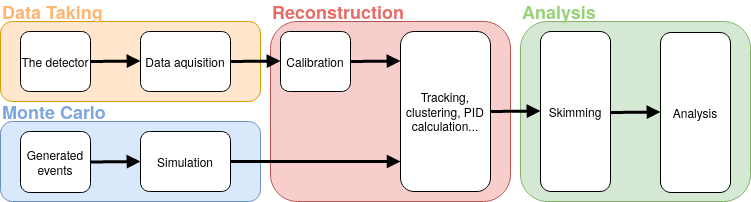

.. _onlinebook_hep_analyses:

HEP Analyses
============

.. sidebar:: Overview
    :class: overview

    **Teaching**: 2 hrs

    **Prerequisites**: 
    	
    	* What is a B factory?

    **Objectives**:

        * A first introduction to all of the basic concepts in a HEP analysis.
        * A "big picture" overview of what the Belle II software is supposed 
          to do.
        * Be aware of important Belle II reference documents and (at least)
          have spend a bit of time navigating them.

In this section you will learn the basic concepts underlying an analysis at 
Belle II, starting from how the data acquisition works and ending to the 
description of the most common analysis concepts.

The workflow that goes from the data taking to the publication of any 
measurement in High-Energy Physics (HEP) experiment is quite complex.
Measurements involve multiple steps that can take months or even years. 
While the details of this procedure can be extremely complex and tedious the
overall picture is simple enough to be fitted in a human-readable scheme:

Starting from the very end, you can see that the input to the analysis are 
reconstructed, skimmed events, coming either from the actual data taking or from the 
generation of simulated events. The skmming is necessary to reduce the size of the 
dataset and significantly simplify and speed-up the analysis.  The reconstruction 
step is the same for both real and simulated data to minimize the differences 
between the two, except that the data need to be first calibrated.

The rest of this section will quickly go through each of the four blocks in which 
the workflow is split, covering the very basic concepts and deferring most of the 
technical expalations about how the software works to the other chapters.

Intro: Cut and count
--------------------

Almost regardless of the quantity you are going to measure in your analysis, you 
will have to face some basic problems: select events you want to study (the 
signal) over similar events that mimic them (the background), estimate efficiency 
of such a selection and, possibly, estimate the intrinsic resolution on the 
quantities you will measure. Finally you will typically want to count how many
signal events you observe.

The most basic way to select a signal is to apply what, in jargon, are called "cuts". 
A cut is nothing but selection, usually binary, over one quantity that has some 
separation power between signal and background. Of course multiples cuts can be 
applied in sequence, leading to quite effective background reductions. 
Before deciding on the selection criteria however, one must define the variable 
that will be used to count of many signal events are left. A good variable has a 
very peaking distribution for signal, and a smooth, uniform distribution for the 
background.

.. admonition:: Example

    In many b-physics analyses you will make candidate B mesons from 
    combinations of tracks and calorimeter clusters.
    You will work through an example of this in a :ref:`later lesson
    <onlinebook_first_steering_file>`, but for now, consider the energy of your
    candidate B in the centre-of-momentum system.

    .. admonition:: Question
        :class: exercise stacked
    
        What is the the energy of a B meson produced in the decay of an 
        :math:`\Upsilon(4S)` in the rest frame of the :math:`\Upsilon`?
    
    .. admonition:: Solution
        :class: toggle solution
    
        Half of its rest mass: :math:`\sim 5.3 {\textrm GeV}`

    The difference between half of the energy in the centre-of-momentum
    and the total energy of the B candidate is called :math:`\Delta E`.
    An early  **cut**  you might make is to require that this quantity 
    is close to zero.
    
    That is, you would accept B meson canddiates which satisfy:
    :math:`-150 <\Delta E< 150 {\textrm MeV}`
    and reject those which don't.

An interesting event for most B physics analyses, is one where the 
:math:`e^+e^-` produced an :math:`\Upsilon(4S)`.
However this is not the most probable result in an :math:`e^+e^-` collision.

.. admonition:: Question
    :class: exercise stacked

    What is the most likely final state for an :math:`e^+e^-` collision at 10 GeV?
    What is the cross section?

.. admonition:: Hint
    :class: toggle xhint stacked

    You should be able to find this information on confluence.

.. admonition:: Solution
    :class: toggle solution

    At around 125 nb, the most probably process is :math:`e^+e^-\to e^+e^-`.

.. admonition:: Question
    :class: exercise stacked

    What is the cross section for hadronic events?

.. admonition:: Solution
    :class: toggle solution

    About 5.8 nb.

.. admonition:: Question
    :class: exercise stacked

    What is the cross section for :math:`B\bar B` hadronic events?

.. admonition:: Solution
    :class: toggle solution

    About 1.1 nb.

We call anything that is not "what you want to analyse": **background**.
This means different things for different analyses.
Certain kinds of background events (such as :math:`e^+e^- \to e^+e^-`) are 
relatively easy to reject and can be done in the **trigger**.
Other kinds of backgrounds are dealt with at later stages of your analysis.

We will cover different aspects of this later in this lesson, and in
further lessons.

Data taking: The experiment
---------------------------

If you are reading this manual, you are probably already at least partially 
familiar with the general layout of the SuperKEKB accelerator and the Belle II
experiment. However, before moving on, let's very quickly review their structure.

The SuperKEKB accelerator circulates electrons and positrons through its roughly
3km circumference tunnel in opposite directions. These beams are asymmetric in
momentum, with the electrons kept at around 7Gev/c and the positrons at around
4GeV/c. At a single point on the accelerator ring, the two beams are steered
into (almost) head-on collision, resulting in a center-of-mass energy of
typically around 10.6GeV. The point of collision is named the "interaction
region".

.. admonition:: Question
    :class: exercise stacked

    At LHC, every bunch collision generates dozens of individual particle
    interactions that overlay each other in the detectors (pile-up),
    considerably complicating the data analysis. 
    This doesn't seem to be a problem at SuperKEKB and Belle II. Why?

.. admonition:: Hint
    :class: toggle xhint stacked

    Start with the planned final instantaneous luminosity of SuperKEKB. How
    many bunch crossings will happen per second? 
    Then think about the typical cross sections in :math:`e^+e^` collisions
    as discussed previously.

.. admonition:: Another hint
    :class: toggle xhint stacked

    The goal instantaneous luminosity of SuperKEKB is :math:`8*10^35 cm^-2
    s^-1`. It takes a beam particle bunch roughly 10us to complete a full
    revolution around the accelerator ring. Up to 2376 bunches will circulate
    in each ring.

.. admonition:: Solution
    :class: toggle solution

    At a final design luminosity of :math:`8*10^35 cm^-2 s^-1` at 2376 bunches
    per ring, each taking about 10us to complete a revolution, the
    delivered luminosity per bunch crossing is about :math:`8*10^35 cm^-2 s^-1
    * 1*10^-6 s / 2376 = 3.4*10^-7 nb`, so even the most likely Bhabha process
    at 125nb only happens once every 25000 bunch crossings.

The Belle II detector is built around the interaction region, with the goal to
detect and measure as many of the particles produced in the SuperKEKB collisions
as possible. Belle II consists of several sub-systems, each one dedicated to a
specific task: reconstruct the trajectory of charged track, reconstruct the
energy of photons, identify the particle type or to identify muons and
reconstruct long-living hadrons. Of course some systems can be used for
multiple purposes: for example, the ECL is mainly intended as a device to
recontruct photons, but is also used to identify electrons and hadrons.

Due to the asymmetry of the SuperKEKB collisions, the Belle II detector is
asymmetric along the beam axis. In the context of Belle II the "forward"
direction is the direction in which the electron beam points, while "backward"
is the direction in which the positron beam points.

.. seealso:: 

    There is an important document for any large HEP detector called the 
    **Technical Design Report** (TDR).

    The Belle II TDR is `arXiv:1011.0352 <https://arxiv.org/abs/1011.0352>`_.

    You might like to refer to this and you will probably need to reference 
    it in your thesis.

.. figure:: belle2.png
    :align: center
    :width: 900px
    :alt: The Belle II detector.

    The Belle II detector.

Beam Pipe
    The beam pipe itself is not an anctive part of the detector, but plays the crucial 
    role of separating the detector from the interaction region, which is located in 
    the low-pressure vacuum of the SuperKEKB rings. It is a cylindrical pipe designed 
    to be as thin as possible in order to minimize the particle's energy loss in it,
    but it also assolves the scope of absorbing part of the soft X-rays emitted by 
    the beams, that represent a major source of noise for the innermost detector, the PXD. 

PXD
    The first active system met by the particles that emerge form the IP is the PiXel
    Detector (PXD). It is a high-granularity tracking system which enables 
    precise reconstruction of the intersection of tracks (a vertex). 
    You can think of this as the inner vertex detector.
    The PXD is constructed from DEPFET silicon sensors segmented into individual
    pixels of down to 50*55 :math:`\upmu m^2` size. It consists of two layers at
    14mm and 22mm radius from the interaction point.

SVD
    The Silicon Vertex Detector (SVD) is the outer part of the vertex detector.
    It comprises of double sided silicon microstrip sensors with strips widths
    down to 50 :math:`\upmu m`. The four layers of the SVD system extend the
    outer radius of the vertex detector up to 140mm.

VXD
    You will occasionally hear people refer to the pair of detectors: PXD+SVD 
    as the VerteX Detector (VXD).

CDC
    The main tracking system for Belle II is the Central Drift Chamber (CDC).
    This is comprised of *so-called* sense wires suspended in He-C2H6 gas.
    Charged particles passing close to the wires cause ionisation resulting 
    in signal propagation in the wires.
    You will hear people refer to these ionisation signals as "hits" in the 
    CDC.
    A charged particle passing through the CDC results in a succession of hits
    following the trajectory of the particle.

TOP
    The Time Of Propagation (TOP) detector provides particle identification
    information in the barrel region of Belle II .
    The subdetector comprises of quartz bars and works by utilising the 
    `Cherenkov effect <https://en.wikipedia.org/wiki/Cherenkov_radiation>`_.
    Particles passing through will cause Cherenkov photons to be emitted at an
    angle that directly depends on the particle velocity. Combining this
    velocity information with particle momentum measured in the preceding
    tracking detectors yields a mass measurement, which identifies the particle
    species. Emitted Cherenkov photons are captured inside the quartz bars by
    total internal reflection. TOP reconstructs the Cherenkov emission angle by
    measuring the effective propagation time of individual Cherenkov photons
    from their emissions point to the TOP sensor plane. At a given momentum,
    heavier particles will have lower velocities, thus a lower Cherenkov opening
    angle and thus, on average, a longer photon propagation path, causing a
    longer time of propagation of individual photons. You might also hear people
    refer to the TOP as the iTOP (imaging TOP).

ARICH
    The Aerogel Ring-Imaging Cherenkov detector is another dedicated particle
    identification subdetector using aerogel as its radiator medium. It covers
    the forward region of the detector.
    Just as with the quartz in TOP, Cherenkov photons are emitted when a charged particle
    of sufficient velocity passes through the aerogel. Contrary to the TOP quartz, the
    aerogel does not capture the emitted Cherenkov photons, so they are forming a cone of
    Cherenkov light around a particle track which is imaged as a ring of characteristic
    radius, providing an orthogonal source of particle mass information.

ECL
    The Electromagnetic CaLorimeter (ECL) is chiefly tasked with measuring the 
    electromagnetic energy of photons and electrons produced in the collision.
    In combination with tracking information, the calorimeter can distinguish, for
    example, electrons from muons.
    A track from an electron will stop in the calorimeter, a muon will continue 
    through as a minimum-ionising particle.
    It therefore provides further orthogonal information to the 
    particle-identification system.

KLM
    Finally, there is the KLong and Muon (KLM) system.
    The KLM provides muon identification information to tracks that pass 
    through all other subdetectors and also reconstructs :math:`K_L^0` s from
    the collision.

.. seealso::

    There are two more useful reference documents that you should be aware of.
    Now seems like a good time to mention them.

    1. Bevan, A. *et al*. The Physics of the B Factories. *Eur.Phys.J. C* **74** 3026(2014). 
       https://doi.org/10.1140/epjc/s10052-014-3026-9

    2. Kou, E. *et al*. The Belle II physics book, *PTEP 2019* **12** 123C01, 
       https://doi.org/10.1093/ptep/ptz106.

    The former is a book describing the previous generation B-factories (the detectors and their achievements).
    The latter describes the Belle II detector and the physics goals.
    It is sometimes referred to (rather opaquely) as the B2TiP report.
    If you are a newcomer you should probably refer to it as it's (significantly more sane) official name.

Data taking: on resonance, continuum, cosmics
---------------------------------------------

To collect :math:`B` mesons one must collide electrons and positrons at the centre-of-mass energy of 
:math:`\sqrt{s} = 10.580` GeV, corresponding to the :math:`\Upsilon(4S)` resonance mass. 
However this is not the only energy at which the SuperKEKB accelerator can work, and it's not the only
 kind of dataset that Belle II collects.

On-resonance
    The standard collisions at :math:`\sqrt{s} = 10.580` GeV.

Off-resonance
    :math: `e^+e^- \to \Upsilon(4S) \to B\bar{B}` is not the only process that takes place at 
    :math:`\sqrt{s} = 10.580` GeV. The production of light and charm quark pairs in the reaction 
    :math: `e^+e^- \to u\bar{u}, d\bar{d}, s\bar{s}, c\bar{c}` has a total cross section of about :math:`3.7` 
    nb is more that three times larger than the production of :math:`B` mesons. As the quarks hadronize leaving 
    final states that are similar to the :math:`B\bar{B}`. This background can be studied using the Montecarlo
    simulation, but it's more effective to study it directly on data. Occasionally, 2-3 times per year, a 
    special dataset is collected approximatively 60 MeV below the :math:`\Upsilon(4S)`. Here no :math:`B` mesons 
    can be produced, leaving one with a pure sample of continuum events, called *off-resonance* (or *continuum*) sample. 

Cosmic
    At the beginning and end of each run period BelleII acquires cosmic muons. These events are used mainly for
    performance studies and for calibration, as they provide an unique sample for aligning the detectors with 
    each other. Usually part of this dataset is collected with the solenoid switched off, so that muons cross the
    detectors on straight trajectories. If the SuperKEKB accelerator has a major  downtime of few days, a cosmic dataset
    is usually collected to keep the BelleII system running.

Beam
    Beam runs are special, usually short data takings used to study the beam-induced background on the inner sub-detectors.
    They are taken with the beams circulating without colliding, to remove all the processes arising from the :math:`e^+e^-` 
    hard scattering.

Scan
   A scan consists of rather short data taking periods (hours or few days long) performed at slightly different energies 
   (usually 10-50 MeV apart). The goals of a scan is to measure the lineshape of the :math:`e^+e^-` cross section to either
   check that data are collected on the resoanance peak (short scans), or to perform real physics measurements
   such the search for exotic vecotr resoances (long scans above the :math:`\Upsilon(4S)`energy)

Non-4S
   SuperKEKB can operate across the whole spectrum of bottomonia, from the :math:`\Upsilon(1S)` at :math:`9.460` GeV to 
   slightly above the :math:`Upsilon(6S)`, around :math:`9.460` GeV. These datasets can be used for all the non-B 
   parts of the BelleII physics program, but are particularly interestign for the spectroscopy, hadronic physics and 
   dark sector studies.

Data taking: Triggers and filters
---------------------------------

When SuperKEKB delivers collisions to the interaction region, it is up to the
Belle II experiment to record the data generated by the collisions. SuperKEKB
bunches can cross the interaction region up to every 4ns. However, in the vast
majority of cases either no collision (more precise: no hard interaction) takes
place at all, or the collision results are not interesting (for example
:math:`e^+e^-\to e^+e^-` type events are the most common, but of secondary
importance to the Belle II physics program). Recording and keeping all detector
information for each possible collision time would thus be wasteful (indeed the
required resources and bandwidth from the detector to the offline disks would be
rather comical). Instead, the Belle II online system, consisting of the Data
AcQuisition (DAQ), Level 1 TriGger (TRG, also called L1) and the High Level
Trigger (HLT), is designed to reduce the amount of data as much as possible
before it even reaches the first storage hard disk.

Generally, when Belle II is running and operational, each subdetector will
transmit its readout data upon receipt of an external trigger signal.
The data gathered from all subdetectors in response to a given external trigger
is what we call "one event". Generating this trigger signal for each
"interesting" collision is the task of the TRG system. The TRG system receives
what effectively amounts to a low resolution "live stream" of the readout data
of CDC, ECL and KLM (for completeness: TOP also sends stream data to TRG  but it
is not used for triggering directly). The streamed data is interpreted in near
realtime in highly specialised fast electronics boards (Field Programmable Gate
Arrays, FPGAs). If TRG determines an interesting collision event has just taken
place, it generates a trigger signal which is distributed to all subdetectors.
The TRG system is designed to issue up to 30kHz of such triggers at full
SuperKEKB design luminosity.

.. note::
   The TRG system will issue a trigger decision with a fixed delay of about 4us.
   In practice, all subdetector frontend electronics thus have to keep a buffer
   of their readout data of the past several microseconds, so they can transmit
   the measurement they took in the time slice around 4us ago.

The DAQ system makes sure that all trigger signals are synchronously delivered
to all subdetectors. It also provides the high-speed data links that are used
to read out the subdetector data for each event and forwards it to the HLT
system.

The HLT system is a computing cluster of about 4000 CPU cores located right next
to the Belle II detector. It receives the full raw subdetector data for each
triggered event performs an immediate full reconstruction, using the
exact same basf2 software as is used in offline data analysis. Based on the
result of this reconstruction, events are classified and either stored to a
local offline storage hard disk drive or discarded. This high level event
selection is expected to reduce the amount of data written to the offline
storage by at least 60%.

Both the TRG system and the HLT classify events based on the data available to
them. While the decision whether to issue a trigger for a given collision (or on
HLT whether to keep the event or discard it) is of course binary, certain event
classes might be intentionally triggered at less than 100% of their occurence.
For example, while Bhabha scattering events (:math:`e^+e^- \to e^+e^-` often just
called "Bhabhas") are generally not very interesting for the physics program of
Belle II, keeping some of them for calibration purposes might be very useful.
Since Bhabhas are easily identified even with the limited information available
to the TRG system, the TRG system will not issue a trigger for every single
identified Bhabha event, but only for a configurable fraction. This technique of
intentionally issuing triggers only for fractions of a given event class is
named prescaling. When working on your own analysis, it is very important to
keep in mind potential prescaling of the triggers that yield the events you use
in your analysis. Since the prescaling settings can (and will) change over
the lifetime of the Belle II experiment, updated numbers for each run can be
found here TODO: where? on confluence?

Since the TRG and HLT systems are ultimately deciding which data is being kept
for offline analysis, the importance of understanding and validating their
performance vs. their intended functionality is of highest importance for the
success of the Belle II experiment.

TODO: HLT tags? jiltering? (HLT skims)

Simulation: the Montecarlo
--------------------------

Describe here:
* What a generator is
* What the simulation is, what's Geant
* can we trust the MC 100%? Performance studies
* How can you have your MC being generated?

Processing: the reconstruction
------------------------------

Describe here:
* What is the reconstruction
* Example 1: tracking (short)
* Example2: clustering (?)
* Why do we need to run the reconstruction separately from the analysis? 
  Mention that resources are very not infinite

Processing: Data formats
------------------------

When an e+e- collision happens, the resulting products will leave signal in the BelleII 
subdetectors that are acquired, matched in time as each subsystem have a different delay 
and response time (event building), and saved to disk in a packed, binary format. 
Several steps have to be performed in order to produce a physics result of these 
hardly-intelligible raw data. These steps are unpacking, calibration, reconstruction 
and finally analysis. Each of these steps reads and writes different objects, and 
produces files in different formats. 

.. note::
   All the Belle II data files are root files, where the relevant objects are stored 
   in the branches of a tree. When we say "different formats", we refer simply to the 
   different branches contained in those trees.

Let's start form the data objects we save. There are four groups of them: raw, low-level,
reconstruction-level and analysis-level. The raw objects are the output of the single 
subsystems: digitized  PMT signals from the TOP, digitized ADC signals form the CDC, and 
so on. Without any further process, these objects cannot be used. The low-level objects 
come from the very first step of the data processing, the unpacking. The RAW signals are 
turned into more abstract and understandable objects: the CDC ACD signals are converted 
in CDChits, the TOP PMT signals are turned into TOPDigits, and so on.  The low-level 
objects are foundamentalto understand the detector performance, but they cannot yet be 
directly used to perform an analysis. The last step is called reconstruction, and consists 
in running algorithm on the collection of digits to produce analysis-friendly quantities. 
The output of the reconstruction is are high-level variables like ECL clusters, resulting 
from running cluster algorithms on the ECLDigits,  tracks resulting from running the 
tracking algorithms over the collections of CDC, SVD and PXD hits, PID likelihood resulting 
from the analysis of the TOP signals. In the process of reconstruction the calibrations 
are applied, correcting for the fluctuations in the detector response. These hgh-level 
objects are finally read by the analysis software, and turned into analysis-level 
objects: charged particles, photons, missing energies and all the quantities used to 
present a physics result.

In BelleII there are four different data formats, reflecting which data objects are 
stored in a file:

* RAW. This is the most basic format. It contains the un-processed, un-calibrated output 
  of the detector. Analysis cannot be run on these data, but they serve as base for the 
  production of the subsequent data format
* cDST (calibration Data Summary Table). This format contains the same objects as the RAW 
  (so a full reconstruction could be performed starting from it), plus the results of the 
  tracking, which is the most demanding part of the reconstruction. The scope of this 
  format is to perform low-level detectro studies and calculate calibration constants.
* mDST (mini Data Summary Table). This is the basic data-analysis format. It contains only 
  the high level information that can be directly used to perform a physics analysis. 
  However, it is not the suggested format to perform analysis.
* uDST (micro Data Summary Table). This is the main format for data analysis. It's the 
  result of the analysis skim procedure, that selects from the mDST only the few events 
  that can be useful for a certain type of analysis (events with a well reconstructed J/psi 
  per example). The content of this ormat is the same as the mDST, with the addition of the 
  reconstructed particles used in the skimming selection (if you look at the J/psi skim, 
  you will also find a list of J/psi already reconstructed for you in the file).

.. note::
   If you are simply running an analysis, you will mostly use uDST, if you are also involed 
   in performance studies you will probably use cDST as well and if your core activity will 
   be hardware operations, you will be mostly dealing with the RAW and cDST formats.

Analysis: what do we measure?
-----------------------------

The Belle II detectors can provide three kind of information: momentum, energy and PID 
probability. Of course not all of them are available for every particle, in fact in most cases 
only two of them are, and however only for a very limited number of particles.  

Charged particles are seen in the detector if they live long enough to cross its active colume, 
for example the SVD layers, and leave a ionization signal in it.

However, tracking only emasures the 3-momentum of these particles. In order to get form this 
the 4-momentum one has to either assign a mass hypothesis, which is done using the 
information from the particle identification systems.

Neutral particles such photons, neutrons or KL do not leave any ionization in the tracking 
system, and can only  be detected when they interact with the dense material of the ECL or 
the KLM. In these cases we will have a measurement of their energy and, from the analysis of 
the shape of the energy deposition, an indication about their nature.

All the other particles that are either short lived and decay nearby the interaction point 
(such as the J/psi), or are long-lived but neautra and decay inside the active volumen of the 
detector (such the Ks or Lambda), have to be reconstructed combingin the 4-momenta of their 
decay products, or of the decay prducts at the end of their decay chain. We define as final 
state particles all the particles that are directly reconstructed from the signal they leave 
in the detector. The particles obtained combining other particles are usually referred as 
combined particles.

Analysis: the skimming
----------------------

Describe here:
* what skiming is
* why it's needed

.. admonition:: Key points
    :class: key-points

    * You know where to find the Belle II TDR, "The Physics of the B factories", and "The Belle II physics book".

.. topic:: Author of this lesson

    Umberto Tamponi

