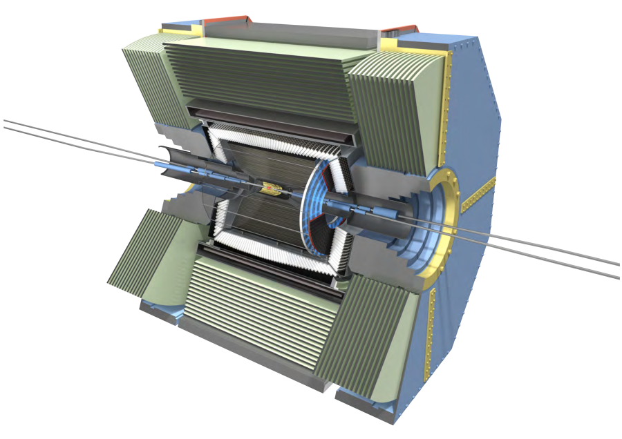
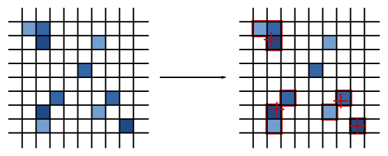
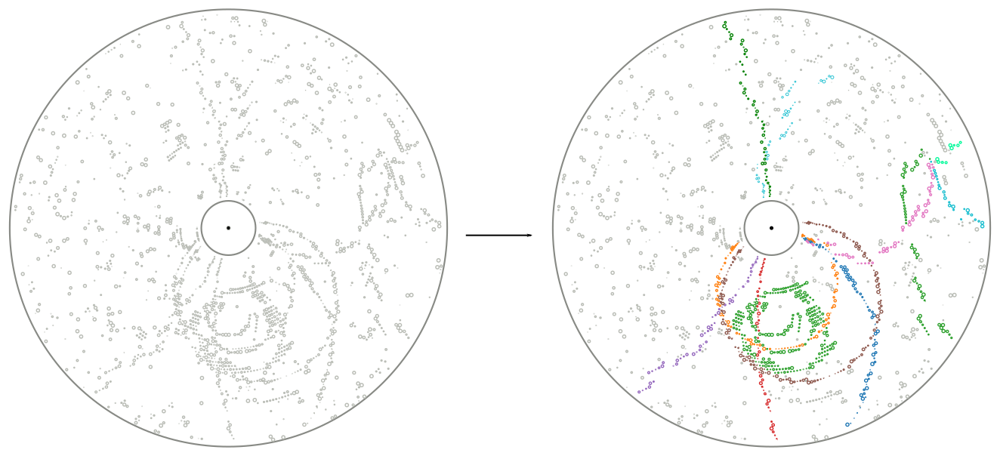

.. _onlinebook_hep_analyses:

HEP Analyses
============

.. sidebar:: Overview
    :class: overview

    **Teaching**: 2 hrs

    **Prerequisites**:

    	* What is a B factory?

    **Objectives**:

        * A first introduction to all of the basic concepts in a HEP analysis.
        * A "big picture" overview of what the Belle II software is supposed
          to do.
        * Be aware of important Belle II reference documents and (at least)
          have spend a bit of time navigating them.

In this section you will learn the basic concepts underlying an analysis at
Belle II, starting from how the data acquisition works and ending to the
description of the most common analysis concepts.

The workflow that goes from the data taking to the publication of any
measurement in High-Energy Physics (HEP) experiment is quite complex.
Measurements involve multiple steps that can take months or even years.
While the details of this procedure can be extremely complex and tedious the
overall picture is simple enough to be fitted in a human-readable scheme:

.. figure:: grand_scheme_of_hep.png
  :width: 40em
  :align: center

Starting from the very end, you can see that the input to the analysis are
reconstructed, skimmed events, coming either from the actual data taking or from the
generation of simulated events. The skmming is necessary to reduce the size of the
dataset and significantly simplify and speed-up the analysis.  The reconstruction
step is the same for both real and simulated data to minimize the differences
between the two, except that the data need to be first calibrated.

The rest of this section will quickly go through each of the four blocks in which
the workflow is split, covering the very basic concepts and deferring most of the
technical expalations about how the software works to the other chapters.

Intro: Cut and count
--------------------

Almost regardless of the quantity you are going to measure in your analysis, you
will have to face some basic problems: select events you want to study (the
signal) over similar events that mimic them (the background), estimate efficiency
of such a selection and, possibly, estimate the intrinsic resolution on the
quantities you will measure. Finally you will typically want to count how many
signal events you observe.

The most basic way to select a signal is to apply what, in jargon, are called "cuts".
A cut is nothing but selection, usually binary, over one quantity that has some
separation power between signal and background. Of course multiples cuts can be
applied in sequence, leading to quite effective background reductions.
Before deciding on the selection criteria however, one must define the variable
that will be used to count of many signal events are left. A good variable has a
very peaking distribution for signal, and a smooth, uniform distribution for the
background.

.. admonition:: Example

    In many b-physics analyses you will make candidate B mesons from
    combinations of tracks and calorimeter clusters.
    You will work through an example of this in a :ref:`later lesson
    <onlinebook_first_steering_file>`, but for now, consider the energy of your
    candidate B in the centre-of-momentum system.

    .. admonition:: Question
        :class: exercise stacked

        What is the the energy of a B meson produced in the decay of an
        :math:`\Upsilon(4S)` in the rest frame of the :math:`\Upsilon`?

    .. admonition:: Solution
        :class: toggle solution

        Half of its rest mass: :math:`\sim 5.3 {\textrm GeV}`

    The difference between half of the energy in the centre-of-momentum
    and the total energy of the B candidate is called :math:`\Delta E`.
    An early  **cut**  you might make is to require that this quantity
    is close to zero.

    That is, you would accept B meson canddiates which satisfy:
    :math:`-150 <\Delta E< 150 {\textrm MeV}`
    and reject those which don't.

An interesting event for most B physics analyses, is one where the
:math:`e^+e^-` produced an :math:`\Upsilon(4S)`.
However this is not the most probable result in an :math:`e^+e^-` collision.

.. admonition:: Question
    :class: exercise stacked

    What is the most likely final state for an :math:`e^+e^-` collision at 10 GeV?
    What is the cross section?

.. admonition:: Hint
    :class: toggle xhint stacked

    You should be able to find this information on confluence.

.. admonition:: Solution
    :class: toggle solution

    At around 125 nb, the most probably process is :math:`e^+e^-\to e^+e^-`.

.. admonition:: Question
    :class: exercise stacked

    What is the cross section for hadronic events?

.. admonition:: Solution
    :class: toggle solution

    About 5.8 nb.

.. admonition:: Question
    :class: exercise stacked

    What is the cross section for :math:`B\bar B` hadronic events?

.. admonition:: Solution
    :class: toggle solution

    About 1.1 nb.

We call anything that is not "what you want to analyse": **background**.
This means different things for different analyses.
Certain kinds of background events (such as :math:`e^+e^- \to e^+e^-`) are
relatively easy to reject and can be done in the **trigger**.
Other kinds of backgrounds are dealt with at later stages of your analysis.

We will cover different aspects of this later in this lesson, and in
further lessons.

Data taking: The experiment
---------------------------

If you are reading this manual, you are probably already at least partially
familiar with the general layout of the SuperKEKB accelerator and the Belle II
experiment. However, before moving on, let's very quickly review their structure.

The SuperKEKB accelerator circulates electrons and positrons through its roughly
3km circumference tunnel in opposite directions. These beams are asymmetric in
momentum, with the electrons kept at around 7Gev/c and the positrons at around
4GeV/c. At a single point on the accelerator ring, the two beams are steered
into (almost) head-on collision, resulting in a center-of-mass energy of
typically around 10.6GeV. The point of collision is named the "interaction
region".

.. admonition:: Question
    :class: exercise stacked

    At LHC, every bunch collision generates dozens of individual particle
    interactions that overlay each other in the detectors (pile-up),
    considerably complicating the data analysis.
    This doesn't seem to be a problem at SuperKEKB and Belle II. Why?

.. admonition:: Hint
    :class: toggle xhint stacked

    Start with the planned final instantaneous luminosity of SuperKEKB. How
    many bunch crossings will happen per second?
    Then think about the typical cross sections in :math:`e^+e^-` collisions
    as discussed previously.

.. admonition:: Another hint
    :class: toggle xhint stacked

    The goal instantaneous luminosity of SuperKEKB is :math:`8*10^35 \textrm
    {cm}^-2 \textrm{s}^-1`. It takes a beam particle bunch roughly :math:`10
    \textrm{\mu s}` to complete a full revolution around the accelerator
    ring. Up to 2376 bunches will circulate in each ring.

.. admonition:: Solution
    :class: toggle solution

    At a final design luminosity of :math:`8*10^35 \textrm{cm}^{-2} \textrm{s}^
    {-1}` at 2376 bunches per ring, each taking about 10us to complete a revolution, the
    delivered luminosity per bunch crossing is about :math:`8*10^{35} \textrm
    {cm}^{-2} \textrm{s}^{-1} * 1*10^{-6} \textrm{s} / 2376 = 3.4*10^{-7}
    \textrm{nb}`, so even the most likely Bhabha process at :math:`125
    \textrm{nb}` only happens once every 25000 bunch crossings.

The Belle II detector is built around the interaction region, with the goal to
detect and measure as many of the particles produced in the SuperKEKB collisions
as possible. Belle II consists of several sub-systems, each one dedicated to a
specific task: reconstruct the trajectory of charged track, reconstruct the
energy of photons, identify the particle type or to identify muons and
reconstruct long-living hadrons. Of course some systems can be used for
multiple purposes: for example, the ECL is mainly intended as a device to
recontruct photons, but is also used to identify electrons and hadrons.

Due to the asymmetry of the SuperKEKB collisions, the Belle II detector is
asymmetric along the beam axis. In the context of Belle II the "forward"
direction is the direction in which the electron beam points, while "backward"
is the direction in which the positron beam points.

.. seealso::

    There is an important document for any large HEP detector called the
    **Technical Design Report** (TDR).

    The Belle II TDR is `arXiv:1011.0352 <https://arxiv.org/abs/1011.0352>`_.

    You might like to refer to this and you will probably need to reference
    it in your thesis.

    The Belle II detector.

Beam Pipe
    The beam pipe itself is not an anctive part of the detector, but plays the crucial
    role of separating the detector from the interaction region, which is located in
    the low-pressure vacuum of the SuperKEKB rings. It is a cylindrical pipe designed
    to be as thin as possible in order to minimize the particle's energy loss in it,
    but it also assolves the scope of absorbing part of the soft X-rays emitted by
    the beams, that represent a major source of noise for the innermost detector, the PXD.

PXD
    The first active system met by the particles that emerge form the IP is the PiXel
    Detector (PXD). It is a high-granularity tracking system which enables
    precise reconstruction of the intersection of tracks (a vertex).
    You can think of this as the inner vertex detector.
    The PXD is constructed from DEPFET silicon sensors segmented into individual
    pixels of down to  :math:`50*55 \textrm{\mu m}^2` size. It consists of
    two layers
    at 14mm and 22mm radius from the interaction point.

SVD
    The Silicon Vertex Detector (SVD) is the outer part of the vertex detector.
    It comprises of double sided silicon microstrip sensors with strips widths
    down to :math:`50 \textrm{\mu m}`. The four layers of the SVD system extend
    the
    outer radius of the vertex detector up to 140mm.

VXD
    You will occasionally hear people refer to the pair of detectors: PXD+SVD
    as the VerteX Detector (VXD).

CDC
    The main tracking system for Belle II is the Central Drift Chamber (CDC).
    This is comprised of *so-called* sense wires suspended in He-C2H6 gas.
    Charged particles passing close to the wires cause ionisation resulting
    in signal propagation in the wires.
    You will hear people refer to these ionisation signals as "hits" in the
    CDC.
    A charged particle passing through the CDC results in a succession of hits
    following the trajectory of the particle.

TOP
    The Time Of Propagation (TOP) detector provides particle identification
    information in the barrel region of Belle II .
    The subdetector comprises of quartz bars and works by utilising the
    `Cherenkov effect <https://en.wikipedia.org/wiki/Cherenkov_radiation>`_.
    Particles passing through will cause Cherenkov photons to be emitted at an
    angle that directly depends on the particle velocity. Combining this
    velocity information with particle momentum measured in the preceding
    tracking detectors yields a mass measurement, which identifies the particle
    species. Emitted Cherenkov photons are captured inside the quartz bars by
    total internal reflection. TOP reconstructs the Cherenkov emission angle by
    measuring the effective propagation time of individual Cherenkov photons
    from their emissions point to the TOP sensor plane. At a given momentum,
    heavier particles will have lower velocities, thus a lower Cherenkov opening
    angle and thus, on average, a longer photon propagation path, causing a
    longer time of propagation of individual photons. You might also hear people
    refer to the TOP as the iTOP (imaging TOP).

ARICH
    The Aerogel Ring-Imaging Cherenkov detector is another dedicated particle
    identification subdetector using aerogel as its radiator medium. It covers
    the forward region of the detector.
    Just as with the quartz in TOP, Cherenkov photons are emitted when a charged particle
    of sufficient velocity passes through the aerogel. Contrary to the TOP quartz, the
    aerogel does not capture the emitted Cherenkov photons, so they are forming a cone of
    Cherenkov light around a particle track which is imaged as a ring of characteristic
    radius, providing an orthogonal source of particle mass information.

ECL
    The Electromagnetic CaLorimeter (ECL) is chiefly tasked with measuring the
    electromagnetic energy of photons and electrons produced in the collision.
    In combination with tracking information, the calorimeter can distinguish, for
    example, electrons from muons.
    A track from an electron will stop in the calorimeter, a muon will continue
    through as a minimum-ionising particle.
    It therefore provides further orthogonal information to the
    particle-identification system.

KLM
    Finally, there is the KLong and Muon (KLM) system.
    The KLM provides muon identification information to tracks that pass
    through all other subdetectors and also reconstructs :math:`K_L^0` s from
    the collision.

.. seealso::

    There are two more useful reference documents that you should be aware of.
    Now seems like a good time to mention them.

    1. Bevan, A. *et al*. The Physics of the B Factories. *Eur.Phys.J. C* **74** 3026(2014).
       https://doi.org/10.1140/epjc/s10052-014-3026-9

    2. Kou, E. *et al*. The Belle II physics book, *PTEP 2019* **12** 123C01,
       https://doi.org/10.1093/ptep/ptz106.

    The former is a book describing the previous generation B-factories (the detectors and their achievements).
    The latter describes the Belle II detector and the physics goals.
    It is sometimes referred to (rather opaquely) as the B2TiP report.
    If you are a newcomer you should probably refer to it as it's (significantly more sane) official name.

Data taking: on resonance, continuum, cosmics
---------------------------------------------

To collect :math:`B` mesons one must collide electrons and positrons at the centre-of-mass energy of
:math:`\sqrt{s} = 10.580` GeV, corresponding to the :math:`\Upsilon(4S)` resonance mass.
However this is not the only energy at which the SuperKEKB accelerator can work, and it's not the only
 kind of dataset that Belle II collects.

On-resonance
    The standard collisions at :math:`\sqrt{s} = 10.580` GeV.

Off-resonance
    :math: `e^+e^- \to \Upsilon(4S) \to B\bar{B}` is not the only process that takes place at
    :math:`\sqrt{s} = 10.580` GeV. The production of light and charm quark pairs in the reaction
    :math: `e^+e^- \to u\bar{u}, d\bar{d}, s\bar{s}, c\bar{c}` has a total cross section of about :math:`3.7`
    nb is more that three times larger than the production of :math:`B` mesons. As the quarks hadronize leaving
    final states that are similar to the :math:`B\bar{B}`. This background can be studied using the Montecarlo
    simulation, but it's more effective to study it directly on data. Occasionally, 2-3 times per year, a
    special dataset is collected approximatively 60 MeV below the :math:`\Upsilon(4S)`. Here no :math:`B` mesons
    can be produced, leaving one with a pure sample of continuum events, called *off-resonance* (or *continuum*) sample.

Cosmic
    At the beginning and end of each run period BelleII acquires cosmic muons. These events are used mainly for
    performance studies and for calibration, as they provide an unique sample for aligning the detectors with
    each other. Usually part of this dataset is collected with the solenoid switched off, so that muons cross the
    detectors on straight trajectories. If the SuperKEKB accelerator has a major  downtime of few days, a cosmic dataset
    is usually collected to keep the BelleII system running.

Beam
    Beam runs are special, usually short data takings used to study the beam-induced background on the inner sub-detectors.
    They are taken with the beams circulating without colliding, to remove all the processes arising from the :math:`e^+e^-`
    hard scattering.

Scan
   A scan consists of rather short data taking periods (hours or few days long) performed at slightly different energies
   (usually 10-50 MeV apart). The goals of a scan is to measure the lineshape of the :math:`e^+e^-` cross section to either
   check that data are collected on the resoanance peak (short scans), or to perform real physics measurements
   such the search for exotic vecotr resoances (long scans above the :math:`\Upsilon(4S)`energy)

Non-4S
   SuperKEKB can operate across the whole spectrum of bottomonia, from the :math:`\Upsilon(1S)` at :math:`9.460` GeV to
   slightly above the :math:`Upsilon(6S)`, around :math:`9.460` GeV. These datasets can be used for all the non-B
   parts of the BelleII physics program, but are particularly interestign for the spectroscopy, hadronic physics and
   dark sector studies.

Data taking: Triggers and filters
---------------------------------

When SuperKEKB delivers collisions to the interaction region, it is up to the
Belle II experiment to record the data generated by the collisions. SuperKEKB
bunches can cross the interaction region up to every 4ns. However, in the vast
majority of cases either no collision (more precise: no hard interaction) takes
place at all, or the collision results are not interesting (for example
:math:`e^+e^-\to e^+e^-` type events are the most common, but of secondary
importance to the Belle II physics program). Recording and keeping all detector
information for each possible collision time would thus be wasteful (indeed the
required resources and bandwidth from the detector to the offline disks would be
rather comical). Instead, the Belle II online system, consisting of the Data
AcQuisition (DAQ), Level 1 TriGger (TRG, also called L1) and the High Level
Trigger (HLT), is designed to reduce the amount of data as much as possible
before it even reaches the first storage hard disk.

Generally, when Belle II is running and operational, each subdetector will
transmit its readout data upon receipt of an external trigger signal.
The data gathered from all subdetectors in response to a given external trigger
is what we call "one event". Generating this trigger signal for each
"interesting" collision is the task of the TRG system. The TRG system receives
what effectively amounts to a low resolution "live stream" of the readout data
of CDC, ECL and KLM (for completeness: TOP also sends stream data to TRG  but it
is not used for triggering directly). The streamed data is interpreted in near
realtime in highly specialised fast electronics boards (Field Programmable Gate
Arrays, FPGAs) by continuously matching it to predefined trigger conditions. If
TRG determines an interesting collision event has just taken place, it generates
a trigger signal which is distributed to all subdetectors. The TRG system is
designed to issue up to 30kHz of such triggers at the full SuperKEKB design
luminosity.

.. note::
   The TRG system will issue a trigger decision with a fixed delay of about 4us.
   In practice, all subdetector frontend electronics thus have to keep a buffer
   of their readout data of the past several microseconds, so they can transmit
   the measurement they took in the time slice around 4us ago.

The DAQ system makes sure that all trigger signals are synchronously delivered
to all subdetectors. It also provides the high-speed data links that are used
to read out the subdetector data for each event and forwards it to the HLT
system.

The HLT system is a computing cluster of about 4000 CPU cores located right next
to the Belle II detector. It receives the full raw subdetector data for each
triggered event performs an immediate full reconstruction, using the
exact same basf2 software as is used in offline data analysis. Based on the
result of this reconstruction, events are classified and either stored to a
local offline storage hard disk drive or discarded. This high level event
selection is expected to reduce the amount of data written to the offline
storage by at least 60%.

Both the TRG system and the HLT classify events based on the data available to
them. While the decision whether to issue a trigger for a given collision (or on
HLT whether to keep the event or discard it) is of course binary, certain event
classes might be intentionally triggered at less than 100% of their occurence.
For example, while Bhabha scattering events (:math:`e^+e^- \to e^+e^-`, often just
called "Bhabhas") are generally not very interesting for the physics program of
Belle II, keeping some of them for calibration purposes might be very useful.
Since Bhabhas are easily identified even with the limited information available
to the TRG system, the TRG system will not issue a trigger for every single
identified Bhabha event, but only for a configurable fraction. This technique of
intentionally issuing triggers only for fractions of a given event class is
named prescaling. When working on your own analysis, it is very important to
keep in mind potential prescaling of the triggers that yield the events you use
in your analysis. Since the prescaling settings can (and will) change over
the lifetime of the Belle II experiment, updated numbers for each run can be
found here TODO: where? on confluence?

Since the TRG and HLT systems are ultimately deciding which data is being kept
for offline analysis, the importance of understanding and validating their
performance vs. their intended functionality is of highest importance for the
success of the Belle II experiment.

.. admonition:: Key points
    :class: key-points

    * The TRG system aims to recognise interesting events from the near
    continuous stream of collisions.
    * The HLT system uses the full readout data for each event to further decide
    which events to keep for offline analysis and which ones to discard.
    * Prescaling might be used to only record every n-th event (on average) that
    satisfies given trigger conditions.

TODO: HLT tags? jiltering? (HLT skims)

Simulation: the Montecarlo
--------------------------

We need to be able to compare data from our detector to the expectation we have.
In vert rare cases this might not be necessary, for example the discovery of the
J/Psi was so clear a signal that we didn't need any comparison to understand
that it was something new. But most of the time we need to make sure what we see
is not some artefact of our very very complex experiment.

To do this we create simulated events which should behave as closely as possible
to the real detector events. This is done using sampling of random numbers
repeatedly and thus called the `Monte Carlo method <https://en.wikipedia.org/wiki/Monte_Carlo_method>`_.
In HEP we usually just call the whole process Montecarlo or MC for short.

Now there are two parts of this procedure we need to distinguish: Generation of
an event and simulation of the event.

.. rubric:: Generation

This is the physics part: the interaction we want to simulate. Given the initial
conditions of the electron and positron colliding we generate a number of
particles according to the physics model we want to study. This could be any
advanced physics model (SUSY, dark matter) or basic standard model physics.

It depends on the analysis: Usually we have specific samples for the decay we
analyse, the "signal MC". And we compare these to simulation of basic standard
model processes, the "generic MC". There might be additional simulations needed
for specific processes which we want to exclude in our analysis, the "background
MC".

For all these different samples the principle is the same: We generate positions
and four-vectors of particles according to a physics model. In Belle II this is
usually a very fast process and takes of the order of milliseconds per event to
generate.

There is a large variety of different generators for different use cases:
EvtGen, KKMC, Tauola, Madgraph, CRY, AAFH, babayaganlo, PHOKARA, ... . All
simulate specific physic processes and will be used for different use cases from
perfomance studies to different analysis types. There is an internal `Belle II
Note <https://docs.belle2.org/record/282?ln=en>`_ with more details if you're
interested.

.. rubric:: Simulation

After we generated the four-vectors of our event we need to now make it look
like output from the real detector. And the real detector measures the
interaction of these particles with the material of our detector: ionisation,
scintillation, bremsstrahlung, pair production, Cherenkov radiation and so forth.

All these processes are well known and can in be simulated. There has been a lot
of effort put into this by many experiments to create simulation software
capable of all of these processes. The most well known one is
`Geant4 <https://geant4.web.cern.ch/>`_ and we also use it in Belle II.

Geant4 takes the four-vectors and simulates their interaction with a virtual
Belle II detector. In the end we get deposited energy and particles produced by
the interactions in each sub detector.

On top of that we have custom software to convert the result from Geant4 into
signals as we see from the detector. For example the pixel detector software
will convert the energy deposited into information which pixels were fired.

Simulating the full detector is an expensive process and takes of the order of a
second for Belle II. For other experiments like ATLAS and CMS it can also get
close to minutes per event due to the much higher energy.

.. admonition:: Question
    :class: exercise stacked

    Assuming it takes one second per event, how long would it take to simulate
    all the 770 million :math:`B\overline{B}` events collected at Belle on one CPU?

    How long would it take to simulate all the :math:`B\bar{B}` events we
    intend to collect for Belle II?

.. admonition:: Hint
    :class: toggle xhint stacked

    You already know the cross section for :math:`B\bar{B}` events now you only
    need the planned total luminosity for Belle II.

.. admonition:: Solution
    :class: toggle solution

    Multiplying 770 million by one gives us 770 million seconds which is around
    8912 days or roughly 24 years.

    For Belle II we intend to collect :math:`50\ \textrm{ab}^{-1}` and the cross section
    is 1.1 nb. So we expect 55 billion :math:`B\overline{B}` events. Equivalent to
    636574 days or 1744 years.

.. admonition:: Question
    :class: exercise stacked

    Computing time doesn't come for free. Real numbers are hard to determine,
    especially for university operated computing centers. But in 2020 one hour
    of CPU time can be bought for around $0.025  on demand so lets take for a
    very quick estimate.

    How many CPUs do we need to buy in the cloud and how much would it cost to
    simulate the equivalent of :math:`50 \textrm{ab}^{-1}` :math:`B\bar{B}`
    events in six months?

.. admonition:: Solution
    :class: toggle solution

    We need 55 billion seconds of CPU time, equivalent to 15.3 million hours. It
    would cost us roughly $382,000.

    Six months have roughly :math:`30 * 6 * 24 = 4320` hours
    so we need 3540 CPUs.

    Now bear in mind: this is only the simulation part, there is still more work
    to do during reconstruction as will be explained in the next section.

.. rubric:: Differences between MC and real data.

Now after this simulation we have data which looks like what we might get from
the real detector and we can use it to compare our expectations to measurements.
But Geant4 uses an ideal detector description we put in. Now the detector itself
consists of thousands of tons of hardware, some of it trying to measure
positions in micrometer precision. We don't know it perfectly and we cannot put
every little thing correctly in the simulation: We simply don't know the exact
material composition and place of every single screw precisely enough. And even
if we did this would slow down Geant4 massively because the system would become
much too complex to simulate.

There will thus always be simplifications we will have to live with but we need
to strive to make the differences as small as technically possible.

But especially in the early phases of the experiment we're still in the process
of understanding the real detector so we cannot have everything correct in the
MC yet. This is a long and tedious process where small detail in the detector
response need to be understood and modelled accordingly in the MC.

This is an ongoing work in the Performance group which tries to understand the
differences between MC and data by looking at specific samples and studies.

.. TODO: link to performance group website?

.. rubric:: Generating MC samples

As you saw above, generating sufficient MC is a tedious process which requires
large amount of CPU time. It also is prone to errors where something might not be
setup exactly correct. These mistakes would be costly for larger productions.

So we have the Data Production group to organize and manage the production of
large MC samples. They make sure that the requests of the physicists are met and
that the computing resources we have are not wasted.

.. seealso::

    You have already found the data production group confluence page.
    If not, take another look at :ref:`the previous lesson <onlinebook_collaborative_tools>`.
    Now might be a good time to bookmark or "watch" some pages.

.. admonition:: Key points
    :class: key-points

    * Simulated data (MC) is necessary to compare results to expectations
    * "Generation" is the first step to create particles according to some
      physics model
    * "Simulation" is then the simulation of these particles interacting with
      the matter in our the detector.
    * simulating large amounts of MC is expensive
    * there are always differences between MC and data, the Performance tries to
      understand, quantify and minimize them.
    * the data production group organizes and manages the MC production.

Processing: the reconstruction
------------------------------

Now after the data acquisition or the simulation we have events which contain
the raw detector responses. We need to process this information into something
more usable for analysis. At best we want to be able to reconstruct the
underlying particles as correctly as possible and get the original four-vectors
of particles produced in the interaction.

However, it's never possible to uniquely identify all the particles in the
interaction because for hadronic interactions there are almost always short
lived particles that decay before reaching the detector.

In addition there will be signals in the detector which are not what we want:
Every detector has an intrinsic noise so some detector channels will fire
randomly. In addition there is real background not coming from the event we're
interested in but from other electrons/positrons in the beam randomly
interacting with each other or parts of the accelerator structure.

So all we can do is look at the detector response and find a set of most likely
particles and then leave it to the analyses to do a proper statistical analysis
of the events.

Now the exact same reconstruction is performed on MC data as on real data: We
want the exact same algorithms in both cases. However in MC we actually know the
correct particles and we can trace which detector response was caused by which
particle.

So we run the exact same reconstruction but in addition for MC we also trace the
correctness of the reconstruction which we call "MC Truth".

.. rubric:: Clustering

One of the first steps in this reconstruction is called clustering where we need
to combine the detector responses in each sub detector if they are related.

As a simple example we can look at the PXD: If a particle passes the
pixel detector we expect a signal in one of the pixels. But what if the particle
passes between pixel boundaries? Or if it flies through the detector at a
shallow angle along multiple pixels? We will get multiple pixels caused by the
same particle.

So we cluster neighboring pixels, taking the detector intrinsic properties such
as noise into account and form groups of pixels. We can then calculate
properties of these clusters like size, shape or center. Since our pixel detector
has an analog readout and can measure the amount of ionisation per pixel we can
use weighted mean calculate the center position. Or we could even use more
advanced algorithms depending on the readout characteristics of our detector.

.. _fig:reconstruction-clustering:

   Simple example of 2D clustering with analog signals

Now this was an example for the pixel detector but this same principle is also
used in the strip detector (in 1D) or in the calorimeter to group neighboring
crystals into clusters.

In addition the calorimeter now has different characteristic cluster shapes
depending on what particle caused the cluster: hadronic interaction of photons.
So the definition of a cluster in the ECL becomes more complicated as the same
connected region of crystals might be caused by one or more photons or one
hadron. But the principle is the same: Identify all hits caused by a particle
and group them into clusters.

.. rubric:: Tracking

A very important part of our reconstruction is the so-called tracking or track
reconstruction. It tries to identify trajectories of particles through the
tracking detectors, called tracks. There are mainly two parts of tracking

Track finding
  Find patterns in the hit clusters in the tracking detectors that look like
  they could be from one particle flying through the detector.

.. _fig:reconstruction-trackfinding:

   The principle of track finding is to identify the patterns in the tracking
   detectors belonging to each particle.

Track fitting
  Determine the best estimate of the particle trajectories found to obtain
  position and momentum close to the interaction region as precisely as
  possible.

Track finding is a very complex process which depends a lot on the detector
layout and characteristics and the most complex part of the reconstruction
process. It would be impossible to describe it properly here. You can find more
details in the Belle II physics book and there is also a paper describing `track
finding at Belle II <https://arxiv.org/abs/2003.12466>`_

What we can say that track finding and fitting requires a lot of computing time
to find all the tracks in our events. As a matter of fact currently our tracking
reconstruction takes about twice as long as the simulation of an event.

.. admonition:: Question
    :class: exercise stacked

    Now assuming reconstruction takes exactly twice as long as simulation and
    simulation still takes 1 second and we can buy one CPU/hour for $0.025 in a
    commercial cloud as above.

    For the full experiment we will collect :math:`50\ \textrm{ab}^{-1}`. The
    plan is to have a total trigger cross section of 20 nb (so in addition to the
    1.1 nb of :math:`B\overline{B}` we will also have some fraction of continuum,
    tau and other events).

    How many CPUs do we need to reconstruct all the real data and simulate and
    reconstruct an equivalent amount of MC in one year? And what will it cost?

.. admonition:: Hint
    :class: toggle xhint stacked

    It's basically the same question as above but we now have a cross section of
    20 nb we want to simulate.

    And we need to reconstruct both data and MC so we need to simulate once and
    reconstruct twice.

.. admonition:: Solution
    :class: toggle solution

    Now all together we will have 1 trillion events from the detector. We have
    to simulate the same amount of events. And reconstruct both.

    That leads to 5 trillion seconds of CPU time or 1.4 billion CPU hours and
    would require 160 thousand CPUs and cost 35 million dollars.

    This is of course a very rough estimate: The 1 and 2 seconds assumption for
    simulation and reconstruction is very very rough. The time also differs
    slightly for different event types. CPUs or the software might get faster
    and we will not have this amount of data very quickly. Also the CPU price is
    sure to change or be negotiable. Nevertheless, Computing cost will always be
    a major driving factor.

    One of the consequences will be that we cannot produce that much MC so for
    some event types we will only be able have a fraction of the amount of
    events simulated as we have real data.

.. rubric:: Particle Identification

Once we have the tracks we can also try to determine the likelihoods for the
track belonging to different particle types. For each given track we can then
check the sub detectors contributing to particle identification if they saw
anything that could be related to this track.

For the CDC we can calculate the total energy loss over the track length and
compare this to the expected values for different particle types. For ARICH we
know where the track entered the detector and can check this area to see if
there are any cerenkov rings around this position. The same principle applies to
TOP, ECL or KLM: we know where the track entered the detectors and can check for
any related information from these sub detectors.

These detectors then calculate likelihoods for the signal caused by different
particle types which we attach to the track information for later use by
analysts.

.. rubric:: Organization of Reconstruction.

As mentioned above the reconstruction can take a long time and be very
expensive, especially if we have a lot of data. It also depends on a lot of
expert knowledge:

* the conditions during data taking need to be taken into account: beam energies
  and positions, detector status, ... .
* the conversion from raw detector signal to energy needs to be properly
  calibrated.
* the position of the tracking detector sensors needs to be well known and
  corrected in software (a process called alignment).

As for the simulation this is something which we centrally organize in Belle
II. So, not very surprising, the Data Production group takes charge and
coordinates with the detector experts the reconstruction of our data.

.. admonition:: Key points
    :class: key-points

    * The "reconstruction" is the process where we process the raw detector
      signal into high level objects like particle trajectories, ECL clusters
      and PID likelihoods.
    * Clustering is the process of finding connected regions of detector signal
      that most likely originated from the same particle
    * Tracking is the process of reconstructing the trajectories of particles
      flying through the tracking detectors and infer position and momentum as
      precisely as possible.
    * Reconstruction takes quite some time and is handled centrally by the Data
      Production Group

Processing: Data formats
------------------------

When an e+e- collision happens, the resulting products will leave signal in the BelleII
subdetectors that are acquired, matched in time as each subsystem have a different delay
and response time (event building), and saved to disk in a packed, binary format.
Several steps have to be performed in order to produce a physics result of these
hardly-intelligible raw data. These steps are unpacking, calibration, reconstruction
and finally analysis. Each of these steps reads and writes different objects, and
produces files in different formats.

.. note::
   All the Belle II data files are root files, where the relevant objects are stored
   in the branches of a tree. When we say "different formats", we refer simply to the
   different branches contained in those trees.

Let's start form the data objects we save. There are four groups of them: raw, low-level,
reconstruction-level and analysis-level. The raw objects are the output of the single
subsystems: digitized  PMT signals from the TOP, digitized ADC signals form the CDC, and
so on. Without any further process, these objects cannot be used. The low-level objects
come from the very first step of the data processing, the unpacking. The RAW signals are
turned into more abstract and understandable objects: the CDC ACD signals are converted
in CDChits, the TOP PMT signals are turned into TOPDigits, and so on.  The low-level
objects are foundamentalto understand the detector performance, but they cannot yet be
directly used to perform an analysis. The last step is called reconstruction, and consists
in running algorithm on the collection of digits to produce analysis-friendly quantities.
The output of the reconstruction is are high-level variables like ECL clusters, resulting
from running cluster algorithms on the ECLDigits,  tracks resulting from running the
tracking algorithms over the collections of CDC, SVD and PXD hits, PID likelihood resulting
from the analysis of the TOP signals. In the process of reconstruction the calibrations
are applied, correcting for the fluctuations in the detector response. These hgh-level
objects are finally read by the analysis software, and turned into analysis-level
objects: charged particles, photons, missing energies and all the quantities used to
present a physics result.

In BelleII there are four different data formats, reflecting which data objects are
stored in a file:

* RAW. This is the most basic format. It contains the un-processed, un-calibrated output
  of the detector. Analysis cannot be run on these data, but they serve as base for the
  production of the subsequent data format
* cDST (calibration Data Summary Table). This format contains the same objects as the RAW
  (so a full reconstruction could be performed starting from it), plus the results of the
  tracking, which is the most demanding part of the reconstruction. The scope of this
  format is to perform low-level detectro studies and calculate calibration constants.
* mDST (mini Data Summary Table). This is the basic data-analysis format. It contains only
  the high level information that can be directly used to perform a physics analysis.
  However, it is not the suggested format to perform analysis.
* uDST (micro Data Summary Table). This is the main format for data analysis. It's the
  result of the analysis skim procedure, that selects from the mDST only the few events
  that can be useful for a certain type of analysis (events with a well reconstructed J/psi
  per example). The content of this ormat is the same as the mDST, with the addition of the
  reconstructed particles used in the skimming selection (if you look at the J/psi skim,
  you will also find a list of J/psi already reconstructed for you in the file).

.. note::
   If you are simply running an analysis, you will mostly use uDST, if you are also involed
   in performance studies you will probably use cDST as well and if your core activity will
   be hardware operations, you will be mostly dealing with the RAW and cDST formats.

Analysis: reconstructed and combined particles
----------------------------------------------

The Belle II detectors can provide three kind of information:
* Momentum
* Energy
* PID probability.

Of course not all of them are available for every particle, in fact in most cases
only two of them are, and however only for a very limited number of particles.  Most of the particles
in the :math:`e^+e^-` collision do not live long enough to leave any signal inside the detector, and must
be reconstructed measuring their decay products. This introduces the very important distinction
bewteen measured particles, who leave a signal inside the detector and are reconstructed directly
starting from those signals and combined particles that are reconstructed as sum of measure particles.

.. admonition:: Question
    :class: exercise stacked

    What is the average flight lenght of a 1 GeV muon and a 1 GeV :math:`D^+` meson?
    Do they both reach the tracking system?

.. admonition:: Hint
    :class: toggle xhint stacked

    Go to https://pdglive.lbl.gov/Viewer.action and look up at the muon and :math:`D^+` lifetime.
    Remember that the beampipe radius is 1 cm.

.. admonition:: Solution
    :class: toggle solution

    The average flight length of a particle of speed :math:`\beta` and lifetime
    :math:`\tau` is
    :math:`L = \gamma\beta\tau c`. The Lorentz factor is :math:`\gamma = E/M` while :math:`\beta = p/E`,
    therefore :math:`L = c\tau p/M`. From this:
    :math:`L_{\mu} \approx 63` m and :math:`L_{D^0} \approx 170` :math:`\mu m`. Only the muon reaches
    the tracking system.

.. admonition:: Question
    :class: exercise stacked

    Keeping in mind the result of the previous exercise, which particles do you think survive long
    enough to reach the active volume of the detector and leave signal there?

.. admonition:: Hint
    :class: toggle xhint stacked

    Think about the truly stable and very long lived particles you know, but remember that not all
    neutral particles are well reconstructed by the ECL or KLM!

.. admonition:: Solution
    :class: toggle solution

    Let's start from the charged particles.
    All the strongly- or electromagnetically.decaying resonances, both charged and neutral
    (:math:`rho`, :math:`K^\star`, :math:`\pi^0`, ...) do not
    live long enough to significnatly move away from the :math:`e^+e^-` interaction point, so they can
    only be reconstructed detecting their decay products.
    Proton, electrons and their anti-particles are stable and definitively leave ionization signals
    in the tracking system, so they should be in the list.
    Other particles that could leave ionization are the long-lived, weakly decaying particles.
    Charged pions, charged kaons and muons are not stable, but we saw already that the latter has a
    very long flight lenght, usually exceeding the scale of the detector. Pions and kaons decay much
    faster than a muon, buts still have a :math:`c\tau` of approximatively 8 and 4 meters respectively,
    which make then likely to leave a detectable track before decaying. The are both on the list.
    :math:`D` and :math:`B` mesons fly much less than a mm before decaying, so they cannot leave any
    detectable track.
    Some hyperons, strange baryons, are charged and have a sizable lifetime. The longest-liviging one
    is the :math:`Csi^-` with a lifetime of 0.7 ns corresponding to `c\tau \approx 5` cm. Such particle,
    especially if it has few GeV of momentum, can cross the PXD and even the inner layers of the SVD
    leaving a signal. However, such short track would be very difficoult to reconstruct, and it's
    much more convenient to reconstruct these hyperons looking at their (almost) stable decay products.
    Finally, there's one last category of stable charged particles we can detect: light (anti-)nuclei as
    deuteron, tritium od helium. These can be produced ether in the :math:`e^+e^-` collision or, much more
    easily, by spallation processes on the inner detector materials.

    Let's look now at the neutral particles. The photon is stable, and the ECL is designed exactly
    to measure photon enegies. The (anti-)neutron is basically stable for our purposes, but it
    leaves no signal in the tracking system and the ECL is not designed as an hadronic calorimeter.
    There are studies focused on reconstructing this particle in the ECL, but let's leave it out
    of the list for the moment.
    The :math:`K_L` has :math:`c\tau \approx 15 m`, so it's definitiley to be considered stable
    in the scale of the experiment. As the neutron is leaves no ionization, but the KLM is designed
    to detect its interaction in the iron layersof the solenoid's return yoke. Let's count it as a
    reconstucted particle.
    :math:`Lambda` and :math:`K_s` behave similarly to the :math:`K_L`,but their lifetime is much shorter
    and, at the Belle II energies, theymostly decay inside the tracking volume. The most convenient way
    to reconstruct and combine their decay products, pions and proton.

Let's see now how reconstructed and combined particles are handled, and what are the special cases.
Recontructed particles are alsoe referres as *final state particles (FSP)*, as they are the very final
products of any decay chain we may be interested in reconstructing.
In making an analysis, one has three building blocks:

Reconstructed particle
    Reconstructed particles are the basic building block for any analysis. The originate from two
    different reconstruction objects: charged particles are reconstructed from tracks, photons and
    :math:`K_L` from ECL or KLM clusters. Of course a charged track entering the ECL will leave a signal,
    so one can have a cluster attached to a charged tracks.
    The tracking can only measur ethe 3-momentum of a particle, so to calculate its 4-momentum one
    has to make an assumpion on the mass. This is usually based on the response of the PID system.
    On the other hand cltsers provide a measurement of the energy, but not of the momentum. To get it, we
    make both an assumpion on the particle mass, and on its production point (all photons and :math:`K_L` are
    assumed to originate in the primary interaction point).
    Tracks and clusters are produced during the reconstruction step. The only operation that is left to the
    final user at the analysis level is the mass assignment.

Combined particles
   Summing the 4-momenta of reconstructed particles one can reconstruct any resonance, at least as
   long as all itsdecay products are measured. One can then proceed further and combine combined particles
   to move upwards ina decay tree, until the desired step is reached.
   The creation of combined particles is done at the analysis level by the final user, using the tools
   provided by the basf2 analysis package.

V0
   Finally, there's a class of combined particle that require a special treatment, and are therefore provided
   to the user by the reconstruction procedure. So called V0 are neutral particles decaying into two charged
   particles far from the interaction point, leaving a typical V-shaped signature. These particles can of course be
   reconstructed combining the 4-momenat of their daughters, but if the decay has happened outside of the beam pipe
   it is better to re-run the tracking before doing it, since if a track originates not in the IP, it will cross less
   material than expected and the multiple scattering corrections must be updated.

Analysis: the skimming
----------------------

Describe here:
* what skiming is
* why it's needed

.. admonition:: Key points
    :class: key-points

    * You know where to find the Belle II TDR, "The Physics of the B factories", and "The Belle II physics book".

.. topic:: Author of this lesson

    Umberto Tamponi
