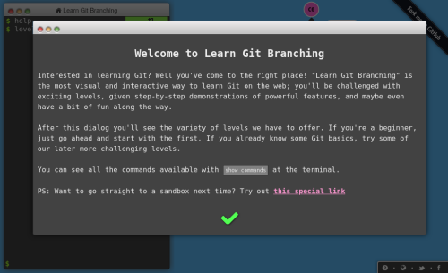

.. _onlinebook_git:

==========================
 Version Control with Git
==========================

.. sidebar:: Overview
    :class: overview

    **External Training**: about 3 hours.

    **Teaching**: 10 min

    **Exercises**: 15 min

    **Prerequisites**:

        * Basic bash knowledge

    **Questions**:

        * How to collaboratively develop software?
        * How to keep different versions of my code?
        * How to synchronize my code between servers?

    **Objectives**:

        * Learn to use the world's most successful version control system
        * Get ready to contribute to Belle 2 software

Creating a physics analysis or developing a piece of software is not a straight
forward process without errors. There will be a lot of changes to the scripts,
notes, documents, code over time.

Sometimes the changes will be wrong and we need to fix these errors. Sometimes
we might get feedback to a specific version of our paper but we might have
changed this part already and we need to figure out what still applies. And
sometimes we might get an email like this

    Hi,

    2 years ago you presented This Thing™ at That Meeting™ and I'm trying to do
    the same, could you send me the script you used back then?

    Best Regards,

    -- Poor Student

Now one way to achieve this is would maybe be to keep all old versions manually,
either in the same file but commented out like this:

.. code-block:: python

    a = 5
    # a += 6  wrong, changed April 2019
    # a += 7  still wrong, changed May 2019
    a += 8
    # print(f"value is {a/2}")  no longer needed, May 2019

Or by keeping old versions of the file manually and create ``thesis.tex``,
``thesis-v2.tex``, ``thesis-v2.1.tex``, ``thesis-v2.2-final.tex``,
``thesis-v2.2-final-really.tex`` ...

Or you could use a version control software to do this. And *the* version
control system to use these days is called Git. It helps you keep track of the
changes over time and more importantly, is basically essential to be able to
effectively work together with colleagues on the same project.

Git is everywhere in the software industry but also in science it is by now the
de-facto standard. It can and will make your life much, much easier but first
you will learn how to use it.

Luckily there is a very large amount of good git tutorials out there. We'll
stick with Software Carpentry and their `Version Control with Git
<https://swcarpentry.github.io/git-novice/>`_  introduction. We would like you
to go there and go through the introduction and then come back here when you are
done.

Afterwards we can quickly go to the Belle II specific things you might need to
be aware of.

Belle II Specifics
==================

In Belle II we use Bitbucket Server by Atlassian for our git repositories. While
this is rather similar to github in some regards. It is strongly advised to use
``ssh`` as access protocol and for that you need to upload your public key to
https://stash.desy.de.

You should already have a ssh key (see :ref:`onlinebook_ssh`) and you should copy the the contents of the
public key file and upload it `here
<https://stash.desy.de/plugins/servlet/ssh/account/keys>`__.

You should also make sure that you configure your git to username and email to
something your Collaborators can recognize. The best is to use the email address
you used when registering your DESY account or alternatively the DESY email
address you got with your account.

.. note::

    If you want to commit to the main Belle II software repository the email is
    actually validated to be one of the two options above.

We also have a `confluence page <https://confluence.desy.de/x/2o4iAg>`_ with
more information and help in case of problems.

Exercises
=========

.. seealso::

  While we'd encourage you to work through this section by yourself, we've also
  prepared a video to help. Please stop it at every exercise to think and try to
  do all steps by yourself as well.

  .. raw:: html

      <iframe width="640" height="400" src="https://rebrand.ly/fb969" frameborder="0" allow="accelerometer; autoplay; clipboard-write; encrypted-media; gyroscope; picture-in-picture" allowfullscreen></iframe>

Let's test what you learned so far!

.. admonition:: Exercise
   :class: exercise stacked

   The *Belle II Training* project contains two training repositories for playing
   with git. Find and clone them.

.. admonition:: Hint
   :class: xhint stacked toggle

   The project lives `here <https://stash.desy.de/projects/B2T>`__.

.. admonition:: Hint
   :class: xhint stacked toggle

   The repositories live `here <https://stash.desy.de/projects/B2T/repos/b2-git-training-space/browse>`__
   and `here <https://stash.desy.de/projects/B2T/repos/b2-git-training-space-2/browse>`__.
   You can find the URL to clone by clicking a button in the sidebar on your left.

.. admonition:: Solution
   :class: solution toggle

   .. code-block:: bash

      git clone ssh://git@stash.desy.de:7999/b2t/b2-git-training-space.git
      git clone ssh://git@stash.desy.de:7999/b2t/b2-git-training-space-2.git

Now you should have both repositories on your local machine.

.. admonition:: Exercise
   :class: exercise stacked

   Make a local change in ``b2-git-training-space``, commit and push.

.. admonition:: Solution
   :class: solution toggle

   .. code-block:: bash

      # Example of a change (try something else)
      echo "I'm a cat." >> my_story.txt
      git add my_story.txt
      git commit -m "Adding a story"
      git push

.. hint::

   If you get completely stuck in this exercise or in one of the following exercises
   you have a couple of options:

   * Start over by deleting the local repository and cloning a new one
     (`the xkcd school of using git <https://xkcd.com/1597/>`_)
   * Ask a more experienced ``git`` user for help (don't forget to include the
     output of ``git status`` and a clear description of your problem)
   * Familiarize yourself with ``git stash`` (shelves work that wasn't
     commited yet) and ``git reset`` ("undo" ``git commit``)

Unfortunately for you, ``b2-git-training-space-2`` has stricter rules and you
cannot just push changes there directly. Instead, you have to open a pull request (PR).
For this concept you need to complete the next section.

Branches (intermediate)
=======================

.. seealso::

  While we'd encourage you to work through this section by yourself, we've also
  prepared a video to help. Please stop it at every exercise to think and try to
  do all steps by yourself as well.

  .. raw:: html

      <iframe width="640" height="400" src="https://rebrand.ly/94f3hik" frameborder="0" allow="accelerometer; autoplay; clipboard-write; encrypted-media; gyroscope; picture-in-picture" allowfullscreen></iframe>

By now you should have a good feeling about why git is needed and start to feel
a bit more comfortable with basic ``git`` commands.

However there is one very important concept that we kept secret from you till
now: branches!
This concept is indispensable for collaborating on bigger projects, but you
might not need it right away if you work on a project all by yourself.

.. |uncheck| raw:: html

    <input type="checkbox">

.. hint::

   If you are short on time, you may skip this section, but you need to
   promise that you will come back!

   |uncheck| I promise!

Now complete the first three lessons on `learngitbranching <https://learngitbranching.js.org/>`_!

Now you should be familiar with the commands ``git branch`` and ``git merge``.

.. admonition:: Exercise (advanced)
   :class: exercise stacked

   Go to the repository ``b2-git-training-space-2`` and commit some changes to a new branch.

.. admonition:: Hint
   :class: xhint stacked toggle

   You should have already cloned this repository in the last section.
   Run ``git pull`` to make sure you're up to date.

.. admonition:: Hint
   :class: xhint stacked toggle

   You will need the commands ``git branch``, ``git checkout``, ``git add`` and ``git commit``.

.. admonition:: Solution
   :class: solution toggle

   .. code-block:: bash

      # Make sure your repository is up to date
      git pull
      # Create a new branch (IMPORTANT: pick a unique name for your branch!)
      git branch <your new branch>
      # Switch to it
      git checkout <your new branch>
      # Example of a change (try something else)
      echo "I'm a cat." >> my_story.txt
      git add my_story.txt
      git commit -m "Adding a story"

Remember that you weren't allowed to push to the master branch in this
repository. To still get your changes in, you need to first push your
new branch to the remote (just like there is a local and a remote ``master``
branch you will then have a local and a remote ``<your new branch>`` branch).

.. code-block:: bash

   git push --set-upstream origin <your new branch>

The output of the last command tells you to go to

.. code-block::

   https://stash.desy.de/projects/B2T/repos/b2-git-training-space-2/compare/commits?sourceBranch=refs/heads/<your new branch>

to open a PR. That's exactly what we want to do!

.. admonition:: Exercise
   :class: exercise stacked

   Create a PR and add the StarterKit organizer as a reviewer.

.. admonition:: Solution
   :class: solution toggle

   Click on the link described above or paste it in the address bar of
   your browser. Follow the instructions.

Now you have to wait for someone to approve your PR. Once they do,
you can click on the ``Merge`` button. Then your changes are finally
in the repository (verify this by checkout out the ``master`` branch and
updating it with ``git pull``).

.. admonition:: Exercise
   :class: Exercise

   Check if there are any other open PRs. If there are, leave some comments!
   You can also add yourself as the reviewer and approve them.

Further reading
---------------

Git is complex and it might take you months (or years, depending on your effort)
to really feel its full power and to be able to use it effortless.

At this point `the xkcd comic <https://xkcd.com/1597/>`_ from above might still
show you (we certainly haven't taught you enough to change it). Therefore it's important
to continue your training even after the StarterKit. It will not be time wasted!

.. seealso::

  We have started to compile a reading list for git `on confluence <https://confluence.desy.de/x/qhG3Cg>`_.
  Please take a look (and help us extend it if you can recommend other tutorials)!

.. hint::

  There is a variety of graphical user interfaces for git. If visualizing things
  helps you and you still feel uncomfortable in the command line, you might
  want to try them out!

.. include:: ../lesson_footer.rstinclude

.. topic:: Authors of this lesson

     Kilian Lieret,
     Martin Ritter
