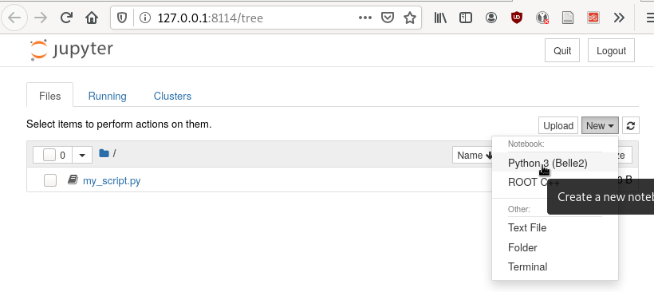

.. _onlinebook_python:

Python
======

.. sidebar:: Overview
    :class: overview

    **External Training**: about 7 hours.

    **Teaching**: 1 hour

    **Exercises**: 30 min

    **Prerequisites**:

      * :ref:`onlinebook_ssh`

    **Questions**:

      * What are the key concepts of python?
      * How can I process tabular data?
      * How can I plot data?

    **Objectives**:

      * Get more familiar with python
      * Understand how to manipulate and plot data with ``root_pandas``

High Energy Physics (HEP) analyses are too complex to be done with pen, paper
and calculator. They usually are not even suited for spreadsheet programs like
Excel. There are multiple reasons for this. For one the data size is usually
larger than paper or spreadsheets can handle. But also the steps we take are
quite complex. You are of course welcome to try but we really don't recommend
it.

So what we need is something more powerful. For many years the HEP community
believed that only very fast and complex programming languages are powerful
enough to handle our data. So most students needed to start with C++ or even
Fortran.

And while there's nothing wrong with those languages once you mastered them, the
learning curve is very long and steep. Issues with the language have been known
to take a major fraction of students time with frustrating issues like:

* Why does it not compile?
* It crashes with an error called "segmentation violation", what's that?
* Somehow it used up all my memory and I didn't even load the data file yet.

And while it's true that once the program was finally done running the analysis
be very fast it is not necessarily efficient. Spending half a year for on a
program for it to finish in an hour instead of one month development and have it
finish in a day is maybe not the best use of students time.

So in recent years HEP has started moving to Python for analysis use: It is very
easy to learn and has very nice scientific libraries to do all kinds of things.
Some people still say python is way too slow and if you misuse it that is
certainly true. But if used correctly python is usually much easier to write and
can achieve comparable if not better speeds when compared to naive C++
implementations. Yes, if you are a master of C++ nothing can beat your execution
speed but the language is very hard to master. In contrast Python offers
sophisticated and optimized libraries for basically all relevant use cases.
Usually these include optimizations that would take years to implement in C++,
like GPU support.

Think about it: almost all of the billion dollar industry that is machine
learning is done in Python and they would not do that if it would not be
efficient.

Consequently in Belle II we make heavy use of Python which means you will need
to be familiar with it. By now you probably know what's coming next.

Luckily there is a very large amount of good python tutorials out there. We'll
stick with Software Carpentry and their `Programming with Python
<https://swcarpentry.github.io/python-novice-inflammation/>`_   introduction. We
would like you to go there and go through the introduction and then come back
here when you are done.

.. image:: swcarpentry_logo-blue.svg
    :target: https://swcarpentry.github.io/python-novice-inflammation/
    :alt: Programming with Python

What are the key concepts of python?
------------------------------------

.. seealso::

  While we'd encourage you to work through this section by yourself, we've also
  prepared a video to help. Please stop it at every exercise to think and try to
  do all steps by yourself as well.

  .. raw:: html

      <iframe width="640" height="400" src="https://rebrand.ly/46pihb0" frameborder="0" allow="accelerometer; autoplay; clipboard-write; encrypted-media; gyroscope; picture-in-picture" allowfullscreen></iframe>

Welcome back! Now we're going to test you on your new-found knowledge
in Python.

As you should be aware by now, the key concepts of python include:

  * importing libraries that you wish to use
  * importing and/or storing data in different ways i.e. arrays, lists
  * writing and using (sometimes pre-defined) functions
  * writing conditions: if statements, for loops etc.
  * understanding and using errors to debug

You should be aware that there are multiple ways of running
python. Either interactively from your terminal:

.. code-block:: bash

  python3

>>> import math
>>> print(math.pi)

As a script from your terminal:

.. code-block:: bash

  python3 my_script.py  # where this file has python commands inside

Or within a python compiler and interpreter such as Visual Studio or XCode.

The official recommended version of python is python3. Python2 is no longer supported.
To check which python version you have installed you can check in your terminal using

.. code-block:: bash

  python3 --version

OR you could perform this in a live python session, either in your terminal or in a jupyter notebook using:

.. code:: ipython3

  from platform import python_version
  print(python_version())

Let's create a python file from terminal and run it

.. admonition:: Exercise
  :class: exercise stacked

  Log in to KEKCC. Create a folder ``starterkit`` in your home folder and
  create a python file ``my_file.py``. Import the basic math library `math <https://docs.python.org/3/library/math.html>`_
  and print out the value of π.

.. admonition:: Hint
  :class: xhint stacked toggle

  To create a file you'll need to use your bash skills. The internet is your friend.

.. admonition:: Hint
  :class: xhint stacked toggle

  The specific bash commands you'll need are ``mkdir``, ``cd`` and ``touch``.

.. admonition:: Hint
  :class: xhint stacked toggle

  Add the ``import`` command inside your python file using your favourite
  editor. Previous tutorials introduced the ``nano`` editor to you.

.. admonition:: Solution
  :class: solution toggle

  .. code-block:: bash

    # Make sure we're in our home directory
    cd ~
    # Create a folder and change there
    mkdir starterkit
    cd starterkit
    # Create your .py file
    touch my_file.py
    # Open your file to edit it in your editor of choice, e.g.
    nano my_file.py

  Now add the python lines to your file.

  .. code-block:: python

    import math
    print(math.pi)

Congratulations! You've now created your first python file. Now, run it!

.. admonition:: Exercise
  :class: exercise stacked

  Run your new python file in your terminal.

.. admonition:: Solution
  :class: solution toggle

  .. code-block:: ipython3

    python3 my_file.py

Great! Well done! 😁 You can now create python scripts in your terminal!

Practising Python: Jupyter notebooks
-------------------------------------

.. seealso::

  While we'd encourage you to work through this section by yourself, we've also
  prepared a video to help. Please stop it at every exercise to think and try to
  do all steps by yourself as well.

  .. raw:: html

      <iframe width="640" height="400" src="https://rebrand.ly/5jctlx7" frameborder="0" allow="accelerometer; autoplay; clipboard-write; encrypted-media; gyroscope; picture-in-picture" allowfullscreen></iframe>

We will work in a jupyter notebook to allow you to
practice using your python skills further.

`Jupyter <https://jupyter.org/>`_ Notebooks are interactive notebooks that allow one to visualise code,
data and outputs in a very simple way. When you run a notebook you have an
operating system called a kernel that runs the code.

.. admonition:: Exercise
  :class: exercise stacked

  Navigate to your ``starterkit`` folder on KEKCC that you created in the previous
  exercise. Start your Jupyter notebook server. Open the jupyter page in your browser.

.. admonition:: Solution
  :class: solution toggle

  .. code-block:: bash

    cd ~/starterkit  # just to make sure we're there
    jupyter-notebook --port <your forwarded port> --no-browser

  Connecting and starting a jupyter notebook is described in more detail here (:ref:`onlinebook_ssh`).

.. admonition:: Running on other servers (optional)
  :class: toggle

  In principle most of the content of this page will work from anywhere if
  you have installed the right packages.

  * If you have the Belle II software explained and set up, there are no issues
    at all. Please start your jupyter notebook after running ``b2setup`` as
    shown in the SSH tutorial
  * If you are using the DESY NAF Jupyter Hub, make sure that you select the
    latest Belle II software release as kernel (i.e. ``release-xx-xx-xx``),
    rather than ``python`` (the letter won't have ROOT properly set up).
  * If you cannot set up the Belle II software, you might need to install some
    packages locally

Note that your script ``my_script.py`` from before is also shown.

.. admonition:: Exercise
  :class: exercise

  Click on ``my_script.py`` and add another line of python code and save.
  Go back to the home screen and click on "New" and then "Text File".
  Call your file ``my_second_script.py`` and add a couple of lines of
  python.

.. admonition:: Exercise
  :class: exercise stacked

  Now open a second terminal window and connect to kekcc. Verify that you did
  indeed create the second file and change the contents of the first.

.. admonition:: Solution
  :class: solution toggle

  .. code-block:: bash

    cd ~/starterkit
    ls
    cat my_script.py
    cat my_second_script.py

.. hint::

  Throughout all of the following lessons you always need to have one terminal window for your
  jupyter notebook to run in and one more to enter commands in bash, just as we
  practiced right now.

Okay, so we can also create and edit files through our browser. Nice!

But the true power of jupyter are its *notebooks*. Click on "New" and "Python 3 (Belle 2)" as
shown in the screenshot

A new window with your notebook will open.

The main difference between using a jupyter
notebook (``.ipynb``) and a python file (``.py``) is that jupyter notebooks
are interactive and allow you to see what your code does each step of
the way. If you were to type all of code into a python
file and run it, you would achieve the same output (provided you save
something as output).

Each block in a jupyter
notebook is a "cell". These cells can be run using the kernel by clicking the
run button or by pressing ``Shift + Enter``.   When you run a cell, the kernel will
process and store any variables or dataframes you define.   If your kernel
crashes, you will have to restart it.

.. admonition:: Exercise
  :class: exercise

  Click on "Help" and then on "User Interface Tour" to get a first overview
  over jupyter.
  Examine the ``Cell`` and ``Kernel`` drop down menus to see what options
  you have available.

.. admonition:: Exercise
  :class: exercise

  Write a couple of lines of python in a cell of the notebook and execute
  them.

It is also useful to be able to access help or extra information about the
tools you will be using. In particular you will often want to check
information about a python object you are using. The definition of a python
object includes commands, packages, modules, classes, types...
basically anything that has a description called a *docstring*).
There are multiple ways to access this information, including
what is already discussed  in :ref:`onlinebook_basf2_introduction`
For jupyter notebooks, a great interactive way to access the information
(docstring) is by putting your cursor on the object in question and pressing
``Shift + Tab``.

In addition to the ``Shift + Tab`` option, you can also run a cell with your
object in question, with a question mark! For example, if our object in
question is the ``print`` function we can type:

.. code:: ipython3

  print?

For any python interpreter, one can also use:

.. code:: ipython3

  help(object)

Pandas Tutorial and Python Data Analysis
----------------------------------------

This section aims to answer the question *"How can I process tabular data?"*

We will use the `root_pandas <https://github.com/scikit-hep/root_pandas>`_
package to read TTrees from ROOT files.

Now, the previous sentence may have not been familiar to you at all. If so, read
on. If not, feel free to skip the next paragraph.

ROOT: a nano introduction
^^^^^^^^^^^^^^^^^^^^^^^^^

ROOT files, as you'll come to be familiar with, are the main way we store our
data at Belle II. Within these files are ``TTree`` objects known as *trees*, which are
analogous to a sub-folder. For example, you may store a tree full of :math:`B`
meson candidates. Within a tree you can have ``TBranch``'es known as
*branches*. Each branch could be one of the oodles of variables available for
the particle you've stored in your tree --- for example, the :math:`B` meson's
invariant mass, it's daughter's momentum, it's great-great-granddaughter's
cluster energy etc. etc. etc.

* More information: `CERN's ROOT <https://root.cern.ch/>`_
* If you get stuck with ROOT, you can also ask in  `CERN's ROOT Forum <https://root-forum.cern.ch/>`_

Importing ROOT files
^^^^^^^^^^^^^^^^^^^^

In this section we will learn how to import a ROOT file as a Pandas DataFrame
using the ``root_pandas`` library.

Pandas provides high-performance, easy-to-use data structures and data analysis
tools for Python, see `here
<https://pandas.pydata.org/docs/user_guide/10min.html>`_.

.. admonition:: Exercise
  :class: exercise stacked

  Start a new notebook and import ``root_pandas``.

.. admonition:: Solution
  :class: solution toggle

  .. code:: ipython3

    import root_pandas

You can load in an example dataframe using the ``read_root`` function from the ``root_pandas`` package.

.. code:: ipython3
  :linenos:

  file_path = "https://desycloud.desy.de/index.php/s/R8iModtQsa4WwYx/download?path=%2F&files=pandas_tutorial_ntuple.root"
  df = root_pandas.read_root(file_path)

This code imports the ``pandas_tutorial_ntuple.root`` root file as a dataframe ``df``. You are welcome to import your own root files, but be aware that the variables and outputs will appear differently to this tutorial.

.. admonition:: Alternatives to ``root_pandas`` (optional)
  :class: toggle

  ``root_pandas`` needs ROOT to be installed but there is an alternative called
  `uproot <https://github.com/scikit-hep/uproot>`_ which can load root files into
  pandas dataframes without requiring ROOT. This means it's a bit simpler to
  install on your personal machine.

  With ``uproot``, line 2 of the above snippet becomes

  .. code-block::

    df = uproot.open(file_path)["b0phiKs"].pandas.df

Investigating your DataFrame
^^^^^^^^^^^^^^^^^^^^^^^^^^^^^

In jupyter notebooks, the last value of a cell is shown as output. So if we create
a cell with

.. code:: ipython3

  df

as the last line, we will see a visual representation of the dataframe. In your case
each row of the dataframe corresponds to one candidate of a collision event.

You can also show a preview of the dataframe by only showing the first few rows using ``head``.
Similarly ``tail`` shows the last few rows. Optionally: You can
specify the number of rows shown in parentheses.

.. code:: ipython3

  df.head(5)

Each DataFrame has an index (you can think of this as row numbers, in our case the number of the candidates)
and a set of columns:

.. code:: ipython3

  len(df.columns)

You can access the full data stored in the DataFrame with the ``to_numpy`` method,
which is a large 2D numpy matrix

.. code:: ipython3

  df.to_numpy

However ``to_numpy`` may not be the most visually pleasing (or easy) way to inspect the contents of your dataframe.

A useful feature to quickly summarize your data is to use the ``descibe`` method:

.. code:: ipython3

  df.describe()

.. admonition:: Exercise
  :class: exercise stacked

  What are the output rows of ``df.describe``?

.. admonition:: Hint
  :class: xhint stacked toggle

  No hint here!

.. admonition:: Solution
  :class: solution toggle

  ``df.describe`` has the great ability to summarize each of your columns/variables. When using it, a table is printed with rows of 'count', 'mean', 'std', 'min', '25%', '50%', '75%' and 'max'.

* ``count``, the number of entries
* ``mean``, the average of all entries
* ``std``, the standard deviation of the column
* ``min``, and ``max``: the smallest and largest value of the column
* ``25%``, ``50%``, ``75%``: the value where only 25%, 50% or 75% of the entries in the column have
  a smaller value. For example if we have 100 entries in the dataframe the 25% quantile is the 25th smallest value.
  The 50% quantile is also known as the median.

You can also display the values of the DataFrame sorted by a specific column:

.. code:: ipython3

  df.sort_values(by='B0_M').head()

Finally, everyone who works with numpy and pandas will at some point try to use a fancy funtion and get an error message that the *shapes* of some objects differ.

.. admonition:: Exercise
  :class: exercise stacked

  What is the output of ``df.shape`` and what does it mean?

.. admonition:: Hint
  :class: xhint stacked toggle

  Try it out in your jupyter notebook. To understand the output, ``df.shape?`` (or ``pd.DataFrame.shape?``) is,
  once again, your friend.

.. admonition:: Solution
  :class: solution toggle

  The output comes in the form of a tuple (a finite ordered list (or sequence) of elements). For example, one output could be ``(15540523, 20)``, which is saying you have a dataframe of 15540523 rows, and 20 columns.

Selecting columns
^^^^^^^^^^^^^^^^^

Selecting a column can be performed by ``df['column_name']`` or
``df.column_name``. The result will be a pandas Series, a 1D vector. The
difference between the two options is that using ``df.column`` allows for
auto-completion.

.. code:: ipython3

  df['B0_M'].describe()
  # or
  df.B0_M.describe()

Multiple columns can be selected by passing an array of columns:

.. code:: ipython3

  df[['B0_mbc', 'B0_M', 'B0_deltae', 'B0_isSignal']].describe()

We can assign this subset of our original dataframe to a new variable

.. code:: ipython3

  subset = df[['B0_mbc', 'B0_M', 'B0_deltae', 'B0_isSignal']]
  subset.columns

Selecting Rows
^^^^^^^^^^^^^^

Similarly to arrays in python, one can select rows via ``df[i:j]``. And single
rows can be returned via ``df.iloc[i]``.

.. code:: ipython3

  df[2:10]

Vectorized Operations
^^^^^^^^^^^^^^^^^^^^^

This is one of the most powerful features of pandas and numpy. Operations on a
Series or DataFrame are performed element-wise.

.. code:: ipython3

  df.B0_mbc - df.B0_M

Let's look a slightly more complicated (but totally non-physical) example:

.. code:: ipython3

  import numpy as np

  x = (df.B0_deltae * df.B0_et)**2 / (np.sin(df.B0_cc2) + np.sqrt(df.B0_cc5))
  2*x - 2

Adding Columns
^^^^^^^^^^^^^^^

You can easily add columns in the following way:

.. code:: ipython3

  df['fancy_new_column'] = (df.B0_deltae * df.B0_et)**2 / np.sin(df.B0_cc2)
  df['delta_M_mbc'] = df.B0_M - df.B0_mbc

.. code:: ipython3

  df.delta_M_mbc.describe()

.. code:: ipython3

  df['fancy_new_column']

Modifying Columns
^^^^^^^^^^^^^^^^^

Sometimes we want to change the type of a column. For example if we look at all
the different values in the ``B0_isSignal`` column by using

.. code:: ipython3

  df['B0_isSignal'].unique()

we see that there are only two values. So it might make more sense to interpet
this as a boolean value:

.. code:: ipython3

  df['B0_isSignal'] = df['B0_isSignal'].astype(bool)
  df.B0_isSignal.value_counts()

Querying Rows (i.e. making cuts)
^^^^^^^^^^^^^^^^^^^^^^^^^^^^^^^^

Finally, arguably the most useful function for your analyses is the ``query`` function. Querying allows one to cut on data using variables and values using a 'cut string'. Within your cut string you can use usual python logic to have many arguments. For example:

.. code:: ipython3

    df.query("(B0_mbc>5.2) & (B0_deltae>-1)")

.. admonition:: Exercise
  :class: exercise stacked

  Create two DataFrames, one for Signal and one for Background only
  containing ``B0_mbc``, ``B0_M``, ``B0_isSignal`` and ``B0_deltae`` columns.

.. admonition:: Hint
  :class: xhint stacked toggle

  Split between signal and background using the ``B0_isSignal`` column.

.. admonition:: Solution
  :class: solution toggle

  .. code:: ipython3

    bkgd_df = df.query("B0_isSignal==0")[["B0_mbc", "B0_M", "B0_isSignal", "B0_deltae"]]
    signal_df = df.query("B0_isSignal==1")[["B0_mbc", "B0_M", "B0_isSignal", "B0_deltae"]]

Grouped Operations: a quick note
^^^^^^^^^^^^^^^^^^^^^^^^^^^^^^^^

One of the most powerful features of pandas is the ``groupby`` operation. This
is beyond the scope of the tutorial, but the user should be aware of it's
existence ready for later analysis. ``groupby`` allows the user to group all
rows in a dateframe by selected variables.

.. code:: ipython3

  df.groupby('B0_isSignal').describe()

A short introduction to plotting in python
------------------------------------------

In this section we will answer *"How can I plot data?"* and demonstrate the
`matplotlib <https://matplotlib.org>`_ package used to plot in python.

.. code:: ipython3

  import matplotlib.pyplot as plt
  # show plots in notebook
  %matplotlib inline

.. hint::

  ``%matplotlib inline`` is not normal python code (you might get a ``SyntaxError``), but a so called
  `magic function <https://ipython.readthedocs.io/en/stable/interactive/tutorial.html#magics-explained>`_
  of your interactive python environment. Here it is responsible for showing the
  plots in your notebook.

  If you don't see any plots, you have probably forgot to include and execute this line!

In previous example workshops the simple decay mode :math:`B^0\to \phi K_S^0`,
where :math:`\phi \to K^+ K^-` and :math:`K_S^0 \to \pi^+ \pi^-` was
reconstructed. Now we will use these candidates to plot example
distributions. This time we use the ``root_pandas`` package to read the data

.. code:: ipython3
  :linenos:

  import root_pandas

  file_path = "https://desycloud.desy.de/index.php/s/R8iModtQsa4WwYx/download?path=%2F&files=pandas_tutorial_ntuple.root"
  df = root_pandas.read_root(file_path).astype(float)
  df.B0_isSignal = df.B0_isSignal.astype(bool)
  df.describe()

Pandas built in histogram function
^^^^^^^^^^^^^^^^^^^^^^^^^^^^^^^^^^

There exists, if you prefer, a built in histogram function for Pandas. The
following cells show how to implement it.

.. code:: ipython3

  df.B0_mbc.hist(range=(5.2, 5.3), bins=100)

.. code:: ipython3

  df.B0_mbc.hist(range=(5.2, 5.3), bins=100, by=df.B0_isSignal)

.. code:: ipython3

  df.query("B0_isSignal==1").B0_mbc.hist(range=(5.2, 5.3), bins=100)
  df.query("B0_isSignal==0").B0_mbc.hist(range=(5.2, 5.3), bins=100, alpha=.5)

.. admonition:: Exercise
  :class: exercise

  Now plot ``B0_deltae`` separately for signal and background.

Using Matplotlib
^^^^^^^^^^^^^^^^

Internally the pandas library however makes use of matplotlib itself.
Using matplotlib directly opens up many more possibilities. It also works well
with juptyer notebooks, so this is what this tutorial will focus on.
Compare the following two code snippets with their equivalent of the last
section to get a feeling for the syntax.

.. code:: ipython3

  h = plt.hist(df.B0_mbc, bins=100, range=(5.2, 5.3))

.. code:: ipython3

  h = plt.hist(df.query("B0_isSignal==1").B0_mbc, bins=100, range=(5.2, 5.3))
  h = plt.hist(df.query("B0_isSignal==0").B0_mbc, bins=100, range=(5.2, 5.3))

Making your plots pretty
^^^^^^^^^^^^^^^^^^^^^^^^

Let’s face it, physicists aren’t well known for their amazing graphical
representations, but here’s our chance to shine! We can implement matplotlib
functions to make our plots GREAT. You can even choose a `colourblind friendly colour scheme <https://confluence.desy.de/display/BI/Colo%28u%29r+Blind+Friendly+Plots+and+Displays>`_!

It is possible to display multiple plots at once using ``plt.subplots``. As you can see
below, rather than simply having our histograms show up using ``plt``, we define a
figure ``fig`` and axes ``ax``.
These are the equivalent of our canvas where we paint our code art.

.. code:: ipython3
  :linenos:

  # Here we set up the "canvas" to show two plots side by side
  fig, ax = plt.subplots(nrows=1, ncols=2, figsize=(10, 6))
  # ax is now an array with two elements, each representing one plot

  h = ax[0].hist(df.query("(B0_isSignal == 1)").B0_mbc, bins=100, range=(5.2, 5.3),
                histtype='stepfilled', lw=1, label="Signal", edgecolor='black')
  h = ax[1].hist(df.query("(B0_isSignal == 0)").B0_mbc, bins=100, range=(5.2, 5.3),
                histtype='step', lw=2, label="Background")

  ax[0].legend(loc="best")
  ax[0].set_xlabel(r"$M_{\mathrm{bc}}$", fontsize=18)
  ax[0].grid() # applies a nice grid to the plot
  ax[0].set_xlim(5.2, 5.3) # sets the range of the x-axis

  plt.show()  # shows the figure after all changes to the style have been made

.. note::

  Note that we were using so-called r-strings: ``r"this is my string"``.
  Usually characters escaped with a backslash have special meanings. For example
  ``\n`` represents a line break. If you want to type a literal ``\n`` (for example
  when you type a :math:`\nu` in LaTeX for your plot labels as ``\nu``), you can either
  "escape" the backslash ``\\nu`` or deactivate special characters altogether by
  adding an ``r`` to the beginning of the string ``r"\nu"``.

.. admonition:: Exercise
  :class: exercise stacked

  Run the above code to see the effects on the output and then apply your own changes to
  the second axis.

.. admonition:: Hint
  :class: xhint stacked toggle

  ``ax[0]`` refers to the first axis, so all changes in the code snippet above will
  only change that axis.

.. admonition:: Solution
  :class: solution toggle

  This solution is a basic example, there are many fun style edits you can find online for
  yourself.

  .. code:: ipython3
    :linenos:

    fig, ax = plt.subplots(1,2,figsize=(10,6))

    h = ax[0].hist(df.query("(B0_isSignal == 1)").B0_mbc, bins=100, range=(5.2, 5.3),
                  histtype='stepfilled', lw=1, label="Signal", edgecolor='black')
    h = ax[1].hist(df.query("(B0_isSignal == 0)").B0_mbc, bins=100, range=(5.2, 5.3),
                  histtype='step', lw=2, label="Background")

    ax[0].legend(loc="best")
    ax[1].legend(loc=3)

    ax[0].set_xlabel(r"$M_{\mathrm{bc}}$", fontsize=18)
    ax[1].set_xlabel(r"$M_{\mathrm{bc}}$", fontsize=20)

    ax[0].grid()

    ax[0].set_xlim(5.2, 5.3)
    ax[1].set_xlim(5.2, 5.3)

    plt.show()

The implementation of 2D histograms are often very useful and are easily done:

.. code:: ipython3
  :linenos:

  plt.figure(figsize=(15,10))
  cut = '(B0_mbc>5.2) & (B0_phi_M<1.1)'
  h = plt.hist2d(df.query(cut).B0_mbc, df.query(cut).B0_phi_M, bins=100)
  plt.xlabel(r"$M_{BC}$")
  plt.ylabel(r"$M(\phi)$")
  plt.savefig("2dplot.pdf")
  plt.show()

.. note::

  Note here how the query cut has been defined as the string ``cut`` which is then
  passed to ``df.query``. You should always avoid copy/pasting the same code
  (inflexible and prone to errors).

.. admonition:: Exercise
  :class: exercise stacked

  However the code above is not as efficient as it could be. Do you see why?
  How could you solve this?

.. admonition:: Hint
  :class: xhint stacked toggle

  With a very large dataframe, ``query`` can take a lot of time (you need to look
  at every row of the dataframe, even if only few rows pass the selection)

.. admonition:: Hint
  :class: xhint stacked toggle

  So the issue is that you call ``df.query(cut)`` twice. How could you avoid this?

.. admonition:: Solution
  :class: solution toggle

  You could simply define ``df_cut = df.query(cut)`` and then use ``df_cut``
  in line 3.

.. admonition:: Another way to use matplotlib with dataframes
  :class: toggle

  Most matplotlib functions also support a ``data`` keyword which can take a
  dataframe. Afterwards you can specify columns by their string names.
  In our example, line 3 could have been

  .. code-block:: python

    h = plt.hist2d("B0_mbc", "B0_phi_M", bins=100, data=df.query(cut))

  Note that this also solves the last exercise (we only call ``query`` once).

Finally, Belle II does have an `official plot style <https://stash.desy.de/projects/B2/repos/plot_style/browse>`_, for plots that are *published* internally and externally.
You do not need to worry about this at this stage, but keep it in mind.

.. warning::

  The following will only work if you have the Belle II software ``BASF2`` set up.
  You will learn how to do so in the following chapters.
  You're invited to still try executing the following lines, but don't worry if
  you see an error message telling you that the style has not been found.

Importing the style is as easy as "one, two, ...

.. code:: ipython3

  from matplotlib import pyplot as plt
  plt.style.use("belle2")

.. seealso::

  A very fun way to explore the capabilities of ``matplotlib`` is the
  `matplotlib gallery <https://matplotlib.org/3.1.1/gallery/index.html>`_ that
  shows many example plots together with the code that was used to generate them.

.. admonition:: Exercise
  :class: exercise stacked

  Select your favorit plot from the ``matplotlib`` gallery. Can you generate
  it in your notebook? Try to modify some properties of the plotting
  (different colors, labels or data).

.. admonition:: Solution
  :class: solution toggle

  You should be able to generate the picture simply by copy-pasting the code
  example given.

Dealing with large files in a jupyter notebook (optional)
---------------------------------------------------------

If your files are quite large you may start to find your jupyter notebook kernel
crashing - there are a few ways in which we can mitigate this.

- "Chunk" your data
- Only import the columns (variables) that you will use/need.
- Add any cuts you can

To import the file using chunking there are some slight differences in the code:

.. code:: ipython3

   df_chunk = root_pandas.read_root(
       ['filePath/fileName'], columns=Y4S_columns, chunksize=100
   )

Here I have defined which columns I wish to be included in the following string:

.. code:: ipython3

  Y4S_columns = ['B0_mbc', 'B0_M', 'B0_deltae', 'B0_isSignal']

.. admonition:: Exercise
  :class: exercise stacked

  Load your dataframe as chunks.

.. admonition:: Solution
  :class: solution toggle

  .. code:: ipython3

    files = ["https://desycloud.desy.de/index.php/s/R8iModtQsa4WwYx/download?path=%2F&files=pandas_tutorial_ntuple.root"]
    df_chunk=root_pandas.read_root(files, columns=Y4S_columns, chunksize=100000)

Now the data is loaded as chunks, we "loop" over or run through all the chunks
and piece them together. This is the point at which we can add our cuts to
reduce the loaded, chunked file more.

.. code:: ipython3
  :linenos:

  import pandas as pd

  cut = "(B0_mbc > 5.2)"  # Define our cut

  df_list = []
  for chunk in df_chunk:
      chunk = chunk.query(cut)  # Implement our cut!
      df_list.append(chunk)
  df = pd.concat(df_list)  # Concatenate our chunks into a dataframe!

Your journey continues
----------------------

If you haven't programmed in python before this lesson, then you're probably quite
exhausted at this point and deserve a break!

However, your python journey has just begun and there's a lot to learn.

.. |uncheck| raw:: html

    <input type="checkbox">

.. hint::

  Even if you can somehow get your analysis "to work" with your current understanding
  of python, we can't encourage you enough to keep on educating yourself about
  python and its best coding practices.

  Chances are you will write a LOT of code and work on your analysis for a long time.
  Bad design decisions and sloppy coding practices will slowly build up and might
  cost you a lot of time and nerves in the end (and will cause pain to anyone
  who will have to work with your code afterwards).

  |uncheck| I promise I will read more about this.

.. admonition:: Exercise
  :class: exercise stacked

  A small `easter egg <https://en.wikipedia.org/wiki/Easter_egg_(media)>`_ that has been
  included in python: Simply run

  .. code-block:: python

    import this

  Can you make sense of the output?

.. admonition:: Solution
  :class: solution toggle

  This "Zen of Python" collects 19 guiding principles for writing good python code.
  There's a `wikipedia page about it <https://en.wikipedia.org/wiki/Zen_of_Python>`_ and many
  more resources that you can google that go into more detail.

.. seealso::

  We have started to compile a reading list for python `on confluence <https://confluence.desy.de/x/ARC3Cg>`_.
  Please help us extend it!

.. include:: ../lesson_footer.rstinclude

.. topic:: Authors of this lesson

  Martin Ritter (Intro),
  Hannah Wakeling (Exercises),
  Kilian Lieret
