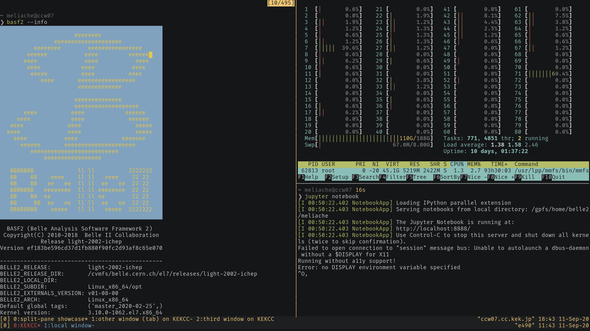

.. _onlinebook_ssh:

SSH - Secure Shell
==================

.. sidebar:: Overview
    :class: overview

    **Teaching**: 1 h

    **Exercises**: 15 min

    **Prerequisites**:

        * The ssh client installed on your computer
        * To be able to enter simple commands on the terminal
        * How to edit a text file on your computer
        * A DESY account
        * A `KEKCC account <https://belle.kek.jp/secured2/secretary/registration/comp_system.html>`_

    **Questions**:

        * How to log in to a server?
        * Why should I have a SSH config?
        * How to generate and use keys?
        * How to forward ports?
        * How to copy files from and to a server?
        * How can I get Jupyter notebooks running on a server?

    **Objectives**:

        * Be able to work comfortably on a remote machine.

Secure Shell (SSH) is a protocol to access other computers. It was invented in
1995 to make the old methods more secure but on first glance it still behaves
similar to remote shell or telnet from the eighties: You can connect to a remote
computer to enter commands in a terminal. In the simplest case you will just
type the name of the computer you want to connect to:

.. code-block:: none

    ssh username@servername.domain

However SSH has become much more powerful than this if you know how to use it
correctly. So in this section we will try to go through all the helpful features
you should know when working remotely.

But first we need to talk a bit about security, especially encryption.

Asymmetric Encryption
---------------------

One cornerstone technology of the current internet is asymmetric cryptography,
or public-key cryptography. When browsing the web we all use it constantly
without caring about it but it's also important for the efficient usage of SSH
so we need to go through some key features of it.

The idea behind asymmetric encryption is to have two distinct, different keys
for encryption. One key can encrypt the message and then only the other key can
decrypt the message.

A very simple example, consider a string of numbers from ``1435706``. Now for
encryption we could just "add" a value to each of this digits and take the
modulus by 10 to get another digit

.. math::

   f_{k}(x) = (x + k) \bmod 10

Now if we choose as keys :math:`A=3` and :math:`B=7` then we can "encrypt" the
message by applying :math:`f_A(x)` on each digit to get the encrypted message
``4768039``. And we can decrypt it again by applying :math:`f_B(x)` to get the
original message ``1435706``. This also works by first applying :math:`f_B(x)`
and then :math:`f_A(x)`

If we encrypt a message with one key we need to use the other key to decrypt the
message again and vice versa. Now this example is obviously way too simple but
this is actually rather close to the `RSA algorithm
<https://en.wikipedia.org/wiki/RSA_(cryptosystem)>`_ still used today.

In practice, we will now keep one of these keys private and publish the other.
Let's say we have two people, Alice and Bob and Alice owns the private key and
Bob has the public key. Then with this key pair they can perform two things:

.. _fig:asymmetric_encryption:

   The two use cases of public/private encryption using our very simple example.

Confidentiality
   Bob can send confidential information only intended for Alice by encrypting
   it with the public key. Only Alice has the private key to decrypt it and
   nobody else can see the content of the message (left side of
   :numref:`fig:asymmetric_encryption`).

Authentication
   To establish the identity of Alice, Bob gives Alice a message to encrypt with
   her private key. Bob can then decrypt it with his public key to be sure he
   talks to Alice as only she would have been able to encrypt the message (right
   side of :numref:`fig:asymmetric_encryption`).

The second part here is the one you are using almost everywhere in the internet:
Every https connection on the internet uses this principle to make sure that the
server claiming to be "netflix.com" is actually the real netflix server. And
this is also what we use for SSH connections.

.. warning::

    While the public key can be shared freely it is critical that the private
    key remains private. If someone gains access to your private key they can
    impersonate you in the digital world and get access to a lot of your
    resources.

.. admonition:: Key points
    :class: key-points

    * asymmetric cryptography has two keys, a private and a public key
    * it can be used to establish the identity of the owner of the private key
    * the private key should be kept as safe as possible.

SSH Basics
----------

Now back to SSH: When we connect to a server using SSH it will use the same
method to establish the identity of the server. So when you connect for the
first time SSH will ask you if you know this computer. So if you type

.. code-block:: bash

    ssh <desyusername>@bastion.desy.de

(and replace ``<desyusername>`` by your DESY username) for the first time you
should see something like

.. code-block:: none

    The authenticity of host 'bastion.desy.de (131.169.5.82)' can't be established.
    RSA key fingerprint is SHA256:WbkI/Ko+FdCbIAVn6ky2odyWxCvCL3+5XqWSZQ6PynE.
    Are you sure you want to continue connecting (yes/no)?

This means that ssh doesn't have the public key of ``bastion.desy.de`` which is
called the "host key" so it cannot be sure you connect to the right server. It's
usually fine to just say yes, it will only ask you the first time and remember
this decision. So after you enter yes you will get a message like

.. code-block:: none

    Warning: Permanently added 'bastion.desy.de' (RSA) to the list of known hosts.

which is perfectly normal. In the next step the server will ask you for your
password and after you entered that you should see a command line prompt and are
now connected.

Once you are connected the next important step is to disconnect, just type
``exit`` and press return and your connection will be closed. If you're very
impatient you can also press ``Ctrl-D`` as a shortcut.

..  _batch system recommendation warning:
.. warning::

    Don't run long-running and CPU or memory heavy jobs on login nodes like
    KEKCC and DESY where they have a dedicated batch systems (e.g.
    :ref:`onlinebook_gbasf2`, :ref:`LSF <onlinebook_bsub>` or
    :ref:`onlinebook_htcondor`). The login nodes are shared
    resources for all users and it's not very polite and mostly also not
    permitted to occupy them with calculations that could be done on dedicated
    machines.

.. admonition:: Exercise
   :class: exercise

   Login to ``bastion.desy.de``, verify that the login succeeded with the
   ``hostname`` command and log out again.

.. seealso::
   :class: toggle

    One final thing about host keys: After you connected to a server, ssh
    remembers the host key and will verify it on each connection. So you might
    see something like this::

        @@@@@@@@@@@@@@@@@@@@@@@@@@@@@@@@@@@@@@@@@@@@@@@@@@@@@@@@@@@
        @    WARNING: REMOTE HOST IDENTIFICATION HAS CHANGED!     @
        @@@@@@@@@@@@@@@@@@@@@@@@@@@@@@@@@@@@@@@@@@@@@@@@@@@@@@@@@@@
        IT IS POSSIBLE THAT SOMEONE IS DOING SOMETHING NASTY!
        Someone could be eavesdropping on you right now (man-in-the-middle attack)!
        It is also possible that a host key has just been changed.
        The fingerprint for the RSA key sent by the remote host is
        SHA256:zyIMwlji8jqtD+UuSFuknQmevQPAUCiT39BfH/NrIbA.
        Please contact your system administrator.

    This means the host presented a different key than it used to. This can
    sometimes happen if the server you want to connect to was reinstalled. So if
    **you know** that the server was reinstalled or upgraded you can tell ssh to
    forget the previous host key. For example to forget the host key for
    ``bastion.desy.de`` just use

    .. code-block:: bash

        ssh-keygen -R bastion.desy.de

.. rubric:: Copying Files

In addition to just connection to a remote shell we can also ssh to copy files
from one computer to another. Very similar to the ``cp`` command there is a
``scp`` command for "Secure Copy". To specify a file on a server just precede
the filename with the ssh connection string followed by a colon:

.. code-block:: bash

    scp desyusername@bastion.desy.de:/etc/motd bastion-message

This will copy the file ``/etc/motd`` to your local computer into the current
directory. In the same way

.. code-block:: bash

    scp bastion-message desyusername@bastion.desy.de:~/

will copy the file ``bastion-message`` from your local directory into your home
directory on ``bastion.desy.de``.

.. admonition:: Exercise
   :class: exercise stacked

   Copy a file from your local computer to your home directory on
   ``bastion.desy.de``

.. admonition:: Hint
   :class: toggle xhint

   You can use the ``touch`` command to create empty files

.. admonition:: Exercise
   :class: exercise

   Copy a file from your home directory on ``bastion.desy.de`` to you local
   directory

.. admonition:: Question
   :class: exercise stacked

   How can we copy full directories with all files at once?

.. admonition:: Hint
   :class: toggle xhint stacked

   Try ``man scp``

.. admonition:: Solution
   :class: toggle solution

   Supply ``-r`` to scp: ``scp -r desy:~/plots .`` will try to copy the full
   directory ``plots`` on the remote machine to your current directory

   However for more efficient copying of large amount of files you should consider
   using ``rsync``

.. rubric:: Nested SSH connections

You can also use ssh inside an ssh connection to "jump" from machine to machine.
This sometimes is necessary as not all computers can be connected to directly
from the internet. For example the login node for the KEK computing center
cannot be accessed directly if your are not in the KEK network or using VPN. The
KEK network is rather complex so a very simplified layout is shown in
:numref:`fig:keknetwork`.

.. _fig:keknetwork:

   Very simplified layout of the KEK network.

.. note::
   It is possible for your home institute to get direct access to KEK network so
   you might not be affected by this restriction while at work.

So unless you are using VPN or are at KEK you most likely need to connect to the
gateway servers first, either ``sshcc1.kek.jp`` or ``sshcc2.kek.jp``

.. code-block:: none

    ssh username@sshcc1.kek.jp

.. warning::

    Your username on KEKCC is not necessarily the same as your DESY username.

and once this connection is established you can login to KEKCC from this gateway
server.

.. code-block:: none

    ssh username@login.cc.kek.jp

.. warning::

    * This second step needs to be done in the terminal connected to the gateway
      server
    * The initial password for ``login.cc.kek.jp`` is not the same as that of
      ``sshcc1.kek.jp``.

Now you should be connected to KEKCC but you needed to enter two commands. And
trying to copy files from KEKCC to your home machine becomes very complicated as
you would have copy them in multiple steps as well so this is clearly not yet
the optimal solution.

.. admonition:: Key points
    :class: key-points

    * simple connection to a server is just done by ``ssh username@servername``
    * ``scp`` can be used to copy files from and to remote computers
    * you can jump between hosts by executing ssh in a ssh connection
    * ssh uses host keys to ensure the identity of the server you connect to

Debugging
---------

If you run into trouble in one of the following sections it can be very
instructive to switch on debugging output by using the ``-v`` option of ssh:

.. code-block:: bash

    ssh -v username@servername

Once you have created a configuration file (next section) it can also sometimes
be helpful to disable it to rule out this source of error. This can be done
by using the ``-F`` option to specify a blank config file:

.. code-block:: bash

    ssh -F /dev/null username@servername

SSH Configuration File
----------------------

Now you can already connect to a server but if your username or the server name
is long you will have to type all of this every time you connect. Luckily we can
automate this using the SSH configuration file ``.ssh/config`` in your home
directory. Usually this file doesn't exist but you can simply create an empty
file with that name.

The syntax of the configuration file is very simple. It's just the name of a
configuration option followed by it's value. For example, to send periodic
status updates which might help keep connections from disconnecting we can
simply write the following in the file:

.. literalinclude:: ssh_config.txt
   :start-at: S10
   :end-at: E10
   :linenos:

.. note:: Marker comments in the solution code
    :class: toggle

    If you are wondering about comments like ``[S10]`` or ``[E10]`` in the code
    snippets that we include in our tutorials: You can completely ignore them.
    In case you are curious about their meaning: Sometimes we want to show only
    a small part of a larger file. Copying the code or referencing the lines by
    line numbers is a bit unstable (what if someone changes the code and
    forgets to update the rest of the documentation?), so we use these tags to
    mark the beginning and end of a subset of lines to be included in the
    documentation.

But more importantly we can also define "hosts" to connect to and settings that
should only apply for these hosts

.. literalinclude:: ssh_config.txt
   :start-at: S20
   :end-at: E20
   :linenos:

This now allows us to just execute ``ssh desy`` and the correct username and
full hostname are taken from the configuration file. This will also work with
``scp`` so now you can just use the shorter version

.. code-block::

    scp desy:/etc/mtod bastion-message

to copy a file from the desy login server. This now also allows us to automate
the login to KEKCC via the gateway server

.. literalinclude:: ssh_config.txt
   :start-at: S30
   :end-at: E30
   :linenos:

The line containing ``ProxyJump`` tells ssh to not directly connect to the host
but first connect to the gateway host and then connect from there. We could make
this more complicated if needed by also adding a ProxyJump to the gateway server
configuration if we need to perform even more jumps. You should now be able to
login to KEKCC by just typing ``ssh kekcc`` and also copy files directly with
``scp``. But you will have to enter your password two times, once when
connecting to the gateway server and then when connecting to the KEKCC machine.

.. admonition:: In case of ``ProxyJump`` trouble
    :class: toggle warning

    The ``ProxyJump`` directive was introduced in OpenSSH 7.3. If you get an
    error message ``Bad configuration option: proxyjump``, please check if
    you can update your SSH client.

    While we definitely recommend you to get an up-to-date system that can use
    the newer version, a quick workaround is to replace the ``ProxyJump`` line
    with the following (using ``ProxyCommand``):

    .. code-block::

        ProxyCommand ssh hostname -W %h:%p

    Where ``hostname`` should be the server you jump through, so
    ``sshcc1.kek.jp`` in our case.

.. admonition:: Exercise
   :class: exercise stacked

   Add a working kekcc configuration to your config file and verify that
   you can login to kekcc by simply writing ``ssh kekcc``

.. admonition:: Hint
   :class: toggle xhint

   Create the config file and take the above snippet. But make sure you replace
   your own usernames for both servers

.. admonition:: Key points
    :class: key-points

    * SSH configuration file is in ``.ssh/config``
    * It allows us to automate and configure ssh
    * We can define short names to connect to servers
    * We can automate jumping between hosts

Key Based Authentication
------------------------

As you have seen there is a lot of entering your password, especially when
jumping between hosts. Time to take care of that. Remember when we explained
asymmetric encryption? SSH can use it to authenticate you to a server. This is
usually safer and more convenient than using the password directly.

.. note::

    Key based login doesn't work to all servers. Most notable exception for us
    is DESY as they have a different security system called kerberos which is
    incompatible with key based login. However for DESY one can obtain a
    `kerberos token <https://confluence.desy.de/x/173UBw>`_ instead
    which will have almost the same effect.

.. rubric:: Creating a key pair

First, we need to create a private/public key pair to be used for SSH, called an
identity. We want to do this on your **local machine**. There is an easy way to
do this by just calling ``ssh-keygen``. Without any options this will just
create a private/public key pair we can use but you might at least give it a
comment string so that you can identify the key easier.

.. code-block::

    ssh-keygen -C "Alice's Laptop"

This will prompt your for a file name, by default it should offer
``.ssh/id_rsa`` in your home directory. If you do not already have a key then
just choose this. This will then be your default ssh identity and will be used
by default. Otherwise you can choose any filename you like and you can create as
many keys as you want but then you will have to tell ssh manually to use them.
It is advisable to put them in the .ssh directory but in theory you can put them
anywhere.

.. warning::

    If you already have a key in your ``.ssh`` directory this might overwrite
    the existing key and cause problems on existing logins. Only overwrite the
    existing key if you are sure you don't need the old one

Next, it will ask you for a passphrase to protect the key. While technically you
can create keys without a passphrase you should **never** do so as it would make
it way to easy for others to get access to your key. This passphrase is not
related to your account passwords and doesn't need to be changed but you should
choose something safe, preferably a `sequence of random words
<https://xkcd.com/936/>`_. Don't worry, you don't have to type it all the time.
After that it should just print some information on the key. Congratulations,
you have created your very own SSH identity.

.. admonition:: Question
   :class: exercise stacked

   Where is the public key stored?

.. admonition:: Hint
   :class: toggle xhint stacked

   Check the output of ``ssh-keygen``

.. admonition:: Solution
   :class: toggle solution

   In a file with the same name as the private key but ``.pub`` in the end.

.. admonition:: Question (optional)
   :class: exercise stacked

   The default key type is to use "rsa". What types are possible for a key?

.. admonition:: Hint
   :class: toggle xhint stacked

   Try ``man ssh-keygen`` or for more information google "ssh key types"

.. admonition:: Solution
   :class: toggle solution

   There should be `RSA <https://en.wikipedia.org/wiki/RSA_(cryptosystem)>`_,
   `DSA <https://en.wikipedia.org/wiki/Digital_Signature_Algorithm>`_, `ECDSA
   <https://en.wikipedia.org/wiki/Elliptic_Curve_Digital_Signature_Algorithm>`_
   and `Ed25519 <https://en.wikipedia.org/wiki/Curve25519>`_

   However, DSA has been found unsafe and there are some concerns about ECDSA so
   the only real options are RSA and Ed25519. Ed25519 was added later and should
   be more secure but is not supported on very old versions of SSH.

.. rubric:: Using your new key

Now that you have a key we want to use it. If you chose the default name, ssh
will offer it to the remote server automatically. If you didn't choose the
default name you need to tell ssh to use this key. While you can just tell ssh
which identity to use with the `-i` parameter each time you run it, the best way
to do this is again the configuration file. You can even tell ssh to not try to
use the password at all but just the listed keys.

.. literalinclude:: ssh_config.txt
   :start-at: S40
   :end-at: E40
   :linenos:

But if the remote server doesn't know your identity it will reject it. So we
need to give the public key to the remote server. This is very simple, all
private keys you want to be able to login to a server should have their public
keys in ``.ssh/authorized_keys`` on the server. Just the contents of the
``.pub`` files one after another. And there is a program available to create
this file. We just have to call it for each server we want to be able to login
with this key.

.. code-block:: bash

    ssh-copy-id -i ~/.ssh/id_rsa sshcc1.kek.jp
    ssh-copy-id -i ~/.ssh/id_rsa kekcc

.. note::

    If you created the key in a different file you need to change the filename
    given with the ``-i`` parameters. You can also omit the ``-i <identity>``
    option and ssh-copy-id will copy all public keys it can find.

Once that is done you should be able to login to KEKCC with only the key
password. And on most machines ssh will automatically remember the passphrase
during the session so you should only be asked to enter the passphrase one or
maybe not at all if you already used the key recently.

.. note::

    If ssh does ask you for your passphrase every time you might need to check
    or configure your ``ssh-agent``, the process that remembers the keys.

You need to repeat these steps from all machines you work from, so your laptop
and your workstation if you have both: Each machine you "own" should have it's
own private/public key pair and those should be known to the servers you want to
login to.

.. rubric:: Making keys available on other machines

Finally, you usually don't want to have private keys present on systems you
don't really have control over for security reasons. But even more important
that would require us to keep track of too many key pairs. So usually we avoid
having keys on servers like KEKCC. But sometimes, especially when using git, you
might need or want keys to be available on these machines as well.

The best thing to do here is "Agent forwarding": You tell ssh "please make the
keys I have on this machine available while connect to another machine". This is
done very easily, either by adding ``-A`` to the ssh call or by adding
``ForwardAgent Yes`` to the configuration file, either globally or on a per
host basis

Now after connecting you should be able to use your keys as if you were working
on your local machine. You can also inspect the keys available: ssh keeps
identities in an "authentication agent" for easy use. They are usually added the
first time they are used and then kept during the session. You can inspect and
modify this list of keys with the command ``ssh-add``.

* ``ssh-add <identityfile>`` to add a key to the agent
* ``ssh-add`` to add all default keys (``.ssh/id_rsa``, ``.ssh/id_ed25519``, ...)
* ``ssh-add -l`` to list all keys currently known.
* ``ssh-add -d <identityfile>`` or ``ssh-add -D`` to delete one or all keys from
  the agent

.. note::

    On MacOSX you need to add the following lines to the configuration file to
    enable agent forwarding ::

        UseKeychain yes
        AddKeysToAgent yes

    (see `this note
    <https://developer.apple.com/library/archive/technotes/tn2449/_index.html>`_
    for technical details)

.. admonition:: Key points
    :class: key-points

    * ``ssh-keygen`` can be used to create private/public key pairs for
      authentication
    * ``ssh-copy-id`` can be used to copy the public key to the server to enable
      login via the private key
    * which keys to use for which server can be configured in the configuration
      file
    * Agent forwarding can be used to make your local private keys available on
      the server you connect.
    * ``ssh-add`` allows you to add, list or remove identities from the agent

Port Forwarding
---------------

One of the last topics we need to discuss is the ability of SSH to do port
forwarding. For this we first need to quickly explain what a port is: In
computer networks you need two things to connect to a computer, its address and
a port number. The address identifies which machine to talk to and the port
number is just a simple number between 1 and 65535 to identify the service or
program to talk to.

Which service uses which port number is not fully fixed so in theory we could
run anything on any given port number but that would make the internet very
complicated. So there is a set of "well known" port numbers which are used by
default. For example, ssh uses port 22 by default and when browsing the web the
https connections are on port 443 while the older, un-encrypted http is on port
80.

Now sometimes you might want to have a connection other than ssh to a machine
like the KEKCC login node that is not reachable. For example to reach a
web server like ``http://bweb3.cc.kek.jp`` that is only reachable inside the kek
network we need to connect to port 80 on the machine ``bweb3.cc.kek.jp``

ssh can help us do that: we can instruct it to make something like a tunnel and
route all the network traffic through its encrypted channel. The most common
case for this is called local port forwarding: ssh creates opens port on the
local machine and forwards all requests to connect to this one to another
machine on the other end of the ssh connection. So getting back to the example:

.. code-block:: bash

    ssh -L 8080:bweb3.cc.kek.jp:80 kekcc

This will open a connection to kekcc and the local port 8080. Any connection to
this port is then forwarded to ``bweb3.cc.kek.jp`` on port 80. So now to connect
to bweb3 we can open our local web browser and enter ``http://localhost:8080``
and we should see it open the correct webpage.

Note that the 8080 in the local side can be chosen freely but only one program
can open a port at any given time and you can only use ports above 1024 unless
you have administrator privileges. 8080 is a "typical" port used for forwardings
and is usually free. But any number is fine.

.. admonition:: Question
   :class: exercise stacked

   How would the command look like if I want to open https://software.belle2.org
   via a connection to ``bastion.desy.de``? What do I need to type in my
   web browser?

.. admonition:: Hint
   :class: toggle xhint stacked

   Make sure to choose the correct port

.. admonition:: Solution
   :class: toggle solution

   We need to run ``ssh -L 8080:software.belle2.org:443 desy`` and then type
   ``https://localhost:8080`` in the browser.

.. rubric:: Programs that open ports on the target machine

One special case is running programs on the other side that directly open a port
on the machine you're working on for you to connect. The most prominent example
in our field are `Jupyter notebooks <https://jupyter.org/>`_ which offer a very
nice python interface via web browser.

.. warning::

    Opening a port is not user specific but opens the port visible to **all
    users on the network**. So whenever you open a port to listen to connections
    you should make sure it cannot be misused. Jupyter does this for you with
    passwords or token strings so you don't need to worry in this specific case.

.. note::

    DESY offers a direct `weblogin
    <https://confluence.desy.de/x/rJetC>`_ to jupyter
    notebooks so the following is not necessary for DESY

Now you can tell jupyter notebooks which port to use but this time we run it on
the KEKCC computers and there might be other users there so it can be a bit
tricky to find an open port number. This means you should not just use "8080".
You should pick a random number between 1025 and 65535 for yourself.

Now we can connect to kekcc and forward this port number to the same number on
the connected host. In this example we'll keep 8080 but you should really pick
your own number.

.. code-block:: bash

    ssh -L 8080:localhost:8080 kekcc

In this case ``localhost`` means "whatever is called the local machine on the
remote side of the connection". Once that is done we can try to start a jupyter
notebook on kekcc

.. code-block:: bash

    source /cvmfs/belle.cern.ch/tools/b2setup release-05-00-01
    jupyter notebook --port=8080 --no-browser

This should print a bit of information including a bit at the end that looks
like this:

.. code-block:: none

    Or copy and paste one of these URLs:
        http://localhost:8080/?token=...

Now you just need to make sure that the number is the same as you chose. If that
is not the case then the port you chose is already occupied and you need to stop
the notebook (press ``Ctrl-C``), disconnect ssh and try with a different number.

If it is the same number you're all good and you can just copy-paste the full
link (including the characters after ``token=``) into your web browser and you
should see a notebook interface open up.

.. admonition:: Key points
    :class: key-points

    * each network connection consists of a host and a port number
    * port forwarding allows to connect to other services via ssh
    * ``ssh -L localport:remotehost:remoteport server`` will forward all
      connections to ``localport`` on the local machine to whatever is called
      ``remotehost`` at port ``remoteport`` on ``server``
    * this allows to open jupyter notebooks on kekcc or other computing centers

Additional Tips and Tricks (Optional)
-------------------------------------

By now you hopefully know all the things necessary to comfortably work with ssh
and configure it to your liking. There are a few more things that can make
working with ssh even more comfortable so we just collect them here for people
interested in this.

.. rubric:: ``rsync`` for file transfers

Very often one might want to synchronize a folder from a server with a local
machine. You already downloaded most of it but now you created a few new plots
and running ``scp -r`` would copy everything again unless you really specify
just the new files.

There is a program to solve exactly this problem called ``rsync``. By default it
works on folders and will only transmit what is necessary. The most common use
case is

.. code-block:: bash

    rsync -vaz server:/folder/ localfolder

which will efficiently copy everything in ``folder`` on ``server`` and put it in
the directory ``localfolder`` (beware, it matters whether or not you put a slash
at the end of the target)/ The most common options are

-v          verbose mode, print file names as they are copied
-a          archive mode, copy everything recursively and preserve file times
            and permissions
-z          compress data while transmitting it
-n          Only show which files would be copied instead of copying. Useful to
            check everything works as expected before starting a big copy
--exclude   exclude the given files from copying, useful for logfiles you might
            not need
--delete    delete everything in ``localfolder`` that is not in the source folder
            on the server. This is great to keep an exact copy but can be
            **dangerous** as files created locally might get lost

So to create an exact copy of a directory but excluding the logs subdirectory
we could use

.. code-block:: bash

    rsync -vaz --exclude=logs --delete server:/folder/ localfolder

.. rubric:: Editing files over SSH

There are multiple ways to show files on a system connected to by ssh as if they were
local files. For example

* there is ``sshfs`` which lets you connect the files on a remote machine via the
  command line. Once it's installed you can just run
  ``sshfs [user@]hostname:[directory] mountpoint``. There even is a windows version.
* on Linux when using Gnome in the file browser there is a "+ Other locations"
  in left pane at the bottom. This should bring up a "Connect to Server" field
  where you can enter any ssh host in the form ``ssh://username@host/folder`` and
  gnome will let you see the files on that host. See `here
  <https://help.gnome.org/users/gnome-help/stable/nautilus-connect.html.en>`_ for
  more information but this works similar in other desktop environments.
* In addition many editors or development environments have their own support to
  work on a remote machine via ssh. There is a
  `guide on confluence <https://confluence.desy.de/x/XGJ8Cg>`_
  explaining the setup for some of them.

.. rubric:: SSH multiplexing

ssh allows us to have multiple sessions over the same connection: You connect
once and all subsequent connections go over the same connection. This can speed
up connection times and also reduces password prompts if key based
authentication doesn't work. All we have to do is put the following in the
configuration file

.. code-block::
    :linenos:

    ControlMaster auto
    ControlPath ~/.ssh/%r@%h:%p.control
    ControlPersist 30m

And when connecting ssh will automatically create a control path that can be
used by other connections and will keep the connection alive for 30m after we
closed the last ssh session.

This also allows to add port forwards to an existing connection: once you are
connected to a server you can run ``ssh -fNL localport:remotehost:remoteport
server`` locally in a different terminal to add a port forwarding.

If you really want to close the connection to a server you will have to run
``ssh -O exit server`` and ssh will close the channel completely.

.. rubric:: sshuttle for advanced forwarding

There is an additional tool called `sshuttle
<https://sshuttle.readthedocs.io/en/stable/>`_. You can only run it on machines
where you have administration privileges but then it allows to use ssh to
transparently connect your whole laptop to the network. This is then basically
identical to a VPN connection.

.. rubric:: Location aware SSH config file

Sometimes you want to have your SSH config depend on where you are with your
laptop. For example, while at KEK you don't need to jump through the gateway.
This is indeed possible and explained in detail on `B2 Questions
<https://questions.belle2.org/question/1247/sshconfig-dependent-on-network/>`_.

.. rubric:: Using a terminal multiplexer (e.g. tmux, screen)

When you loose your ssh connection or your terminal window is closed, all
processes that had been running in that terminal are also killed. This can
be frustrating if it is a long-running process such compilation or a dataset
download.

To avoid this you can use a `terminal multiplexer
<https://en.wikipedia.org/wiki/Terminal_multiplexer>`_ program such as `GNU
screen <https://www.gnu.org/software/screen/>`_ or the newer and more
feature-rich `tmux <https://github.com/tmux/tmux/wiki>`_. Both are
pre-installed on KEKCC and NAF.

.. hint::
   For computational jobs like processing a steering file, use a
   batch submission system instead (see :ref:`this warning <batch system recommendation warning>`).

These programs create one or multiple new terminal sessions within your
terminal, and these sessions run independently of the original terminal, even
if it exits. You just have to re-connect and re-attach the old screen or tmux
session. A terminal multiplexer allows for example to

* Start a process (e.g. a download or compilation) on your work computer, log
  out (which detaches the session) go home and from your home desktop /
  notebook re-attach the session and check how your process is doing.

* Having multiple interactive shells in parallel on a remote host, without
  needing to open multiple terminals and connecting from each one separately.
  Think of it like having multiple remote "tabs". Tmux can also act as a
  terminal window manager and arrange them side-by-side. This can be useful e.g.
  for running a process in one pane and monitoring the processor load via
  `htop <https://htop.dev/>`_.

   Tmux running in the local terminal and on KEKCC with multiple windows and
   panes.

If you don't know either programs yet: learn how to use (the newer) tmux.
Check out the official `getting started guide
<https://github.com/tmux/tmux/wiki/Getting-Started>`_ from its `wiki
<https://github.com/tmux/tmux/wiki>`_ or one of the various googable online
guides such as `this one <https://linuxhandbook.com/tmux/>`_. And I also
recommend keeping a `cheat sheet <https://tmuxcheatsheet.com>`_ in your
bookmarks. The commands that you need for the most basic use-case are

tmux new-session
    Creates and attaches a new tmux session. This is also the default behaviour
    when just entering the ``tmux``. However, the ``new-session`` subcommand
    allows for additional options such as naming sessions (see ``tmux
    new-session --help``).

tmux kill-session
    Kills the current tmux session. Use this when you finish your work and
    don't require your session anymore, it is a polite thing to do on shared
    resources like login nodes.

tmux detach
    Detaches the current tmux session, so that you return your original
    terminal session, but the tmux session keeps running in the background.
    This happens automatically when you loose your connection or your terminal
    is closed.

tmux attach
    Short form: ``tmux a``.
    Attaches a running but detached tmux session. When you log into a cluster
    like KEKCC or NAF to attach your previous tmux session, make sure are on
    **exactly the same host** as the one in which you started
    the initial tmux session.

All these commands take optional arguments to be able to handle multiple
sessions and there are many more useful tmux commands than those listed here,
for example if you want to have multiple windows (tmux "tabs") and panes in a
tmux. To see those, check out the documentation links above, where you will
also find keyboard shortcuts for most of them.

.. admonition:: Question
   :class: exercise stacked

   Why should I keep track of the exact host on which the terminal multiplexer
   is run and how do I do that?

.. admonition:: Hint
   :class: toggle xhint stacked

   Check out the output of the ``hostname`` command in a computing cluster like
   KEKCC. Why is it different from the hostname that you used to login (the
   ``Hostname`` line in your :ref:`ssh config <online_book/prerequisites/ssh:SSH
   Configuration File>`)? Could you have found out the host name without typing
   any commands? How can you change the specific host?

.. admonition:: Solution
   :class: toggle solution

   When you connect to a computing cluster like KEKCC via a login node, e.g.
   ``login.cc.kek.jp``, you are connected to a random host (also called "node",
   i.e. an individual server) in that cluster for load-balancing purposes.
   You can check the full host name with the ``hostname`` command. But you
   can also see the first part of the hostname (the current node)
   in your shell prompt (the string at the beginning of the command line).

   If you disconnect and reconnect to the login node, you can be connected to a
   different node, but your terminal multiplexer will still be running on the
   old host, so you will have to connect to that specific host which it is
   running on. From within the computing cluster, you can usually just use the
   node name for the ssh connection. For example, if your tmux session is
   running on ``ccw01.cc.kek.jp``, but you have been connected to ``ccw02``,
   from there you can simply use

   .. code-block:: bash

       ssh ccw01

   to connect to the other node. Alternatively, you
   can directly connect to a specific host instead of the login node, but for
   that you might need to extend your :ref:`ssh config
   <online_book/prerequisites/ssh:SSH Configuration File>` to also use a
   gateway server for the specific nodes in the cluster, e.g. for the KEKCC:

   .. literalinclude:: ssh_config.txt
      :start-at: S50
      :end-at: E50
      :linenos:

   Then ``ssh ccw01`` will also work from outside KEKCC.

.. include:: ../lesson_footer.rstinclude

.. topic:: Author(s) of this lesson

     Martin Ritter,
     Michael Eliachevitch

