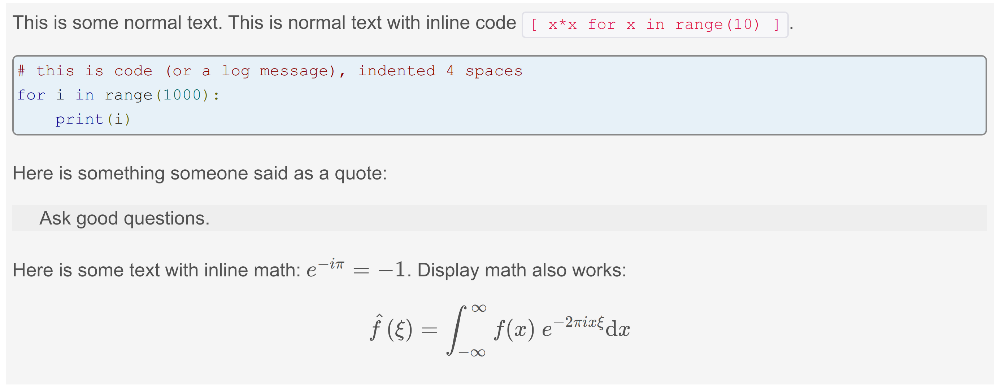

.. _onlinebook_collaborative_tools:

Collaborative Tools.
====================

.. sidebar:: Overview
    :class: overview

    **Teaching**: 10 minutes

    **Exercises**: 10 minutes

    **Prerequisites**:

    	* DESY accounts.
        * An internet browser.

    **Questions**:

        * Where do I find information?
        * Where can I ask for help?
        * Where can I report bugs?
        * Where do I find the source code?

    **Objectives**:

        * Learn where things are or where to look.
        * Learn to ask good questions at the right places.
        * Learn how to report problems.

Belle II is an international collaboration of more than 1000 members from all
over the world.
Since we are so spread out communication tools are really important.

You are reading this page, so you have already
`registered as a member <https://confluence.desy.de/x/ET0HAg>`_
and obtained DESY credentials.
These allow you to access private areas of the
`belle2.org <https://belle2.org>`_ website.
Many (but not all) services are hosted at **<something>.belle2.org** or
**<something>.desy.de**.


    The collaboration as of 2020-07-09.

Important services for you
--------------------------

Here is a curated list of the services and tools that we think are most useful
right away (for newcomers) and that are needed in these lessons.

`confluence.desy.de <https://confluence.desy.de>`_
    Our "wiki".
    Editable, linked pages that can be easily modified and updated.
    Used for many things from run planning to tracking progress through a
    physics analysis.

`stash.desy.de <https://stash.desy.de>`_
    Our git server.
    All code should go here, ideally under the Belle II "project".
    **It is a rule that your analysis code must be viewable to the rest of the
    collaboration.**
    To make this less painful, you should get happy with git and the stash tool.

`agira.desy.de <https://agira.desy.de>`_
    Our bug reporting and work-tracking system.
    Used to report problems, request features, request MC samples, and track
    work.
    You will hear people refer to this as "JIRA".

`software.belle2.org <https://software.belle2.org>`_
    The documentation for
    the Belle II software.
    You might occasionally hear people refer to this as "sphinx".

`questions.belle2.org <https://questions.belle2.org>`_
    Our Q&A forum.
    Something like stack exchange if you've ever used that.

`chat.belle2.org <https://chat.belle2.org>`_
    For chatting with other collaborators who are awake in your timezone.

.. tip::

        What a lot of different places where information could be.
        If only there was a way to search all places at once!

        We've got you covered.
        Try `search.belle2.org <https://search.belle2.org>`_.

You should note that **confluence**, **stash**, and agira/**jira** are part of
a `suite of commercial tools <https://www.atlassian.com/>`_, and **"sphinx"**
is an industry-standard open-source tool for generating documentation.
This means that there is non-Belle II-specific help on the internet.

.. admonition:: Question
     :class: exercise stacked

     The software documentation is built using a tool called "sphinx".
     Where is the project's homepage?

.. admonition:: Solution
   :class: toggle solution

   It's at `www.sphinx-doc.org <https://www.sphinx-doc.org>`_.
   There is also an English-language wikipedia page
   `here <https://en.wikipedia.org/wiki/Sphinx_(documentation_generator)>`__.

.. admonition:: Question
     :class: exercise stacked

     Where is the documentation for **confluence**, **stash**, and **jira**?

.. admonition:: Solution
   :class: toggle solution

   At `support.atlassian.com <https://support.atlassian.com>`_!
   (You need to choose the tool and browse to "documentation".)

.. admonition:: Question
     :class: exercise stacked

     What markup language does sphinx use?

.. admonition:: Solution
   :class: toggle solution

   **reStructured text** (more on this later).

That's not all
--------------

It's not immediately relevant right now, but there are many other services.
There is a full and complete list of all services on confluence.

.. centered:: `Belle II Collaborative Services and Tools <https://confluence.desy.de/x/96PwAw>`_.

.. tip::

        You should probably bookmark the
        `Belle II Collaborative Services and Tools
        <https://confluence.desy.de/x/96PwAw>`_
        page.


Where do I go for help?
-----------------------

With all of these tools, it might be hard to work out where to go to get help.

.. hint::

    If you get stuck or have any questions during a StarterKit workshop or with
    the training lessons in the online book you don't need
    to think about where to ask:
    The `#starterkit-workshop channel <https://chat.belle2.org/channel/starterkit-workshop>`_
    in our chat will provide fast help.
    Please also check out the quick tips section below: :ref:`onlinebook_collaborative_tools_b2chat_howto`.

... meta
~~~~~~~~

What if there is a problem with one of the collaborative tools themselves?
It doesn't happen often, but sometimes the web services go down.
Or maybe you have trouble logging in.
Then you should check the confluence page for the responsible person and/or
email to b2-helpdesk@belle2.org.

... with my analysis
~~~~~~~~~~~~~~~~~~~~

Let's assume you are working on an analysis when...

* ...you have an error message or something is happening with your analysis
  that you don't understand.
  You should first try to understand it yourself.

  - Search for your error in the documentation, the source code, and in
    previous question posts.

  - If you don't have any luck `ask a question <https://questions.belle2.org>`_.

* ...something goes really **wrong**.
  You have a crash or a segmentation fault, or the output cannot possibly be
  correct.
  **You probably have a bug.**
  Bugs should be reported at `agira.desy.de`_.
  You should continue to try and investigate and understand it yourself.

... with the grid
~~~~~~~~~~~~~~~~~

Let's assume you are working with the grid when...

* ...you have an error message or something is happening that you don't
  understand.
  You should first try to understand it yourself.

  - Look at recent announcements on the
    `comp-users-forum <https://lists.belle2.org/sympa/info/comp-users-forum>`_
    mailing list.

  - Look for question posts on a similar topic.

  - If you don't have any luck `ask a question <https://questions.belle2.org>`_
    or send an email to comp-users-forum@belle2.org.

Some tips
---------

.. _onlinebook_collaborative_tools_b2chat_howto:

Asking a question in #starterkit-workshop
~~~~~~~~~~~~~~~~~~~~~~~~~~~~~~~~~~~~~~~~~

.. note::

    The `#starterkit-workshop channel <https://chat.belle2.org/channel/starterkit-workshop>`_
    is for beginner's questions about the online book material and for everything
    that happens during a StarterKit workshop.
    It's not the right place for specific or very detailed questions about your
    own analysis.

Our chat works like any other chat with a couple of nice features. For example you can
put small parts of code in backticks ```print("hello world")``` and you can add larger
bits of source code in triple backticks like so (note that you can create a new line by pressing
Shift-Enter):

.. code-block::

   ```
   print("foo")
   print("bar")
   ```

The only thing that we would like you to pay attention to, is that you make use of
the "threading" feature of our chat. This makes it easier to get an overview
over all recent questions.

If you want to reply to an existing message,
please click on the small icon on the right:


If there are already several replies, you can also click the reply button
below (it will open a side panel with all the replies):


.. admonition:: Exercise
    :class: exercise

    Join the `#test channel <https://chat.belle2.org/channel/test>`_ and type
    some quick test messages. Try to include some bits of "code" as shown above.

.. admonition:: Exercise
    :class: exercise

    Try out the "reply" feature, either by replying to one of the previous messages
    from other users or by replying to your own message.

Confluence
~~~~~~~~~~

Confluence is useful for easy documentation.
We use it for glossaries, instructions, and planning.
You will find: physics meetings discussion, the data-taking,
data-reconstruction status, and much more on there.

It's not reliable for software documentation.

.. admonition:: Exercise
    :class: exercise stacked

    All Belle II data and simulation is centrally processed and reconstructed.
    This is handled by the "data-production group".
    Find the current data-production status.
    What data is processed?
    What is on-going?

.. admonition:: Solution
    :class: toggle solution

    It's on confluence:
    `Data Production Status
    <https://confluence.desy.de/x/fGCJC>`_

.. admonition:: Exercise
    :class: exercise stacked

    Find the run plan for the next (or current) data-taking period.

.. admonition:: Solution
    :class: toggle solution

    It's on confluence:
    `Run Plan <https://confluence.desy.de/x/Xgp0Bw>`_

.. admonition:: Question
    :class: exercise stacked

    There are some Belle II-specific acronyms and jargon that you will
    encounter in these lessons.
    What do the following mean?

    * FEI
    * ROE
    * BCS

.. admonition:: Hint
    :class: toggle xhint stacked

    There is a glossary.
    You should be able to find it.

.. admonition:: Solution
    :class: toggle solution

    Take a look at the `Main Glossary
    <https://confluence.desy.de/x/gwgWAg>`_
    on confluence.

There are some downsides to confluence.
Pages may be outdated (check the "last edited" message at the top) and
sometimes links are broken or pages re-organised.

If you think something is outdated you can leave a comment on the page, and the
original author of the page will probably get back to you.
If you are quite sure that something is outdated: please update it!
You can always leave a comment asking experts to check your edit.

We try to **avoid** documenting software on confluence because software
changes between versions.
Pages can be simultaneously outdated and not outdated depending on the version
of the software you are using.

.. admonition:: Exercise
    :class: exercise

    There is a sandbox confluence page for you to experiment with adding
    material.
    Go to the `Confluence Training Test Page <https://confluence.desy.de/x/61Z8Cg>`_ and add some content.

    Some inspiration:

    * Link to a JIRA ticket.
    * Link to another confluence page.
    * Tag your colleagues.
    * Add the date.
    * Add your favourite picture of a cat / piece of art.

How to ask a good question on questions.belle2
~~~~~~~~~~~~~~~~~~~~~~~~~~~~~~~~~~~~~~~~~~~~~~

Like most Q&A forums, `questions.belle2.org <https://questions.belle2.org>`_ is
only as good as the posts.
Even though you have a problem and you want help quickly it is worthwile to
take time on presentation.

0. Search for existing questions.
1. Try to boil down the issue to the minimal (non)-working example, what you
   expect to happen, as well as instructions on how to run it.
2. Try to include all details that are needed to reproduce the issue but
   avoid walls of text.
3. Include full error messages and logs.
4. Make use of formatting (for code, logs, . . . ).
5. If you use data, include a path or a small example data file.
6. Choose an appropriate title, and use tags.

.. admonition:: Question
    :class: exercise stacked

    What is an MWE?

.. admonition:: Hint
    :class: toggle xhint stacked

    This is jargon but it is not specific to Belle II.

.. admonition:: Solution
    :class: toggle solution

    It stands for minimal working example.

    .. seealso::

         `This excellent stack overflow post
         <https://stackoverflow.com/help/minimal-reproducible-example>`_
         and `this English language wikipedia page
         <https://en.wikipedia.org/wiki/Minimal_working_example>`_.


.. seealso::

    There is a meta-question post:
    `How do I ask a good software question here?
    <https://questions.belle2.org/question/3625/how-do-i-ask-a-good-software-question-here/>`_

A bit more about formatting
^^^^^^^^^^^^^^^^^^^^^^^^^^^

When writing your questions post, you can turn on "preview" (this is helpful).
You can use simple markdown syntax.
Code is indented by four spaces, and you can use latex!

.. code:: markdown

        This is some normal text.
        This is normal text with inline code `[ x*x for x in range(10) ]`.

            # this is code (or a log message), indented 4 spaces
            for i in range(1000):
                print(i)

        Here is something someone said as a quote:

        > Ask good questions.

        Here is some text with inline math: $ e^{-i\pi} = -1 $. Display math also works:

        $$ \hat{f}(\xi) = \int_{-\infty}^{\infty} f(x)\ e^{-2\pi i x \xi}{\rm d}x $$

This gets rendered something like:




Housekeeping
^^^^^^^^^^^^

When your question has been answered, you should mark it as "resolved" and
up- (or down-) vote anything that was useful (or unhelpful).

You should also vote on other good questions.
This helps everyone find relevant good information.


   Click on the circle with a check-mark to choose an answer.
   Click on the arrow to up-vote.

Don't forget to answer!
^^^^^^^^^^^^^^^^^^^^^^^

The forum is a Q& **A** forum.
If you know an answer to a question: answer it!

.. tip::

    If you *don't* know the answer, but know someone who you think might:
    please tag them in a comment.

A bit more about working with stash and JIRA
~~~~~~~~~~~~~~~~~~~~~~~~~~~~~~~~~~~~~~~~~~~~

.. admonition:: Exercise
     :class: exercise stacked

     Go to https://stash.desy.de

     * What's displayed at the dashboard/home screen?
     * Find the main Belle II software repository.
     * Look at the commits.

.. admonition:: Solution
   :class: toggle solution

   Some of that is just browsing.
   We trust that you did it.
   The main software repository is:
   https://stash.desy.de/projects/B2/repos/software , and the list of commits
   is `here <https://stash.desy.de/projects/B2/repos/software/commits>`__.

.. admonition:: Exercise
     :class: exercise stacked

     Go to https://agira.desy.de

     * What’s displayed at the dashboard/home screen?
     * Where is the Belle II "project"?
     * Browse a couple of issues.

.. admonition:: Solution
   :class: toggle solution

   The Belle II project is:
   https://agira.desy.de/projects/BII

Here is a rough workflow for working with stash and JIRA.

1. Identify an issue: Feature requests, bug report, ...

   - If you don’t know if it's a real bug, you can always ask on questions.

2. Open an issue on JIRA and assign someone to work on it

   - Click "create" and fill out the form.

   - It can be reassigned, so either guess someone or leave it as "Automatic".
     If you leave assignee as Automatic but choose a "component" then the
     person in charge of the package is automatically assigned.

3. Discuss there in comments: Is this really a bug? Do we really need this
   feature?

4. You (or someone else will) create a branch that references the issue,
   write some code, and add some commits to the branch.

5. You (or someone else will) open a pull request, add reviewers, and add a
   clear description.

   - You (or someone else) can edit the text, title, and reviewers after a
     first attempt.

6. Reviewers look at the changes, leave comments on code and in general.

7. The developer will react to reviewers

   - more commits to this branch

8. After all reviewers agree: Merge!

.. seealso::

    `How do I send a JIRA ticket?
    <https://questions.belle2.org/question/1317/how-do-i-send-a-jira-ticket/>`_

.. tip::

    You should already be ok with 1-3.
    With a bit of practice, and the :ref:`onlinebook_software_prerequisites`,
    we hope you will be able to also do 4-8.

There is a problem with the documentation!
~~~~~~~~~~~~~~~~~~~~~~~~~~~~~~~~~~~~~~~~~~

As we mentioned before, the software documentation is generated by a tool
called **sphinx**.
This is nice because it is well integrated with python.
The page you are now reading is written in sphinx.

.. admonition:: Exercise
     :class: exercise stacked

     Find the source file for this page.

.. admonition:: Hint
    :class: toggle xhint stacked

    Scroll to the top and you should see a helpful looking link.

.. admonition:: Solution
   :class: toggle solution

   It's `here <../../_sources/online_book/welcome/collaborative_tools.rst.txt>`__.

If you discover an omission or a problem (or even a typo) you can actually
fix it quite easily yourself.
It is a good excuse for a first pull request, and you will make the software
developers very happy.

.. seealso:: :ref:`doctools`

.. seealso:: `How do I make a pull request? <https://questions.belle2.org/question/683/how-do-i-make-a-pull-request/>`_


And finally: Be bold!
---------------------

You can make a difference!

People are nice: don't be too afraid to bother them or break stuff (chances are
you won't, anyway).
Ask for help on `questions.belle2.org <https://questions.belle2.org>`_ or leave
a comment on a confluence page or on a JIRA ticket.

Help us out with documentation: as a beginner, you know best what is missing!

.. admonition:: Key points
    :class: key-points

    * Software documentation → `software.belle2.org <https://software.belle2.org>`_.
    * Ask questions (and answer them) at `questions.belle2.org <https://questions.belle2.org>`_.
    * `Confluence <https://confluence.desy.de>`_ is our wiki.
    * Code → `stash.desy.de <https://stash.desy.de>`_.
    * Bugs, feature requests → `agira.desy.de <https://agira.desy.de>`_.

.. tip:: Good questions are also documentation and are also helpful!

.. tip:: Bugs do exist, don't hesitate too much to report them.

.. include:: ../lesson_footer.rstinclude

.. topic:: Author(s) of this lesson

     Kilian Lieret,
     Sam Cunliffe
