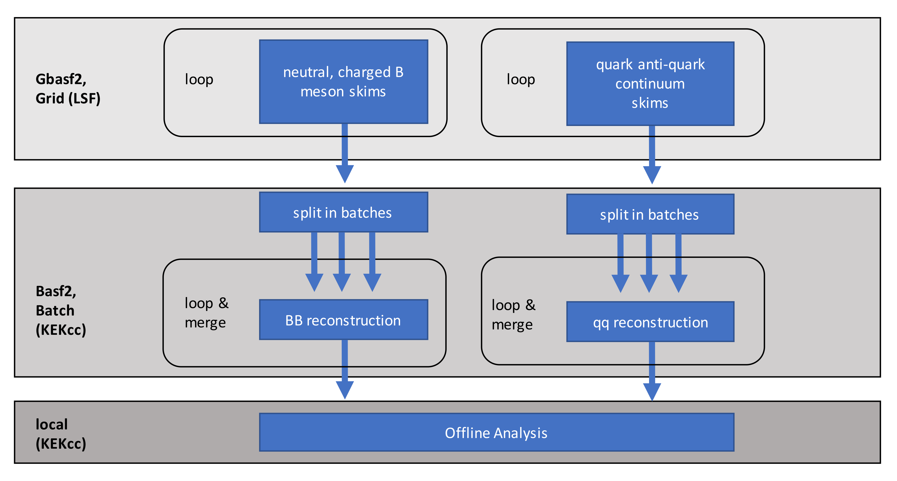

.. _onlinebook_workflowmanagement:

Workflow Management
===================
 
Increasingly complex HEP analyses require many separate analysis steps on Monte Carlo simulations and data. In a typical Belle II analysis, we run skims, reconstructions and offline analysis on different computing resources:
   

    
    Analysis steps on different computing resources in a sample Belle II analysis.
   
**The sequence of all processing steps required for your analysis is a workflow.** In your own interest (as well as in the interest of analysts following after you) you should set up your analysis in a workflow management system, i.e. automatize the entire workflow execution. 

Currently, there is a lack of documentation of interplay of the different scripts and jobs, which are executed manually one-by-one by the analyst. This is error-prone, time-consuming and deteriorates the reproducibility of results, the transparency of collaborative reviews and hinders data preservation efforts.

In so-called workflow management tools, **dependencies between processing steps are made explicit in a stand-alone executable**, including job submission to remote computing resources, parallel computing etc. Previous boilerplate code (such as custom bash scripts) becomes obsolete.

A workflow is visualized in a directed acyclic graph (DAG), which illustrates the dependencies between all processing steps. The DAG for a typical Belle II analysis quickly gets large, and workflow management tools can save you lots of headaches:

.. figure:: workflowmanagement/workflows/dag.png
    :width: 40em
    :align: center
    
    Directed acyclic graph (DAG) for a sample Belle II analysis.
    
A wide variety of workflow management tools exists (see for example `here <https://github.com/pditommaso/awesome-pipeline/>`_). For Belle II analyses, the b2luigi (based on the luigi framework) and snakemake workflow management tools are particulary useful (see e.g. `our comparison <https://arxiv.org/abs/2212.01422>`_). 

In this lesson, we build a minimalistic Belle II analysis in both tools, employing gbasf2, basf2 and the LSF batch system:

.. toctree::
   :glob:
   :maxdepth: 1

   workflowmanagement/*

.. topic:: Author(s) of this lesson

   Caspar Schmitt
