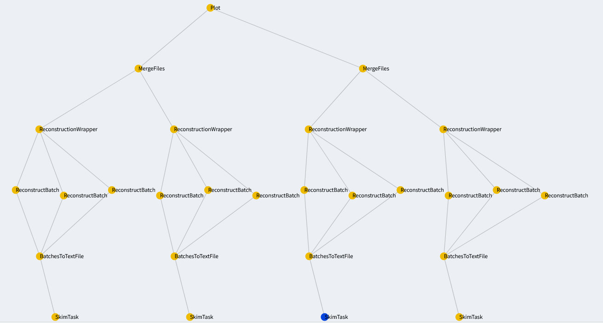

.. _onlinebook_workflowmanagement_b2luigi:

b2luigi
=======
   
.. sidebar:: Overview
    :class: overview

    **Teaching**: 10 minutes

    **Prerequisites**:

    * access to kekcc
    * grid-certificate for gbasf2

    **Questions**:

    * How do I implement my analysis in a b2luigi workflow?
    * How do I automatize job submission and job steering on remote computing resources?

    **Objectives**:

    * Look at a complete Belle II workflow example.
    * Understand how to modify and extend the workflow.

`Luigi <https://luigi.readthedocs.io/en/stable/>`_ is a workflow management framework named after a well-known plumber and widely used in industry. It was originally developed by the Spotify group and open-sourced in 2012. In luigi, the workflow logic is decentralized and integrated with the analysis code for every processing step.

For Belle II workflows, the helper package `b2luigi <https://b2luigi.readthedocs.io/en/stable/>`_ adds additional support for remote execution and ROOT file handling. In the following, we will provide a full example of a minimal Belle II analysis, employing gbasf2, basf2 and the LSF batch system. A full guide to b2luigi and luigi can be found elsewhere.

Let us outline the general processing steps (called tasks in b2luigi) for a generic Belle II workflow:

#. Run and download skims from the grid.

#. Reconstruct the skims on the KEKcc batch system. Employ batching for shorter computing times.

#. Merge the reconstructed batches.

#. Perform your offline analysis on the merged batches.

#. Produce some plots.

Now let us look at the directed acyclic graph for this workflow:

We read it from bottom to top: At the bottom, we see the task *Plot*, which is our final goal and fills some histograms for our reconstructed particles. Above it we see all of its dependencies, i.e. tasks that are required for *Plot*. First there are the merged reconstructed batches, which themselves require the reconstructed batches. We see that the skim is split into three batches, which are reconstructed simultaneously. The reconstructed batches build upon a batch of the skimmed files. b2luigi will build this dependency tree for your workflow and execute it from top to bottom.

Typically in Monte-Carlo simulation, you perform these steps multiple times for different event types (B mesons, quark-antiquark continuum etc.). Therefore the full dependency tree might look like this:

    
Now, let us go through the source code step by step. You are welcome to use this as a template for you own analysis.

.. toctree::
   :glob:
   :maxdepth: 1

   b2luigi/offlineanalysis
   b2luigi/reconstruction
   b2luigi/skim
   b2luigi/execution

.. include:: ../lesson_footer.rstinclude

.. topic:: Author of this lesson

     Caspar Schmitt
