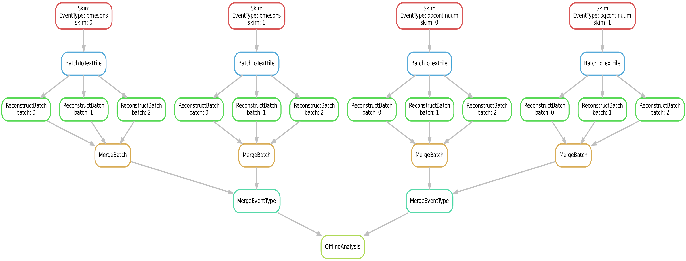

.. _onlinebook_workflowmanagement_snakemake:

snakemake
=========
   
.. sidebar:: Overview
    :class: overview

    **Teaching**: 10 minutes

    **Prerequisites**:

    * access to kekcc.
    * grid-certificate for gbasf2.

    **Questions**:

    * How do I implement my analysis in a snakemake workflow?
    * How do I automatize job submission and job steering on remote computing resources?

    **Objectives**:

    * Look at a complete Belle II workflow example.
    * Understand how to modify and extend the workflow.

`Snakemake <https://snakemake.readthedocs.io/en/v3.11.1/index.html>`_ is a workflow management framework designed for uses in research, with extensive support for environment management and remote execution. It features a very simple Python-based syntax and accommodates shell commands and external scripts in multiple programming languages with minimal adaptations. A full guide can be found elsewhere.

Let us reproduce the full Belle II workflow that we dicussed for :ref:`onlinebook_workflowmanagement_b2luigi`.

Again, we submit four skims (two for B mesons and two for quark-antiquark continuum) to the grid, which are each reconstructed in three batches on the KEKcc batch system. The reconstructed batches are merged and finally we fill some histograms in the offline analysis.

The directed acyclic graph (DAG) looks like this:

Now, let us look at the source code step by step:

.. toctree::
   :glob:
   :maxdepth: 1

   snakemake/snakefile
   snakemake/scripts
   snakemake/execution
   
.. include:: ../lesson_footer.rstinclude

.. topic:: Author of this lesson

     Caspar Schmitt
