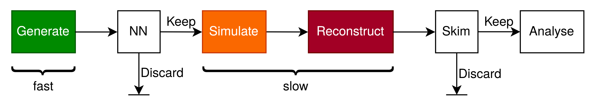

Smart Background Simulation
---------------------------------------------------------------------

The Smart Background project aims to reduce the production time and resources required for directly 
skimmed background MC campaigns. To this end, a transformer based neural network is used to 
predict the probability that an event will pass a given skim directly after event generation 
before the costly simulation and reconstruction steps (see :numref:`smartbkg_workflow`) so that these can be 
skipped for events that will be filtered out by the skim anyway. To ensure unbiased distributions 
after neural network filtering, importance sampling is employed, using the neural network output as a probability to sample 
an event and, if it is kept, weighting it with the inverse neural network output.

.. _smartbkg_workflow:

    Schematic view of skimmed MC production using Smart Background.

.. note:: Datasets produced using Smart Background are weighted and must be treated as such when analyzed! The weights 
  are stored in the event extra info as ``weight_<SkimName>``.

Usage
^^^^^

To employ this method, we recommend using the :py:func:`skim.smartbkg.add_smartbkg_filtering` convenience function 
from ``skim.smartbkg``. It should be placed after the event generator but before simulation and reconstruction. 
As mandatory input it requires the skim object you are running (works with any skim derived from :py:class:`skim.core.BaseSkim`,
including :py:class:`skim.core.CombinedSkim` , as long as the used skims are known to the trained model, see below). 
It also requires information about the background type produced (uubar, ddbar, ssbar, ccbar, charged, mixed, taupair). 
If this cannot be inferred from the event extra info (e.g. by setting it in the event generator as below), 
you can manually provide it via the ``event_type`` argument.
A part of your steering file might then look like this (for a full example see ``skim/examples/SmartBkgExampleSteering.py``):

.. code-block:: python

  # Add event generator (evtgen for charged events in this example)
  finalstate = "charged"
  gen.add_evtgen_generator(finalstate=finalstate, path=path, eventType=finalstate)

  # Define skim
  skim = feiHadronic(
      analysisGlobaltag=ma.getAnalysisGlobaltag(),
      OutputFileName="your_output_file_name.udst.root"
  )

  # Add SmartBkg filtering by providing the skim
  skim.smartbkg.add_smartbkg_filtering(
      skim=skim,
      path=path
  )

  # Add simulation and reconstruction
  sim.add_simulation(path)
  rec.add_reconstruction(path)

  # Apply the skim
  skim(path)

The event weights for the skim (or for each skim separately if you use a :py:class:`skim.core.CombinedSkim`) are stored in the 
event extra info as ``weight_<SkimName>``. If an event is not sampled for a particular skim, the corresponding 
weight is set to 0. If an event is sampled for none of the provided skims, it is filtered out to an empty path.

We currently provide a pre-trained model via the global tag ??? that is trained on 51 skims. The supported skim codes are 
``11180500``, ``11180600``, ``11640100``, ``12160100``, ``12160200``, ``12160300``, ``12160400``, ``13160200``, ``13160300``, 
``14120300``, ``14120600``, ``14121100``, ``14140100``, ``14140101``, ``14140102``, ``14140200``, ``14141000``, ``14141001``, 
``14141002``, ``15410300``, ``15420100``, ``15440100``, ``16460200``, ``17230100``, ``17230200``, ``17230400``, ``17230500``, 
``17230600``, ``17240100``, ``17240300``, ``17240600``, ``17240700``, ``17241000``, ``17241200``, ``18000000``, ``18000001``, 
``18020100``, ``18020200``, ``18020400``, ``18130100``, ``18360100``, ``18520100``, ``18520200``, ``18520400``, ``18520500``, 
``18530200``, ``18570600``, ``18570700``, ``19120100``, ``19130201``, ``19130300``.

For studies you may want to disable filtering and look at the model output. This is possible by setting the ``debug_mode`` argument 
of :py:func:`skim.smartbkg.add_smartbkg_filtering` to ``True``. This will disable filtering and reweighting, and instead the 
model outputs will be saved to the event extra info as ``SmartBKG_Prediction_<SkimName>``. An example of how to write out the model
predictions as well as the skim flags is provided under ``skim/examples/SmartBkgDebugMode.py``. 

For greater customisability you may also use the :b2:mod:`SmartBackground` module directly. It requires as 
mandatory input the skim LFN codes of all used skims, and can also be put into debug mode. It performs the reweighting, 
but no filtering on its own (instead it returns 1 as a return value if an event is sampled for at least one skim, otherwise 0).

The code for the entire Smart Background project including the model setup, training script and data preparation 
can be found on `GitLab <https://gitlab.desy.de/belle2/analyses/smartbkg>`_.

Module documentation
^^^^^^^^^^^^^^^^^^^^

.. autofunction:: skim.smartbkg.add_smartbkg_filtering

.. b2-modules::
  :modules: SmartBackground