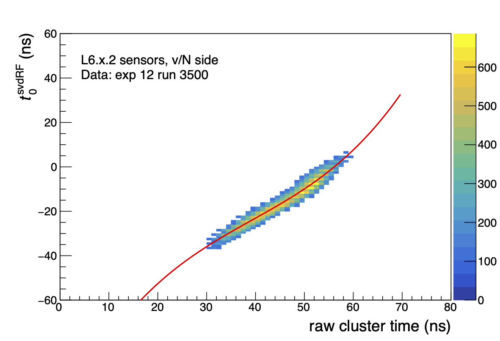

.. _svdoffcalib:

SVD Offline Calibration
=======================

Here we briefly describe the so-called offline calibrations.

.. _svdtimecalib:

Hit Time Calibration
---------------------

The time calibration is implemented in the :ref:`calibration framework<cal_caf>` and is run on **6-sample data** with AirFlow.

The hit time calibration exploits the correlation between the time of the event ``EventT0`` and the hit time. We select clusters associated to tracks and neglect the flight time of the particle.

For all three time estimators ``CoG6``, ``CoG3`` and ``ELS3`` we first compute the time of the event in the SVD reference frame, :math:`t_0^{\rm SVD}`:

.. math::

   t_0^{\rm SVD} = t_0 - \frac{\Delta t}{4} \cdot (3 - TB + 4\ FF)

where :math:`\Delta t \simeq 31.44` ns is the sampling period of the APV readout chip, :math:`TB = 0,1,2,3` is the :ref:`TriggerBin<svdtb>` and provides the correct time shift to move into the SVD reference frame, and :math:`FF=0,1,2,3` (:ref:`FirstFrame<svdff>`) is applied only for ``CoG3`` and ``ELS3`` due to the :ref:`MaxSum<MaxSum>` algorithm.

We build the 2D plot of the raw hit time :math:`t_{\rm raw}` vs :math:`t_0^{\rm SVD}`. Note that the :math:`t_{\rm raw}` is different for the three estimator.
We then take the ``ProfileX`` of the 2D plot and fit the correlation with a function that depends on the estimator. An example of correlation plot for CoG6, with calibration function superimposed is shown in the following figure:

**CoG6 Calibration Function**

For ``CoG6`` we use a third order polynomial:

.. math::

   t_{\rm CoG6} = a + b t_{\rm raw} + c t_{\rm raw}^2 + d t_{\rm raw}^3

**CoG3 Calibration Function**

For ``CoG3`` we use a third order polynomial, but with a different parameterization:

.. math::

   t_{\rm CoG3} = a +( b + cd^2) t_{\rm raw} - cd t_{\rm raw}^2 + c t_{\rm raw}^3/3

**ELS3 Calibration Function**

For ``ELS3`` we use the following calibration function:

.. math::

   t_{\rm ELS3} = a + b t_{\rm raw} + \frac{c}{t_{\rm raw} - d}\quad {\rm for} \quad x < d - \frac{\sqrt{-c}}{4}

.. _svdclustertimeshifting:

SVD Cluster-Time Shift w.r.t. Cluster-Size
------------------------------------------
The mean of the cluster-time distribution shifts with the cluster size, as the strips of the clusters with lower amplitude, which are at the edge, delays in time. This effect is not simulated and it appears only in data. To compensate this, improving cluster time resolution in data and data-simulation agreement, a shift is added to the calibrated time.

The calculation of shift values is implemented in the :ref:`calibration_caf` and is run on **6-sample data** with AirFlow and depends on :ref:`svdtimecalib`.

For all three time estimators ``CoG6``, ``CoG3`` and ``ELS3``, we build the 1D plot of the cluster-time :math:`\left[t^{\rm Calibrated}_{\rm Cluster} - t_0^{\rm Event}\right]`; where :math:`t_{\rm Cluster}` is calibrated time of clusters in an event and :math:`t_0^{\rm Event}` is the EventT0 (mainly from CDC). Then the 1D plots are processed to find the peak.

The steps are in the following:

#. The 1D plot, mentioned above, is fitted with a single Gaussian function;
#. The same plot is fitted with a double Gaussian, using the fit result of the single Gaussian as initial parameters;
#. The value of shift is taken as follows:

   #. if the double Gaussian fit is successful, the shift considered is the mean of the Gaussian with :math:`f>0.5`;
   #. else if single Gaussian fit is successful, the shift is the mean of the single Gaussian;
   #. else shift is the mean of the histogram.

The shift-values are stored in :ref:`SVDClusterTimeShifter<svdclustertimeshifter>` DBObject.

.. _svdhotstripscalibrations:

SVD Calibration of Hot-Strips
-----------------------------
The SVD hot strips are only used in the context of the SVD beam-background studies, **NOT** in reconstruction.
The calibration of SVD hot strips produces a list of hot strips per SVD sensor-side that are evaluated using ``pedestal runs`` as input. Pedestal runs are ``beam``-runs for beam-background studies, where data are collected without beams and with detectors on PEAK.

The calculation of hot-strips is implemented in the :ref:`calibration_caf`. It is **NOT** run in Airflow during prompt calibrations since this calibration does not use physics runs, and the payload produced in not used in recontruction.

The calibration uses only ``RawSVD``, which is unpacked and converted to :ref:`SVDShaperDigits<svdshapers>`.

For the calibration we build 1D occupancy distributions per sensor-side. Per each sensor-side we loop over the strips and classify them as hot based on their occupancy. The criteria to classify the strips as the following are based on three parameters:

#. the absolute occupancy threshold. The default is **0.2**. A strip is tagged as hot if its occupancy is higher than 0.2 (i.e. 20%).;
#. the relative occupancy threshold. It is relative to the average occupancy per sensor-side or chip. The default is **5**. A strip is tagged as hot if its occupancy is higher than 5 times the average occupancy, by default;
#. a parameter used to select the strips to compute the average occupancy. By default it is `False` and the average occupancy per sensor-side is computed. Set `True` to compute the average occupancy per chip (128 strips/chip are considered in this case).

The calibration steps are the following:

#. loop over the strips and tag as hot the strips with an occupancy higher than the absolute occupancy threshold. The hot strips are removed from the computation of the average occupancy;
#. Classify the other hot strips iteratively:
   #. loop over the strips and and tag as hot the strips with an occupancy greater than the relative occupancy threshold. The hot strips are removed from the computation of the average occupancy;
   #. repeat until no hot-strips are found.
                
The list of hot-strips is stored in the :ref:`SVDHotStripsCalibrations<svdhotstrips>` DBObject.
