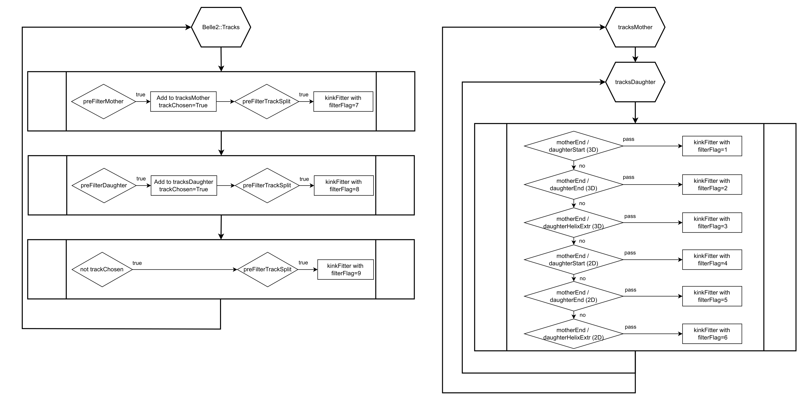
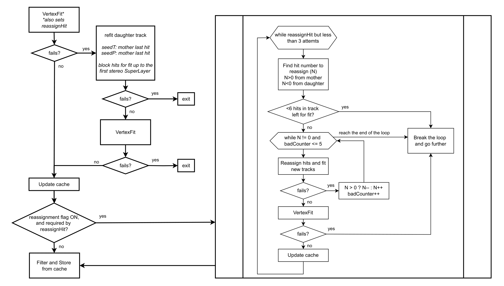
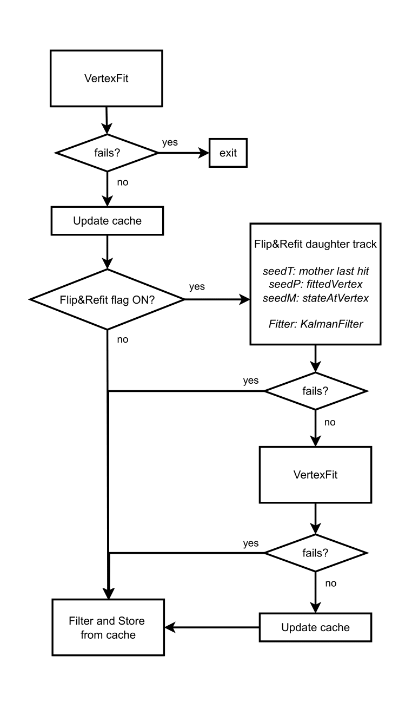
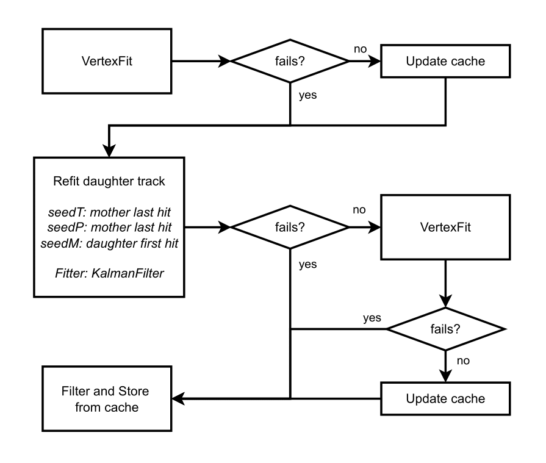
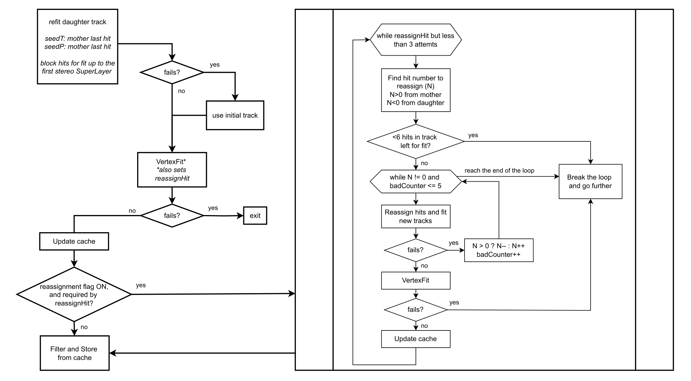
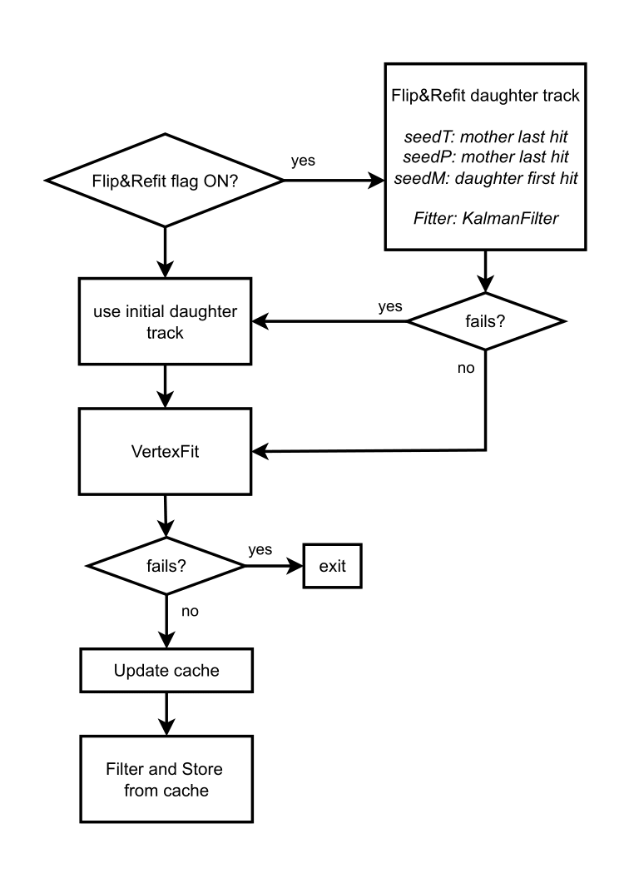
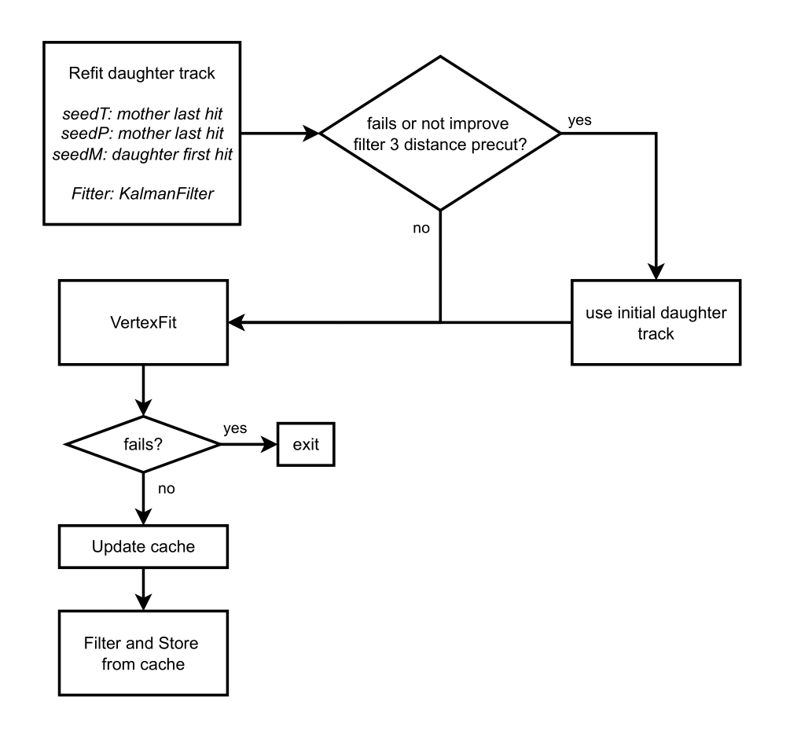

Tracking for Special Classes of Tracks
--------------------------------------

.. _tracking_v0Finding:

V0 Finding
""""""""""
V0s are neutral particles we reconstruct from their decay into two charged tracks, such as :math:`K_S\to\pi^+\pi^-` or :math:`\Lambda\to p\pi^-`. Due to their relatively long lifetime, they mostly decay outside of the beam pipe. By default, the track parameters extrapolated to the point of closest approach (POCA) to IP (0, 0, 0) are stored in the mDST. This extrapolation also includes the correction for potential material effects and energy losses. Because the daughters of V0s are not produced at the POCA, they need some special treatment. The `V0Finder` module takes care of this.

Also photon conversions (:math:`\gamma\to e^+e^-` inside material) need the same kind of special treatment for the same reasons, therefore the `V0Finder` takes care of these as well.

The `V0Finder` takes care specifically of V0s with a decay vertex outside of the beam pipe (i.e. transverse distance from origin above 1 cm). V0s that decay inside the beam pipe can be reconstructed at analysis level using the standard reconstruction procedure (i.e. with `reconstructDecay` plus vertex fit), and are therefore ignored by the `V0Finder`.

The `V0Finder` is run during reconstruction (i.e. raw data processing for mDST production) so that it can access all the information it needs (hits attached to tracks, magnetic field map, detector geometry), and that are not available when running analyses. It performs the following steps.

* Combination: consider each pair made of one positive and one negative track.
* Preselection: compute the invariant mass of the two tracks.

  * This requires knowledge of the angle between the momenta

    .. math::

        m^2 = (E_++E_-)^2 - (\vec p_+ + \vec p_-)^2 = (E_++E_-)^2 - p_+^2 - p_-^2 - 2p_+p_-\cos\alpha

    which is unavailable because the vertex position is not yet known; therefore a range of possible invariant masses is computed (with the minimum obtained assuming :math:`\cos\alpha=1` and the maximum assuming :math:`\cos\alpha=-1`), and this range is required to overlap with an invariant mass window (see ``massRangeKshort`` and ``massRangeLambda`` module parameters)
  * This cut is not applied to photon conversions.
  * Since release-08, an additional cut is applied to reject pairs of tracks that definitely intersect within the beam pipe, and thus must not be handled by the `V0Finder`. This is meant to speed up the module by skipping some pairs without performing the vertex fitting (see below). The tracks are approximated with straight lines (that pass by the POCA to the IP and have the same direction as the momentum at the POCA to the IP), and the point of closest approach between the two lines is found analytically. If the distance of such point from the IP is smaller than ``precutRho`` (0.5 cm by default), the pair is rejected. Also, pairs of almost-parallel tracks (:math:`\cos\alpha` > ``precutCosAlpha``, 0.9 by default) are always accepted, as the straight-line approximation for the vertex is less reliable in this case.

* Vertex fitting: the vertex position is obtained from a so-called vertex fit. The `V0Finder` employs the RAVE fitter from the GenFit package and exploits the knowledge about first hit position, energy losses of the tracks inside detector material, magnetic field non-uniformities; if the fit does not converge (:math:`\chi^2/NDF > ` ``vertexChi2CutOutside`` module parameter), or the vertex is found to be inside the beam pipe, the candidate is rejected.
* Inner hits removal: if the tracks were produced at the fitted vertex, they can not have left any hit in the helix segments that come before the vertex; if any such hit is attached, it must be wrong and can bias the track fit, therefore they are removed, then the tracks are refitted, and the vertex is fitted again; the check for inner hits is also repeated.

  * If the fit with the refitted tracks fails, the previous result is kept.
  * This step can be skipped with the ``v0FitterMode`` module parameter

* Selection: now that the vertex is fitted, the invariant mass can be computed and a cut applied to it (see ``invMassRangeKshort``, ``invMassRangeLambda`` and ``invMassRangePhoton`` module parameters)

Candidates that pass the selection are stored to V0 objects, which contain the reference (array index) to two ``Track``\s and two ``TrackFitResult``\s with the parameters of the helices at the decay vertex position.

.. note::

   The ``TrackFitResult``\s associated to the ``Track``\s normally store the helix parameters at the perigee (point of closest approach to the IP), but these might be different from the ones at the decay vertex position due to energy losses, magnetic field non-uniformities and material effects. In order to reconstruct the V0 vertex correctly, the parameters at the decay vertex must be used (this is particularly important when computing the angle between the tracks).

During analysis, V0 lists are loaded using functions such as `stdKshorts` and `stdLambdas`. What these functions do is

* Take candidates from V0 objects

  * Make candidates using the ``TrackFitResult``\s associated to the V0 object for the daughters
  * Fit their vertices (using TreeFit or KFit)
  * Apply a cut on the invariant mass

* Reconstruct V0s that decayed inside the beam pipe

  * Use `reconstructDecay` to make candidates with a loose invariant mass cut (if the V0 decayed inside the beam pipe, the error we make on the invariant mass because we don't know the vertex position yet is small)
  * Fit their vertices (using TreeFit or KFit)
  * Apply a cut on the invariant mass

* Merge the two candidates lists, keeping only the candidate from a V0 object in case of duplicates

.. b2-modules::
   :package: tracking
   :modules: V0Finder
   :io-plots:

.. _tracking_kinkFinding:

Kink Finding
""""""""""""

Kink is a special case of tracking where two tracks can be related as mother and daughter. The shape of this object is similar
to a kink of the track where the name of the object originates from. Kinks appear due to physical processes occurring inside the
tracking detector, such as decays-in-flight of pions, kaons, and muons and particle scattering on the material. Although some of
these processes produce more than one charged particle, usually, it is possible to relate only one daughter particle with its mother, e.g.,
it is quite rare that more than one daughter pion is reconstructed from the :math:`K^-\to\pi^-\pi^+\pi^-` decay.

The most interesting cases of kinks are when the primary particle from IP decays in flight inside the CDC. Muon decay-in-flight
can be used to measure its polarization, which allows for studying weak processes with them, e.g., Michel parameters measurement
in :math:`\tau^-\to\mu^-\bar{\nu}_\mu\nu_\tau` decays. Kaon and pion decays-in-flight allow for their identification and
:math:`dE/dx`-losses calibration, while not reconstructed, they create inevitable fake rate in the TOP and ARICH systems.

In general, there are five possibilities for kink events:

1) mother track is reconstructed, and daughter track is reconstructed;
2) mother track is reconstructed, and daughter track is not reconstructed;
3) mother track is not reconstructed, and daughter track is reconstructed;
4) mother track is not reconstructed, and daughter track is not reconstructed;
5) mother and daughter tracks are combined into one reconstructed track.

The latter case is the most crucial for the PID fake rate. In principle, there are around 10% of events where a particle from IP
decays inside CDC, and the daughter track cannot be reconstructed due to leaving not enough hits.

In addition to real kink events, there are events that can imitate kink, although not being one.
They consist of combinations of tracks from IP with their clones or fake tracks.
While being a background for physical studies of kinks, identification of such events allows for suppression of these
secondary bad tracks and therefore reducing background for other analyses.

**Kink Finder**

`KinkFinder` handles two general cases of kinks at Belle II:

* The first one is when both mother and daughter tracks were found by the track finding, and a ``Track`` was created for each of them individually. In this case, `KinkFinder` tries to find two track combinations forming a kink.
* The second one is when hits from mother and daughter tracks are found by track finding as one track. In this case, `KinkFinder` tries to select such tracks and split them into two.

The parameters of the `KinkFinder` are stored as a payload in the ``KinkFinderParameters`` object.

*KinkFinder for kinks as a combination of two separate tracks*

Before two tracks are combined as a pair, one of them should pass the mother track preselection, and the other should pass
the daughter track preselection. In addition, both tracks are required to have no VXD hits at their end
(the efficiency loss due to this requirement is negligible).

Mother track preselection is based on the following requirements:

* If the track has CDC hits, it should end inside CDC with its last hit state position having offset from the outer walls of CDC. The offset from the outer cylinder is set by the ``KinkFinderParameters::m_precutRho`` parameter, and the offset in the :math:`z`-axis is set by the ``KinkFinderParameters::m_precutZ`` parameter. This requirement suppresses the ordinary track selection.
* If the track has more than 10 CDC hits, the last hit position has to have a radius > 17 cm, thus not ending in the first layer of CDC or inside SVD (although the latter should be excluded when the absence of VXD hits at the end of the track is required). This is to exclude curlers from the consideration.
* Finally, the radius of the first hit state position should be less than 12 cm (before the outermost SVD layer) **AND** have impact parameter ``D0`` less than 1 cm; thus, the track is from IP.

Daughter track preselection is based on the following requirements:

* Either the first or last hit state position should be inside CDC with the same offsets ``KinkFinderParameters::m_precutRho`` and ``KinkFinderParameters::m_precutZ`` as the mother candidate. This is to ensure that at least one endpoint of the track is inside the CDC.
* The radius of the first hit state position should be more than 12 cm **OR** have impact parameter ``D0`` more than 1 cm; thus, the track is not from IP (the requirement is inverted from mother preselection).

One track that passes mother preselection is combined with one track that passes daughter preselection, and preselection cuts are applied to the pair.
There are 6 different filters for the pair, and further processing depends on which one is used to select the pair.
The list of the filters is the following (the filter with a lower index is processed earlier; once one filter is passed, the others are not considered):

* **Filter 1**. The distance between the mother's LAST hit state position and the daughter's FIRST hit state position is less than ``KinkFinderParameters::m_precutDistance``. This is a normal ordering when the mother track is followed by the daughter track. The majority of events are like this.
* **Filter 2**. The distance between the mother's LAST hit state position and the daughter's LAST hit state position is less than ``KinkFinderParameters::m_precutDistance``. This case is similar to the normal ordering, but the daughter track is reconstructed with the wrong charge as it goes back to IP, and the track finding assumes it as a track coming from IP.
* **Filter 3**. The 3rd filter is aimed at the cases when the daughter track is reconstructed missing some inner superlayers; thus, ``Helix`` extrapolation has to be applied to check the distance to the mother's LAST hit. Here, the wrong charge cases are not distinguished, and the daughter track state closest to the mother's LAST hit state is chosen for the ``Helix`` extrapolation. The distance at the closest approach is less than ``KinkFinderParameters::m_precutDistance``. To exclude a random combination of the tracks from the whole detector, one of the angles between the directions from IP to the mother LAST hit state position and the daughter FIRST/LAST state positions should be less than :math:`\pi/6` (either in 3D or in 2D). The fraction of these cases is the second largest.

The following three filters are similar to those already listed, but they are aimed at recovering events where the daughter
track :math:`z`-component of the reconstructed momentum is wrong; thus, the requirements are checked in 2D:

* **Filter 4**. The :math:`r\phi` distance between the mother's LAST hit state position and the daughter's FIRST hit state position is less than ``KinkFinderParameters::m_precutDistance2D``.
* **Filter 5**. The :math:`r\phi` distance between the mother's LAST hit state position and the daughter's LAST hit state position is less than ``KinkFinderParameters::m_precutDistance2D``.
* **Filter 6**. The same as the 3rd filter, but the comparison is done between the distance in :math:`r\phi` and ``KinkFinderParameters::m_precutDistance2D``.

The track pairs that passed one of the listed filters are then processed by ``KinkFitter``.

*KinkFinder for kinks combined in one track*

Before the track is given to ``KinkFitter`` for further splitting, it should pass the track-to-split preselection.
The tracks are selected from three groups; each group is assigned a filter number, the information about which can be used
at the analysis level to further suppress the false split track cases:

1) The first group consists of tracks passing mother track preselection, and the assigned filter is 7;
2) The second group consists of tracks passing daughter track preselection, and the assigned filter is 8;
3) The third group includes all tracks that have not passed the previous criteria, and the filter assigned to them is 9.

The same as in the case of a track pair, the track to be split is required to have no VXD hits at its end
(the efficiency loss due to this requirement is negligible).

Track-to-split preselection is based on the following requirements:

1) The p-value of the track fit should be lower than ``KinkFinderParameters::m_precutSplitPValue``.
2) The number of fitted CDC hits in the track should be more than 5 (to be able to split in general) and less than ``KinkFinderParameters::m_precutSplitNCDCHit``.
3) The radius of the first hit state position should be less than 18 cm; thus, tracks that do not have VXD hits but start in the first two layers of CDC are also accepted.
4) Track impact parameter ``D0`` should be less than 2 cm.

The track passing the listed criteria is then processed by ``KinkFitter`` with a call of the ``fitAndStore`` function.
The function is the same as in the case of the track pair, and the split-track candidate is passed to both mother and
daughter track function variables.

A simplified scheme of the `KinkFinder` module with the processing sequence is shown in :numref:`kink_finder_scheme`.

.. _kink_finder_scheme:

  Simplified scheme of the `KinkFinder` module with the processing sequence.

**Kink Fitter**

The ``KinkFitter`` class is responsible for processing the kink track pair candidates: fitting the kink vertex, hits reassignment
between tracks, daughter track refitting to improve the resolutions, fitting the combination of the track pair as one track to
suppress the clones, and finally filtering and storing the result. It is also responsible for processing the tracks selected to be split
to create a kink track pair. The ``KinkFinderParameters::m_kinkFitterMode`` is responsible for switching ON and OFF
different algorithms inside ``KinkFitter``, as it is described below.

As it was mentioned before, track pairs selected with different filters are processed differently. Thus, the following
description will be split by the filter. Major algorithms used in the processing of several filters are described separately at the end.

*General Scheme*

* **Filter 1** (schematic view is shown in :numref:`kink_fitter_filter1_scheme`).

    1) The vertex fit (described below) is done for a track pair.
    2) If the vertex fit fails, the daughter track is refitted without using the inner hits up to the first stereo superlayer in the fit (they might be returned to the fit at the further steps). For time and position seeds, the mother's LAST hit state values are used. If the daughter track fit fails or the vertex fit fails, exit.
    3) If the hit reassignment mode is ON, do hit reassignment based on the information in the ``reassignHitStatus`` variable (described below).

.. _kink_fitter_filter1_scheme:

  Simplified scheme of the KinkFitter processing sequence for filter 1.

* **Filter 2** (schematic view is shown in :numref:`kink_fitter_filter2_scheme`).

    1) The vertex fit is done for a track pair. If it fails, exit.
    2) If the flip and refit mode is ON, flip and refit the daughter track. As a time seed, use the mother’s LAST hit state value. As a position seed, use the fitted kink vertex. As a momentum seed, use the daughter’s LAST hit state extrapolated to the kink vertex with the opposite sign. ``KalmanFilter`` from the ``genfit2`` package is used as a fitter (better performance than ``DAF`` from the same package in this case). If the daughter track fit fails, vertex fit fails, or the distance at the fitted kink vertex is bigger than the initial one, proceed with the initial result.

.. _kink_fitter_filter2_scheme:

  Simplified scheme of the KinkFitter processing sequence for filter 2.

* **Filter 3** (schematic view is shown in :numref:`kink_fitter_filter3_scheme`).

    1) The vertex fit is done for a track pair.
    2) Refit the daughter track. As time and position seeds, use the mother’s LAST hit state values. As a momentum seed, use the daughter’s FIRST hit state. ``KalmanFilter`` from the ``genfit2`` package is used as a fitter (better performance than ``DAF`` from the same package in this case). If the daughter track fit fails, vertex fit fails, or the distance at the fitted kink vertex is bigger than the initial one (the latter condition if the original vertex fit has not failed), proceed with the initial result.

.. _kink_fitter_filter3_scheme:

  Simplified scheme of the KinkFitter processing sequence for filter 3.

* **Filter 4** (schematic view is shown in :numref:`kink_fitter_filter4_scheme`).

    1) The daughter track is refitted without using the inner hits up to the first stereo superlayer in the fit (they might be returned to the fit at the further steps). For time and position seeds, the mother's LAST hit state values are used. If the track fit fails, proceed with the original track.
    2) The vertex fit is done for a track pair. If it fails, exit.
    3) If the hit reassignment mode is ON, do hit reassignment based on the information in the ``reassignHitStatus`` variable (described below).

.. _kink_fitter_filter4_scheme:

  Simplified scheme of the KinkFitter processing sequence for filter 4.

* **Filter 5** (schematic view is shown in :numref:`kink_fitter_filter5_scheme`).

    1) If the flip and refit mode is ON, flip and refit the daughter track. As time and position seeds, use the mother's LAST hit state values. As a momentum seed, use the daughter's LAST hit state with the opposite sign. ``KalmanFilter`` from the ``genfit2`` package is used as a fitter (better performance than ``DAF`` from the same package in this case). If the daughter track fit fails, proceed with the original track.
    2) The vertex fit is done for a track pair. If it fails, exit.

.. _kink_fitter_filter5_scheme:

  Simplified scheme of the KinkFitter processing sequence for filter 5.

* **Filter 6** (schematic view is shown in :numref:`kink_fitter_filter6_scheme`).

    1) Refit the daughter track. As time and position seeds, use the mother's LAST hit state values. As a momentum seed, use the daughter's FIRST hit state. ``KalmanFilter`` from the ``genfit2`` package is used as a fitter (better performance than ``DAF`` from the same package in this case). If the daughter track fit fails, vertex fit fails, or the distance preselection from `KinkFinder` for filter 3 is not passed (``KinkFinderParameters::m_precutDistance``), proceed with the original track.
    2) The vertex fit is done for a track pair. If it fails, exit.

.. _kink_fitter_filter6_scheme:

  Simplified scheme of the KinkFitter processing sequence for filter 6.

* The last steps are similar for all filters from 1st to 6th:

    1) Filter the result. If the distance between the track pair at the fitted kink vertex is larger than ``KinkFinderParameters::m_vertexDistanceCut`` or the radius of the fitted kink vertex is less than 14 cm (inside VXD), do not save the result.
    2) If the combined fit of the track pair mode is ON, combine two tracks in one and fit it. The result of the fit is stored as a flag (described below).
    3) Fill in the information about the filter, combined fit, and number of reassigned hits into the special flag. Prepare the ``TrackFitResult``\s of the mother and daughter tracks. Store the ``Kink`` object.

* **Filter 7-9** (schematic view is shown in :numref:`kink_fitter_filter79_scheme`). They are not distinguished at the ``KinkFitter`` processing level.

    1) Tracks are split (described below), and two `RecoTrack`\s are created.
    2) The vertex fit is done for a new track pair. If it fails, exit.
    3) If the distance between tracks at the fitted kink vertex is bigger than ``KinkFinderParameters::m_vertexDistanceCut`` and the hit reassignment is ON, do hit reassignment based on the information in the ``reassignHitStatus`` variable (described below).
    4) Filter the result. If the radius of the fitted kink vertex is less than 14 cm (inside VXD), do not save the result. If the distance between the created track pair at the fitted kink vertex is larger than ``KinkFinderParameters::m_vertexDistanceCut``, then set the second digit of the flag to store to 1 and do not throw away the result (unlike with filter 1-6 track pairs).
    5) Fill in the information about the filter, passing distance cut, and the number of reassigned hits into the special flag. Prepare the ``TrackFitResult``\s of the mother and daughter tracks. Store the ``Kink`` object.

.. _kink_fitter_filter79_scheme:

.. figure:: figures/KinkFitterFilter79Scheme.png
  :width: 60em
  :align: center

  Simplified scheme of the KinkFitter processing sequence for filter 7-9.

*Vertex Fit*

The vertex fit of the kink track pair is based on the :ref:`analysis/doc/OtherVertexFitters:KFit`. The mother and daughter states, closest to the seed vertex,
are processed to get the objects required by :ref:`analysis/doc/OtherVertexFitters:KFit`. As a vertex seed for initial fits, the mother's LAST hit state position is used,
while for further fits, the previous vertex fit result is used. By default, the cardinal representations of the track fits and corresponding masses are used.
The correct magnetic field for the vertex seed is used. If the fit fails or the resulting :math:`\chi^2` is larger than the set limit
``KinkFinderParameters::m_vertexChi2Cut``, the fit returns false.

If the fit is successful, both tracks are extrapolated to the vertex. If the vertex is inside one of the tracks, the corresponding flag is filled
(``reassignHitStatus`` 1st bit if hits to be reassigned from daughter to mother, and 2nd bit in an opposite case).
This flag is then used in the hit reassignment if it is done.

Finally, the distance between two tracks in the fitted kink vertex is calculated.

*Hit Reassignment*

This part is responsible for hit reassignment between two tracks to improve resolutions and reconstruction efficiency.
It works only when the corresponding flag is ON (the 1st bit of ``KinkFinderParameters::m_kinkFitterMode`` is 1).
The hit reassignment is done in 3 iterations. Each iteration has the following structure:

1) Find hit position, all hits before which are reassigned. If the hits are reassigned from daughter to mother, the value is negative. If the hits are reassigned from mother to daughter, it is positive. For the daughter track, counting starts from the first hit, while for the mother track, counting starts from the last hit. If the amount of left daughter CDC hits is insufficient for fit (less than 5), stop the procedure. A similar requirement is for the mother, but if the number of SVD hits is sufficient (more than 5), reassign all mother CDC hits.
2) Copy mother and daughter `RecoTrack`\s with respect to the hit reassignment.
3) Fit new `RecoTrack`\s. If the fit fails or ratio (:math:`\chi^2_m + \chi^2_d)/(NDF_m + NDF_d)`` calculated for new `RecoTrack`\s is larger than for initial two `RecoTrack`\s, consider reassignment as failed.
4) If the reassignment fails, try to decrement the hit position by one; this can be repeated no more than 5 times.
5) For succeeded reassignment, do vertex fit. If it fails, exit the procedure. If the resulting distance between tracks is smaller than ``KinkFinderParameters::m_vertexDistanceCut``, save the result to a buffer, which will be used in the further processing. Even if the ``KinkFinderParameters::m_vertexDistanceCut`` criteria is not passed, use the new tracks to calculate new hit position for reassignment.
6) If there is no need in further reassignment or it is a 3rd iteration, exit.

*Combined Fit Result*

The fit result of a track combined from a pair is not saved, and only a special flag is calculated for it.
It has the following values:

* 19: means fit of combined track failed.
* 18: means the combined track has smaller n.d.f. than the initial mother track.
* If the flag value is less than 16, it should be understood in a bit form (1 yes, 0 no):

    * 1st bit: p-value of the combined track fit > p-value of the initial mother track fit;
    * 2nd bit: p-value of the combined track fit > p-value of the initial daughter track fit;
    * 3rd bit: n.d.f. of the combined track fit > n.d.f. of the initial daughter track fit;
    * 4th bit: p-value of the combined track fit > :math:`10^{-7}`.

*Splitting Procedure*

Here is a description of the track-splitting procedure:

1) Do initial splitting at three points on the track defined by the following ratios of mother to daughter fraction of initial number of hits: 80%/20%, 50%/50%, and 20%/80%. The splitting is done using only CDC hits; thus, if one of the ratios requires VXD hits assigned to the daughter, all the CDC hits are assigned to the daughter, and all VXD hits are assigned to the mother.
2) Fit created three pairs of tracks. If there are not enough hits for the fit, assume it failed. Calculate the value of :math:`|(\chi^2_m+\chi^2_d)/(NDF_m+NDF_d)-1|` and compare it to :math:`|\chi^2/NDF-1|` of initial track. If the value for a created track pair is bigger, then assume fit failed.
3) The actual search of the splitting point is done in five iterations (usually, it is enough to converge):

    1) Choose the edge point with a better fit result using the variable introduced in step 2. If both edges fit fails, check the middle one. If it fails too, the splitting fails; otherwise, use it as an actual splitting point.
    2) Find the middle point between the best edge and the previous middle point. Split the track in it and fit a new track pair as it is described in the step 2.
    3) If the procedure converges earlier, exit.

4) Select the point with the best fit result and use it as an actual splitting point.

*KinkFitter Working Modes*

``KinkFitter`` working modes are stored in ``KinkFinderParameters::m_kinkFitterMode`` (1 is ON, 0 is OFF):

* 1st bit: hit reassignment;
* 2nd bit: flip and refit daughter tracks for filter 2 and 5;
* 3rd bit: combine track pair into one track and fit it (except split tracks);
* 4th bit: find tracks that are candidate to be split and split them.

Currently, the ``KinkFinderParameters::m_kinkFitterMode`` ranges from 0 to 15, but it can be changed in the future with
the introduction of new modes or removing the old one.

*Information stored in the Kink object*

* Indices for mother and daughter ``Belle2::Track``\s (in case of splitting, they are both for the split track). Since `KinkFinder` does not create new ``Belle2::Track``\s, the indices of initial tracks are stored.
* Indices for mother and daughter ``Belle2::TrackFitResult``\s.

    * For the mother, there are two indices of ``Belle2::TrackFitResult`` at IP and the fitted kink vertex.
    * For the daughter, there is only one index of ``Belle2::TrackFitResult`` at the fitted kink vertex.

* Three coordinates of the fitted kink vertex.
* FilterFlag (described in detail below).

*FilterFlag Content*

``FilterFlag`` in ``Kink`` object stores the following information:

* 1st digit represents the filter used to preselect the kink candidate (from 1 to 5):

    * Filters that preselect track pairs with close endpoints (filter 1, 2, 4, and 5) are saved as 1;
    * Filters that require ``Helix`` extrapolation for the selection (filter 3 and 6) are saved as 2;
    * Splitting filter 7, 8, and 9 are save as 3, 4, and 5, respectively.

* 2nd and 3rd digits for filter 1-6 forms two-digit flag of combined fit (from 0 to 15 represent bit form, while 18 and 19 mean failed flags themselves). 2nd digit for filters 7-9 shows 1 (0) if the distance at the fitted vertex is bigger (smaller) than required cut ``KinkFinderParameters::m_vertexDistanceCut``.
* 4th and 5th digits form two-digit number of reassigned hits (from 0 to 32). If more than 32 hits are reassigned (rare case), the value is set to 32 (the limit for thousands of the ``short`` type).
* The sign shows from which track hits were reassigned (:math:`-` from daughter to mother, :math:`+` from mother to daughter).

.. b2-modules::
   :package: tracking
   :modules: KinkFinder
   :io-plots: