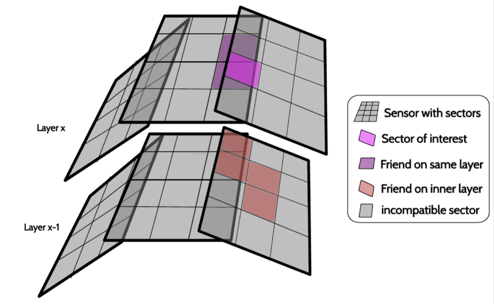
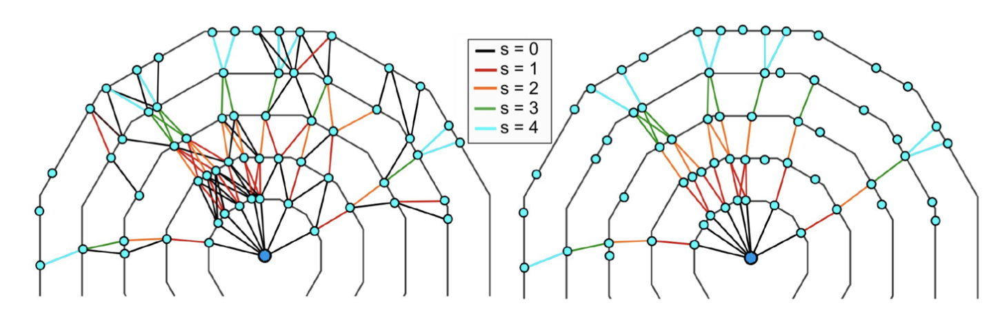

 .. _tracking_trackFindingSVD: 

SVD Track Finding
=================

.. warning::
  This documentation is under construction!

The VXDTF2 is the SVD standalone pattern recognition algorithm. In this page there is a brief description of the logic behind this pattern recognition algorithm.

Reduction of the combinatorial burden with the SectorMaps
---------------------------------------------------------
The goal extract track patterns from a huge number of possible combinations of space points (3D hits) in the 4 SVD layers.
The logic behind the reduction of the number of combinations is the following:
divide the sensors into sectors (NxM)
combine SpacePoints belonging to friend-sectors only, two sectors are friend if they are directly connected by a track
reject background SpacePoints using dedicated filters

The connections defining friend sectors are learned from simulation. In order to avoid attaching background hits to patterns, filters based on 2- or 3-hit combinations are also learned from simulation.
The SectorMap stores the information about the friendship relations between sectors and a set of selection requirements (filters = {variable, range}) used to reject background hits.

.. container:: twocol

    .. container:: leftside

       simplified view of the friendship relations

       .. figure:: figures/sectormap.png
	  :align: center

    .. container:: rightside
		   
       two-hit filter example

       .. figure:: figures/filter.png
	  :align: center

Variables used in the filters are geometric (distances, slopes) or properties of the SVD clusters, like the cluster time, listed in the following tables:

+----------------------------+------------------------------------------------------------------------------------+
| variables for 2-hit filter | description                                                                        |
+----------------------------+------------------------------------------------------------------------------------+
|distance 3D                 | squared distance of the two SpacePoints                                            |
+----------------------------+------------------------------------------------------------------------------------+
|distance 2D                 | xy squared distance of the two SpacePoints in the x-y plane                        |
+----------------------------+------------------------------------------------------------------------------------+
|distance 1D                 | z distance of the two SpacePoints in the z direction                               |
+----------------------------+------------------------------------------------------------------------------------+
|slope rz                    | angle between the z direction and the direction defined by the two Space Points    |
+----------------------------+------------------------------------------------------------------------------------+
|cos xy                      | angle between of the vector defined by the two Space Points on the transverse plane|
+----------------------------+------------------------------------------------------------------------------------+
|time difference U-U         | time difference of the two u-side clusters of the SpacePoints                      |
+----------------------------+------------------------------------------------------------------------------------+
|time difference V-V         | time difference of the two v-side clusters of the SpacePoints                      |      
+----------------------------+------------------------------------------------------------------------------------+

The allowed range for each filter is learned from simulation, filling the distribution of the variable during the training and defining threshold as max and min of the distribution (or 0.1% and 99.9% quantile?).
Using the friendship relations and the filters, segments connecting two, three or four SpacePoints are built. At this stage a single SpacePoint can be shared by more than one segment and we are ready to build track candidates that are identified and collected by a Cellular Automaton.

SectorMap Training
------------------

The training of the SectorMap is a critical step for the performance of the pattern recognition. Important aspects of the training are:

* division of the sensor in sectors: we use a 4x4 division
* sample used for the training (size, types of simulated events): we use :math:`10^6\ B-\bar{B}` + X bhabha events
* pruning: removal of friendship relations that are less used: the threshold is set at 70%
* difference in misalignment between simulation and real detector: we train with perfectly aligned MC

Track Candidates identified by the Cellular Automaton
-----------------------------------------------------

The SectorMaps is used to produce the Segment Network, a set of segments (a pair of SpacePoints) that satisfy the friendship relations and the filters.
A Cellular Automaton which uses segments as cells is run to gather the longest paths.

Best Candidate Selection 
-------------------------

Finally, a best candidate selection is performed by looking at a simple quality indicator:

* a Triplet Fit is applied to each path and sub paths obtained by excluding one or more space points
* for each track candidate the sum of the chi2 of each triplet is computed
* the p-value of each track candidate is used to select the track candidates competing for one or more space points

What about the  with the Hopfield Neural Network? is it used?
