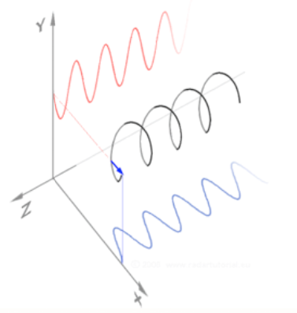
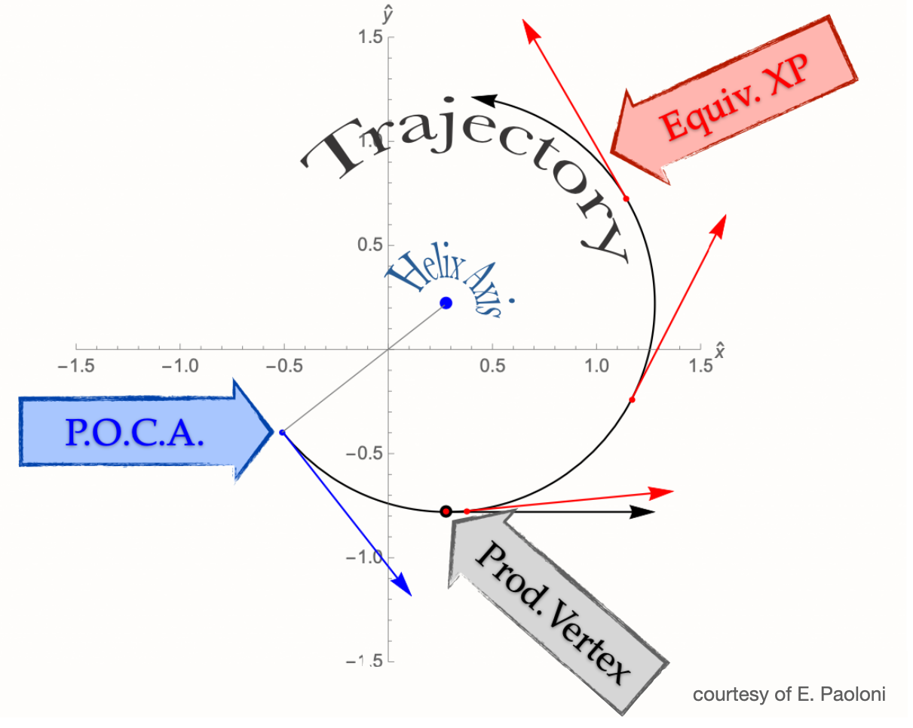

.. _trk_parameterization:

Track Parameterization
----------------------

In empty space, the trajectory of a charged particle in an homogeneous electromagnetic field is a perfect helix:

    A perfect helix (black), and its projections on the :math:`xz` (blue) and :math:`yz` (red) planes. The B field is along :math:`z`.

    The projection of the helix on the transverse plane, :math:`xy`.

A helix is described by 5 parameters, computed at the point of closest approach (POCA) of the track to the origin of the coordinate system:

* :math:`d_0 \in [-\infty, +\infty]`: the signed distance of the POCA on the transverse plane. The sign is the same of the :math:`z` component of the angular momentum with respect to the origin;
* :math:`z_0 \in [-\infty, +\infty]`: the z coordinate of the POCA;
* :math:`\phi_0 \in [-\pi, +\pi]`: the angle defined by the transverse momentum at the POCA and the :math:`x` axis;
* :math:`\omega \in [-\infty, +\infty]`: the inverse of the curvature radius, signed with the assumed [#]_ charge of the particle;
* :math:`\tan\lambda \in [-\infty, +\infty]`: the tangent of the angle defined by the momentum at the POCA and the transverse plane, :math:`xy`.

.. [#] the charge of the particle is determined by the track fit.

The momentum :math:`\vec{p}_{\rm POCA}` and position :math:`\vec{x}_{\rm POCA}` of the track are univocally determined by the 5 track parameters.
When tracks are used in analysis, *e.g.* when you look for primary and secondary vertices, they are represented by the perfect helix at the POCA.

Additional Details
^^^^^^^^^^^^^^^^^^

1) In order to describe the complete trajectory of a charged particle *we need several helices*:
whenever a charged particle crosses some material (e.g. the beam pipe, VXD sensors) the helix changes a little bit because of the multiple scattering and the energy loss in the material.
Changes to the B field also produce a variation of the helix. We can imagine the complete trajectory of a charged particle
as a sum of perfect helices, each one connecting two different pieces of material.
Since material effects depend on the particle type, the same set of hits (pattern) can yield  different helices if the trajectory is fitted with different mass hypothesis.
See :ref:`Track Fitting<tracking_trackFitting>` for more details.

2) The trajectory of a charged particle in empty space is determined by its position :math:`\vec{x}` and its momentum :math:`\vec{p}` at a given point of the helix.
Any point of the helix is good to store the parameters: :math:`(\vec{x}(t), \vec{p}(t))` is as good as :math:`(\vec{x}(t+\Delta t), \vec{p}(t+\Delta t))`, we must choose one, and we choose the POCA.
Indeed, in the :ref:`mDST<mdst>` we only store *one* helix among the many that are needed to describe the complete particle trajectory.
Since most of the tracks (with the exception of the daughters of long-lived particles, see point 3)) the one helix that is relevant for physics analysis is the one inside the beam pipe.
The POCA is therefore the most convenient point to compute the 5 helix parameters for the physics analysis.

3) Tracks that are created outside the beam pipe need a different treatment as the extrapolated helix to the POCA is not a good representation
of their trajectory. For this reason we have the :ref:`V0 Finder<tracking_v0Finding>`, a dedicated module that
looks for vertices outside the beam pipe, and stores the track parameters at the point of closest approach to the vertex.
This module improves the reconstruction of the so-called long-lived particles: :math:`K_S`, :math:`\Lambda` and photon conversions.

.. note::

    * trajectories inside the beam pipe are perfect helices neglecting B field inhomogeneities and energy loss by radiation;
    * during track reconstruction, tracks are extrapolated and fitted taking into account the material and the B field, with a statistical treatment of the multiple scattering and of the energy loss;
    * when tracks are used at analysis level, the material is not considered in the track extrapolation, *i.e.* the helix at the POCA is the only one available.
