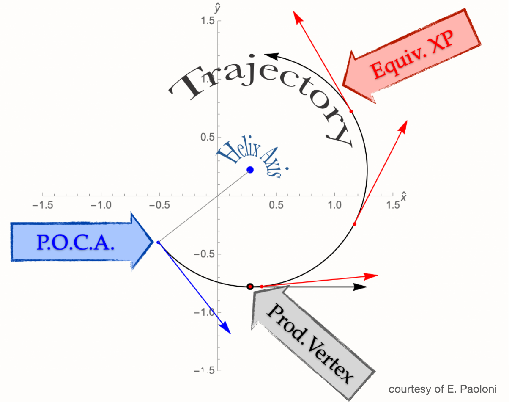

.. _trk_parameterization:

Track Parameterization
----------------------

In empty space, the trajectory of a charged particle in an homogeneous electromagnetic field is a perfect helix:

.. figure:: figures/helix_3d.png
    :align: center
    :width: 70%

    A perfect helix (black), and its projections on the :math:`xz` (blue) and :math:`yz` (red) planes. 

    The projection of the helix on the transverse plane.

A helix is described by 5 parameters, computed at the point of closest approach (POCA) of the track to the origin of the coordinate system:

* :math:`d_0 \in [-\infty, +\infty]`: the signed distance of the POCA on the transverse plane. The sign is the same of the z component of the angular momentum with respect to the origin;
* :math:`z_0 \in [-\infty, +\infty]`: the z coordinate of the POCA;
* :math:`\phi_0 \in [-\pi, +\pi]`: the angle defined by the transverse momentum :math:`p_t` at the POCA and the x-axis;
* :math:`\omega \in [-\infty, +\infty]`: the inverse of the curvature radius, signed with the assumed [#]_ charge of the particle;
* :math:`\tan\lambda \in [-\infty, +\infty]`: the tangent of the angle defined by the momentum at the POCA and the xy plane;

.. [#] the charge of the particle is determined by the track fit

The momentum :math:`\vec{p}_{\rm POCA}` and position :math:`\vec{x}_{\rm POCA}` of the track are univocally determined by the 5 track parameters.
When tracks are used in analysis, *e.g.* when you look for primary and secondary vertices, they are represented by the perfect helix that passes through the POCA. 

Additional Details
^^^^^^^^^^^^^^^^^^

1) In order to describe the complete trajectory of our charged particles inside Belle II we need several helices:
whenever a charged particle crosses some material (e.g. the beam pipe, VXD sensors) the helix changes a little bit because of the multiple scattering and the energy loss in the material.
In addition, changes to the B-field also produce a variation to the helix. We can picture the complete trajectory of a charged particle
as a sum of perfect helices that connect differnt pieces of material crossed by the particle.
Because of material effects depend on the particle type, the same set of hits (pattern) can yield  different helices if the trajectory is fitted with different mass hypothesis.
See :ref:`Track Fitting<tracking_trackFitting>` for more details.

2) The trajectory of a charged particle is determined by its position :math:`\vec{x}` and its momentum :math:`\vec{p}` at a given point of the helix.
Any point of the helix is good to store the parameters: :math:`(\vec{x}(t), \vec{p}(t))` is as good as :math:`(\vec{x}(t+\Delta t), \vec{p}(t+\Delta t))`, we need to choose one, and we choose the POCA.
Indeed, in the :ref:`mDST<mdst>` we only store *one* helix among the many that are needed to describe the complete trajectory from its creation through material and changes of the B-field.
Since most of the tracks (with the only exception of daughters of long-lived particles, see point 3)) are needed to reconstruct vertices inside the beam pipe,
the choice of the POCA becomes obvious: the helix inside the beamp pipe is the one relevant for the physics analyses.

3) Tracks that are created outside the beam pipe need a different treatment as the extrapolated helix to the POCA is not a good representation
of the trajectory of the charged particle. For this reason we have the :ref:`V0 Finder<tracking_v0Finding>`, a dedicated module that 
looks for vertices outside the beam pipe, and stores the track parameters at the point of closest approach to the vertex. 
This module improves the reconstruction of the so-called long-lived particles: :math:`K_S`, :math:`\Lambda` and photon conversions.

.. note::

    * during tracking reconstruction, track are extrapolated considering the material and the B field map, with a statistical treatment of the multiple scattering and of the energy loss.
    * trajectories inside the beam pipe are perfect helices neglecting B field inhomogeneities and energy loss by radiation
